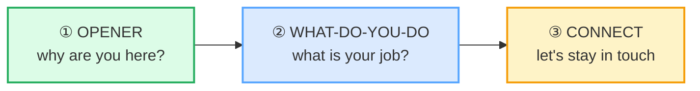

# Networking Small Talk

> **Phase 2 · workplace · bundle #40 · Days 79–80.**
> *"'What brings you here?' / 'What do you do?'"*
>
> 🔗 This bundle layers the **workplace event** on the social functions of Phase
> 1: it is [SMALL TALK](../speech_acts/SMALL_TALK.md) + [GREETINGS & INTROS](../speech_acts/GREETINGS_INTROS.md)
> + [CLOSINGS](../speech_acts/CLOSINGS.md) under a professional-event register.
> It also leans on [MEETING OPENINGS](./MEETING_OPENINGS.md) (the four-move
> skeleton — welcome → start → agenda → handover — reappears here as opener →
> what-do-you-do → connect) and forward to the writing bundles
> [LINKEDIN POSTS](../writing/LINKEDIN_POSTS.md) and [COVER LETTERS](../writing/COVER_LETTERS.md)
> (the "what do you do?" answer in written form).

---

## Why this bundle exists (read this first)

A Vietnamese professional's first English networking event usually goes one of
two ways — both wrong. Either they **freeze** (introversion + face: *mình không
rành tiếng Anh, nói sai mất mặt, để người khác hỏi mình*) and never start a
single conversation, or they **jump straight to business** (*"I am developer, I
want job, you give me?"*) and scare the contact off. Both failures share one
root: Vietnamese networking culture is **relationship-first and indirect** — you
build trust over meals, gifts, and a mutual introducer before any business is
named — so the direct English opener → occupation → connect sequence feels
either rude (to a Vietnamese ear) or terrifying (to a Vietnamese speaker asked
to perform it).

English networking small talk inverts almost all of that. It is
**transactional-first**: within the first 60 seconds you establish *why each
person is here*, *what each person does*, and *whether you'll stay in touch*.
The two pinned chunks of this bundle — **"What brings you here?"** and **"What
do you do?"** — are the spine of that exchange. Get them out cleanly and the
whole event opens up; stumble on them and you spend the night hovering at the
edge of the room.

---

## 1. The three-move networking exchange (the anatomy)

Every English networking conversation is some combination of these three moves.
The chunks vary by setting (conference vs. company mixer vs. client reception),
but the **skeleton is constant**:

| Move | Job | Casual mixer | Formal / client reception |
|---|---|---|---|
| ① Opener | establish *why you're both here* | "What brings you here?" | "Is this your first time at one of these?" |
| ② What-do-you-do | establish *what each person does* | "So, what do you do?" | "And what line of work are you in?" |
| ③ Connect | turn the chat into a continuing tie | "Let's connect on LinkedIn." | "Let me send you a note — here's my card." |

The two pinned chunks sit at moves ① and ② — they are the spine:

> From `networking_corpus.md`:
>
> | What brings you here? | What do you do? |
> |---|---|
> | /ˈwɒt ˈbrɪŋz juː ˈhɪə/ UK · /ˈwɑːt ˈbrɪŋz juː ˈhɪr/ US | /ˈwɒt duː juː ˈduː/ UK · /ˈwɑːt duː juː ˈduː/ US |
> | OED *bring* — idiom "what brings you here?" = "for what reason have you come?… now often used as a greeting or rhetorical question"; Cambridge *bring* /brɪŋ/ example sentence attests it | Indeed + Christina Rebuffet (Business English) attest "What do you do?" as the canonical networking/interview question = "What is your job?" |

---

## 2. The opener move — "What brings you here?" is the default

The opener has one job: give the other person an easy thing to say back. The
three chunks below cover the whole register range and are attested verbatim in
the British Council "guide to small talk openers" (see Sources):

> From `networking_corpus.md`:
>
> - **What brings you here?** /ˈwɒt ˈbrɪŋz juː ˈhɪə/ UK · /ˈwɑːt ˈbrɪŋz juː
>   ˈhɪr/ US — the default conference/event opener; the OED glosses it "for
>   what reason have you come? … now often used as a greeting or rhetorical
>   question" (pinned).
> - **So, how do you know [the host]?** /səʊ haʊ duː juː ˈnəʊ/ UK · /soʊ haʊ
>   duː juː ˈnoʊ/ US — asks the shared connection; the British Council small-
>   talk guide attests *"How do you know …(name of person/client)?"*.
> - **Is this your first time here?** /ɪz ðɪz jɔː ˈfɜːst ˈtaɪm ˈhɪə/ UK ·
>   /ɪz ðɪz jɔːr ˈfɜːrst ˈtaɪm ˈhɪr/ US — the new-comer check; the British
>   Council guide attests *"Have you been here / to one of these events
>   before?"*.

**Why "what brings you here?" and not "why are you here?"?** `Why are you
here?` sounds like a challenge or an accusation (*"why have you come to my
office/house?"*). `What brings you here?` softens it with the dummy *what* +
*brings* frame — it presupposes a *good* reason exists and invites the person
to share it. The OED marks the idiom explicitly as "now often used as a greeting
or rhetorical question", i.e. it is the expected polite opener, not a literal
demand for justification.

**Pronunciation note (L1-relevant):** `brings` ends in the cluster /ŋz/.
Vietnamese has no consonant clusters and tends to drop the /z/ → "What bring
you here?". Hold the cluster: /brɪŋz/ — release the /z/ audibly. 🔗 See
[FINAL CONSONANTS](../pronunciation/FINAL_CONSONANTS.md) and
[CONSONANT CLUSTERS](../pronunciation/CONSONANT_CLUSTERS.md).

---

## 3. The "what do you do?" exchange — three reply frames

After the opener, the conversation pivots to occupation. **"What do you do?"**
is the canonical question — short for *what do you do for a living?*. The three
reply frames below let you answer without over- or under-selling:

> From `networking_corpus.md`:
>
> - **What do you do?** /ˈwɒt duː juː ˈduː/ UK · /ˈwɑːt duː juː ˈduː/ US — the
>   standard English "what is your job?"; Indeed and Christina Rebuffet attest
>   it as the canonical networking question (pinned).
> - **I'm in marketing. / I work in marketing.** /aɪm ɪn ˈmɑːkɪtɪŋ/ UK ·
>   /aɪm ɪn ˈmɑːrkɪtɪŋ/ US — the **field/sector** frame: `I'm in ___` / `I work
>   in ___` + industry (no article, no job title). Cambridge *marketing* UK
>   /ˈmɑːkɪtɪŋ/ US /ˈmɑːrkɪtɪŋ/.
> - **I'm a software engineer.** /aɪm ə ˈsɒftweə ˌendʒɪˈnɪə/ UK · /aɪm ə
>   ˈsɔːftwer ˌendʒəˈnɪr/ US — the **role** frame: `I'm a ___` + article +
>   job-title noun phrase. Cambridge *engineer* UK /ˌendʒɪˈnɪə/ US
>   /ˌendʒəˈnɪr/.

**Why three frames and not one?** The frame signals how much you want to say.
`I'm in ___` keeps it at the sector level (marketing, finance, education) —
good when you want the conversation to move on. `I work in ___` is the neutral
middle. `I'm a ___` commits to a specific role and invites the follow-up "oh,
what kind?" — good when you *want* to talk shop. All three are attested in the
standard ESL/business-English reply set.

**The pragmatic trap:** Vietnamese has no single equivalent to "what do you
do?". The literal translation *"bạn làm nghề gì?"* is too direct for a first
meeting — Vietnamese networking circles the topic through a mutual introducer
and shared context first. In English, **"What do you do?" is itself the social
lubricant**: asking it is not rude, it is the expected first real question.
Refusing to answer, or answering only with *"I work at a company"* and waiting,
reads as evasive, not modest.

**Pronunciation note (L1-relevant):** `engineer` is stressed on the **third**
syllable — en-gi-**NEER** — not the first. The Vietnamese sesquisyllabic habit
front-stresses it → /ˈendʒənɪə/ ("EN-gi-neer"), which sounds odd. Drill the
stress with a clap on the last syllable: en-gi-**NEER**.

---

## 4. The connect move — closing the loop

The connect move turns a one-off chat into a continuing tie. The four chunks
below run the register range from digital-first to face-to-face to soft
follow-up:

> From `networking_corpus.md`:
>
> - **Let's connect on LinkedIn.** /lets kəˈnekt ɒn ˈlɪnktɪn/ UK · /lets
>   kəˈnekt ɑːn ˈlɪnktɪn/ US — the default digital follow-up at any
>   professional event; `connect` /kəˈnekt/ is LinkedIn's own first-degree
>   relationship verb (Cambridge *connect* = "to join or be joined").
> - **Here's my card.** /hɪəz maɪ kɑːd/ UK · /hɪrz maɪ kɑːrd/ US — the
>   face-to-face exchange; Cambridge *card* UK /kɑːd/ US /kɑːrd/ = "business
>   card".
> - **Let's grab a coffee sometime.** /lets ɡræb ə ˈkɒfi ˈsʌmtaɪm/ UK · /lets
>   ɡræb ə ˈkɔːfi ˈsʌmtaɪm/ US — the soft, low-commitment follow-up. Learning
>   English with Oxford (OUP) explicitly glosses it = "often a polite gesture
>   rather than a definite plan" — i.e. it does **not** mean "I will definitely
>   schedule coffee with you".
> - **Let me shoot you an email.** /ˈlet miː ʃuːt juː ən ˈiːmeɪl/ — casual
>   promise to follow up; Cambridge *shoot* lists the idiom *shoot someone an
>   email/look/question* = "to send/ask quickly".

**Why "let's grab a coffee sometime" is *not* a real appointment.** This is the
#1 cross-cultural trap for Vietnamese learners. Vietnamese follows through on
its soft invitations — *"hôm nào rảnh anh em mình đi cafe"* is usually followed
by an actual date being set within days. English "let's grab a coffee sometime"
is, per the Oxford source, **"often a polite gesture rather than a definite
plan"** — it signals warmth and leaves the door open, but it is not a promise.
Treating it as a promise (chasing the person for a date the next day) reads as
pushy; treating it as rejection (the person "ghosted" you) is a
misreading. The honest move is: say it back, connect on LinkedIn, and let the
real follow-up come through the channel you exchanged.

🔗 See [CLOSINGS](../speech_acts/CLOSINGS.md) — the connect move *is* the
closing of a networking conversation; "Let's grab coffee sometime" is the
networking twin of the social closing "Let's catch up soon."

---

## 5. Cheat sheet — the ≤8 survival chunks

The Pareto set. These eight carry you through almost every networking
conversation in English. Drill them aloud as one flowing sequence: opener →
what-do-you-do → connect. (Every row is a corpus attestation above.)

| # | Chunk | IPA | Why it's here |
|---|---|---|---|
| 1 | **What brings you here?** | /ˈwɒt ˈbrɪŋz juː ˈhɪə/ UK · /ˈwɑːt ˈbrɪŋz juː ˈhɪr/ US | the default event opener (pinned) |
| 2 | **So, how do you know [the host]?** | /səʊ haʊ duː juː ˈnəʊ/ UK · /soʊ haʊ duː juː ˈnoʊ/ US | asks the shared connection |
| 3 | **Is this your first time here?** | /ɪz ðɪz jɔː ˈfɜːst ˈtaɪm ˈhɪə/ UK · /ɪz ðɪz jɔːr ˈfɜːrst ˈtaɪm ˈhɪr/ US | new-comer check |
| 4 | **What do you do?** | /ˈwɒt duː juː ˈduː/ UK · /ˈwɑːt duː juː ˈduː/ US | the standard occupation question (pinned) |
| 5 | **I'm in marketing. / I work in…** | /aɪm ɪn ˈmɑːkɪtɪŋ/ UK · /aɪm ɪn ˈmɑːrkɪtɪŋ/ US | field/sector reply frame |
| 6 | **I'm a software engineer.** | /aɪm ə ˈsɒftweə ˌendʒɪˈnɪə/ UK · /aɪm ə ˈsɔːftwer ˌendʒəˈnɪr/ US | role reply frame |
| 7 | **Let's connect on LinkedIn.** | /lets kəˈnekt ɒn ˈlɪnktɪn/ UK · /lets kəˈnekt ɑːn ˈlɪnktɪn/ US | default digital follow-up |
| 8 | **Let's grab a coffee sometime.** | /lets ɡræb ə ˈkɒfi ˈsʌmtaɪm/ UK · /lets ɡræb ə ˈkɔːfi ˈsʌmtaɪm/ US | soft, low-commitment follow-up |

> Open [`networking.html`](./networking.html) to drill these as flip cards,
> hear native clips, play the role-play, shadow, and write your own opener +
> "what do you do" answer.

---

## 6. Vietnamese → English L1 pitfalls table

The "expert payoff." Vietnamese networking culture and English networking
culture collide on **directness, self-promotion, and the meaning of soft
invitations** — and the opening 60 seconds is where the collision is most
visible. These are the specific interference traps a Vietnamese speaker hits at
an English networking event.

| Vietnamese trap (what you do) | English fix (what to do instead) |
|---|---|
| **Freezes / never starts a conversation** — introversion + face (*mình không giỏi tiếng Anh, nói sai mất mặt*); waits to be introduced by a mutual host | Walk up within the first 5 minutes and use the opener chunk: *"Hi — what brings you here?"* In English events silence reads as uninterested, not modest. 🔗 [SMALL TALK](../speech_acts/SMALL_TALK.md). |
| **Jumps straight to business** — *"I am developer, I want job"* — because Vietnamese networking circles the relationship first and you compensate by over-stating the ask | Do the three moves in order: opener → what-do-you-do → connect. Business surfaces naturally *after* the connect move, never before it. |
| **Refuses to answer "What do you do?"** — *"I just work at a company"* — Vietnamese modesty / discomfort with self-promotion (khoe khoang mất lòng) | Answer with a frame: *"I'm in marketing"* or *"I'm a software engineer."* Stating your job is **not** boasting in English — it is the expected social lubricant. |
| **Literal-translates the Vietnamese opener** — *"What is your work?"* / *"What job do you do?"* (sounds blunt or odd) | Use the canonical chunk: **"What do you do?"** (short for *what do you do for a living?*). It is the single expected question; *don't* reword it. |
| **Treats "let's grab a coffee sometime" as a real appointment** — chases the person for a date the next day (Vietnamese follows through on its soft invitations) | "Let's grab a coffee sometime" is, per Oxford, **"often a polite gesture rather than a definite plan."** Say it back, connect on LinkedIn, let the real follow-up come through the channel you exchanged. 🔗 [CLOSINGS](../speech_acts/CLOSINGS.md). |
| **Forgets to actually exchange contact** — Vietnamese relationships are tracked through the mutual introducer, so the explicit card/LinkedIn step feels transactional | Always end with an explicit connect move: *"Let's connect on LinkedIn"* or *"Here's my card."* No exchange = the conversation didn't happen, professionally. |
| **Over-formal self-introduction** — *"My name is Nguyen. I am working at FPT Corporation as the position of senior developer"* — translates the Vietnamese ceremonial résumé-sentence | English self-intro is **one short clause**: *"I'm Mai — I'm a software engineer."* The full CV belongs on LinkedIn, not in the opener. |
| **Drops the /ŋz/ cluster in "brings"** → "What bring you here?" (Vietnamese has no consonant clusters) | Hold the cluster: /brɪŋz/ — release the /z/ audibly. 🔗 Drill [FINAL CONSONANTS](../pronunciation/FINAL_CONSONANTS.md) + [CONSONANT CLUSTERS](../pronunciation/CONSONANT_CLUSTERS.md). |
| **Front-stresses "engineer"** → /ˈendʒənɪə/ ("EN-gi-neer") — Vietnamese sesquisyllabic habit puts the stress on the first major syllable | Stress the **third** syllable: en-gi-**NEER** /ˌendʒɪˈnɪə/ UK · /ˌendʒəˈnɪr/ US. Drill with a clap on the last syllable. |
| **/ʃ/ → /s/ in "shoot"** → "soot you an email" (Vietnamese has no /ʃ/) | Round the lips for /ʃ/: **sh**oot /ʃuːt/. Minimal pair: *shoot* /ʃuːt/ vs *suit* /suːt/. |
| **Says "linked-IN"** with stress on the second syllable → /lɪŋktˈɪn/ | Stress the **first** syllable, weaken the second: **LINK**-ed-in /ˈlɪnktɪn/. The /kt/ cluster is the other trap — keep it tight, not "lin-kin". |

---

## How to practise this bundle (the daily 20 min)

1. **READ** (5 min) — this guide, §1–§4.
2. **SHADOW** (7 min) — open `networking.html`, drill the 8 flip cards, then
   run the role-play **aloud** as Person A (the initiator): opener →
   what-do-you-do → connect, no pauses, as one flowing sequence.
3. **PRODUCE** (8 min) — the writing task: write a **networking opener** + your
   own **"what do you do?" answer** for a real event you might attend. Read it
   aloud, recording yourself; check `brings` has its /ŋz/, `engineer` is
   back-stressed, and the connect move is explicit.

---

## Sources

- Cambridge Advanced Learner's Dictionary — https://dictionary.cambridge.org/dictionary/english/{word} (entries for *bring* /brɪŋ/ with example sentence "What brings you here?"; *connect* /kəˈnekt/; *marketing* UK /ˈmɑːkɪtɪŋ/ US /ˈmɑːrkɪtɪŋ/; *card* UK /kɑːd/ US /kɑːrd/; *grab* /ɡræb/; *shoot* incl. idiom *shoot someone an email*; *know* UK /nəʊ/ US /noʊ/; *do* /duː/; *first* UK /fɜːst/ US /fɜːrst/; *time* /taɪm/; *here* UK /hɪə/ US /hɪr/; *email* /ˈiːmeɪl/; *LinkedIn* /ˈlɪnktɪn/)
- Cambridge pronunciation page — https://dictionary.cambridge.org/pronunciation/english/engineer (*engineer* UK /ˌendʒɪˈnɪə/ US /ˌendʒəˈnɪr/)
- Oxford English Dictionary (OED) — https://www.oed.com/dictionary/bring_v (*bring* — idiom "what brings you here?" = "for what reason have you come?… now often used as a greeting or rhetorical question")
- Wiktionary — https://en.wiktionary.org/wiki/engineer (RP /ˌɛn(d)ʒɪˈnɪə/, GenAm /ˌɛnd͡ʒɪˈnɪ(ə)ɹ/ — cross-checks Cambridge stress)
- British Council English Online, "Your guide to small talk topics, phrases and openers in English" (2025) — https://englishonline.britishcouncil.org/blog/articles/your-guide-to-small-talk-topics-phrases-and-openers-in-english/ (attests the three networking openers verbatim)
- Indeed, "35 Questions for an English Interview" — https://www.indeed.com/career-advice/interviewing/questions-for-interview-in-english (attests "What do you do?")
- Christina Rebuffet Business English, "Introduce yourself in a job interview" — https://christinarebuffet.com/blog/prepare-a-job-interview-in-english-introducing-yourself/
- Learning English with Oxford (OUP) — attests "Let's grab a coffee sometime" = "often a polite gesture rather than a definite plan"
- U.S. Department of Labor (ODEP), "Networking" (soft-skills PDF) — https://www.dol.gov/sites/dolgov/files/odep/topics/youth/softskills/networking.pdf
- Native audio: YouGlish — https://youglish.com/pronounce/{phrase}/english/us? (clips for all 10 chunks — all verified HTTP 200 on 2026-06-24)
- Frequency methodology: wordfrequency.info (spoken sub-corpus) — https://www.wordfrequency.info/
