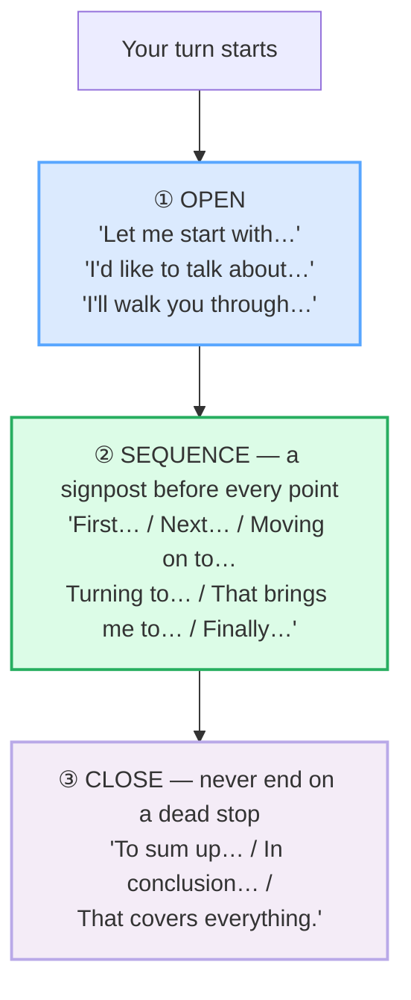

# Short Presentations

> **Phase 2 · workplace · bundle #35 · Days 69–70.**
> *Signposting: "First…, next…, finally…"* — the road signs that make a 60-second
> talk followable.
>
> 🔗 Builds on [STATUS UPDATES](./STATUS_UPDATES.md) — the four-slot standup
> skeleton is the *micro*-version of this; a short presentation is the same
> signposting instinct stretched over three points. Related:
> [CONTRIBUTING](./CONTRIBUTING.md) (longer meeting turns) and
> [FINAL CONSONANTS](../pronunciation/FINAL_CONSONANTS.md) — every *next* /nekst/,
> *finally* /ˈfaɪnəli/, *start* /stɑːrt/ here ends in a cluster or final consonant
> a Vietnamese learner drops if Phase 0 wasn't drilled.

---

## Why this bundle exists (read this first)

In a Vietnamese classroom or workplace, a presentation (*thuyết trình*) is often
**memorised and read aloud** — a single flowing script delivered word-for-word
from a sheet, with weak or no transitions between ideas, and an abrupt ending
(no summary). The audience is expected to *follow along*. In an
English-speaking workplace, **the opposite is the norm**. A short presentation
is a **three-phase structure held together by explicit "road signs"**:

- **every** point is introduced by a signpost (*First…, Next…, Moving on to…,
  Finally…*) so the listener always knows where they are;
- **no** signpost is optional — skipping one reads as disorganised, not concise;
- the talk **always** closes with a summary (*To sum up…*), never a dead stop;
- the tone is **conversational and plain**, not scripted and over-formal.

This bundle teaches the ~8 signposts that hold any 3-point mini-presentation
together. Master these and a 60-second team update, a demo, or a project pitch
stops sounding translated — and starts sounding like a colleague who knows where
their talk is going.

---

## 1. The three-phase signposting skeleton

Every native short presentation — a standup deep-dive, a feature demo, a project
pitch — runs the same three phases, and **every phase boundary is marked out
loud**:

Skip a phase and the audience loses the thread: an opening with no roadmap feels
vague; points with no signposts blur together; an ending with no summary feels
cut off. The three sections below fill the three phases with the native chunks.

---

## 2. ① OPEN — give the roadmap in the first sentence

The opening chunk does one job: tell the audience *"here is the map, you can
follow this."* A memorised opener translated from Vietnamese (*"Today I will
present to you about…"*) sounds stiff and over-formal. The native move is a
conversational framing chunk in plain English.

> From `short_presentations_corpus.md`:
>
> | Let me start with… | I'd like to talk about… | I'll walk you through… |
> |---|---|---|
> | /ˌlet mi ˈstɑːt wɪð/ | /aɪd ˈlaɪk tə ˈtɔːk əˈbaʊt/ | /aɪl ˌwɔːk ju ˈθruː/ |

> The Bialystok University of Technology *Signpost Language* EAP handout — the
> canonical academic-presentation signposting reference — records *"Let me start
> with…"* and *"I'm going to talk about…"* as the standard opening markers. The
> University of Padua signposting thesis (Nardo, 2017) lists *"let me start with"*
> / *"let us begin with"* as attested EMI openers. A real native example: the
> University of Oxford Gazette (2023/24) opens a talk *"Let me start with people:
> this university and all its successes are derived from the outstanding and
> dedicated people who work here."*

**Why *walk you through*:** this chunk promises a guided, step-by-step tour —
use it for demos and process explanations (*"I'll walk you through the new
onboarding flow"*). Cambridge attests the phrasal verb *walk through* in exactly
this sense.

---

## 3. ② SEQUENCE — a signpost before every point (the heart of the bundle)

This is where Vietnamese learners fail most often. English-speaking audiences
expect a signpost at **every** boundary; without it, the listener cannot tell
where one idea ends and the next begins. The native norm is one signpost per
point, like road signs on a highway.

> From `short_presentations_corpus.md`:
>
> | First… | Next… | Then… | Moving on to… | Turning to… | That brings me to… | Finally… |
> |---|---|---|---|---|---|---|
> | /fɜːst/–/fɜːrst/ | /nekst/ | /ðen/ | /ˈmuːvɪŋ ɒn tə/ | /ˈtɜːnɪŋ tə/ | /ðæt ˈbrɪŋz mi tə/ | /ˈfaɪnəli/ |

**The five moves, in order of a typical 3-point talk:**

1. **First…** — opens point #1. The simplest, most reliable signpost in spoken
   English. /fɜːst/ UK · /fɜːrst/ US (note the American /r/).
2. **Next…** / **Then…** — opens point #2. *Next* /nekst/ is the cleaner of the
   two for a numbered list; *then* /ðen/ is better for a time sequence.
3. **Moving on to…** — the **transition** signpost: closes the current point and
   opens the next in one move. *"Moving on to the roadmap…"* Attested verbatim
   in the Bialystok EAP handout (*"Now we'll move on to…"*).
4. **Turning to…** — the **pivot**: a sharper change of topic. *"Turning to the
   budget…"* Use it when point #3 is a genuinely different subject, not the
   next item in a list.
5. **That brings me to…** — the **bridge**: the previous point *leads naturally*
   to this one. *"That brings me to my final point…"*
6. **Finally…** — opens the **last** point. /ˈfaɪnəli/. Never start the summary
   with *finally* — *finally* introduces the last *point*, not the summary
   itself (that is *To sum up*).

> **Pinned real example** (sanity-check the attestation is real, not invented):
> Cambridge Dictionary, *finally* entry —
> https://www.oxfordlearnersdictionaries.com/us/about/english/pronunciation_english —
> the Oxford Learner's Dictionary pronunciation guide records the schwa
> explicitly: *"the schwa /ə/ is shown in the transcription of finally
> /ˈfaɪnəli/."* Cambridge *Vocabulary in Use* confirms *finally ˈfaɪnəli*. The
> Bialystok EAP handout attests the sequence *"Firstly… Secondly… Next… After
> that… And finally…"* — and the spoken-English shortening to *First… Next…
> Finally…* is the high-frequency workplace form.

**The L1 jump-error:** a Vietnamese learner says *"The revenue is up. The new
feature launched. The roadmap is ready."* — three points with **zero
signposts**, so the audience hears three disconnected sentences, not a
structured talk. Drill one signpost per point.

---

## 4. ③ CLOSE — always summarise, never dead-stop

Vietnamese learners end presentations **abruptly**: the last point is spoken and
the talk simply stops. The native norm is the opposite — a talk always closes
with an **explicit summary** so the audience can consolidate the three points
into one takeaway.

> From `short_presentations_corpus.md`:
>
> | To sum up… | In conclusion… | That covers everything |
> |---|---|---|
> | /tə ˌsʌm ˈʌp/ | /ɪn kənˈkluːʒn/ | /ðæt ˈkʌvəz ˈevriθɪŋ/ |

**The three closes, by register:**

1. **To sum up…** /tə ˌsʌm ˈʌp/ — the **default spoken close**. Plain,
   conversational, and the single highest-frequency summary signpost in spoken
   English. Cambridge attests *sum up*: *"To sum up, there are three main
   points."* Use this for any workplace talk.
2. **In conclusion…** /ɪn kənˈkluːʒn/ — the **formal / written-style close**.
   Heavier register; fine for a board presentation or a written report, but
   slightly stiff for a casual team update. Attested in the Bialystok EAP
   handout's Summarising section.
3. **That covers everything** — the **done signal**: the talk is over and you're
   ready for questions. *"Well, that covers everything I want to say."* Pair it
   with an invitation: *"That covers everything — any questions?"*

> **Pinned real example:** Cambridge Dictionary, *sum up* phrasal verb —
> https://dictionary.cambridge.org/dictionary/english/sum-up — IPA /ˌsʌm ˈʌp/,
> gloss: *"to give the main information about something in a short form"*;
> example: *"To sum up, there are three main points."*

---

## 5. The full 60-second talk (one presenter, all three phases)

Putting it together — here is a model 60-second presentation that hits every
phase and every key signpost:

> **Let me start with** a quick overview of Q2. *(OPEN)*
> **First**, the results: revenue is up twelve percent year on year.
> **Moving on to** the next point — our new feature launched last week, and
> early adoption is strong. *(SEQUENCE — transition)*
> **Finally**, the roadmap for Q3 is already locked in. *(SEQUENCE — last point)*
> **To sum up**: a strong quarter, a successful launch, and a clear roadmap
> ahead. *(CLOSE — summary)*
> **That covers everything** — happy to take any questions. *(CLOSE — done)*

Every bolded chunk is a corpus row above. Drill this signpost rhythm until it is
automatic — that is the difference between a talk the audience follows and one
they tune out of.

---

## 6. Cheat sheet — the ≤8 survival chunks

The Pareto set. Drill these eight aloud until every signpost lands and every
final consonant is audible. (Every row is a corpus attestation above.)

| # | Chunk | IPA | Why it's here |
|---|---|---|---|
| 1 | **Let me start with…** | /ˌlet mi ˈstɑːt wɪð/ | OPEN — gives the roadmap, conversational |
| 2 | **First…** | /fɜːst/ UK · /fɜːrst/ US | SEQUENCE — opens point #1 |
| 3 | **Next…** | /nekst/ | SEQUENCE — opens point #2 (/kst/ cluster) |
| 4 | **Moving on to…** | /ˈmuːvɪŋ ɒn tə/ UK · /ˈmuːvɪŋ ɑːn tə/ US | SEQUENCE — transition (close + open) |
| 5 | **Turning to…** | /ˈtɜːnɪŋ tə/ UK · /ˈtɜːrnɪŋ tə/ US | SEQUENCE — pivot to a new topic |
| 6 | **Finally…** | /ˈfaɪnəli/ | SEQUENCE — opens the last point |
| 7 | **To sum up…** | /tə ˌsʌm ˈʌp/ | CLOSE — the default spoken summary |
| 8 | **In conclusion…** | /ɪn kənˈkluːʒn/ | CLOSE — formal / written register |

> Open [`short_presentations.html`](./short_presentations.html) to drill these
> as flip cards, run the presenter + questioner role-play, shadow, and write
> your own signposted 3-point mini-presentation.

---

## 7. Vietnamese → English L1 pitfalls table

The "expert payoff." These are the specific interference traps a Vietnamese
speaker hits on short presentations — extend, don't replace, the seed rows from
the spec.

| Vietnamese trap (what you do) | English fix (what to do instead) |
|---|---|
| **Memorises and reads aloud** — a single flowing script delivered word-for-word with no improvisation | Rehearse the **structure** (the 3 signposts), not the wording. Know your *First… / Next… / Finally…* skeleton cold; let the sentences inside each point be flexible. |
| **No signposts between points** — "The revenue is up. The new feature launched. The roadmap is ready." (3 disconnected sentences) | Put a signpost before **every** point: *First… / Next… / Moving on to… / Finally…*. One signpost per point — the listener needs the road sign. |
| **Abrupt ending, no summary** — the last point is spoken and the talk just stops | Always close with *To sum up…* + the one takeaway. A talk without a summary feels cut off; the summary is what the audience remembers. |
| **Over-formal scripted tone** — "Today I would like to present to you about…" / "Finally, I would like to express my deepest gratitude…" | Use plain conversational signposts: *Let me start with… / I'll walk you through… / To sum up…*. Workplace English is conversational, not ceremonial. |
| **Translates the opener literally** — "Today I present to you a little about…" | Use a native framing chunk: *Let me start with…* / *I'd like to talk about…* / *I'll walk you through…*. The literal translation sounds stiff and slow. |
| **Confuses *Finally* and *To sum up*** — uses *Finally…* to start the summary | *Finally…* introduces the **last point**; *To sum up…* introduces the **summary**. A 3-point talk goes *First… / Next… / Finally…* (last point) **then** *To sum up…* (summary). |
| **Drops the /kst/ cluster in *next*** — "nec" for *next*, "then" merged with "next" | Drill the /kst/ cluster: *next* /nekst/. 🔗 See [FINAL CONSONANTS](../pronunciation/FINAL_CONSONANTS.md) §C — /ks/ + /t/ is exactly the cluster Vietnamese has no slot for. |
| **Stress on the wrong syllable in *finally*** — says *fiNALly* (stress on the last syllable, Vietnamese syllable-timed habit) | Stress the **first** syllable: *FI*·nal·ly /ˈfaɪnəli/. Vietnamese is syllable-timed, so word stress is easy to miss — and it changes how native the word sounds. |
| **Drops the final /t/ in *start*** — "Let me star with…" (the /t/ before /w/ is unreleased) | Hold the /t/ contact and release audibly: *start* /stɑːt/ UK · /stɑːrt/ US. The /t/ glottalises before a consonant but should not vanish. 🔗 [FINAL CONSONANTS](../pronunciation/FINAL_CONSONANTS.md). |
| **Treats the close as an apology** — trailing off "So… that's all… um, sorry…" | Close decisively: *To sum up: [one sentence]. That covers everything — any questions?* Decisiveness reads as competence; trailing off reads as uncertainty. |

---

## How to practise this bundle (the daily 20 min)

1. **READ** (5 min) — this guide, §1–§5.
2. **SHADOW** (7 min) — open `short_presentations.html`, drill the 8 flip cards
   + the 60-second presenter role-play **aloud**, hitting every signpost and
   every final consonant.
3. **PRODUCE** (8 min) — the writing task: signpost a **3-point
   mini-presentation** (*First… / Moving on to… / To sum up…*) on your real
   current project. Read it aloud, recording yourself; check every signpost
   lands and the summary closes the talk.

---

## Sources

- Cambridge Advanced Learner's Dictionary — https://dictionary.cambridge.org/dictionary/english/{word}
  (entries for *first, next, then, finally, start, sum, sum up, walk through,
  conclusion, everything*).
- Oxford Advanced Learner's Dictionary, "Pronunciation Guide (English/Academic
  Dictionaries)" — confirms *finally* /ˈfaɪnəli/ (schwa shown for clarity) —
  https://www.oxfordlearnersdictionaries.com/us/about/english/pronunciation_english
- Cambridge *English Vocabulary in Use* (Pre-int/Int, Redman, CUP) —
  *finally* /ˈfaɪnəli/.
- Bialystok University of Technology (PB.edu.pl), *Signpost Language* EAP handout
  — https://pb.edu.pl/sjo/wp-content/uploads/sites/9/2017/11/Signpost-language.pdf
  (attests "Let me start with…", "Now we'll move on to…", "Turning to…", "That
  brings me to the end of my talk", "In conclusion…", "that covers everything").
- Nardo, S. *Signposting language in English-medium instruction* (MA thesis,
  University of Padua, 2017) —
  https://thesis.unipd.it/retrieve/6c95d63e-9e19-4032-9a56-304c452f4f40/SARA_NARDO_2017.pdf
- University of Oxford Gazette 2023/24 —
  https://assets-oxweb.admin.ox.ac.uk/2026-03/University%20of%20Oxford%20Gazette%202023-2024%20-%20Vol%20154%20(redacted).pdf
- Native audio: YouGlish — https://youglish.com/pronounce/{phrase}/english/us?
- Frequency methodology: wordfrequency.info (spoken sub-corpus) —
  https://www.wordfrequency.info/
