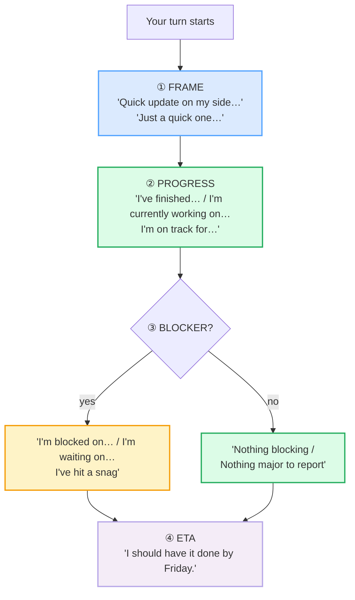

# Status Updates & Standups

> **Phase 2 · workplace · bundle #34 · Days 67–68.**
> *"Quick update on my side…" / "Blocked on…"* — the four-slot skeleton every
> daily standup runs on.
>
> 🔗 Builds on [FINAL CONSONANTS](../pronunciation/FINAL_CONSONANTS.md) — every
> *blocked* /blɒkt/, *finished* /ˈfɪnɪʃt/, *snag* /snæɡ/ here is a final
> cluster a Vietnamese learner drops if Phase 0 wasn't drilled. Related:
> [MEETING OPENINGS](./MEETING_OPENINGS.md) (the opening that *frames* a
> meeting, vs. the chunk that frames a single update) and
> [CONTRIBUTING](./CONTRIBUTING.md) (longer meeting turns — this bundle is the
> short, structured version).

---

## Why this bundle exists (read this first)

In a Vietnamese workplace, "báo cáo tình trạng" is often a flowing,
context-heavy paragraph: you describe what you did, imply the timeline, and
soft-pedal any problem so nobody loses face. In an English-speaking agile
team, **the opposite is the norm**. A status update is a **tight, four-slot
structure**, delivered in under sixty seconds, where:

- **naming a blocker early is professional**, not a confession of failure;
- **a concrete ETA is expected**, not boastful;
- **vague verbs** ("I'm *doing* the task") signal you don't know what you're
  doing — the native chunks (*I'm currently working on*, *I'm on track for*)
  are precise without being arrogant.

This bundle teaches that skeleton and the ~8 chunks that fill it. Master these
and you sound like a functioning team member in any English standup — which is
the single highest-frequency workplace speaking act.

---

## 1. The four-slot skeleton

Every native update — spoken in a standup, written in a Slack thread, or
dictated into a Loom — runs the same four beats:

Skip a slot and the team asks a follow-up ("…and when do you think you'll have
it?"), which is exactly the rambling the structure exists to prevent. The four
sections below fill the four slots with the native chunks.

---

## 2. ① FRAME — promise brevity in the first two seconds

The opening chunk does one job: signal *"this will be short, structured, and
you can stop listening in 30 seconds."* A bare "I report…" or "Today I want to
say…" sounds translated and slow.

> From `status_updates_corpus.md`:
>
> | Quick update on my side | Just a quick one | Status update |
> |---|---|---|
> | /ˈkwɪk ˌʌpˈdeɪt ɒn maɪ ˈsaɪd/ | /ˈdʒʌst ə ˈkwɪk ˈwʌn/ | /ˈsteɪtəs ˌʌpˈdeɪt/ |

**Why *on my side*:** agile teams run round-robins ("let's go around"). "On my
side" / "on my end" frames *your* slice of the work, separating it from the
team's. It is **not** a spatial phrase — it's a discourse marker.

> The Cambridge Dictionary blog's corpus note on introductions records the
> sibling pattern *"just a quick one to ask you / let you know"* — same
> pragmatic function (promise brevity before the ask).

---

## 3. ② PROGRESS — split completed vs. in-progress vs. forecast

This is where Vietnamese learners merge three tenses into one vague stream.
The native norm is **three distinct forms** for three distinct states:

| State | Tense | Chunk | IPA |
|---|---|---|---|
| **Completed** | present perfect | *I've finished…* / *I've made progress on…* | /aɪv ˈfɪnɪʃt/ · /aɪv ˈmeɪd ˈprəʊɡres ɒn/ |
| **In progress** | present continuous | *I'm currently working on…* | /aɪm ˈkʌrəntli ˈwɜːkɪŋ ɒn/ |
| **Forecast** | idiom | *I'm on track for…* | /aɪm ɒn ˈtræk fɔː(r)/ |

> From `status_updates_corpus.md`:
>
> - **I've finished** /aɪv ˈfɪnɪʃt/ — the /ʃt/ final cluster is the Phase 0
>   trap. Drop the /t/ and you say "I've fini**sh**" — sounds incomplete.
> - **I've made progress on** — note the **noun stress**: *PRO*gress (UK
>   /ˈprəʊɡres/, US /ˈprɑːɡres/), stress on the first syllable. The verb
>   *proGRESS* flips the stress. Vietnamese has no stress-timed rhythm, so the
>   noun/verb stress shift is easy to miss — and it changes meaning.
> - **I'm currently working on** — *currently* /ˈkʌrəntli/ UK · /ˈkɜːrəntli/
>   US. The /li/ ending + the /ŋ/ of *working* are both final-C traps.
> - **I'm on track for** — Cambridge attests *"The theme park is on track for
>   a record year."* The chunk means *forecast to hit the target*, not
>   *physically on a track*.

**The L1 merge error:** a Vietnamese learner says *"I'm doing the login
feature"* for all three states — yesterday's work, today's work, and
tomorrow's forecast collapsed into one present continuous. The team can't tell
what's done. Drill the three-way split above.

---

## 4. ③ BLOCKER — name it early, name it specifically

This is the **hardest slot for a Vietnamese learner**, not because of language
but because of culture. In a high-context, face-preserving workplace, saying
"I'm blocked" feels like admitting incompetence. In an English-speaking agile
team, **the opposite is true**: hiding a blocker until the deadline is the
unprofessional move; flagging it on day one is what a senior engineer does.

> From `status_updates_corpus.md`:
>
> | I'm blocked on… | I'm waiting on… | I've hit a snag | Nothing blocking |
> |---|---|---|---|
> | /aɪm ˈblɒkt ɒn/–/aɪm ˈblɑːkt ɑːn/ | /aɪm ˈweɪtɪŋ ɒn/ | /aɪv ˈhɪt ə ˈsnæɡ/ | /ˈnʌθɪŋ ˈblɒkɪŋ/–/ˈnʌθɪŋ ˈblɑːkɪŋ/ |

**The four-way spectrum:**

1. **I'm blocked on…** — the *hard* block. You cannot proceed without
   something external (an API, a decision, a permission). Cambridge attests
   the construction across agile sources; Talaera's standup template gives the
   exact model: *"I'm blocked on the API credentials."* Always follow with
   **what** you need and **who** can unblock you — *"I'm blocked on the API
   credentials; I need 30 minutes with the security team."*
2. **I'm waiting on…** — the *soft* block. You can do other work, but this
   item is paused until someone/something else moves. Cambridge's phrasal-verb
   entry: *"The lawyers are waiting on the jury's verdict."* Note **on**, not
   *for* — *waiting on* is the workplace idiom (US-led, now global in business
   English).
3. **I've hit a snag** — the *internal, solvable* problem. You're not blocked
   by a person; you ran into a technical issue you're working through.
   Cambridge: *"talks have hit a snag."* This chunk is **face-saving** — it
   reports a problem without sounding alarmist.
4. **Nothing blocking** / **Nothing major to report** — the *clean* case. Use
   one of these explicitly; silence is ambiguous. *"Nothing major to report"*
   is attested in real meeting minutes (Canal Winchester City Council, 2022).

> **Pinned real example** (sanity-check the attestation is real, not invented):
> Cambridge Dictionary, *snag* entry —
> https://dictionary.cambridge.org/dictionary/english/snag —
> gloss: *"a problem or difficulty that stops or slows the progress of
> something"*; example: *"The team was close to signing him to a long-range
> contract, but talks have hit a snag."* IPA /snæɡ/.

---

## 5. ④ ETA — name a concrete date, even if approximate

The ETA slot is the one Vietnamese learners **omit most often**. A high-context
speaker assumes the team shares the timeline implicitly. The native norm is
the opposite: **always name a date or time**, calibrated with a modal. The
modal (*should*) is doing real work — it signals a forecast, not a promise, so
you don't lose face if you miss it by a day.

> From `status_updates_corpus.md`:
>
> - **I should have it done by…** /aɪ ˈʃʊd həv ɪt ˈdʌn baɪ/
> - **It'll be done by…** /ˈɪtl ˈbiː ˈdʌn baɪ/

> The passive form (*It'll be done by…*) is shorter and more detached — use it
> when you want to depersonalise (e.g. a delayed external dependency). The
> active form (*I should have it done by…*) takes ownership — use it for your
> own work.

**Note *by*, not *until*:** *by Friday* = the deadline is Friday (the work
finishes no later than Friday). *Until Friday* = the work continues for the
whole duration up to Friday. Vietnamese learners conflate these because
Vietnamese has one word (*đến*) for both. This is a high-frequency
intelligibility error in ETA slots.

> **Pinned real example:** SSW "Rules to Better Email" —
> https://www.ssw.com.au/rules/rules-to-better-email — attests:
> *"I can't do it this week, but I should have it done by the end of next
> week."* Ask a Manager (2017) attests: *"I should have it done by tomorrow
> morning."*

---

## 6. The full standup turn (one person, all four slots)

Putting it together — here is a model 30-second turn that hits every slot:

> **Quick update on my side.** *(FRAME)*
> I've **finished** the login page; I'm **currently working on** the password
> reset flow, and I'm **on track for** Friday. *(PROGRESS)*
> I'm **blocked on** the email service credentials — I've asked Priya to
> provision them. *(BLOCKER)*
> I **should have** the reset flow **done by** end of day Thursday. *(ETA)*

Every bolded chunk is a corpus row above. Drill this four-beat rhythm until it
is automatic — that is the difference between a junior who rambles and a
senior who updates in thirty seconds.

---

## 7. Cheat sheet — the ≤8 survival chunks

The Pareto set. Drill these eight aloud until every final consonant is audible
and every slot is filled. (Every row is a corpus attestation above.)

| # | Chunk | IPA | Why it's here |
|---|---|---|---|
| 1 | **Quick update on my side** | /ˈkwɪk ˌʌpˈdeɪt ɒn maɪ ˈsaɪd/ | FRAME — promises brevity, separates your slice |
| 2 | **I'm currently working on…** | /aɪm ˈkʌrəntli ˈwɜːkɪŋ ɒn/ | PROGRESS (in-progress) — present continuous |
| 3 | **I've made progress on…** | /aɪv ˈmeɪd ˈprəʊɡres ɒn/ | PROGRESS (completed chunk) — present perfect |
| 4 | **I'm on track for…** | /aɪm ɒn ˈtræk fɔː(r)/ | PROGRESS (forecast) — Cambridge idiom |
| 5 | **I'm blocked on…** | /aɪm ˈblɒkt ɒn/–/aɪm ˈblɑːkt ɑːn/ | BLOCKER (hard) — name it early |
| 6 | **I've hit a snag** | /aɪv ˈhɪt ə ˈsnæɡ/ | BLOCKER (internal/solvable) — face-saving |
| 7 | **Nothing major to report** | /ˈnʌθɪŋ ˈmeɪdʒə(r) tə rɪˈpɔːt/ | BLOCKER (none) — explicit silence |
| 8 | **I should have it done by…** | /aɪ ˈʃʊd həv ɪt ˈdʌn baɪ/ | ETA — modal + *by* + date |

> Open [`status_updates.html`](./status_updates.html) to drill these as flip
> cards, run the 3-person standup role-play, shadow, and write your own
> 3-line update.

---

## 8. Vietnamese → English L1 pitfalls table

The "expert payoff." These are the specific interference traps a Vietnamese
speaker hits on status updates — extend, don't replace, the seed rows from the
spec.

| Vietnamese trap (what you do) | English fix (what to do instead) |
|---|---|
| **Merges three tenses into one** — "I'm doing the login" for yesterday's finished work, today's in-progress, AND tomorrow's forecast | Split explicitly: *I've finished* (present perfect) / *I'm currently working on* (present continuous) / *I'm on track for* (forecast idiom). One state per chunk. |
| **Omits the ETA slot entirely** — assumes the team shares the timeline implicitly (high-context norm) | Always close with *I should have it done by [date]*. Name a concrete date, even if approximate; the modal *should* calibrates it as a forecast, not a promise. |
| **Hides blockers to save face** — won't say "I'm blocked" because it feels like admitting incompetence | Reframe: in English-speaking agile, **flagging a blocker on day one is the senior move**. Use *I'm blocked on…* + what you need + who can unblock you. Hiding it until the deadline is the unprofessional move. |
| **Over-promises to please** — "I will finish by tomorrow" said to satisfy the listener, with no real plan | Calibrate with the modal: *I should have it done by…* (forecast) not *I will finish by…* (promise). Miss a promise and you lose trust; miss a forecast and you adjust. |
| **Vague verb "doing"** — "I'm doing the task" with no state, no scope, no ETA | Replace *doing* with a state-specific chunk: *finished* / *currently working on* / *on track for*. Vague *doing* signals you don't know what state the work is in. |
| **Rambling update** — a flowing 3-minute paragraph (the Vietnamese *báo cáo* style) instead of a 30-second structured turn | Force the four-slot skeleton: FRAME → PROGRESS → BLOCKER → ETA. If you're past 60 seconds, you've skipped a slot or merged them. |
| **Confuses *by* and *until*** — "I will finish until Friday" (Vietnamese *đến* conflates both) | *By Friday* = deadline is Friday (finishes no later than Friday). *Until Friday* = continues for the whole duration up to Friday. ETA slots use **by**. |
| **Drops the final cluster in *blocked* / *finished*** — "I'm blok on…" / "I've finish on…" | Drill the /kt/ in *blocked* /blɒkt/ and the /ʃt/ in *finished* /ˈfɪnɪʃt/. 🔗 See [FINAL CONSONANTS](../pronunciation/FINAL_CONSONANTS.md) §C1 — these are exactly the past-participle endings Vietnamese omits. |
| **No noun/verb stress shift on *progress*** — says *proGRESS* (verb stress) for the noun | The **noun** is *PRO*gress /ˈprəʊɡres/ (UK) · /ˈprɑːɡres/ (US) — stress on the first syllable. The verb *proGRESS* flips it. Vietnamese is syllable-timed, so the shift is easy to miss — and it changes meaning. |
| **Translates the opener literally** — "I report a little" / "Today I want to say…" | Use a native framing chunk: *Quick update on my side* / *Just a quick one* / *Status update*. These promise brevity in the first two seconds — the literal translation sounds stiff and slow. |

---

## How to practise this bundle (the daily 20 min)

1. **READ** (5 min) — this guide, §1–§6.
2. **SHADOW** (7 min) — open `status_updates.html`, drill the 8 flip cards +
   the 3-person standup role-play **aloud**, hitting every final consonant.
3. **PRODUCE** (8 min) — the writing task: write a **3-line status update**
   (progress + blocker + ETA) for your real current task. Read it aloud,
   recording yourself; check each slot is filled and every final is audible.

---

## Sources

- Cambridge Advanced Learner's Dictionary — https://dictionary.cambridge.org/dictionary/english/{word}
  (entries for *update, status, finish, progress, currently, work, track,
  blocked, block, wait, snag, done, report, major, on track, wait on*).
- Cambridge Dictionary blog, "Introducing yourself" (corpus note on
  *just a quick one*) —
  https://dictionaryblog.cambridge.org/2017/12/06/introducing-yourself/
- Oxford Advanced Learner's Dictionary (US) — *snag* —
  https://www.oxfordlearnersdictionaries.com/us/definition/english/snag_2
- Collins Dictionary (American English) — *snag* /snæɡ/ —
  https://www.collinsdictionary.com/us/dictionary/english/snag
- Talaera, "Standup Meeting Template: What to Say as a Non-Native Speaker" —
  https://www.talaera.com/industry-specific-english/standup-meeting-template/
- Kollabe, "15 Scrum Anti-Patterns" — https://kollabe.com/posts/scrum-anti-patterns
- LinkedIn (V. K. Sadineni), "Stop saying 'we're blocked' in standups" —
  https://www.linkedin.com/posts/vinay-kumar-sadineni_agile-standups-scrummaster-activity-7399409843335438336-Kdzm
- EngVarta, "Best App To Practise Daily Standups In English" —
  https://engvarta.com/best-app-to-practise-daily-standups-in-english/
- SSW, "Rules to Better Email" — https://www.ssw.com.au/rules/rules-to-better-email
- Ask a Manager (2017) —
  https://www.askamanager.org/2017/10/my-coworker-assigns-me-work-says-no-rush-and-then-checks-on-it-an-hour-later.html
- Canal Winchester City Council Meeting Minutes (2022) —
  https://www.canalwinchesterohio.gov/AgendaCenter/ViewFile/Minutes/_04182022-386
- Native audio: YouGlish — https://youglish.com/pronounce/{phrase}/english/us?
- Frequency methodology: wordfrequency.info (spoken sub-corpus) —
  https://www.wordfrequency.info/
