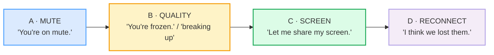

# Video-Call Specifics

> **Phase 2 · workplace · bundle #42 · Days 83–84.**
> *"You're on mute." / "You're frozen." / "Can everyone see?"*
>
> 🔗 This is the **tech-troubleshooting layer** on top of
> [PHONE_VIDEO](../speech_acts/PHONE_VIDEO.md) (Phase 1), which handles call
> **openings and closings** ("Hi, it's X." / "I should let you go."). Those get
> you in and out of a call; *this* bundle is what you say **when the tech
> breaks** — mute, freeze, lag, echo, screen-share, dropped connections. Sibling
> Phase 2 bundles: [MEETING_OPENINGS](./MEETING_OPENINGS.md) (the call starts
> fine), [STATUS_UPDATES](./STATUS_UPDATES.md) (what you say once it's working),
> [CONTRIBUTING](./CONTRIBUTING.md) (joining the discussion).

---

## Why this is its own bundle (read this first)

Video-call phrases are **recent and unfamiliar** to a Vietnamese L1 learner —
most did not exist in everyday business English before 2020, and Vietnamese
has no native equivalent chunks for *"You're on mute."* or *"Let me share my
screen."* The result is a specific, costly failure mode: when the tech hiccups,
the learner **freezes silently**. They can see the problem (someone's mouth is
moving with no audio; the picture has stopped; the screen is black) but they do
not *narrate* it in English — they wait, or type it in the chat, or apologise in
Vietnamese in their head. Meanwhile a native speaker has already said *"Hold on,
you're on mute."* in under a second.

This bundle's whole job is to make those four narration moves — **mute → frozen
→ screen-share → lost** — automatic retrieval, so the moment tech fails, the
right chunk comes out of your mouth instead of panic. It is also about
**shame**: tech hiccups are normal, and a learner who treats *"Sorry, I think
you're on mute."* as embarrassing will stay silent; one who treats it as a fixed
phrase loses the shame and gains fluency.

---

## 1. The four tech-hiccup moves

Every video-call failure a Vietnamese learner hits falls into one of four
buckets, and each bucket has **one survival chunk** that native speakers fire
without thinking:

You do **not** explain the failure ("the connection between your device and the
server has latency") — you **name it in a chunk** and move on. That compression
is the skill.

---

## 2. Mute issues — the #1 chunk of the era

`mute` /mjuːt/ as a call-state is now standard business English: Cambridge
documents both the **`on mute`** idiom ("having the mute button pressed on a
device so that it does not produce any sound") and the call verb ("to make a
person unable to be heard, for example when using video conferencing software").

> From `video_call_specifics_corpus.md`:
>
> - **You're on mute.** UK /jɔː(r) ɒn ˈmjuːt/ · US /jʊr ɑːn ˈmjuːt/
> - **I think you're on mute.** (hedged, softer) UK /aɪ ˈθɪŋk jɔː(r) ɒn ˈmjuːt/
> - **You're muted.** UK /jɔː(r) ˈmjuːtɪd/ — note `-ed` → /ɪd/ (stem ends in /t/)
> - **Could you unmute?** UK /kʊd ju ˌʌnˈmjuːt/ (Oxford: "Remember to unmute
>   yourself when it is your turn to speak.")

**The pragmatic ladder:** the **hedged** *I think you're on mute* is politer than
the blunt *You're on mute.* — use the blunt form with close colleagues, the
hedged form with a client or senior. *Could you unmute?* is the polite request
form when naming the problem directly feels rude.

---

## 3. Audio / video quality — narrate, don't diagnose

When the connection degrades, natives **report the symptom in a chunk**, they do
not troubleshoot aloud:

> From `video_call_specifics_corpus.md`:
>
> - **You're frozen.** UK /jɔː(r) ˈfrəʊ.zən/ · US /jʊr ˈfroʊ.zən/ — your video
>   stopped moving
> - **You're breaking up.** UK /jɔː(r) ˈbreɪkɪŋ ʌp/ — your audio is intermittent
> - **Your audio is lagging.** UK /jɔː(r) ˈɔːdi.əʊ ɪz ˈlæɡɪŋ/ — voice/video out
>   of sync
> - **There's an echo.** UK /ðeərz ən ˈek.əʊ/ · US /ðerz ən ˈek.oʊ/ — we hear you
>   twice
> - **You're cutting out.** UK /jɔː(r) ˈkʌtɪŋ aʊt/ — your audio keeps vanishing

**The Vietnamese trap:** a learner who *feels* the problem often stays silent
("maybe it will fix itself") or over-explains it. The fix is to treat these five
as a **fixed set** — one symptom, one chunk, immediately.

---

## 4. Screen share — the presenter's choreography

Sharing a screen is a **four-beat narration**, and skipping a beat confuses the
room (natives have a running joke about *"Can you see my screen?"* because
everyone says it). The choreography:

| Beat | Chunk | Why |
|---|---|---|
| 1 · announce | **Let me share my screen.** | tells the room you're starting |
| 2 · confirm | **Can everyone see my screen?** / **You should see my screen now.** | visibility check (etiquette rule #20 per SavvyCal) |
| 3 · hand off | (present) | the audience watches |
| 4 · close | **Let me stop sharing.** | cleanly ends the share |

> From `video_call_specifics_corpus.md`:
>
> - **Let me share my screen.** UK /let mi ˈʃeə(r) maɪ ˈskriːn/
> - **Can everyone see my screen?** UK /kən ˈevrɪwʌn siː maɪ ˈskriːn/
> - **You should see my screen now.** UK /ju ʃʊd siː maɪ ˈskriːn naʊ/
> - **Let me stop sharing.** UK /let mi stɒp ˈʃeərɪŋ/

---

## 5. Reconnect — when the call drops

Dropped connections have a **fixed two-step recovery**: name the loss, then
propose the rejoin.

> From `video_call_specifics_corpus.md`:
>
> - **I think we lost him/her/them.** UK /aɪ ˈθɪŋk wi lɒst ðəm/ — a participant
>   dropped
> - **Let's drop and reconnect.** UK /lets drɒp ənd ˌriːkəˈnekt/ — start a fresh
>   call
> - **Let me dial back in.** UK /let mi ˈdaɪəl bæk ɪn/ — I'll rejoin

`we lost them` is an idiom — `lost` here = "lost the connection to", not
misplaced. `drop` (the call) and `dial back in` reuse phone vocabulary for the
video age.

---

## 6. Cheat sheet — the ≤8 survival chunks

The Pareto set. Drill these eight aloud until each fires the instant the tech
fails. (Every row is a corpus attestation above.)

| # | Chunk | IPA | Why it's here |
|---|---|---|---|
| 1 | **You're on mute.** | UK /jɔː(r) ɒn ˈmjuːt/ · US /jʊr ɑːn ˈmjuːt/ | the #1 call chunk of the era |
| 2 | **Could you unmute?** | /kʊd ju ˌʌnˈmjuːt/ | polite mute-request (vs the blunt *you're muted*) |
| 3 | **You're frozen.** | UK /jɔː(r) ˈfrəʊ.zən/ · US /jʊr ˈfroʊ.zən/ | narrate a frozen video instantly |
| 4 | **You're breaking up.** | UK /jɔː(r) ˈbreɪkɪŋ ʌp/ | intermittent audio — one chunk, not a diagnosis |
| 5 | **There's an echo.** | UK /ðeərz ən ˈek.əʊ/ · US /ðerz ən ˈek.oʊ/ | feedback loop — name it, fix it |
| 6 | **Let me share my screen.** | UK /let mi ˈʃeə(r) maɪ ˈskriːn/ · US /let mi ˈʃer maɪ ˈskriːn/ | screen-share beat 1 (announce) |
| 7 | **Can everyone see my screen?** | UK /kən ˈevrɪwʌn siː maɪ ˈskriːn/ | screen-share beat 2 (visibility check) |
| 8 | **I think we lost them.** | UK /aɪ ˈθɪŋk wi lɒst ðəm/ · US /aɪ ˈθɪŋk wi lɑːst ðəm/ | call-drop recovery step 1 |

> Open [`video_call_specifics.html`](./video_call_specifics.html) to drill these
> as flip cards, hear native clips, play the role-play, shadow, and write.

---

## 7. Vietnamese → English L1 pitfalls table

The "expert payoff." These are the specific interference traps a Vietnamese
speaker hits on video-call English — extend, don't replace, the seed rows from
the spec.

| Vietnamese trap (what you do) | English fix (what to do instead) |
|---|---|
| **Stays silent when tech fails** — sees the mute/freeze but waits, hoping it self-fixes, instead of narrating | Fire the chunk in &lt;1s: *"Hold on, you're on mute."* / *"You're frozen — can you repeat?"*. Silence reads as incompetence; a fast chunk reads as fluency. |
| **Shame about tech hiccups** — apologises profusely ("I'm so sorry, so sorry, my internet is bad") | One light apology + move on: *"Sorry — I was on mute. As I was saying,…"*. Over-apologising signals low confidence; natives treat mute as a non-event. |
| **Drops final consonants** on the call-state words → *"You're on mew"* for *mute*, *"You're froze"* for *frozen* | Release the final: **mute** /mjuːt/ (hit the /t/), **frozen** /ˈfrəʊ.zən/ (hit the /n/). 🔗 [FINAL_CONSONANTS](../pronunciation/FINAL_CONSONANTS.md) — dropped finals are the #1 VN intelligibility loss. |
| **No past/participle agreement** → *"You are freeze"* / *"You are break up"* | Use the participle: **You're frozen.** / **You're breaking up.** / **You're cutting out.** These are fixed *be* + `-ing`/`-en` forms. |
| **`/θ/` → /t/, `/ð/` → /z/** → *"I tink we lost dem"* | Tongue-between-teeth: **think** /θɪŋk/, **them** /ðəm/. 🔗 [TH_SOUNDS](../pronunciation/TH_SOUNDS.md). |
| **Literal translation** → *"Bạn đang bị tắt tiếng"* carried into English as *"You are being turned off sound"* | Retrieve the **fixed chunk**, not a translation: *"You're on mute."* / *"You're muted."* These are non-compositional — memorise as units. |
| **Confuses `on mute` vs `muted`** → mixes *"you on mute"* and *"you're mute"* | `on mute` = the *state of the device* (the button is pressed); `muted` = the *state of you* (your mic is off). Both are correct; pick one and say it cleanly. |
| **Over-explains the failure** → *"The connection of network have some problem with delay"* | Name the symptom in one chunk: *"Your audio is lagging."* / *"There's an echo."* Diagnose in the chat if needed, never aloud. |
| **Mis-stresses the chunk** → *"You're ON mute"* (wrong word) | Stress the **content word**: *"You're on **MUTE**."* / *"You're **FROZEN**."* — the grammar words (*you're, on, is*) stay weak. 🔗 [SENTENCE_STRESS](../pronunciation/SENTENCE_STRESS.md). |

---

## How to practise this bundle (the daily 20 min)

1. **READ** (5 min) — this guide, §1–§5.
2. **SHADOW** (7 min) — open `video_call_specifics.html`, drill the 8 flip cards
   + the role-play **aloud**, firing each chunk the instant its "hiccup" appears.
3. **PRODUCE** (8 min) — the writing task: write **one screen-share cue** (*Let
   me share my screen… / Can everyone see my screen?*) **+ one tech-issue line**
   (*You're on mute. / You're frozen. / You're breaking up.*). Read them aloud,
   recording yourself; check each final consonant is audible.

---

## Sources

- Cambridge Advanced Learner's Dictionary — `mute` /mjuːt/, the `on mute` idiom, the call-verb sense — https://dictionary.cambridge.org/dictionary/english/mute
- Cambridge Advanced Learner's Dictionary — `frozen` UK /ˈfrəʊ.zən/, US /ˈfroʊ.zən/ — https://dictionary.cambridge.org/dictionary/english/frozen
- Cambridge Advanced Learner's Dictionary — `echo` UK /ˈek.əʊ/, US /ˈek.oʊ/ — https://dictionary.cambridge.org/dictionary/english/echo
- Cambridge Advanced Learner's Dictionary — `lag` /læɡ/ + computer-delay sense — https://dictionary.cambridge.org/dictionary/english/lag_1
- Cambridge Advanced Learner's Dictionary — `break up` / `cut out` phrasal verbs — https://dictionary.cambridge.org/dictionary/english/break-up · https://dictionary.cambridge.org/dictionary/english/cut-out
- Cambridge Advanced Learner's Dictionary — *share, screen, drop, dial, reconnect* — https://dictionary.cambridge.org/dictionary/english/{word}
- Oxford Advanced Learner's Dictionary — `unmute` /ˌʌnˈmjuːt/ — https://www.oxfordlearnersdictionaries.com/definition/english/unmute
- Collins COBUILD — `unmute` — https://www.collinsdictionary.com/us/dictionary/english/unmute
- SavvyCal, "Virtual Meeting Etiquette" (Rule #20 — *"can you see my screen?"*) — https://savvycal.com/articles/virtual-meeting-etiquette/
- SlideUpLift, "Virtual Meeting Etiquette Rules" — https://slideuplift.com/blog/virtual-meeting-etiquette/
- Speak Confident English, "Must-Have English Phrases for Online Meetings" — https://www.speakconfidentenglish.com/english-phrases-online-meetings/
- Preply, "Essential phrases for Business calls in English" — https://preply.com/en/blog/business-calls-in-english/
- 18kenglish, "Con Call: Conference Call English Phrases" — https://18kenglish.com/con-call-chinese-conference-call-english-2026/
- Native audio: YouGlish — https://youglish.com/pronounce/{chunk}/english/us?
- Frequency methodology: wordfrequency.info (spoken sub-corpus) — https://www.wordfrequency.info/
