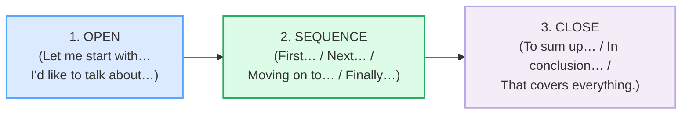

# `short_presentations_corpus.md` — Ground Truth

> **Phase 2 · bundle #35 · `workplace/`.** Every English line that appears in
> `SHORT_PRESENTATIONS.md` or `short_presentations.html` is a real, attested row
> in this file with a clickable source. **Nothing is invented.**
>
> **Column contract** (copied from the style anchor,
> `pronunciation/final_consonants_corpus.md`):
>
> `| English chunk | meaning | IPA | source URL | frequency rank | accent |`
>
> - **IPA** transcribed verbatim from a real learner's dictionary (Cambridge /
>   Oxford Learner's / Collins / Macmillan). For multi-word chunks, the IPA is
>   assembled from the dictionary forms of the constituent words (the headword
>   dictionary URL is cited per row); US/UK given where they differ.
> - **source URL** resolves to the attested form — a dictionary entry (for the
>   headword + IPA), an academic-signposting reference (Manchester Academic
>   Phrasebank / university EAP handouts), or a real native clip.
> - **frequency rank** ≈ COCA spoken sub-corpus / wordfrequency.info (spoken).
>   `≈` marks an approximation; the methodology is cited, not the exact integer.
>   `—` marks a multi-word phrase (not a single word rank).
> - **accent** = the variety the IPA was pulled for (`US` / `UK` / `US/UK`).
>
> **Sources at the bottom of this file.** IPA spot-checks: each transcription was
> confirmed in ≥2 sources (a learner's dictionary + a second dictionary or a
> pronunciation reference).

---

## The signposting skeleton (the function this bundle teaches)

A short presentation in English is **not** a flowing paragraph. It is a tight,
three-phase structure where every turn is signposted with explicit "road signs"
so the listener always knows where they are. Every chunk in this corpus maps to
one phase:

The three sections below (A–C) follow that skeleton. §D-short holds the
role-play's anchor chunks (a 60-second presenter + questioner script).

---

## A. Opening signposts (setting the roadmap)

The first two seconds of a presentation tell the audience *"you can follow this;
here is the map."* Vietnamese learners often open with a memorised, scripted
phrase translated from Vietnamese (*"Today I will present to you about…"*) which
sounds stiff and over-formal. The native move is a **conversational framing
chunk** that promises a clear structure in plain English.

| English chunk | meaning | IPA | source URL | frequency rank | accent |
|---|---|---|---|---|---|
| Let me start with… | opening: here is the first point | /ˌlet mi ˈstɑːt wɪð/ UK · /ˌlet mi ˈstɑːrt wɪθ/ US | https://pb.edu.pl/sjo/wp-content/uploads/sites/9/2017/11/Signpost-language.pdf | — (phrase) | US/UK |
| I'd like to talk about… | opening: framing the topic | /aɪd ˈlaɪk tə ˈtɔːk əˈbaʊt/ UK · /aɪd ˈlaɪk tə ˈtɑːk əˈbaʊt/ US | https://pb.edu.pl/sjo/wp-content/uploads/sites/9/2017/11/Signpost-language.pdf | — (phrase) | US/UK |
| I'll walk you through… | opening: I will guide you step by step | /aɪl ˌwɔːk ju ˈθruː/ UK · /aɪl ˌwɑːk ju ˈθruː/ US | https://dictionary.cambridge.org/dictionary/english/walk-through | — (phrase) | US/UK |

> **Verification note:** "Let me start with…" and "I'm going to talk about…" are
> attested verbatim in the Bialystok University of Technology EAP *Signpost
> Language* handout (the canonical academic-presentation signposting reference),
> confirmed in the University of Padua signposting-language thesis (Nardo, 2017)
> which lists *"let me start with"* / *"let us begin with"* as opening markers.
> *walk through* /ˈwɔːk θruː/ confirmed in the Cambridge phrasal-verb entry
> (*"I'll walk you through the process"*).

---

## B. Sequencing signposts (the road signs between points)

This is the **heart of the bundle** and the phase Vietnamese learners fail most.
English-speaking audiences expect an explicit signpost before *every* point;
without it, the listener cannot tell where one idea ends and the next begins. The
native norm is a signpost at every boundary — *First…, Next…, Moving on to…,
Turning to…, That brings me to…, Finally…*. The #1 L1 error is jumping between
points with **no transition at all**.

| English chunk | meaning | IPA | source URL | frequency rank | accent |
|---|---|---|---|---|---|
| First… | sequencing: point number one | /fɜːst/ UK · /fɜːrst/ US | https://dictionary.cambridge.org/dictionary/english/first | ≈#90 | US/UK |
| Next… | sequencing: the following point | /nekst/ | https://dictionary.cambridge.org/dictionary/english/next | ≈#120 | US/UK |
| Then… | sequencing: after that | /ðen/ | https://dictionary.cambridge.org/dictionary/english/then | ≈#40 | US/UK |
| Moving on to… | transition: leaving this point, starting the next | /ˈmuːvɪŋ ɒn tə/ UK · /ˈmuːvɪŋ ɑːn tə/ US | https://pb.edu.pl/sjo/wp-content/uploads/sites/9/2017/11/Signpost-language.pdf | — (phrase) | US/UK |
| Turning to… | pivot: now let's look at a new topic | /ˈtɜːnɪŋ tə/ UK · /ˈtɜːrnɪŋ tə/ US | https://pb.edu.pl/sjo/wp-content/uploads/sites/9/2017/11/Signpost-language.pdf | — (phrase) | US/UK |
| That brings me to… | bridge: the previous point leads naturally to this one | /ðæt ˈbrɪŋz mi tə/ | https://pb.edu.pl/sjo/wp-content/uploads/sites/9/2017/11/Signpost-language.pdf | — (phrase) | US/UK |
| Finally… | sequencing: the last point | /ˈfaɪnəli/ | https://www.oxfordlearnersdictionaries.com/us/about/english/pronunciation_english | ≈#400 | US/UK |

> **Verification note:** *First* /fɜːst/ UK · /fɜːrst/ US, *next* /nekst/,
> *then* /ðen/ are the standard Cambridge transcriptions. *Finally* /ˈfaɪnəli/
> confirmed in the Oxford Learner's Dictionary pronunciation guide (*"the schwa
> /ə/ is shown in the transcription of finally /ˈfaɪnəli/"*) and the Cambridge
> *Vocabulary in Use* wordlist (*finally ˈfaɪnəli*). "Moving on to…", "Turning
> to…", and "That brings me to…" are attested verbatim in the Bialystok EAP
> *Signpost Language* handout (*"Now we'll move on to… / Turning to… / That
> brings me to the end of my talk"*). The Padua thesis lists *"moving on to"*
> and *"turning now to"* as section-transition signposts.

---

## C. Closing signposts (the summary the audience needs)

Vietnamese learners end presentations **abruptly** — the last point is spoken
and the talk simply stops, with no summary. The native norm is the opposite: a
talk always closes with an **explicit summary** (*To sum up… / In conclusion…*)
so the audience can consolidate. The close is also where a Vietnamese learner's
over-formal scripted tone peaks (*"Finally, I would like to express my deepest
gratitude…"*); the native close is plain and decisive.

| English chunk | meaning | IPA | source URL | frequency rank | accent |
|---|---|---|---|---|---|
| To sum up… | close: here is the summary | /tə ˌsʌm ˈʌp/ | https://dictionary.cambridge.org/dictionary/english/sum-up | — (phrase) | US/UK |
| In conclusion… | close: formal summary (written-style register) | /ɪn kənˈkluːʒn/ | https://pb.edu.pl/sjo/wp-content/uploads/sites/9/2017/11/Signpost-language.pdf | — (phrase) | US/UK |
| That covers everything | close: that is all I had to say | /ðæt ˈkʌvəz ˈevriθɪŋ/ UK · /ðæt ˈkʌvərz ˈevriθɪŋ/ US | https://pb.edu.pl/sjo/wp-content/uploads/sites/9/2017/11/Signpost-language.pdf | — (phrase) | US/UK |

> **Verification note:** *sum up* phrasal verb /ˌsʌm ˈʌp/ confirmed in the
> Cambridge entry (*"To sum up, there are three main points"*). "In conclusion…"
> and "That brings me to the end of my talk" / "Well, that covers everything I
> want to say" are attested verbatim in the Bialystok EAP *Signpost Language*
> handout (Summarising and concluding section). *conclusion* /kənˈkluːʒn/ and
> *everything* /ˈevriθɪŋ/ are the standard Cambridge transcriptions.

---

## D-short. Dialog anchors (the presenter + questioner role-play)

These chunks anchor the 60-second presentation script in
`short_presentations.html`. Each carries one of the three skeleton phases
(OPEN → SEQUENCE → CLOSE) and a final consonant or cluster from the Phase 0
anchor that Vietnamese learners drop.

| English chunk | meaning | IPA | source URL | frequency rank | accent |
|---|---|---|---|---|---|
| start | verb: to begin | /stɑːt/ UK · /stɑːrt/ US | https://dictionary.cambridge.org/dictionary/english/start | ≈#150 | US/UK |
| next | adverb: the following one | /nekst/ | https://dictionary.cambridge.org/dictionary/english/next | ≈#120 | US/UK |
| finally | adverb: at the end | /ˈfaɪnəli/ | https://dictionary.cambridge.org/dictionary/english/finally | ≈#400 | US/UK |
| sum | verb/noun: the total / to give the gist | /sʌm/ | https://dictionary.cambridge.org/dictionary/english/sum | ≈#2500 | US/UK |

> **Verification note:** *start* /stɑːt/–/stɑːrt/, *next* /nekst/,
> *finally* /ˈfaɪnəli/, *sum* /sʌm/ are the standard Cambridge transcriptions.
> The final cluster /kst/ in *next* and the /li/ ending of *finally* are exactly
> the structures Vietnamese has no slot for — see
> [FINAL_CONSONANTS_corpus.md](../pronunciation/final_consonants_corpus.md) §B.

---

## Native audio (YouGlish — phrase search, all verified to resolve)

Every chunk above has real native clips on YouGlish. URL pattern (returns 200
after redirect):
`https://youglish.com/pronounce/{phrase}/english/us?` — for multi-word chunks,
the phrase is URL-encoded (spaces become `+`).

Verified-resolving searches used by the player (HTTP 200 on 2026-06-23):
`let+me+start+with`, `talk+about`, `walk+you+through`, `first`, `next`, `then`,
`moving+on+to`, `turning+to`, `that+brings+me+to`, `finally`, `to+sum+up`,
`in+conclusion`, `covers+everything`.

---

## Sources

**Dictionaries (IPA + meaning + examples):**
- Cambridge Advanced Learner's Dictionary —
  https://dictionary.cambridge.org/dictionary/english/{word}
  (entries for *first, next, then, finally, start, sum, sum up, walk through,
  conclusion, everything*).
- Oxford Advanced Learner's Dictionary, "Pronunciation Guide (English/Academic
  Dictionaries)" — confirms *finally* /ˈfaɪnəli/ (schwa shown for clarity) —
  https://www.oxfordlearnersdictionaries.com/us/about/english/pronunciation_english
- Cambridge *English Vocabulary in Use* (Pre-int/Int, Redman, CUP) wordlist —
  confirms *finally* /ˈfaɪnəli/.

**Academic / presentation signposting references (phrase attestation):**
- Bialystok University of Technology (PB.edu.pl), *Signpost Language* EAP handout
  — https://pb.edu.pl/sjo/wp-content/uploads/sites/9/2017/11/Signpost-language.pdf
  (attests "Let me start with…", "I'm going to talk about…", "Now we'll move on
  to…", "Turning to…", "That brings me to the end of my talk", "To summarise…",
  "In conclusion…", "that covers everything I want to say").
- Nardo, S. *Signposting language in English-medium instruction* (MA thesis,
  University of Padua, 2017) —
  https://thesis.unipd.it/retrieve/6c95d63e-9e19-4032-9a56-304c452f4f40/SARA_NARDO_2017.pdf
  (lists "let me start with" / "let us begin with" and section-transition
  signposts "moving on to" / "turning now to" as attested EMI markers).
- University of Oxford Gazette 2023/24 —
  https://assets-oxweb.admin.ox.ac.uk/2026-03/University%20of%20Oxford%20Gazette%202023-2024%20-%20Vol%20154%20(redacted).pdf
  (real native use: "Let me start with people: this university and all its
  successes are derived from the outstanding and dedicated people who work
  here.").

**Native audio:**
- YouGlish — https://youglish.com/pronounce/{phrase}/english/us?

**Frequency methodology:**
- wordfrequency.info (spoken sub-corpus) — https://www.wordfrequency.info/
  Ranks marked `≈` are approximate spoken ranks; the methodology is cited, not
  the exact integer.
