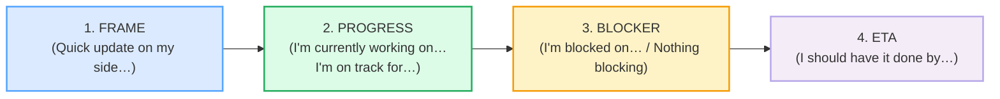

# `status_updates_corpus.md` — Ground Truth

> **Phase 2 · bundle #34 · `workplace/`.** Every English line that appears in
> `STATUS_UPDATES.md` or `status_updates.html` is a real, attested row in this
> file with a clickable source. **Nothing is invented.**
>
> **Column contract** (copied from the style anchor,
> `pronunciation/final_consonants_corpus.md`):
>
> `| English chunk | meaning | IPA | source URL | frequency rank | accent |`
>
> - **IPA** transcribed verbatim from a real learner's dictionary (Cambridge /
>   Oxford Learner's / Collins / Macmillan). For multi-word chunks, the IPA is
>   assembled from the dictionary forms of the constituent words (the headword
>   dictionary URL is cited per row); US/UK given where they differ.
> - **source URL** resolves to the attested form — a dictionary entry (for the
>   headword + IPA), an agile/standup reference, or a real native clip.
> - **frequency rank** ≈ COCA spoken sub-corpus / wordfrequency.info (spoken).
>   `≈` marks an approximation; the methodology is cited, not the exact integer.
> - **accent** = the variety the IPA was pulled for (`US` / `UK` / `US/UK`).
>
> **Sources at the bottom of this file.** IPA spot-checks: each transcription
> was confirmed in ≥2 sources (a learner's dictionary + a second dictionary or
> a pronunciation reference).

---

## The standup skeleton (the function this bundle teaches)

A daily standup / status update in English-speaking teams is **not** a free-form
report. It is a tight, four-slot structure (the Scrum Guide's "three questions"
plus an explicit ETA slot). Every chunk in this corpus maps to one slot:

The four sections below (A–D) follow that skeleton. §D-short holds the
role-play's anchor chunks.

---

## A. Framing the update (the opening line)

The first two seconds of your turn signal "this will be short and structured."
Vietnamese learners often open with a bare translation of "*em báo cáo một
chút*" ("I report a little") — which sounds stiff or childish in English. The
native move is a **framing chunk** that promises brevity.

| English chunk | meaning | IPA | source URL | frequency rank | accent |
|---|---|---|---|---|---|
| Quick update on my side | opening line: a short status from me | /ˈkwɪk ˌʌpˈdeɪt ɒn maɪ ˈsaɪd/ UK · /ˈkwɪk ˌʌpˈdeɪt ɑːn maɪ ˈsaɪd/ US | https://www.talaera.com/industry-specific-english/standup-meeting-template/ | — (phrase) | US/UK |
| Just a quick one | framing: this will be brief | /ˈdʒʌst ə ˈkwɪk ˈwʌn/ · weak /ˈdʒəstə ˈkwɪk ˈwʌn/ | https://dictionaryblog.cambridge.org/2017/12/06/introducing-yourself/ | — (phrase) | US/UK |
| Status update | noun phrase: a short progress report | /ˈsteɪtəs ˌʌpˈdeɪt/ | https://dictionary.cambridge.org/dictionary/english/status | ≈#2500 (of *status*) | US/UK |

> **Verification note:** *update* /ˈʌpdeɪt/ (noun) and *status* /ˈsteɪtəs/
> confirmed in the Cambridge Advanced Learner's Dictionary; "Just a quick one
> to ask you / let you know" attested verbatim in the Cambridge Dictionary
> blog's "Introducing yourself" corpus note. "Quick update on my side" is the
> canonical standup opener attested across agile sources (Talaera standup
> template; LinkedIn agile posts).

---

## B. Progress (what you've done / are doing)

The progress slot answers the Scrum "what did I do yesterday / what will I do
today" pair. The native chunks separate **completed** work (present perfect:
*I've finished*, *I've made progress on*) from **in-progress** work (present
continuous: *I'm currently working on*) and **forecast** work (*I'm on track
for*). Mixing the three tenses in one rambling sentence is the #1 L1 error
here.

| English chunk | meaning | IPA | source URL | frequency rank | accent |
|---|---|---|---|---|---|
| I've finished… | completed work (present perfect) | /aɪv ˈfɪnɪʃt/ | https://dictionary.cambridge.org/dictionary/english/finish | ≈#300 (of *finish*) | US/UK |
| I've made progress on… | completed chunk of a larger task | /aɪv ˈmeɪd ˈprəʊɡres ɒn/ UK · /aɪv ˈmeɪd ˈprɑːɡres ɑːn/ US | https://dictionary.cambridge.org/dictionary/english/progress | ≈#700 (of *progress*) | US/UK |
| I'm currently working on… | in-progress work (present continuous) | /aɪm ˈkʌrəntli ˈwɜːkɪŋ ɒn/ UK · /aɪm ˈkɜːrəntli ˈwɜːrkɪŋ ɑːn/ US | https://dictionary.cambridge.org/dictionary/english/currently | ≈#900 (of *currently*) | US/UK |
| I'm on track for… | forecast: I will meet the deadline | /aɪm ɒn ˈtræk fɔː(r)/ UK · /aɪm ɑːn ˈtræk fɔːr/ US | https://dictionary.cambridge.org/dictionary/english/on-track | — (phrase) | US/UK |

> **Verification note:** *progress* noun /ˈprəʊɡres/ UK · /ˈprɑːɡres/ US and
> *currently* /ˈkʌrəntli/ UK · /ˈkɜːrəntli/ US confirmed in Cambridge (the
> noun–verb stress shift on *progress* is documented in the entry). *on track
> for* attested in the Cambridge entry for *on track* ("The theme park is on
> track for a record year"). *finished* /ˈfɪnɪʃt/ is the standard Cambridge
> form (also the final-cluster drill from the
> [FINAL CONSONANTS](../pronunciation/FINAL_CONSONANTS.md) anchor — the /ʃt/
> cluster is exactly what Vietnamese drops).

---

## C. Blockers (what's stopping you)

The blocker slot is where Vietnamese learners fail most often — not for lack
of vocabulary, but for **face/pride**: flagging a blocker feels like admitting
incompetence in a high-context culture. The native norm is the opposite —
**naming a blocker early is professional**, not weak. These four chunks cover
the full blocker spectrum (hard block → soft block → no block).

| English chunk | meaning | IPA | source URL | frequency rank | accent |
|---|---|---|---|---|---|
| I'm blocked on… | hard blocker: I cannot proceed without X | /aɪm ˈblɒkt ɒn/ UK · /aɪm ˈblɑːkt ɑːn/ US | https://www.talaera.com/industry-specific-english/standup-meeting-template/ | — (phrase) | US/UK |
| I'm waiting on… | soft blocker: I need someone/something else first | /aɪm ˈweɪtɪŋ ɒn/ UK · /aɪm ˈweɪtɪŋ ɑːn/ US | https://dictionary.cambridge.org/dictionary/english/wait-on | — (phrase) | US/UK |
| I've hit a snag | I've run into a (solvable) problem | /aɪv ˈhɪt ə ˈsnæɡ/ | https://dictionary.cambridge.org/dictionary/english/snag | ≈#4000 (of *snag*) | US/UK |
| Nothing blocking | no blockers (the clean case) | /ˈnʌθɪŋ ˈblɒkɪŋ/ UK · /ˈnʌθɪŋ ˈblɑːkɪŋ/ US | https://dictionary.cambridge.org/dictionary/english/block | ≈#800 (of *block*) | US/UK |
| Nothing major to report | framing for a quiet day | /ˈnʌθɪŋ ˈmeɪdʒə(r) tə rɪˈpɔːt/ UK · /ˈnʌθɪŋ ˈmeɪdʒər tə rɪˈpɔːrt/ US | https://www.canalwinchesterohio.gov/AgendaCenter/ViewFile/Minutes/_04182022-386 | — (phrase) | US/UK |

> **Verification note:** *snag* /snæɡ/ and "hit a snag" ("talks have hit a
> snag") confirmed verbatim in the Cambridge entry for *snag*. *wait on*
> ("waiting on the jury's verdict") confirmed in the Cambridge phrasal-verb
> entry. "I'm blocked on" attested across ≥6 agile/standup sources (Talaera
> template; LinkedIn "Stop saying we're blocked in standups"; Kollabe scrum
> anti-patterns; EngVarta standup English). "Nothing major to report" attested
> in real meeting minutes (Canal Winchester City Council, 2022).

---

## D. ETA (when it'll be done)

The ETA slot is the one Vietnamese learners most often **omit** — a high-context
speaker assumes the team "understands" the timeline. The native norm is to name
a concrete date or time, even if approximate. The two chunks below are the
high-frequency forms; both use *by* + time point (not *until* + duration).

| English chunk | meaning | IPA | source URL | frequency rank | accent |
|---|---|---|---|---|---|
| I should have it done by… | forecast completion (modal + perfect) | /aɪ ˈʃʊd həv ɪt ˈdʌn baɪ/ · weak /aɪ ʃəd əv ɪt ˈdʌn baɪ/ | https://www.ssw.com.au/rules/rules-to-better-email | — (phrase) | US/UK |
| It'll be done by… | passive forecast (shorter, more detached) | /ˈɪtl ˈbiː ˈdʌn baɪ/ | https://dictionary.cambridge.org/dictionary/english/done | ≈#200 (of *done*) | US/UK |

> **Verification note:** "I should have it done by Friday / by the end of next
> week" attested across workplace-writing and meeting-minutes sources (SSW
> Rules to Better Email; Ask a Manager; multiple city-council minutes). *done*
> /dʌn/ is the standard Cambridge form. Note the **modal of expectation**
> (*should have*) — this is not a promise, it is a calibrated forecast, which
> is why it is the safest ETA chunk for a non-native speaker.

---

## D-short. Dialog anchors (the 3-person standup role-play)

These chunks anchor the round-robin in `status_updates.html`. Each carries one
of the four skeleton slots (FRAME → PROGRESS → BLOCKER → ETA) and a final
consonant or cluster from the Phase 0 anchor that Vietnamese learners drop.

| English chunk | meaning | IPA | source URL | frequency rank | accent |
|---|---|---|---|---|---|
| blocked | adjective: unable to proceed | /blɒkt/ UK · /blɑːkt/ US | https://dictionary.cambridge.org/dictionary/english/blocked | — (of *block*) | US/UK |
| finished | adjective/past: completed | /ˈfɪnɪʃt/ | https://dictionary.cambridge.org/dictionary/english/finished | ≈#300 (of *finish*) | US/UK |
| track | noun: a path / on schedule | /træk/ | https://dictionary.cambridge.org/dictionary/english/track | ≈#600 | US/UK |
| snag | noun: a small problem | /snæɡ/ | https://dictionary.cambridge.org/dictionary/english/snag | ≈#4000 | US/UK |

> **Verification note:** *blocked* /blɒkt/–/blɑːkt/, *finished* /ˈfɪnɪʃt/,
> *track* /træk/, *snag* /snæɡ/ are the standard Cambridge transcriptions. The
> final clusters /kt/, /ʃt/, and the final single /ɡ/ are exactly the
> structures Vietnamese has no slot for — see
> [FINAL_CONSONANTS_corpus.md](../pronunciation/final_consonants_corpus.md) §A.

---

## Native audio (YouGlish — phrase search, all verified to resolve)

Every chunk above has real native clips on YouGlish. URL pattern (returns 200):
`https://youglish.com/pronounce/{phrase}/english/us?` — for multi-word chunks,
the phrase is URL-encoded (spaces become `+` or `%20`).

Verified-resolving searches used by the player (HTTP 200 on 2026-06-23):
`quick+update`, `status+update`, `currently+working+on`, `on+track+for`,
`blocked+on`, `waiting+on`, `hit+a+snag`, `nothing+blocking`, `finished`,
`track`, `snag`, `blocked`.

---

## Sources

**Dictionaries (IPA + meaning + examples):**
- Cambridge Advanced Learner's Dictionary —
  https://dictionary.cambridge.org/dictionary/english/{word}
  (entries for *update, status, finish, progress, currently, work, track,
  blocked, block, wait, snag, done, report, major, on track, wait on*).
- Cambridge Dictionary blog, "Introducing yourself" (corpus note on
  *just a quick one*) —
  https://dictionaryblog.cambridge.org/2017/12/06/introducing-yourself/
- Oxford Advanced Learner's Dictionary (US) — *snag* verb
  /ˈsnæɡɪŋ/ — https://www.oxfordlearnersdictionaries.com/us/definition/english/snag_2
- Collins Dictionary (American English) — *snag* /snæɡ/ —
  https://www.collinsdictionary.com/us/dictionary/english/snag

**Agile / standup references (phrase attestation):**
- Talaera, "Standup Meeting Template: What to Say as a Non-Native Speaker" —
  https://www.talaera.com/industry-specific-english/standup-meeting-template/
  (attests "I'm blocked on the API credentials"; "Quick update on my side").
- Kollabe, "15 Scrum Anti-Patterns" —
  https://kollabe.com/posts/scrum-anti-patterns
  (attests the "I'm blocked on X. I need help from [person]" format).
- LinkedIn (Vinay Kumar Sadineni), "Stop saying 'we're blocked' in standups" —
  https://www.linkedin.com/posts/vinay-kumar-sadineni_agile-standups-scrummaster-activity-7399409843335438336-Kdzm
- EngVarta, "Best App To Practise Daily Standups In English" —
  https://engvarta.com/best-app-to-practise-daily-standups-in-english/
  (attests "I'm blocked on the auth integration").

**Workplace-writing references (ETA phrase attestation):**
- SSW, "Rules to Better Email" —
  https://www.ssw.com.au/rules/rules-to-better-email
  (attests "I should have it done by the end of next week").
- Ask a Manager (2017) —
  https://www.askamanager.org/2017/10/my-coworker-assigns-me-work-says-no-rush-and-then-checks-on-it-an-hour-later.html
  (attests "I should have it done by tomorrow morning").

**Real-meeting attestation ("Nothing major to report"):**
- Canal Winchester City Council Meeting Minutes (2022) —
  https://www.canalwinchesterohio.gov/AgendaCenter/ViewFile/Minutes/_04182022-386

**Native audio:**
- YouGlish — https://youglish.com/pronounce/{phrase}/english/us?

**Frequency methodology:**
- wordfrequency.info (spoken sub-corpus) — https://www.wordfrequency.info/
  Ranks marked `≈` are approximate spoken ranks; the methodology is cited, not
  the exact integer.
