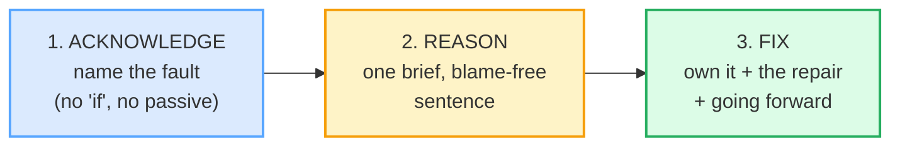

# Apology Emails

> **Phase 3 · writing · bundle #49 · Days 97–98.**
> *"I apologize for the delay; here's what happened."*
>
> 🔗 Builds on [EMAIL ANATOMY](./EMAIL_ANATOMY.md) (the BLUF principle — an
> apology puts the fault up front, not buried in paragraph three), and on
> [FORMAL VS CASUAL REGISTER](./FORMAL_CASUAL_REGISTER.md) (the same apology
> climbs a register ladder: *I'm sorry* → *I apologize* → *Please accept my
> apologies*). The speech-act sibling is
> [APOLOGIZING](../speech_acts/APOLOGIZING.md) — this bundle is its **written,
> professional** form.

---

## Why this bundle exists (read this first)

A Vietnamese learner writing an apology email almost always makes one of two
mistakes, and they are mirror images of each other:

1. **Over-apologise and over-explain** — a long, face-saving paragraph that
   dwells on the excuse, blames the traffic / the weather / the colleague, and
   never gets to the fix. Vietnamese culture reads elaboration as *respect*;
   English business culture reads it as *deflection*.
2. **Under-apologise** — a one-line *"sorry for delay"* with no acknowledgement
   of impact and no repair, because the learner is embarrassed and wants it over.

Both miss the one move that makes an English apology land: **the forward-looking
fix**. The Harvard Business Review "Organizational Apology" framework
(Schweitzer, Brooks & Galinsky, 2015) names four ingredients — *recognition ·
responsibility · remorse · reparation*. Folded into a writeable email, that
collapses to a **three-part spine**:

Notice what is **not** a step: the long excuse, the blame-shift, the conditional
*"if you were offended"*. The reason move is *one sentence*. The fix move is
where you spend your words.

---

## 1. The acknowledge move — name the fault

The first sentence states what went wrong, in active voice, with no hedge. Three
registers of the same move:

| Register | Chunk | When |
|---|---|---|
| Formal (client / external) | **Please accept my apologies.** | most distant relationship |
| Semi-formal (colleague / manager) | **I apologize for the delay.** | the workhorse — most common |
| Neutral (close colleague) | **I'm sorry for any inconvenience caused.** | lower-stakes, internal |

> From `apology_emails_corpus.md`:
>
> | Please accept my apologies | I apologize for the delay |
> |---|---|
> | /pliːz əkˈsept maɪ əˈpɒlədʒiz/ UK · /pliːz əkˈsept maɪ əˈpɑːlədʒiz/ US | /aɪ əˈpɒlədʒaɪz fə ðə dɪˈleɪ/ UK · /aɪ əˈpɑːlədʒaɪz fər ðə dɪˈleɪ/ US |
>
> Cambridge attests *"Please accept my apologies."* in its *apology* entry, and
> *"we apologize for any inconvenience caused"* in its *apologize* entry. Oxford
> attests *"Please accept our apologies for the delay."* These are not invented
> templates — they are dictionary-corpus lines.

**The choice that trips Vietnamese learners: *I apologize* vs *I'm sorry*.**
*"I'm so so sorry"* sounds over-effusive and emotional — fine with a friend,
unprofessional with a client. The full verb **apologize** is *more* formal but
*more* controlled: it carries weight without leaking emotion. Default to it for
any external or written apology.

---

## 2. The reason move — one sentence, blame-free

The reason is **shorter than the apology**. It answers "why?" once, in a clause
that names a cause without pointing at a person. Two openers carry almost the
whole load:

> From `apology_emails_corpus.md`:
>
> - **Unfortunately, …** /ʌnˈfɔːtʃənətli/ UK · /ʌnˈfɔːrtʃənətli/ US — flags
>   bad news *before* it lands, so the reader is braced.
> - **Due to …** /ˈdjuː tuː/ UK · /ˈduː tuː/ US — links a cause, formal.
>   Cambridge attests *"The bus was delayed due to heavy snow."*

So a real reason line reads: *"Unfortunately, the report was delayed due to a
data-validation error."* — one sentence, cause named, no colleague thrown under
the bus.

**The Vietnamese trap here:** the reason is where L1 elaboration instinct kicks
in hardest. Vietnamese apology culture (the face-saving *"em xin lỗi vì… traffic
mưa kẹt xe sếp gọi…"*) rewards a *story*. English business email punishes it:
write the 30/70 rule on your hand — **no more than 30% of the email is the
reason, at least 70% is impact + fix.** If your "why" paragraph is longer than
your "sorry" sentence, the reader stops hearing remorse and starts hearing
excuses.

---

## 3. The fix move — own it, then repair

This is the move that separates a real apology from a non-apology, and it is the
move Vietnamese learners most often **omit entirely**. Three chunks build it:

> From `apology_emails_corpus.md`:
>
> - **I take full responsibility.**
>   /aɪ teɪk fʊl rɪˌspɒnsəˈbɪləti/ UK · /aɪ teɪk fʊl rɪˌspɑːnsəˈbɪləti/ US
>   — own the fault outright, no hedging. (Oxford *responsibility*.)
> - **Here's what we're doing to fix it.** / **To make this right, …**
>   — open the remedy. (Attested in WriteMail.ai's apology-email guide: *"To
>   address this immediately:"*, *"make this situation right"*.)
> - **Going forward, we'll …**
>   /ˈɡəʊɪŋ ˈfɔːwəd wiːl/ UK · /ˈɡoʊɪŋ ˈfɔːrwərd wɪl/ US — promise the
>   *prevention*, the future fix. (WriteMail.ai: *"…reliable performance going
>   forward."*)

Put together, the fix half of an email reads:

> *I take full responsibility. To make this right, the corrected report will be
> in your inbox by 3 PM today, with the extra metrics you flagged. Going
> forward, I've added a two-step data check so this can't recur.*

That is the entire payoff of the email. The acknowledgement opened it; the
reason explained it once; the **fix is what rebuilds trust** — and trust is the
only reason to send the email at all.

🔗 This is the writing-mode sibling of [REQUESTS & REMINDERS](./REQUESTS_REMINDERS.md)
— both lean on the BLUF principle from [EMAIL ANATOMY](./EMAIL_ANATOMY.md), and
both fail the same way when the learner buries the ask (or here, the fix) at the
bottom.

---

## 4. The non-apology — what to *never* write

The fastest way to make an apology worse than no apology: the **conditional** or
**passive** form. These read as deflection to an English reader, even though
they feel polite to a Vietnamese writer:

| Don't write | Why it fails | Write instead |
|---|---|---|
| *"I'm sorry if you were offended."* | conditional — puts the blame on the reader's feelings | *"I apologize for my remark."* |
| *"I apologize for any inconvenience."* | vague — doesn't name the fault | *"I apologize for the delay."* |
| *"Mistakes were made."* | passive — hides who did it | *"I made an error in the report."* |

> From `apology_emails_corpus.md`: the **active, named** forms
> (*I apologize for the delay* / *I take full responsibility*) are the
> dictionary- and business-attested versions. The non-apologies above are the
> ones WriteMail.ai explicitly flags as backfiring.

---

## 5. Cheat sheet — the ≤8 survival chunks

The Pareto set. These eight chunks compose essentially every professional
apology email. (Every row is a corpus attestation above.)

| # | Chunk | IPA | Move |
|---|---|---|---|
| 1 | **Please accept my apologies.** | /pliːz əkˈsept maɪ əˈpɒlədʒiz/ UK · /-ˈpɑːlədʒiz/ US | acknowledge (formal) |
| 2 | **I apologize for the delay.** | /aɪ əˈpɒlədʒaɪz fə ðə dɪˈleɪ/ UK · /-ˈpɑːlədʒaɪz fər-/ US | acknowledge (workhorse) |
| 3 | **I'm sorry for any inconvenience caused.** | /aɪm ˈsɒri fər ˌeni ˌɪnkənˈviːniəns ˈkɔːzd/ UK · /-ˈsɑːri-/ US | acknowledge (neutral) |
| 4 | **Unfortunately, …** | /ʌnˈfɔːtʃənətli/ UK · /ʌnˈfɔːrtʃənətli/ US | reason (flag bad news) |
| 5 | **Due to …** | /ˈdjuː tuː/ UK · /ˈduː tuː/ US | reason (cause) |
| 6 | **I take full responsibility.** | /aɪ teɪk fʊl rɪˌspɒnsəˈbɪləti/ UK · /-ˌspɑːnsə-/ US | responsibility |
| 7 | **To make this right, …** | /tuː meɪk ðɪs raɪt/ | fix (remedy) |
| 8 | **Going forward, we'll …** | /ˈɡəʊɪŋ ˈfɔːwəd wiːl/ UK · /ˈɡoʊɪŋ ˈfɔːrwərd wɪl/ US | fix (prevention) |

> Open [`apology_emails.html`](./apology_emails.html) to drill these as flip
> cards, play the email-thread role-play, shadow, and **write** a 3-part apology.

---

## 6. Vietnamese → English L1 pitfalls table

The "expert payoff." These are the specific interference traps a Vietnamese
writer hits on an apology email — extend, don't replace, the seed rows from the
spec.

| Vietnamese trap (what you do) | English fix (what to do instead) |
|---|---|
| **Over-apologise / over-explain** — a long face-saving paragraph dwelling on the excuse (traffic, rain, the colleague), because elaboration reads as respect in VN | Cut to the **3-part spine**: acknowledge → 1-sentence reason → fix. Apply the **30/70 rule** — ≤30% reason, ≥70% impact + repair. |
| **Blame-shifts implicitly** — *"the report was late because the data was wrong"* (passive, no owner) because naming yourself feels like losing face | **Own it in active voice**: *"I made an error"* / *"I take full responsibility."* In English, ownership *builds* face; hiding loses it. |
| **Under-apologises** — a one-line *"sorry for delay"* with no impact and no fix, because the writer is embarrassed and wants it over | Always add the **fix half** — the email is worthless without it. Name the impact + the repair + going forward. |
| **Uses *"I'm so so sorry"*** over-effusive register with a client | Switch to the full verb **apologize** for external/written: more formal, more controlled, less emotional leakage. Save *"so sorry"* for close colleagues. |
| **Conditional / non-apology reads as polite** — *"I'm sorry if you were offended"* / *"Mistakes were made"* (feels gentle in VN) | Drop the **conditional and passive**. Name the fault: *"I apologize for my remark"* / *"I made an error."* |
| **Drops the article / plural** — *"I apologize for delay"* (no *the*), *"any inconvenience"* (ok) but *"sorry for inconvenience caused"* (no *the/an*) | Drill the fixed chunk with its article intact: **the** delay, **any** inconvenience, **my** apologies. Treat the whole phrase as one unit. |
| **Mixes *"apologize"* (verb) and *"apology"* (noun)** — *"I apology for the delay"* | Verb = -ize: *I apologize*. Noun = -y (plural -ies): *Please accept my apologies*. Drill both forms — they are not interchangeable. |
| **No comma after the opener adverb** — *"Unfortunately the report…"* | Set off the sentence adverb: *Unfortunately, …* / *Going forward, we'll …*. The comma is not optional in professional writing. |
| **Spells *unfortunately* / *apologize* wrong** (Vietnamese writers often drop a letter) | Memorise: **u-n-f-o-r-t-u-n-a-t-e-l-y**; UK *apologise* / US *apologize* — pick one per email, don't mix. |

---

## How to practise this bundle (the daily 20 min)

1. **READ** (5 min) — this guide, §1–§4. Memorise the 3-part spine.
2. **SHADOW** (7 min) — open `apology_emails.html`, drill the 8 flip cards +
   the email-thread role-play **aloud**, exaggerating the stressed content words
   (*apologize*, *responsibility*, *forward*).
3. **PRODUCE** (8 min) — the writing task: **write a 3-part apology email**
   (acknowledge + brief reason + fix). Reveal the model answer, compare, copy
   yours out.

---

## Sources

- Cambridge Advanced Learner's Dictionary — *apologize* (attests *"we apologize for any inconvenience caused"*) — https://dictionary.cambridge.org/dictionary/english/apologize
- Cambridge — *apology* noun (attests *"Please accept my apologies."*) — https://dictionary.cambridge.org/dictionary/english/apology
- Cambridge — *unfortunately* — https://dictionary.cambridge.org/dictionary/english/unfortunately
- Cambridge — *due to something* (attests *"The bus was delayed due to heavy snow."*) — https://dictionary.cambridge.org/dictionary/english/due-to
- Oxford Advanced Learner's Dictionary — *apologize* (attests *"We apologize for the late departure of this flight."*, *"Please accept our apologies for the delay."*) — https://www.oxfordlearnersdictionaries.com/definition/english/apologize
- Oxford Advanced Learner's Dictionary — *responsibility* — https://www.oxfordlearnersdictionaries.com/definition/english/responsibility
- Collins English Pronunciation Dictionary (IPA cross-check) — https://www.collinsdictionary.com/dictionary/english-pronunciations/apologize
- Wiktionary — *inconvenience* (RP /ɪnkənˈviːnɪəns/) — https://en.wiktionary.org/wiki/inconvenience
- WriteMail.ai — "How to Write a Professional Apology Email" (attests *"I take full responsibility"*, *"make this situation right"*, *"…going forward"*) — https://writemail.ai/how-to/professional-apology-email
- Schweitzer, M. E., Brooks, A. W., & Galinsky, A. D. (2015). "The Organizational Apology: A Step-by-Step Guide." *Harvard Business Review*, 93(9), 44–52 — https://hbr.org/2015/09/the-organizational-apology
- Native audio: YouGlish — https://youglish.com/pronounce/{word}/english/us?
- Frequency methodology: wordfrequency.info (spoken sub-corpus) — https://www.wordfrequency.info/
