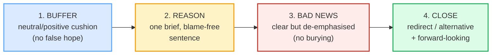

# Bad-News / Sensitive Messages

> **Phase 3 · writing · bundle #50 · Days 99–100.**
> *Buffer → reason → bad news → constructive close.*
>
> 🔗 Builds on [EMAIL ANATOMY](./EMAIL_ANATOMY.md) (the BLUF principle — but a
> bad-news message is the **exception** where you deliberately *delay* the BLUF
> one paragraph), and on [APOLOGY EMAILS](./APOLOGY_EMAILS.md) (the sibling
> genre: an apology is *your* fault → you fix it; bad news is often *not your*
> fault → you redirect). The speech-act siblings are
> [APOLOGIZING](../speech_acts/APOLOGIZING.md) and
> [SYMPATHY & CONCERN](../speech_acts/SYMPATHY.md) — this bundle is their
> **written, professional** form.

---

## Why this bundle exists (read this first)

A Vietnamese learner writing a rejection or a "no" almost always makes one of
two mistakes, and they are mirror images of each other:

1. **Too blunt** — *"You're rejected."* / *"We can't accept."* The learner,
   uncomfortable, wants it over; the recipient feels slapped.
2. **Too vague** — a long, face-saving paragraph of hedge and preamble so
   indirect that the recipient genuinely cannot tell whether they got the job.
   Vietnamese delivery of bad news is traditionally **highly indirect /
   prolonged** to protect face (*"thương cho một roi, cho không cho cả nùi"* is
   inverted in English — here the kindness *is* the clarity). The Vietnamese
   writer, anxious about offending, sometimes buries the news so deep the reader
   has to read it twice to find it.

English professional culture threads the needle with the **indirect / buffer
approach**: soften the landing with a buffer and a reason, **but deliver the
news clearly enough that there is no ambiguity.** Arley Cruthers' *Business
Writing For Everyone* (Kwantlen Polytechnic University, 2021) names the indirect
approach's five parts, which fold into a writeable **4-part spine**:

Notice the tension that defines the genre: the buffer **softens**, but the bad
news itself must be **clear**. Cruthers' rule, verbatim: *"While you want to
break the bad news clearly, try not to spotlight it."* A buried "no" is a failed
bad-news message; so is a spotlighted one.

---

## 1. The buffer move — open neutral / positive (the cushion)

The buffer is **not** false hope. It is a neutral or mildly positive statement
that acknowledges the reader's effort or signals the decision was weighed. Two
openers carry almost the whole load:

| Opener | When | Cambridge attests |
|---|---|---|
| **After careful consideration, …** | formal, weighted decision (hire/award/refund) | *"After some consideration, we've decided to sell the house."* |
| **We appreciate your …** / **Thank you for your …** | acknowledge effort/input (the application, the proposal) | *"We sincerely appreciate the feedback you have given us."* |

> From `bad_news_messages_corpus.md`:
>
> | After careful consideration, … | We appreciate your … |
> |---|---|
> | /ˈɑːftə ˈkeəfl kənˌsɪdəˈreɪʃn/ UK · /ˈæftər ˈkerfl kənˌsɪdəˈreɪʃn/ US | /wiː əˈpriːʃieɪt jɔːr/ UK · /wiː əˈpriːʃieɪt jʊr/ US |
>
> Cambridge's *consideration* entry attests the buffer pattern itself; its
> *appreciate* entry attests *"We sincerely appreciate the feedback you have
> given us."* and *"I appreciate your making the effort to come."* Cruthers'
> worked indirect-approach example opens with the parallel *"Thank you for
> submitting your request…"*

**The trap to avoid:** do *not* open with *"I'm pleased to tell you…"* or
*"Congratulations!"* — that sets up false hope and the bad news lands as a
betrayal. The buffer cushions; it does not celebrate.

---

## 2. The reason move — one brief, blame-free sentence

The reason answers "why?" once, names a cause without pointing at a person, and
is **shorter than the news**. Two openers carry almost the whole load:

> From `bad_news_messages_corpus.md`:
>
> - **Unfortunately, …** /ʌnˈfɔːtʃənətli/ UK · /ʌnˈfɔːrtʃənətli/ US — flags
>   bad news *before* it lands, so the reader is braced. Cambridge attests
>   *"Unfortunately the plane has been delayed — the new departure time is
>   16.20."*
> - **Due to …** /ˈdjuː tuː/ UK · /ˈduː tuː/ US — links a cause, formal.
>   Cambridge attests *"The bus was delayed due to heavy snow."*

So a real reason line reads: *"Unfortunately, due to the high number of
applicants this year, …"* — one sentence, cause named, no applicant thrown
under the bus.

**The Vietnamese trap here:** this is where L1 indirectness kicks in hardest.
The instinct is to soften with a long, circumlocutory story (because in
Vietnamese, lengthening the cushion reads as respect). In English it reads as
*evasion* — and it risks burying the news so the recipient cannot find it. Keep
the reason to **one sentence**; spend your words on the constructive close, not
the excuse.

---

## 3. The bad-news move — deliver it clearly, not brutally

This is the move the whole message exists for, and the move Vietnamese learners
get wrong in both directions. Cambridge's own dictionary examples nail the full
three-register ladder, from soft to formal to firm:

| Register | Chunk | When |
|---|---|---|
| **Soft** | **I'm afraid …** | a gentle "no", lower stakes, spoken-feel |
| **Formal** | **I regret to inform you (that) …** | official rejection (job, application, claim) |
| **Firm** | **We're unable to …** | state a limitation / refusal clearly |

> From `bad_news_messages_corpus.md`:
>
> | I'm afraid … | I regret to inform you … | We're unable to … |
> |---|---|---|
> | /aɪm əˈfreɪd/ | /aɪ rɪˈɡret tuː ɪnˈfɔːm juː/ UK · /-ɪnˈfɔːrm juː/ US | /wɪər ʌnˈeɪbl tuː/ UK · /wɪr ʌnˈeɪbəl tuː/ US |
>
> Cambridge's *afraid* entry gives **"I'm afraid…"** as its own phrase entry:
> *"used to politely introduce bad news or disagreement."* Its *regret* entry
> attests the gold sentence that fuses buffer + news + refusal: *"After careful
> consideration of your proposal, I regret to say that we are unable to accept
> it."* Its *unable* entry attests *"We regret that at the present time we are
> unable to supply the goods you ordered."* These are not invented templates —
> they are dictionary-corpus lines.

**The two ways Vietnamese learners fail this move (and the fix):**

| Failure | Why it happens | Fix |
|---|---|---|
| **Too blunt** — *"You're rejected."* | guilt/discomfort → get it over with fast | Use the *I regret to inform you / We're unable to* frame; never the bare *you* + rejection verb. |
| **Too vague / buried** — the news is hidden in paragraph 3, in a subordinate clause the reader misses | L1 indirectness + fear of giving offense | State the news **once, clearly, in one clause**, then move on. The reader must not have to re-read to know the answer. |
| **Passive overuse** — *"a decision was made" / "it has been decided"* | avoidance of agency reads as polite in VN | Use the passive **at most once** to de-emphasise; the actor (*we*) should appear in the close. Never hide behind *it was decided* for the whole message. |

---

## 4. The constructive close — redirect, then look forward

The close is the move Vietnamese learners most often **omit**, and it is the
move that preserves the relationship. Per Cruthers' model: *"End politely and
forward-looking. Don't mention the bad news again!"* Two forms:

> From `bad_news_messages_corpus.md`:
>
> - **We wish you the best.** /wiː wɪʃ juː ðə best/ — the standard
>   relationship-preserving sign-off.
> - **We'd welcome a future application.** / **Please keep an eye out for …**
>   — the *redirect*: name an alternative or invite a next step (a future cycle,
>   another role, a follow-up).

🔗 This is the writing-mode mirror of [APOLOGY EMAILS](./APOLOGY_EMAILS.md)'
"fix" move — both genres spend their words at the end on the **forward-looking
gesture** that rebuilds trust. The apology's forward gesture is the *repair*;
the bad-news message's is the *alternative / good wish*.

---

## 5. Cheat sheet — the ≤8 survival chunks

The Pareto set. These eight chunks compose essentially every professional
bad-news message, two per spine move. (Every row is a corpus attestation
above.)

| # | Chunk | IPA | Move |
|---|---|---|---|
| 1 | **After careful consideration, …** | /ˈɑːftə ˈkeəfl kənˌsɪdəˈreɪʃn/ UK · /ˈæftər ˈkerfl kənˌsɪdəˈreɪʃn/ US | buffer (deliberation) |
| 2 | **We appreciate your …** | /wiː əˈpriːʃieɪt jɔːr/ UK · /wiː əˈpriːʃieɪt jʊr/ US | buffer (gratitude) |
| 3 | **Unfortunately, …** | /ʌnˈfɔːtʃənətli/ UK · /ʌnˈfɔːrtʃənətli/ US | reason (flag bad news) |
| 4 | **Due to …** | /ˈdjuː tuː/ UK · /ˈduː tuː/ US | reason (cause) |
| 5 | **I'm afraid …** | /aɪm əˈfreɪd/ | bad news (soft) |
| 6 | **I regret to inform you (that) …** | /aɪ rɪˈɡret tuː ɪnˈfɔːm juː/ UK · /-ɪnˈfɔːrm juː/ US | bad news (formal) |
| 7 | **We wish you the best.** | /wiː wɪʃ juː ðə best/ | close (good wish) |
| 8 | **We'd welcome a future application.** | /wiːd ˈwelkəm ə ˈfjuːtʃər ˌæplɪˈkeɪʃn/ | close (redirect) |

> Open [`bad_news_messages.html`](./bad_news_messages.html) to drill these as
> flip cards, play the rejection-message role-play, shadow, and **write** a
> 4-part bad-news message.

---

## 6. Vietnamese → English L1 pitfalls table

The "expert payoff." These are the specific interference traps a Vietnamese
writer hits on a bad-news message — extend, don't replace, the seed rows from
the spec.

| Vietnamese trap (what you do) | English fix (what to do instead) |
|---|---|
| **Too blunt** — *"You're rejected."* / *"We can't accept."* — discomfort makes the learner want it over fast | Never the bare *you* + rejection verb. Frame with **I regret to inform you …** / **We're unable to …** — the verb *regret* carries the softening the bare *reject* lacks. |
| **Too vague / news buried** — so much preamble and hedge that the recipient can't tell if they got the job | State the news **once, in one clear clause**, mid-message. The reader must know the answer after one read — softening must never cost clarity. |
| **Over-long cushion / indirectness** — a face-saving paragraph of story, because in VN lengthening the buffer reads as respect | Keep the reason to **one sentence**. The kindness in English is the *clarity*, not the length. Spend your words on the **close**, not the excuse. |
| **Passive-voice overuse to avoid agency** — *"a decision was made" / "it has been decided" / "your application was not successful"* for the whole message | Use the passive **at most once** to de-emphasise; the actor (*we*) must appear somewhere — ideally in the close (*We wish you the best*). Hiding behind *it was decided* reads as cowardly, not polite. |
| **Guilt/discomfort → avoidance** — never sending the message, or sending it so late the news is stale | Send it **promptly**. Delay compounds the damage; a timely, well-structured "no" is more respectful than a late, apologetic one. |
| **Opens with false hope** — *"I'm pleased to tell you…"* / *"Congratulations!"* then pivots to rejection | The buffer cushions; it does **not** celebrate. Open with *After careful consideration* / *Thank you for your application* — neutral, not positive. |
| **Drops the article / preposition** — *"I regret inform you"* (no *to*), *"unable accept"* (no *to*) | Drill the fixed chunk intact: **regret to** inform, **unable to** accept, **afraid that** …. The *to* is not optional. |
| **Mixes *regret* (verb) and *regret* (noun)** — *"I have a regret to inform you"* / *"We send our regret"* | Verb for the action: *I regret to inform you*. Noun phrase for the formal close: *Please accept our regrets.* Don't mix the slots. |
| **Closes on the bad news** — ends the message with the rejection, no redirect | End **forward-looking**, per Cruthers: *We wish you the best / We'd welcome a future application.* Never re-state the bad news in the closing line. |
| **/θ/ → /t/, /r/ → /z/** in *thank / appreciate / regret* — intelligibility slip that undercuts a formal register | Drill the buffer chunks aloud: tongue-between-teeth for *thank* /θæŋk/; trill/tap nothing — *regret* /rɪˈɡret/ starts with a single /r/. 🔗 See [FINAL CONSONANTS](../pronunciation/FINAL_CONSONANTS.md). |

---

## How to practise this bundle (the daily 20 min)

1. **READ** (5 min) — this guide, §1–§4. Memorise the 4-part spine and the
   soft-but-clear tension.
2. **SHADOW** (7 min) — open `bad_news_messages.html`, drill the 8 flip cards +
   the rejection-message role-play **aloud**, exaggerating the stressed content
   words (*consideration*, *unfortunately*, *regret*, *inform*).
3. **PRODUCE** (8 min) — the writing task: **write a 4-part bad-news message**
   (buffer + reason + bad news + constructive close). Reveal the model answer,
   compare, copy yours out.

---

## Sources

- Cambridge Advanced Learner's Dictionary — *regret* verb (attests *"British Airways regret to announce the cancellation of flight BA205 to Madrid."* and *"After careful consideration of your proposal, I regret to say that we are unable to accept it."*) — https://dictionary.cambridge.org/dictionary/english/regret
- Cambridge — *afraid* adjective (gives **"I'm afraid…"** as a B2 phrase entry: *"used to politely introduce bad news or disagreement"*) — https://dictionary.cambridge.org/dictionary/english/afraid
- Cambridge — *unable* adjective (attests *"We regret that at the present time we are unable to supply the goods you ordered."*) — https://dictionary.cambridge.org/dictionary/english/unable
- Cambridge — *unfortunately* adverb (attests *"Unfortunately the plane has been delayed — the new departure time is 16.20."*) — https://dictionary.cambridge.org/dictionary/english/unfortunately
- Cambridge — *due to something* phrase (attests *"The bus was delayed due to heavy snow."*) — https://dictionary.cambridge.org/dictionary/english/due-to
- Cambridge — *consideration* noun (attests *"After some consideration, we've decided to sell the house."*) — https://dictionary.cambridge.org/dictionary/english/consideration
- Cambridge — *appreciate* verb (attests *"We sincerely appreciate the feedback you have given us."*) — https://dictionary.cambridge.org/dictionary/english/appreciate
- Cambridge — *inform* verb (attests *"It is with great sorrow that I inform you of the death of our director."*) — https://dictionary.cambridge.org/dictionary/english/inform
- Cruthers, A. (2021). "Delivering a Bad News Message." *Business Writing For Everyone* (Kwantlen Polytechnic University Pressbooks) — the indirect-approach buffer model (buffer · explanation · break the news · redirect · forward-looking close); worked example opens *"Thank you for submitting your request…"* and closes *"We look forward to receiving your revised vacation request soon."* — https://kpu.pressbooks.pub/businesswriting/chapter/delivering-a-bad-news-message/
- Native audio: YouGlish — https://youglish.com/pronounce/{word}/english/us?
- Frequency methodology: wordfrequency.info (spoken sub-corpus) — https://www.wordfrequency.info/
