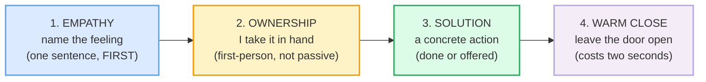

# Customer / Client Messages

> **Phase 3 · writing · bundle #57 · Days 113–114.**
> *Empathy first, then solution; professional warmth.*
>
> 🔗 Builds on [APOLOGY EMAILS](./APOLOGY_EMAILS.md) (the sibling genre — when
> the fault is *yours*, use the *acknowledge → reason → fix* spine; a client
> message covers the broader case where the customer is upset for *any* reason)
> and on [BAD-NEWS MESSAGES](./BAD_NEWS_MESSAGES.md) (the close cousin — both
> open with a buffer, but here the buffer is **empathy**, not neutrality, and
> the resolution is usually *yes*, not *no*). The speech-act siblings are
> [SYMPATHY & CONCERN](../speech_acts/SYMPATHY.md) and
> [APOLOGIZING](../speech_acts/APOLOGIZING.md) — this bundle is their
> **written, professional, customer-facing** form.

---

## Why this bundle exists (read this first)

A Vietnamese learner writing a reply to an upset customer almost always makes
the same structural mistake: they **skip the empathy step** and jump straight
to the policy or the solution. Three reasons converge:

1. **Vietnamese customer messages are often formal and templated.** Public-sector
   and large-company templates in Vietnam lead with the procedure ("Theo quy
   định…" / "Vui lòng đợi 3–5 ngày") — empathy is implied, not stated. English
   customer culture demands the empathy be **explicit, in the first sentence**.
2. **Vietnamese indirectness protects face** by softening, not by naming the
   feeling. So a reply that *feels polite in Vietnamese* ("Chúng tôi đã ghi nhận
   phản ánh của quý khách") reads as **bureaucratic and cold** in English.
3. **Robotic copy-paste templates** — learners reuse one fixed phrase for every
   customer ("Dear customer, we have received your request") because it feels
   safe. A native customer-service reply sounds like a **person**, not a form.

The fix is structural, not lexical. Every professional client message in
English follows the same **4-part spine** — empathy → ownership → solution →
warm close — taught across the major customer-experience references (Qualtrics,
Giva, Zendesk; the HEARD model: Hear · Empathise · Analyse · Resolve ·
Diagnose). This bundle folds *analyse* into *ownership* and *diagnose* into
*warm close* to give the learner a writeable four moves:

Notice the rule that defines the genre: **empathy comes first, even when you
can't do what the customer wants.** Giva's own best-practice note puts it
squarely: *"After validating, pivot toward problem-solving to reduce customer
stress."* Validate *first*, pivot *second*. A reply that opens with the policy
has already lost the customer.

---

## 1. The empathy move — name the feeling, first (the opener)

The first sentence of a client message is **never** the solution. It is a
one-line acknowledgement that you understand *why* the customer is upset. Two
registers carry almost the whole load:

| Opener | When | Real source attests |
|---|---|---|
| **I completely understand (why you'd feel that way).** | the workhorse — fits 90% of upset-customer cases | Giva: *"I completely understand how this situation is affecting you."*; ACXPA: *"I completely understand why you'd feel that way."* |
| **I'm sorry to hear you've had this trouble.** / **I'm sorry you've had this experience.** | when the customer is describing a bad experience, not just a glitch | Freshworks: *"I'm sorry you went through this"* |

> From `client_messages_corpus.md`:
>
> | I completely understand (why you'd feel that way). | I get how frustrating that is. |
> |---|---|
> | /aɪ kəmˈpliːtli ˌʌndəˈstænd/ UK · /aɪ kəmˈpliːtli ˌʌndərˈstænd/ US | /aɪ ɡet haʊ ˈfrʌstreɪtɪŋ ðæt ɪz/ |
>
> Cambridge's `understand` B1 sense is *"to know how someone feels or why
> someone behaves in a particular way"* — the empathy sense, not the
> comprehension sense. Giva, AnswerConnect and ACXPA all attest the
> *"I completely understand…"* opener; Qualtrics attests the *"I know how
> frustrating this must be"* sibling that *"I get how frustrating that is."*
> paraphrases.

**The two ways Vietnamese learners fail this move (and the fix):**

| Failure | Why it happens | Fix |
|---|---|---|
| **Skips empathy entirely** — opens with *"We have processed your request."* | L1 templated/formal style; empathy is implied, not stated | Open with **one empathy sentence first**. Even if you can't grant the request, the empathy sentence is non-negotiable. |
| **Robotic copy-paste** — the same *"Dear customer, we apologise for any inconvenience"* for every case | one safe template feels lower-risk than variation | Vary the opener to the **specific** feeling: *frustrating*, *disappointing*, *stressful*. The word that names the emotion is what makes it sound human. |
| **Over-promises in the empathy line** — *"I completely understand, I will fix everything immediately."* | eagerness to please in the opener | Empathy line is **empathy only** — no promise. The promise goes in move 3 (solution). |

🔗 This is the written mirror of [SYMPATHY & CONCERN](../speech_acts/SYMPATHY.md)
— spoken *"I'm so sorry to hear that"* becomes written *"I'm sorry to hear
you've had this trouble."*

---

## 2. The ownership move — take it in hand (the pivot)

The second sentence claims the problem with **"I"**, not "the system", "the
team", or "you will need to". This is the move that separates a real response
from a deflection. The Vietnamese instinct is to hide behind passive policy
(*"yêu cầu sẽ được xử lý"* / "the request will be processed"); English customer
culture reads the passive as evasive.

> From `client_messages_corpus.md`:
>
> | Let me sort this out for you. | I'll take care of this. |
> |---|---|
> | /let miː ˈsɔːt ðɪs aʊt fə juː/ UK · /let miː ˈsɔːrt ðɪs aʊt fər juː/ US | /aɪl teɪk ˈkeər ɒv ðɪs/ UK · /aɪl teɪk ˈker əv ðɪs/ US |
>
> Cambridge's `sort something out` is a B2 phrasal verb defined as *"to deal
> successfully with a problem, a situation, or a person who is having
> difficulties"* — the exact ownership sense. Call Centre Helper attests the
> full phrase *"Let me sort this out for you so you can get the refund you were
> expecting."*

**The Vietnamese trap here:** the polite instinct is to make the action sound
impersonal and procedural, because in Vietnamese that reads as respectful. In
English customer culture, the **first-person owner** is what builds trust —
*"Let me sort this out for you"* feels warmer than *"Your request will be
processed"* even when the underlying action is identical. If you must hand off
to a team, **you** are still the one doing the handing: *"I've flagged this
with the team."*

---

## 3. The solution move — name the concrete action (the substance)

The move the whole message exists for: a **specific** action, not a vague
*"we'll look into it"*. Two tenses do the work:

| Form | Signal | Example |
|---|---|---|
| **Present-perfect / past** *(I've refunded…, I've updated…)* | the action is **already done** — strongest possible reassurance | *"I've gone ahead and refunded the order in full."* |
| **Modal offer** *(Here's what I can do…)* | an **offer** — use when you need the customer to choose | *"Here's what I can do: a full refund, or a replacement shipped today."* |

> From `client_messages_corpus.md`:
>
> - **Here's what I can do (for you).** /hɪəz wɒt aɪ kæn duː/ UK · /hɪrz wɒt
>   aɪ kæn duː/ US — Giva attests *"Here's what I can do to help resolve this."*
> - **I've gone ahead and refunded …** /aɪv ˈɡɒn əˈhed ənd ˌriːˈfʌndɪd/ —
>   Cambridge's `refund` Business English entry attests *"The customer will be
>   refunded in full up to $50,000."* and *"we will refund the difference"*.
> - **I've escalated this (to our billing team).** /aɪv ˈeskəleɪtɪd ðɪs/ —
>   Cambridge's `escalate` Business English entry attests *"escalate a
>   problem/matter/complaint"* and *"You might need to escalate the issue to
>   the next highest level management team."*

**The trap to avoid:** over-promising. *"I'll make sure this never happens
again"* is a promise you cannot keep and the customer knows it. Name **one
specific, bounded** action you have actually taken or can actually deliver.
*"I've gone ahead and refunded the order"* is honest and complete; *"we'll fix
everything"* is neither.

🔗 The *I've gone ahead and…* action-already-taken form is the client-message
twin of [APOLOGY EMAILS](./APOLOGY_EMAILS.md)' *"I've implemented…"* prevention
move — both use the present-perfect to signal the repair is **in motion, not
promised**.

---

## 4. The warm close — leave the door open (the sign-off)

The move Vietnamese templates most often **omit** — they end on the action,
which reads as transactional. The warm close costs two seconds and is what
makes the customer feel *cared for*, not just *processed*. Two forms:

> From `client_messages_corpus.md`:
>
> - **Is there anything else I can help with?**
>   /ɪz ðeə ˈeniθɪŋ els aɪ kæn help wɪð/ UK · /ɪz ðer ˈeniθɪŋ els aɪ kæn
>   help wɪð/ US — Gorgias attests *"Is there anything else I can help you with
>   today?"*; Zendesk attests the parallel *"Please let us know if there is
>   anything else we can help with."*
> - **Reach out anytime.** /riːtʃ aʊt ˈeniˌtaɪm/ — Cambridge's `reach out`
>   phrasal verb entry itself attests the warm-close form: *"Feel free to reach
>   out if you have any questions about study abroad."*

**The trap to avoid:** never close on the action. *"I've refunded the order."*
is a complete transaction; *"I've refunded the order. Is there anything else I
can help with?"* is a relationship. The two extra words are the whole point.

---

## 5. Cheat sheet — the ≤8 survival chunks

The Pareto set. These eight chunks compose essentially every professional
client message, two per spine move. (Every row is a corpus attestation above.)

| # | Chunk | IPA | Move |
|---|---|---|---|
| 1 | **I completely understand (why you'd feel that way).** | /aɪ kəmˈpliːtli ˌʌndəˈstænd/ UK · /-ˌʌndər-/ US | empathy (workhorse) |
| 2 | **I get how frustrating that is.** | /aɪ ɡet haʊ ˈfrʌstreɪtɪŋ ðæt ɪz/ | empathy (casual-warm) |
| 3 | **Let me sort this out for you.** | /let miː ˈsɔːt ðɪs aʊt fə juː/ UK · /ˈsɔːrt/ /fər/ US | ownership (workhorse) |
| 4 | **I'll take care of this.** | /aɪl teɪk ˈkeər ɒv ðɪs/ UK · /ˈker əv/ US | ownership (compact) |
| 5 | **Here's what I can do (for you).** | /hɪəz wɒt aɪ kæn duː/ UK · /hɪrz/ US | solution (offer) |
| 6 | **I've gone ahead and refunded …** | /aɪv ˈɡɒn əˈhed ənd ˌriːˈfʌndɪd/ UK · /ˈɡɑːn/ US | solution (done) |
| 7 | **Is there anything else I can help with?** | /ɪz ðeə ˈeniθɪŋ els aɪ kæn help wɪð/ UK · /ðer/ US | warm close (workhorse) |
| 8 | **Reach out anytime.** | /riːtʃ aʊt ˈeniˌtaɪm/ | warm close (compact) |

> Open [`client_messages.html`](./client_messages.html) to drill these as flip
> cards, play the client-message role-play, shadow, and **write** a 4-part
> client message.

---

## 6. Vietnamese → English L1 pitfalls table

The "expert payoff." These are the specific interference traps a Vietnamese
writer hits on a client message — extend, don't replace, the seed rows from
the spec.

| Vietnamese trap (what you do) | English fix (what to do instead) |
|---|---|
| **Skips the empathy step** — opens with *"We have received your request"* / *"Theo quy định, quý khách vui lòng…"* | Open with **one empathy sentence first**, always — *I completely understand…* / *I'm sorry to hear you've had this trouble.* Empathy is move 1, not optional decoration. |
| **Robotic copy-paste template** — the same *"Dear customer, we apologise for any inconvenience"* for every case, every customer | Vary the opener to the **specific** feeling the customer described — *frustrating* for an angry complaint, *disappointing* for a missed expectation, *stressful* for a time-critical issue. The emotion word is what makes it sound human. |
| **Passive-voice overuse to avoid agency** — *"your request is being processed"* / *"the matter will be looked into"* for the whole message | Switch to the **first-person owner**: *Let me sort this out for you* / *I'll take care of this.* The passive reads as evasive in English customer culture, even when it reads as respectful in Vietnamese. |
| **Jumps straight to policy / solution without acknowledging the feeling** — *"According to our policy, refunds take 3–5 days"* | Empathy **then** policy. The customer will accept the policy far more readily once they feel heard: *"I completely understand this is frustrating. Per our policy, the refund takes 3–5 days, and I've gone ahead and initiated it today."* |
| **Over-promises to please** — *"I will fix everything immediately"* / *"This will never happen again"* | Name **one specific, bounded** action you can actually deliver: *I've gone ahead and refunded the order* / *I've escalated this to our billing team.* A small kept promise beats a grand broken one. |
| **Closes on the action** — ends the message with the refund / the update, no warm sign-off | Add the **warm close**: *Is there anything else I can help with?* / *Reach out anytime.* Two extra words turn a transaction into a relationship. |
| **Drops the article / preposition** — *"Let me sort this for you"* / *"I've escalated this our team"* (no *to*) | Drill the fixed chunk intact: **let me sort this out for you** (the *out* + *for* are not optional), **escalated this to** the team (the *to* is not optional). |
| **Mixes *sorry* (adjective) and *apologise* (verb) registers** — *"I sorry for the problem"* / *"I apologise you"* (wrong valency) | *I'm sorry* + (that-)clause: *I'm sorry you've had this trouble.* *I apologise for* + noun: *I apologise for the delay.* 🔗 See [APOLOGY EMAILS](./APOLOGY_EMAILS.md). |
| **Translates *tiếc* / *xin lỗi* literally as "sorry" in every slot** — *"Sorry, the refund is processing"* where no apology is owed | Reserve *sorry* for when you (or your company) are actually at fault. For bad luck / system issues you didn't cause, use **empathy without apology**: *I get how frustrating that is — let me sort this out for you.* |
| **/θ/ → /t/, /r/ → /z/, final-cluster deletion** in *trouble* /ˈtrʌbl/, *frustrating* /ˈfrʌstreɪtɪŋ/, *anything else* — intelligibility slip that undercuts a warm register | Drill the empathy chunks aloud: hold the /bl/ cluster in *trouble*, the /str/ in *frustrating*, release the /ls/ in *else*. 🔗 See [FINAL CONSONANTS](../pronunciation/FINAL_CONSONANTS.md) and [CONSONANT CLUSTERS](../pronunciation/CONSONANT_CLUSTERS.md). |

---

## How to practise this bundle (the daily 20 min)

1. **READ** (5 min) — this guide, §1–§4. Memorise the 4-part spine and the
   *empathy-first* rule.
2. **SHADOW** (7 min) — open `client_messages.html`, drill the 8 flip cards +
   the client-message role-play **aloud**, exaggerating the stressed content
   words (*completely*, *frustrating*, *sort*, *refunded*).
3. **PRODUCE** (8 min) — the writing task: **write a 4-part client message**
   (empathy + ownership + solution + warm close). Reveal the model answer,
   compare, copy yours out.

---

## Sources

- Cambridge Advanced Learner's Dictionary — *understand* verb B1 (sense: *"to know how someone feels or why someone behaves in a particular way"*) — https://dictionary.cambridge.org/dictionary/english/understand
- Cambridge — *completely* adverb (UK/US /kəmˈpliːt.li/) — https://dictionary.cambridge.org/dictionary/english/completely
- Cambridge — *sort something out* phrasal verb B2 (UK /sɔːt/, US /sɔːrt/; attests *"Most of the job involves sorting out customers who have queries."*) — https://dictionary.cambridge.org/dictionary/english/sort-out
- Cambridge — *frustrating* adjective (UK /frʌsˈtreɪ.tɪŋ/, US /ˈfrʌs.treɪ.t̬ɪŋ/) — https://dictionary.cambridge.org/dictionary/english/frustrating
- Cambridge — *escalate* verb, Business English (attests *"escalate a problem/matter/complaint"* and *"You might need to escalate the issue to the next highest level management team."*) — https://dictionary.cambridge.org/dictionary/english/escalate
- Cambridge — *refund* verb/noun, Business English (attests *"The customer will be refunded in full up to $50,000."* and *"we will refund the difference"*) — https://dictionary.cambridge.org/dictionary/english/refund
- Cambridge — *reach out (to someone)* phrasal verb (attests *"Feel free to reach out if you have any questions about study abroad."*) — https://dictionary.cambridge.org/dictionary/english/reach-out-to
- Oxford Advanced Learner's Dictionary (cross-check for *understand*, *escalate*, *refund*) — https://www.oxfordlearnersdictionaries.com/
- Giva — "Caring Matters: 40 Empathy Statements for Customer Service" (attests *"I completely understand how this situation is affecting you."*, *"Here's what I can do to help resolve this."*) — https://www.givainc.com/blog/empathy-statements-customer-service/
- Qualtrics — "Empathy Statements for Customer Service" (attests *"I know how frustrating this situation must be for you."*) — https://www.qualtrics.com/articles/customer-experience/customer-service-empathy-phrases/
- Call Centre Helper — "What to Say to an Angry Customer" (attests *"Let me sort this out for you so you can get the refund you were expecting"*) — https://www.callcentrehelper.com/dealing-with-angry-customers-152.htm
- LiveAgent — "Call Center Templates" (attests *"Let me sort this out for you as quickly as possible, so you can get on with your day."*) — https://www.liveagent.com/templates/call-center/
- Freshworks — "20 Effective Empathy Statements for Chat Support" (attests *"I'm sorry you went through this"*) — https://www.freshworks.com/explore-cx/empathy-chat-support/
- Gorgias — "The Best and Worst Customer Service Phrases" (attests *"Is there anything else I can help you with today?"*) — https://www.gorgias.com/blog/customer-service-phrases
- Zendesk — "15 winning customer service phrases" (attests *"Please let us know if there is anything else we can help with."*) — https://www.zendesk.com/blog/customer-experience/engagement/customer-service-phrases/
- Nicereply — "11 Common Customer Service Phrases" (attests the *Happy to help* sign-off family) — https://www.nicereply.com/blog/customer-service-phrases/
- Apizee — "30 Science-Based Empathy Statements" (attests *"I've fully briefed them, and you're in good hands"*) — https://www.apizee.com/empathy-statements.php
- Native audio: YouGlish — https://youglish.com/pronounce/{word}/english/us?
- Frequency methodology: wordfrequency.info (spoken sub-corpus) — https://www.wordfrequency.info/
