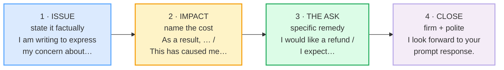

# Written Complaints / Disputes

> **Phase 3 · writing · bundle #64 · Days 127–128.**
> *Firm, factual, solution-oriented; no emotion-leak.*
>
> 🔗 This is the **WRITTEN, formal** version of the complaint function. Its
> spoken sibling is [COMPLAINING POLITELY](../speech_acts/COMPLAINING_POLITELY.md)
> (Phase 1) — *"I'm afraid there's an issue with…"*. Here the medium is text, so
> you trade warmth for **precision**: every fact on record, every ask spelled
> out, and **zero emotion leaking** into the tone. Also builds on
> [APOLOGY EMAILS](./APOLOGY_EMAILS.md) (the mirror — when *you* are the one at
> fault), [CLIENT MESSAGES](./CLIENT_MESSAGES.md) (the customer-service reply,
> the other side of this thread), and
> [EDITING: CONCISION & ACTIVE VOICE](./EDITING_CONCISION.md) (cut the filler so
> the facts land).

---

## Why this is a separate bundle (read this first)

A Vietnamese learner hits two opposite failure modes on a written complaint, and
both lose the case:

1. **Too emotional / venting.** The letter becomes a list of feelings and
   ALL-CAPS and exclamation marks — *"This is ABSOLUTELY UNACCEPTABLE!!!"*. To a
   native reader that reads as **unreasonable**, even when the complaint is
   valid. The company's instinct is to get defensive, not to help.
2. **Too passive / never complains.** The letter is so hedged — *"if it's not
   too much trouble, maybe, whenever convenient…"* — that there is **no clear
   ask**. The company has no reason to act, and the learner gives up their own
   rights.

The English-speaking fix is neither: it is **firm + factual + solution-
oriented**. You state the issue in facts, you name the cost, you make a specific
ask, and you close politely but expecting action. The single discipline that
holds all four moves together is **no emotion-leak** — the FTC states it
directly: *"Don't write an angry, sarcastic, or threatening letter. The person
reading your letter probably isn't responsible for the problem, but may be very
helpful in resolving it."* Emotion weakens the case; facts + a clear ask win it.

---

## 1. The four-move spine

Every effective written complaint follows the same skeleton — issue → impact →
ask → firm-but-polite close. This is the structure the Cambridge FCE/CAE
complaint-letter references (British Council, engxam, LingoLugo) and the two US
consumer-protection sample letters (FTC, Georgia Attorney General) all teach.

| Move | Job | The discipline |
|---|---|---|
| **1 · Issue** | Name the problem: *when*, *what*, *your stance*. | Facts only — date, item, what happened. No feelings yet. |
| **2 · Impact** | State the cost: time, money, safety, the trip. | Factual past tense. No exclamation marks. |
| **3 · The ask** | Name the specific remedy you want. | Concrete + firm. Not "if possible". |
| **4 · Close** | Expect action, keep the high ground. | Polite deadline. No threats, no CAPS. |

> From `complaints_written_corpus.md` (the four anchor chunks, verbatim):
>
> - **Issue:** *"I am writing to express my concern about…"* / *"On [date], I
>   purchased / received…"* / *"I am dissatisfied with…"*
> - **Impact:** *"As a result, (I had to …)."* / *"This has caused me
>   considerable inconvenience."*
> - **Ask:** *"To resolve the problem, I would like a [refund / replacement]."*
>   / *"I expect a full refund."* / *"I am requesting…"*
> - **Close:** *"Please look into this matter."* / *"I look forward to your
>   prompt response."* / *"I hope we can resolve this amicably."*

---

## 2. Move 1 — state the issue factually

The opener's only job is to put the problem **on record**, in facts. Three
register levels of the same move, all from real complaint letters:

| Register | Opener | When to use it |
|---|---|---|
| **Neutral** | *I am writing to express my concern about…* | Default. Soft enough not to provoke, clear enough to be on record. |
| **Factual** | *On [date], I purchased / received…* | Always pair with one of the others — the date + item is the *evidence*. |
| **Direct** | *I am dissatisfied with…* / *The issue is…* | When you want no ambiguity about your stance. |

> From `complaints_written_corpus.md`:
>
> | I am writing to express my concern about… | On [date], I purchased… |
> |---|---|
> | /aɪ æm ˈraɪtɪŋ tə ɪkˈspres maɪ kənˈsɜːn əˈbaʊt/ | /ɒn deɪt aɪ ˈpɜːtʃəst/ |
>
> LingoLugo's FCE guide attests the first opener verbatim; the FTC sample letter
> attests the *On [date], I purchased…* evidence line; the Georgia Attorney
> General sample attests *"I am dissatisfied with your [service or product]"*.

**The Vietnamese trap:** learners either open with emotion (*"I am VERY angry
about your terrible service!!!"*) or open so vaguely that the issue is unclear
(*"I write about a thing"*) — Vietnamese has no tense, no article, and a
face-saving habit of indirectness, so the *when* + *what* facts often vanish.
Fix: **lead with the date and the item**, in past tense.

---

## 3. Move 2 — name the impact (no venting)

This is the move that turns a description into a *case*. State what the problem
**cost** you — but as a fact, not a feeling.

> From `complaints_written_corpus.md` (the impact move, verbatim):
>
> - *"As a result, (I had to …)."* — the cause→effect connector
> - *"This has caused me considerable inconvenience."* — the formal
>   complaint-register cost line (LingoLugo model answer)
> - *"These issues significantly impacted my stay."* — factual past tense, no
>   emotion (LingoLugo model answer)

The trap is the **emotion-leak**. *"You RUINED my whole trip, unbelievable"*
does the *opposite* of strengthen the case — it makes the writer look
unreasonable, so the reader gets defensive. The factual version — *"As a result,
I missed my connecting flight and had to rebook at my own expense"* — is
stronger, because it's *checkable*.

---

## 4. Move 3 — the ask (firm + specific)

The move the whole letter exists for. A Vietnamese learner's instinct is to
under-ask (*"if possible, maybe a small refund, whenever convenient"*) so the
company has no reason to act. English holds the line with three firmness levels:

| Firmness | Ask | Effect |
|---|---|---|
| **Polite-firm** | *I would like a [refund / replacement].* | The default. Modal-softened but unambiguous. |
| **Firm** | *I expect a full refund.* | "Expect" > "hope". You hold the line. |
| **Formal-firm** | *I am requesting…* | The legal/register tone; used in disputes. |

> From `complaints_written_corpus.md`:
>
> - FTC sample attests: *"To resolve the problem, I would like a [refund / or
>   repairs / or an exchange]"*
> - engxam attests: *"I am returning the CDs and **expect** a full refund"* and
>   *"I expect to receive compensation to the tune of (€2000)"*
> - Georgia AG attests: *"I am hereby **requesting** that you: [List specific
>   actions you want]"*

**The rule:** name the remedy **and** a timeframe where you can — *"a full
refund within 14 days"*. A vague ask gets a vague (or no) response.

---

## 5. Move 4 — firm-but-polite close

The move Vietnamese writers most often **sabotage**: they either skip it (ends
abruptly on the ask, reads as cold) or pile on threats (reads as unreasonable).
The English close is **firm + cooperative**.

> From `complaints_written_corpus.md`:
>
> - *"Please look into this matter."* — polite directive (no anger)
> - *"I look forward to your prompt response."* — **the canonical close**
>   (LingoLugo model answer attests it verbatim)
> - *"I hope we can resolve this amicably."* — cooperative tone, high ground kept
> - *"I look forward to hearing from you."* — the neutral formal close
> - *"Yours faithfully,"* (Dear Sir/Madam) / *"Yours sincerely,"* (Dear Mr X) —
>   the sign-off

🔗 The *"I'm afraid there's an issue with…"* spoken softener from
[COMPLAINING POLITELY](../speech_acts/COMPLAINING_POLITELY.md) is the *talking*
version of this register discipline; here it is written down, so it sharpens
into *"I look forward to your prompt response."*

---

## 6. Cheat sheet — the ≤8 survival chunks

The Pareto set. These eight lines write 90% of any written complaint. Drill them
as a four-move block. (Every row is a corpus attestation above.)

| # | Chunk | IPA | Move |
|---|---|---|---|
| 1 | **I am writing to express my concern about…** | /aɪ æm ˈraɪtɪŋ tə ɪkˈspres maɪ kənˈsɜːn əˈbaʊt/ | issue |
| 2 | **On [date], I purchased / received…** | /ɒn deɪt aɪ ˈpɜːtʃəst/ | issue |
| 3 | **I am dissatisfied with…** | /aɪ æm dɪsˈsætɪsfaɪd wɪð/ | issue |
| 4 | **As a result, …** | /æz ə rɪˈzʌlt/ | impact |
| 5 | **I would like a [refund / replacement].** | /aɪ wʊd ˈlaɪk ə ˈriːfʌnd/ | ask |
| 6 | **I expect a prompt reply.** | /aɪ ɪkˈspekt ə prɒmpt rɪˈplaɪ/ | ask |
| 7 | **I look forward to your prompt response.** | /aɪ lʊk ˈfɔːwəd tə jɔːr prɒmpt rɪˈspɒns/ | close |
| 8 | **I hope we can resolve this amicably.** | /aɪ həʊp wiː kæn rɪˈzɒlv ðɪs ˈæmɪkəbli/ | close |

> Open [`complaints_written.html`](./complaints_written.html) to drill these as
> flip cards, play the email-thread role-play, shadow, and write the full
> four-move complaint.

---

## 7. Vietnamese → English L1 pitfalls table

The "expert payoff." These are the specific interference traps a Vietnamese
writer hits on a written complaint — extend, don't replace, the seed rows from
the spec.

| Vietnamese trap (what you do) | English fix (what to do instead) |
|---|---|
| **Vent emotion** → *"This is ABSOLUTELY UNACCEPTABLE!!!"*, CAPS, exclamation overload | Delete every exclamation and CAP. Restate the same point as a **fact**: *"This does not match the advertised specification."* Firm ≠ loud. |
| **Under-asks / never complains** → *"if possible, maybe a small refund…"* | State the ask as a **direct request**: *"I would like a full refund."* A vague ask gets no action; you also give up your consumer rights by never putting it on record. |
| **No tense marking** → *"Yesterday I buy / I receive the item broken"* | Enforce past tense on every fact line: *"On 14 June, I **purchased**…"* / *"The item **arrived** broken."* The past tense is what makes the timeline checkable. |
| **Omitted articles** → *"I bought product from your shop"* | Supply `a/an/the`: *"I bought **a** **[model name]** from **your** shop."* Missing articles read as careless and weaken a formal letter. |
| **No plural marking** → *"I received two item"* | Mark plurals: *"I received two **items**."* The plural makes the quantity a verifiable fact. |
| **Pro-drop / no subject** → *"Is unacceptable" / "Want refund"* | Supply subject + copula/verb: *"**It is** unacceptable."* / *"**I would like a** refund."* Formal English demands the full subject. |
| **Indirectness as politeness** (Vietnamese face-saving) → circles the point, never states the issue | Lead with the **BLUF** (bottom line up front): *"I am writing to express my concern about [X]."* Indirectness reads as weak or unclear in English business writing. |
| **"Hope" where "expect" is needed** → *"I hope you will maybe refund"* | Use **expect** for a firm ask: *"I expect a full refund within 14 days."* *Hope* signals you'll accept inaction; *expect* signals you won't. |
| **Threats / sarcasm to sound strong** → *"or I'll expose you online!!!"* | Replace with a **stated next step** + deadline (FTC model): *"I will wait until [date] before I contact a consumer protection agency."* That is firm *and* professional. |
| **Contractions in formal register** → *"I'd like / I'm writing / don't"* | Write them out in a formal complaint: *"I **would** like"*, *"I **am** writing"*, *"**do not**"*. (LingoLugo's FCE golden rule.) |
| **Drops final consonants** when reading the letter aloud → *"dissatisfie"* for *dissatisfied*, *"respons"* for *response* | The 4-move lines only land if a phone follow-up is intelligible. Drill the finals — 🔗 [FINAL CONSONANTS](../pronunciation/FINAL_CONSONANTS.md). |

---

## How to practise this bundle (the daily 20 min)

1. **READ** (5 min) — this guide, §1–§5.
2. **SHADOW** (7 min) — open `complaints_written.html`, drill the 8 flip cards
   + the email-thread role-play **aloud**, holding a calm firm tone.
3. **PRODUCE** (8 min) — the writing task: **write a full four-move written
   complaint** (issue + impact + ask + close), firm and factual, with **no
   emotion-leak**. Then reveal the model answer and diff yours against it.

---

## Sources

- British Council — "A letter of complaint" (B2) — https://learnenglish.britishcouncil.org/free-resources/writing/b2/letter-complaint
- engxam — "How to write a Letter of Complaint? (FCE, CAE, CPE)" — https://engxam.com/handbook/how-to-write-a-letter-of-complaint-fce-cae-cpe/
- LingoLugo — "FCE Formal Letter & Email Writing Guide" — https://www.lingolugo.com/blog/fce-formal-letter-email-writing-guide.html
- FTC (US, .gov) — "Sample Customer Complaint Letter" — https://consumer.ftc.gov/articles/0296-sample-consumer-complaint-letter
- FTC (US, .gov) — "How to write an effective complaint letter" — https://consumer.ftc.gov/consumer-alerts/2015/09/how-write-effective-complaint-letter
- Georgia Attorney General (US, .gov) — "Sample Complaint Letter to Send to a Business" — https://consumer.georgia.gov/resolve-your-dispute/sample-complaint-letter-send-business
- Oxford Advanced Learner's Dictionary — entries for *concern, dissatisfied, refund, amicably, prompt* — https://www.oxfordlearnersdictionaries.com/
- Cambridge Advanced Learner's Dictionary — *as a result*, *look into something*, plus standard transcriptions — https://dictionary.cambridge.org/dictionary/english/
- Native audio: YouGlish — https://youglish.com/pronounce/{word}/english/us?
- Frequency methodology: wordfrequency.info (spoken sub-corpus) — https://www.wordfrequency.info/
