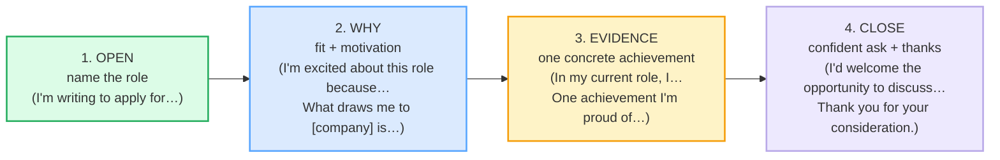

# Cover Letters

> **Phase 3 · writing · bundle #55 · Days 109–110.**
> *"I'm excited to apply because…" + evidence.*
>
> 🔗 Builds on [EMAIL ANATOMY](./EMAIL_ANATOMY.md) (the BLUF principle — a cover
> letter opens by naming the role, not by introducing yourself), on
> [FORMAL VS CASUAL REGISTER](./FORMAL_CASUAL_REGISTER.md) (a cover letter sits at
> the formal end), and pairs with [CV / RÉSUMÉ BULLETS](./CV_BULLETS.md) (the
> letter **adds** evidence the bullets only summarise). The spoken sibling is
> [BEHAVIORAL INTERVIEW Q&A](../workplace/INTERVIEWS_BEHAVIORAL.md) — same STAR
> evidence shape, written form.

---

## Why this bundle exists (read this first)

A Vietnamese learner writing an English cover letter almost always makes the
same two mistakes, and both are **genre** mistakes, not grammar ones.

**Mistake 1 — the template restatement.** Vietnamese *đơn xin việc* (application
letters) are **formal, role-generic, and CV-restating** — a fixed template of
*"Tôi tên là… Tôi đã tốt nghiệp… Tôi có kinh nghiệm… Tôi mong được trao cơ hội"*
that politely restates what the CV already says. English cover-letter culture is
the **opposite**: the letter must be **targeted to THIS role** at THIS company
and must **add evidence the CV does not make obvious** (McGill: *"A cover letter
should add nuance to your C.V."*). A letter that summarises the CV is read as
redundant — the recruiter already has the CV.

**Mistake 2 — modesty → under-selling.** Vietnamese culture reads self-praise as
*kiêu ngạo* (arrogance), so the writer **under-states achievements** (*"I think
I can do the job"*, *"I have some experience"*) or pads with **generic traits**
(*"I am hardworking, careful, and responsible"*) with no evidence. English
cover-letter culture reads this as **no confidence + no proof** — the letter
must **name a specific result** (*"I led X, resulting in Y%"*). The fix is not
to brag; it is to **let the evidence do the talking**.

This bundle teaches the four-move English skeleton that fixes both: **open** by
naming the role, **why** (fit + motivation), **evidence** (one concrete
achievement), **close** (a confident ask + thanks).

Notice what is **not** a move: the long self-introduction (*"My name is…"*), the
CV summary, the generic *"I am hardworking"* trait list, the apology (*"I hope
you will give me a chance"*). The open is one sentence. The why is targeted.
The evidence is one STAR point. The close is confident. That is the whole genre.

---

## 1. The open — name the role (one sentence)

The first line does one job: **name the role and say you are writing to apply**.
No preamble, no *"My name is…"*, no life story. Two registers, standard and
slightly softer:

| Register | Chunk | When |
|---|---|---|
| Standard | **I'm writing to apply for…** | the default — direct, professional |
| Softer | **I'd like to be considered for…** | more formal / internal / committee |

> From `cover_letters_corpus.md`:
>
> | I'm writing to apply for… | I'd like to be considered for… |
> |---|---|
> | /aɪm ˈraɪtɪŋ tə əˈplaɪ fə(r)/ | /aɪd laɪk tə bi kənˈsɪdəd fə(r)/ |
>
> The Harvard OCS model letter opens verbatim: *"I am writing to apply for the
> Marketing and Communications position…"*. *"I'd like to be considered for…"*
> is the Cambridge B2 passive *"be considered for a job/role"*. `apply`
> /əˈplaɪ/ — identical US/UK (Cambridge, Britannica).

**The Vietnamese trap here:** Vietnamese letters open with a long
self-introduction (*"Tôi tên là Nguyễn Văn A, sinh năm…"*) and reach the role
only in paragraph two. English recruiters open hundreds of letters — a missing
*"apply for [role]"* in line 1 is read as a copy-paste template. The fix is
mechanical: **line 1 always names the role.**

---

## 2. The why — fit + motivation (the "because")

The second move is **why THIS role, why THIS company**. This is the move a
Vietnamese L1 writer most often skips — Vietnamese letters assume motivation
(*of course I want the job*), so the letter never states it. English recruiters
read a letter with **no "why" as a form letter**. A specific *"I'm excited about
this role because…"* or *"What draws me to [company] is…"* is what separates a
real application from spam.

> From `cover_letters_corpus.md`:
>
> | I'm excited about this role because… | What draws me to [company] is… |
> |---|---|
> | /aɪm ɪkˈsaɪtɪd əˈbaʊt ðɪs rəʊl bɪˈkɒz/ UK | /wɒt drɔːz miː tuː [ˈkʌmpəni] ɪz/ UK |
>
> The Harvard OCS model attests *"I am excited about the field…"*; Indeed Canada
> attests *"What draws me to Wavewood is its commitment to giving back."*.
> `drawn` /drɔːn/ UK · /drɑːn/ US is the Cambridge adjective *"attracted to"*;
> `particularly` /pəˈtɪkjələli/ UK · /pərˈtɪkjələrli/ US.

**The pinned one-liner for this bundle:**

> From `cover_letters_corpus.md`:
>
> > **I'm excited to apply because…** /aɪm ɪkˈsaɪtɪd tə əˈplaɪ bɪˈkɒz/ UK ·
> > /…bɪˈkɑːz/ US — Dice cover-letter example: *"I'm excited to apply these
> > skills professionally."* Source: dice.com/career-advice.

The discipline here is the word **"because"**: it forces a *specific* reason.
*"I'm excited to apply"* alone is a feeling; *"…because [specific thing about
the role/company]"* is an argument. Write the because-clause first, then attach
the open.

---

## 3. The evidence — one concrete achievement (the proof)

The third move is **evidence the CV does not already make obvious** — one
specific achievement with a result. This is where the letter earns its page.
Three lead-ins carry the whole move:

> From `cover_letters_corpus.md`:
>
> | In my current role, I… | One achievement I'm proud of is… | Most recently, I… |
> |---|---|---|
> | /ɪn maɪ ˈkʌrənt rəʊl aɪ/ | /wʌn əˈtʃiːvmənt aɪm praʊd ɒv ɪz/ UK | /məʊst ˈriːsəntli aɪ/ UK |
>
> *"In my current role, I…"* is the verbatim body opener in the Indeed
> cover-letter example. `achievement` /əˈtʃiːvmənt/, `proud` /praʊd/,
> `current` /ˈkʌrənt/ — Cambridge headwords.

**The evidence shape is STAR** (Situation → Task → Action → Result) — the same
shape used in a behavioral interview. 🔗 See
[BEHAVIORAL INTERVIEW Q&A](../workplace/INTERVIEWS_BEHAVIORAL.md). The written
version compresses it into one or two sentences with a **metric**:

- ❌ *CV restatement:* "I have 3 years of experience in marketing." (the CV says
  this already — redundant)
- ❌ *Generic trait:* "I am a hardworking and responsible person." (no evidence)
- ✅ *Targeted evidence:* "In my current role, I led a campaign that grew sign-ups
  by 34% in one quarter." (Situation + Action + **Result with a number**)

🔗 Pair every evidence point with the action-verb + metric pattern from
[CV / RÉSUMÉ BULLETS](./CV_BULLETS.md) — *"Led X, resulting in Y%"*.

**The Vietnamese trap here:** modesty (*khiêm tốn*) is a virtue in Vietnamese, so
the writer **under-sells** achievements (*"I helped a little with…"*) or drops
the metric (*"I improved sales"* — by how much?). English cover-letter culture
reads the **absence of a specific result as no result**. The fix: let the number
carry the confidence — you are not bragging, the metric is just a fact.

---

## 4. The close — confident ask + thanks

The final move is **a confident ask + thanks**, one or two sentences. No
begging, no apologising. Three chunks carry the whole move:

| Move | Chunk |
|---|---|
| Confident ask | **I'd welcome the opportunity to discuss…** |
| Thanks (pinned closer) | **Thank you for your consideration.** |
| Expectation | **I look forward to hearing from you.** |

> From `cover_letters_corpus.md`:
>
> > **Thank you for your consideration.** /θæŋk juː fə(r) jɔː(r)
> > kənˌsɪd.əˈreɪ.ʃən/ — University of Maryland cover-letter sign-off; cited as
> > a standard close by Adobe Acrobat, LinkedIn, and Ladders.
> > Source: dictionary.cambridge.org/dictionary/english/consideration.
>
> *"I'd welcome the opportunity to discuss how my skills can contribute…"* is the
> verbatim University of Cincinnati close. `consideration`
> /kənˌsɪd.əˈreɪ.ʃən/ UK / US (Cambridge, fetched directly); `opportunity`
> /ˌɒpəˈtjuːnəti/ UK · /ˌɑːpərˈtuːnəti/ US (Oxford, Collins).

**The Vietnamese trap here:** Vietnamese letters close by **begging for a
chance** (*"Tôi mong được anh/chị trao cơ hội để được thể hiện"* → "I hope you
will give me a chance to show myself"). English reads *"hope you give me a
chance"* as **desperate, not polite**. The confident close is *"I'd welcome the
opportunity to discuss…"* — it assumes the conversation will happen. The shift
is psychological: **you are offering value, not asking a favour.**

---

## 5. Cheat sheet — the ≤8 survival chunks

The Pareto set. Memorise these eight; they assemble an entire cover-letter body.
(Every row is a corpus attestation above.)

| # | Chunk | IPA | Why it's here |
|---|---|---|---|
| 1 | **I'm writing to apply for…** | /aɪm ˈraɪtɪŋ tə əˈplaɪ fə(r)/ | the standard opener — names the role |
| 2 | **I'm excited to apply because…** | /aɪm ɪkˈsaɪtɪd tə əˈplaɪ bɪˈkɒz/ UK · /…bɪˈkɑːz/ US | the pinned one-liner — motivation + reason |
| 3 | **I'm particularly drawn to…** | /aɪm pəˈtɪkjələli drɔːn tuː/ UK | specific attraction — the "why me" |
| 4 | **What draws me to [company] is…** | /wɒt drɔːz miː tuː [ˈkʌmpəni] ɪz/ UK | the "why THIS company" frame |
| 5 | **In my current role, I…** | /ɪn maɪ ˈkʌrənt rəʊl aɪ/ | evidence lead-in — factual anchor |
| 6 | **One achievement I'm proud of is…** | /wʌn əˈtʃiːvmənt aɪm praʊd ɒv ɪz/ UK · /…prɑːd əv ɪz/ US | names one specific result |
| 7 | **I'd welcome the opportunity to discuss…** | /aɪd ˈwelkəm ði ˌɒpəˈtjuːnəti tə dɪˈskʌs/ UK · /…ˌɑːpərˈtuːnəti tə dɪˈskʌs/ US | confident close — asks for the interview |
| 8 | **Thank you for your consideration.** | /θæŋk juː fə(r) jɔː(r) kənˌsɪd.əˈreɪ.ʃən/ | the pinned closer — thanks for reading |

> Open [`cover_letters.html`](./cover_letters.html) to drill these as flip
> cards, hear native clips, play the role-play, shadow, and **write the
> cover-letter body** (the primary task for this bundle).

---

## 6. Vietnamese → English L1 pitfalls table

The "expert payoff." These are the specific interference traps a Vietnamese
speaker hits on a cover letter — extend, don't replace, the seed rows from the
spec.

| Vietnamese trap (what you do) | English fix (what to do instead) |
|---|---|
| **Long self-introduction open** — "My name is…, I graduated from…, I was born in…" (the *đơn* template) | Open with **"I'm writing to apply for [role]"** in line 1. The CV has your bio; the letter names the role. |
| **Restates the CV** — "I have 3 years of experience in marketing" (the CV already says this) | **Add evidence the CV does not make obvious.** Pick one achievement and give the *result*. McGill: *"add nuance to your C.V."* |
| **Skips the "why"** — assumes motivation; no *"I'm excited about this role because…"* | State **why THIS role / THIS company** specifically. A letter with no "why" reads as a copy-paste template. |
| **Modesty → under-sells** — "I helped a little", "I have some experience", drops the metric | Let the **number** carry the confidence: *"grew sign-ups by 34%"*. You are stating a fact, not bragging. |
| **Generic traits, no evidence** — "I am hardworking, careful, responsible" | Replace every trait with a **proof point**. "Hardworking" → *"I led X, resulting in Y%."* 🔗 See [CV BULLETS](./CV_BULLETS.md). |
| **Begging close** — "I hope you will give me a chance" (*mong được trao cơ hội*) | Close **confidently**: *"I'd welcome the opportunity to discuss…"*. You are offering value, not asking a favour. |
| **Apologising for gaps/inexperience** — "I am sorry I do not have…" | **Pivot, don't apologise.** Frame what you *bring*: *"Most recently, I…"*. Never put a weakness in the close. |
| **Over-formal / stiff register** — "I have the honour to submit herewith my humble application" | Use **clean professional register**, not ceremonial. *"I'm writing to apply"* is already formal enough; no "herewith" or "humble". 🔗 See [FORMAL VS CASUAL REGISTER](./FORMAL_CASUAL_REGISTER.md). |
| **One generic letter for every job** (role-template) | **Re-target each letter:** name the company and the specific reason (*"What draws me to [company] is…"*). A reusable template = spam. |
| **No article / missing plural in evidence** — "I led team of five people" | Enforce **a/the** and **-s** plurals in the evidence sentence — a dropped *"the"* or *"five people → five people"* reads careless to a recruiter. 🔗 See [FINAL CONSONANTS](../pronunciation/FINAL_CONSONANTS.md). |

---

## How to practise this bundle (the daily 20 min)

1. **READ** (5 min) — this guide, §1–§4.
2. **SHADOW** (7 min) — open `cover_letters.html`, drill the 8 flip cards + read
   the model body **aloud**. The close (*"Thank you for your consideration"*)
   and the pinned open (*"I'm excited to apply because…"*) are the two to
   over-learn — they work in almost any letter.
3. **PRODUCE** (8 min) — the **writing task** (this bundle's primary mode): write
   a cover-letter body — **one "why this role" sentence + one evidence point +
   one close.** Target one specific (real) job. Reveal the model answer to
   compare structure, then copy yours to refine.

---

## Sources

- Cambridge Advanced Learner's Dictionary — https://dictionary.cambridge.org/dictionary/english/{word} (entries for *consideration* [UK/US /kənˌsɪd.əˈreɪ.ʃən/, fetched directly], *apply*, *consider*, *drawn*, *achievement*, *current*, *recently*, *look forward to*).
- Cambridge Pronunciation — https://dictionary.cambridge.org/pronunciation/english/apply (`apply` /əˈplaɪ/ US/UK).
- Oxford Advanced Learner's Dictionary — https://www.oxfordlearnersdictionaries.com/definition/english/opportunity_1 (`opportunity` /ˌɒpəˈtjuːnəti/ UK · /ˌɑːpərˈtuːnəti/ US).
- Britannica Dictionary — `apply` /əˈplaɪ/ (audio cross-check).
- Collins Dictionary — `opportunity` pronunciation cross-check.
- Harvard OCS — Resume & Cover Letter guide — https://careerservices.fas.harvard.edu/resources/create-a-strong-resume/ (opener *"I am writing to apply for…"*; *"I am excited about the field…"*).
- University of Michigan Career Center — Cover Letter Resources — https://careercenter.umich.edu/content/cover-letter-resources.
- McGill University — Writing a Cover Letter (PDF) — https://www.mcgill.ca/careers4engineers/files/careers4engineers/guide_coverletter.pdf (*"add nuance to your C.V."*).
- Loyola University Chicago — Cover Letter Guide (PDF) — https://www.luc.edu/media/lucedu/career/pdfs/guideshandouts/Cover%20Letter%20Guide.pdf.
- University of Cincinnati — Letter of Interest — https://www.uc.edu/blog/how-to-write-letter-of-interest.html (*"I'd welcome the opportunity to discuss…"*).
- University of Maryland — Cover Letters (PDF) — https://eng.umd.edu/sites/clark.umd.edu/files/resource_documents/Cover%20Letters%202020B.pdf (*"Thank you for your consideration."*).
- University of Southern Maine — Cover Letter Resource Guide (PDF) — https://usm.maine.edu/career-employment-hub/wp-content/uploads/sites/241/2022/07/CoverLetter_ResourceGuide_Final_Su2025.pdf.
- Indeed — How to write a cover letter — https://www.indeed.com/career-advice/resumes-cover-letters/how-to-write-a-cover-letter (*"In my current role, I…"*).
- Indeed Canada — Cover letter format — https://ca.indeed.com/career-advice/resumes-cover-letters/cover-letter-format (*"What draws me to Wavewood is…"*).
- Dice — career advice — https://www.dice.com/career-advice/no-cs-degree-want-to-break-into-tech-no-problem (*"I'm excited to apply these skills professionally."*).
- Amherst Careers — Cover Letters That Open Doors — https://careers.amherst.edu/blog/2025/07/21/cover-letters-that-open-doors-especially-when-youre-pivoting/.
- Adobe Acrobat — How to end a cover letter — https://www.adobe.com/acrobat/resources/how-to-end-a-cover-letter.html (*"Thank you for your consideration."*).
- Ladders — 'Thank you for your consideration' — https://www.theladders.com/career-advice/the-best-way-to-say-thank-you-for-your-consideration.
- National Careers Service (UK) — Covering letter — https://nationalcareers.service.gov.uk/careers-advice/covering-letter.
- Native audio: YouGlish — https://youglish.com/pronounce/{chunk}/english/us?
- Frequency methodology: wordfrequency.info (spoken sub-corpus) — https://www.wordfrequency.info/
