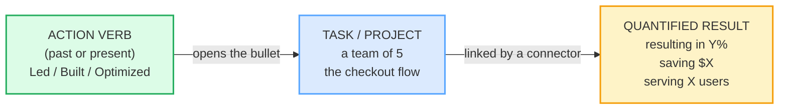

# CV / Résumé Bullets

> **Phase 3 · writing · bundle #56 · Days 111–112.**
> *Action verbs + metrics: "Led X, resulting in Y%."*
>
> 🔗 This bundle is the **writing-task primary** player — the textarea is the
> centerpiece. It builds on [STATUS REPORTS](./STATUS_REPORTS.md) (RAG status +
> metrics) and [COVER LETTERS](./COVER_LETTERS.md) (evidence-first writing), and
> pairs with [FINAL CONSONANTS](../pronunciation/FINAL_CONSONANTS.md) — every
> past-tense verb here ends in an audible `-ed` you must release
> (*Managed* /ˈmænɪdʒd/, not "manage").

---

## Why this is bundle #56 (read this first)

A Vietnamese CV is almost always a **duty list** — "responsible for marketing",
"in charge of sales", "do customer service". That reads as a *job description*,
not an *achievement*. An English résumé is the opposite: every bullet is an
**action verb + a task + a quantified result**. The verb says *what you did*;
the number says *how well*. A recruiter who scans for 6 seconds is looking for
the number, not the noun.

This single switch — **duty → achievement, verb-first, metric-last** — is the
difference between a CV that gets skimmed and one that gets an interview. It is
also the single hardest habit for a Vietnamese learner, because Vietnamese marks
neither tense *nor* quantified impact the way English does, and modesty
("khiêm tốn") trains you to omit the numbers that English recruiters demand.

---

## 1. The mechanism: the PAR / SAR formula

Every strong CV bullet follows the same three-part skeleton. MIT calls it **PAR**
(Project · Activity · Result); Yale SOM calls it **SAR** (Situation · Action ·
Result). The names differ; the spine is identical:

> From `cv_bullets_corpus.md` (the formula, verbatim from MIT Career Services):
>
> > "Start each bullet point statement with a strong action verb (i.e. ACTIVITY),
> > followed by the PROJECT, and then tell the reader the RESULT of your
> > actions."
>
> — https://capd.mit.edu/resources/resumes-writing-about-your-skills/

The verb is the engine. The number is the proof. A bullet without a number is a
duty; a bullet *with* a number is an achievement.

---

## 2. The eleven action verbs (open every bullet with one)

These are the high-frequency set every career guide tells you to lead with. Each
is cited with IPA + source in the corpus. Drill the past tense — the `-ed`
allomorph rule from [FINAL CONSONANTS](../pronunciation/FINAL_CONSONANTS.md)
decides the sound: /t/ after voiceless (*launched* /lɑːntʃt/), /d/ after voiced
(*improved* /ɪmˈpruːvd/, *built* /bɪlt/ irregular), /ɪd/ after /t/ or /d/
(*spearheaded* /ˈspɪrhedɪd/).

> From `cv_bullets_corpus.md` (the verb set, verbatim):
>
> | Verb | IPA | Use it when… |
> |---|---|---|
> | **Led** | /led/ | you guided a team/project |
> | **Spearheaded** | /ˈspɪəhedɪd/ UK · /ˈspɪrhedɪd/ US | you *initiated* and led something new |
> | **Drove** | /drəʊv/ UK · /droʊv/ US | you pushed a metric/result forward |
> | **Built** | /bɪlt/ | you created something from scratch |
> | **Launched** | /lɔːntʃt/ UK · /lɑːntʃt/ US | you shipped a product/campaign |
> | **Optimized** | /ˈɒptɪmaɪzd/ UK · /ˈɑːptɪmaɪzd/ US | you made a process better/faster |
> | **Streamlined** | /ˈstriːmlaɪnd/ | you simplified/cut waste |
> | **Delivered** | /dɪˈlɪvəd/ | you produced a result on time |
> | **Improved** | /ɪmˈpruːvd/ | you made a metric better |
> | **Managed** | /ˈmænɪdʒd/ | you were in charge of people/budget |
> | **Designed** | /dɪˈzaɪnd/ | you planned/created the form |

**Strong vs weak verbs.** A weak verb hides your contribution: *Helped with the
launch*, *Was responsible for marketing*, *Worked on the dashboard*. A strong
verb owns it: *Led the launch*, *Spearheaded marketing*, *Built the dashboard*.
The rule: if you can delete the verb and the bullet still works, the verb is too
weak.

---

## 3. The result connectors (task → impact)

The verb opens the bullet; a **participial phrase** (verb-+-ing) or a
*that*-clause links the task to its number. This connector is what turns a duty
into an achievement:

> From `cv_bullets_corpus.md` (real MIT model bullets, verbatim):
>
> - *Designed and executed company's marketing strategies that **drove a $500k
>   increase in annual revenue*** — verb + *that*-clause + dollar result.
> - *Improved user experience on client platform, **contributing to a 20%
>   increase in subscribers*** — verb + task + `-ing` connector + %-result.
> - *Investigated effects of gas phase oxygen concentration levels …
>   **reducing cell division time by 30%*** — verb + task + `-ing` connector +
>   %-result.
> - *Managed project re-design process … **cut down paperwork by 75%*** — verb +
>   task + %-result.

The pinned connector for this bundle is **"resulting in"** /rɪˈzʌltɪŋ ɪn/ — the
cleanest one-liner form: *Led [X], resulting in [Y%]*.

---

## 4. The tense rule (past for finished, present for current)

A CV is tense-disciplined. Get this wrong and a recruiter reads "careless"
before they read a single word:

| Job status | Tense | Example |
|---|---|---|
| Past job | **past tense** | *Led* a team of 5 engineers |
| Current job | **present tense** | *Manage* a team of 5 engineers |

> From `cv_bullets_corpus.md`:
>
> - Past: **Led** /led/ a team of 5 engineers (finished role)
> - Present: **Manage** /ˈmænɪdʒ/ a team of 5 engineers (current role)

The rule is binary: every bullet under a past job = past tense; every bullet
under your current job = base form (present). MIT Career Development Handbook
and Yale SOM both flag tense-mixing as a top-5 résumé error.

---

## 5. Cheat sheet — the ≤8 survival chunks

The Pareto set. Memorise these eight; they cover ~90% of the bullets you'll
write. (Every row is a corpus attestation above.)

| # | Chunk | IPA | Why it's here |
|---|---|---|---|
| 1 | **Led [team/project]** | /led/ | the default leadership opener |
| 2 | **Spearheaded [initiative]** | /ˈspɪəhedɪd/–/ˈspɪrhedɪd/ | you *started* it — stronger than "helped" |
| 3 | **Drove [metric/results]** | /drəʊv/–/droʊv/ | pushed a number forward |
| 4 | **Built [X] from scratch** | /bɪlt/ | created something new |
| 5 | **Launched [product/campaign]** | /lɔːntʃt/–/lɑːntʃt/ | shipped / set going |
| 6 | **Optimized [process]** | /ˈɒptɪmaɪzd/–/ˈɑːptɪmaɪzd/ | made it faster/cheaper |
| 7 | **…resulting in [Y%]** | /rɪˈzʌltɪŋ ɪn/ | the pinned task→impact connector |
| 8 | **Increased/Reduced … by X%** | /ɪnˈkriːst/–/rɪˈdjuːst/ | the bare quantified-result frame |

> Open [`cv_bullets.html`](./cv_bullets.html) to drill these as flip cards,
> play the interview role-play, shadow the verbs aloud, and — the centerpiece —
> **write 3 CV bullets** with a reveal-model toggle.

---

## 6. Vietnamese → English L1 pitfalls table

The "expert payoff." These are the specific interference traps a Vietnamese
speaker hits when writing English CV bullets — extend, don't replace, the seed
rows from the spec.

| Vietnamese trap (what you do) | English fix (what to do instead) |
|---|---|
| **Duty list, not achievement list** — "responsible for marketing", "in charge of sales" | Flip every duty to **verb + task + number**: "Led 5 campaigns, increasing engagement 30%." A duty describes the job; an achievement describes *your impact*. |
| **No quantification** — omits numbers out of modesty ("khiêm tốn") | Add a metric to every bullet: %, $, count, time, scale. Even an estimate ("150+ users", "~$20k saved") beats no number. Recruiters scan for the number first. |
| **Passive voice** — "was responsible for", "duties included" | Lead with an **active past-tense verb**: *Spearheaded*, *Built*, *Optimized*. Passive hides *who* did it — and the "who" is you. |
| **Weak / hedged verbs** — "helped with", "assisted in", "worked on" | Upgrade to a strong verb that owns the action: *Led*, *Drove*, *Delivered*. "Helped" makes you sound like a bystander in your own CV. |
| **No tense marking** → past/present mixed under one job | Vietnamese has **no tense morphology**; English CVs are tense-strict. Enforce: past job = past tense (*Led*), current job = present (*Manage*). Never mix under one heading. |
| **Drops the `-ed` even in writing** → "Manage a team" under a past job | The spelling `-ed` carries the tense. Write *Managed*, *Improved*, *Optimized* — and when you **say** the bullet in an interview, release the ending (🔗 [FINAL CONSONANTS](../pronunciation/FINAL_CONSONANTS.md)). |
| **Translates "chịu trách nhiệm" as "responsible for"** and stops there | "Responsible for X" is a duty phrase. Rewrite as the *achievement*: what did you *do*, and what was the *result*? "Owned X" or "Led X, resulting in Y" beats "responsible for X" every time. |
| **Round-number vagueness** — "increased sales a lot", "many customers" | Quantify precisely where you can: "by 30%", "serving 12,000 users", "saving $20k/year". Precise numbers signal credibility; vague qualifiers signal guesswork. |

---

## How to practise this bundle (the daily 20 min)

1. **READ** (5 min) — this guide, §1–§4.
2. **SHADOW** (5 min) — open `cv_bullets.html`, drill the 8 action-verb flip
   cards **aloud**, releasing every `-ed`. Play the interview role-play (you
   deliver your bullets verbally).
3. **PRODUCE** (10 min) — the **writing task** (primary mode): write **3 CV
   bullets** for a real or past role, each = action verb + task + quantified
   result. Reveal the model, compare, copy yours into your real CV.

---

## Sources

- Cambridge Advanced Learner's Dictionary — https://dictionary.cambridge.org/dictionary/english/{word} (entries for *lead/led, drive/drove, build/built, launch, deliver, improve, manage, design, result, increase, reduce, save, serve, cut*).
- Oxford Advanced Learner's Dictionary — https://www.oxfordlearnersdictionaries.com/definition/english/spearhead_2 (*spearhead* verb: definition + example "He is spearheading a campaign for a new stadium in the town.").
- Wiktionary (cross-checked IPA) — https://en.wiktionary.org/wiki/{word} (*led* /led/, *spearhead* UK /ˈspɪə.hɛd/ · US /ˈspɪɹ.hɛd/, *optimize* US /ˈɑptɪmaɪz/ · UK /ˈɒptɪmaɪz/, *streamline* /ˈstriːmlaɪn/).
- MIT Career Advising & Professional Development, "Resumes: Writing about your skills" (PAR formula + quantified model bullets) — https://capd.mit.edu/resources/resumes-writing-about-your-skills/
- MIT Career Development Handbook (tense rule) — https://cdn.uconnectlabs.com/wp-content/uploads/sites/123/2021/07/Career-Handbook-2019.pdf
- Yale SOM CDO Resume Writing Guide (SAR framework) — https://som.yale.edu/sites/default/files/2022-01/Yale%20SOM%20CDO%20Resume%20Writing%20Guide-1(1)(1).pdf
- "Vietnamese Phonology: A Complete Guide" (Remitly) — https://www.remitly.com/blog/education/vietnamese-phonology-guide/
- Native audio: YouGlish — https://youglish.com/pronounce/{chunk}/english/us?
- Frequency methodology: wordfrequency.info (spoken sub-corpus) — https://www.wordfrequency.info/
