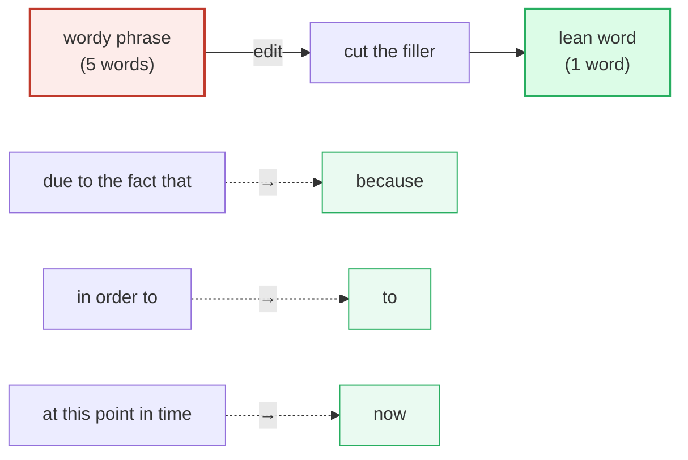
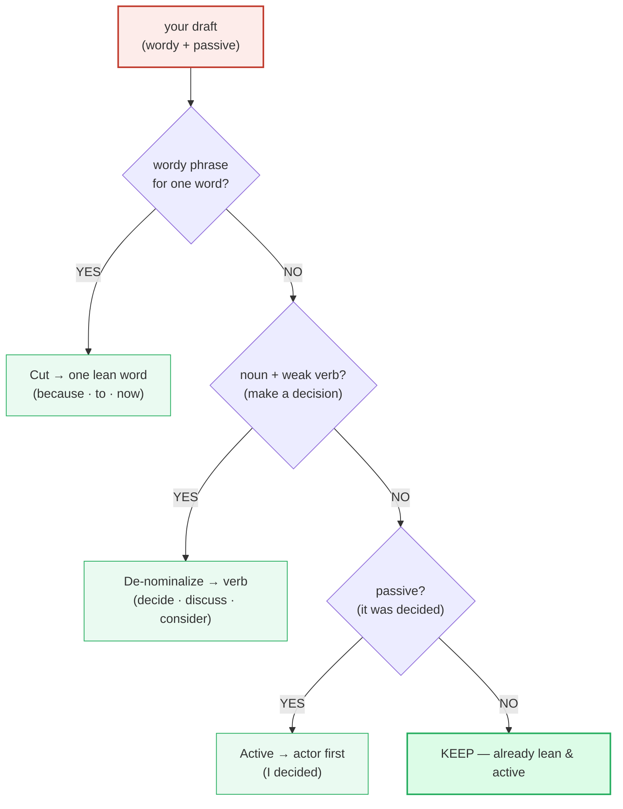

# Editing: Concision & Active Voice

> **Phase 3 · writing/ · bundle #60 · Days 119–120.**
> *Cut filler; subject-verb-object power.*
>
> 🔗 Sibling bundles this one leans on: [EMAIL ANATOMY](./EMAIL_ANATOMY.md)
> (the BLUF principle — concision starts at the subject line), [CV BULLETS](./CV_BULLETS.md)
> (action verbs + metrics — the SVO habit at bullet scale), and forward to
> [EDITING HEDGING](./EDITING_HEDGING.md) (soften *without* weakening — the
> partner edit to "make it lean").

---

## Why this is the editing bundle (read this first)

A Vietnamese learner can have flawless grammar and a strong vocabulary and still
write English that feels **heavy**. The reason is almost never the words chosen
— it is **how many** words, and **who is doing** the action. Two habits transfer
straight from Vietnamese formal writing and from translation:

1. **"Translation inflation."** Vietnamese formal register rewards elaborate,
   ornate phrasing (*theo như quy định tại*, *trong khoảng thời gian...*). When
   that habit rides into English, it produces *"due to the fact that"*,
   *"in order to"*, *"at this point in time"* — five words doing the job of one.
2. **Passive-as-polite.** Learners reach for *"it is recommended"* and *"a
   decision was made"* to sound "professional" or to avoid claiming ownership.
   In English business writing, the passive usually reads as **evasive or
   bureaucratic**, not polite.

The fix is one principle with two moves: **cut filler** and **put the subject
first**. Strunk & White's "Omit needless words" and "use the active voice" are
the same single idea — make every word do work, and make the actor do the verb.

---

## 1. The mechanism: why English rewards SVO

English is a **subject–verb–object** language at its core. The strongest sentence
names the actor, names the action, names the target — in that order — and stops.

| | Vietnamese formal register (L1 habit) | English business writing (target) |
|---|---|---|
| Phrasing density | Ornate, elaborated, "full" | **Lean** — one word where one word works |
| Voice | Passive = formal / humble / safe | **Active** = clear, accountable, energetic |
| Nominalizations | Heavy noun phrases ("make a decision") | **Verbs** that do the work ("decide") |
| Length | More words = more respect | Fewer words = more respect (reader's time) |
| Under-length fear | Cutting = rude / unfinished | Cutting = confident / finished |

The collision is at **register**: what Vietnamese formal writing treats as
respectful elaboration, English business writing treats as clutter. Editing is
the skill that re-tunes the register.

---

## 2. Move 1 — cut wordy filler to one word

The highest-leverage edit: find a phrase that means one word, and use the word.
Every pair below is a listed transformation in a plain-style guide in the Strunk
& White / Zinsser tradition.

> From `editing_concision_corpus.md` (§A, verbatim):
>
> - **due to the fact that → because** /bɪˈkɒz/ UK · /bɪˈkɑːz/ US
> - **in order to → to** /tə/ weak · /tuː/ strong
> - **in the event that → if** /ɪf/
> - **a large number of → many** /ˈmeni/
> - **at this point in time → now** /naʊ/

> **The pinned pair (sanity-check these are real):** "due to the fact that →
> because" and "in order to → to" are attested in Strunk & White's *The Elements
> of Style* wordy-phrase list (cited via the Cambridge UP volume *Writing for the
> Reader's Brain*, Ch. 5, and Portland State's plain-writing handouts). The lean
> words carry IPA because they are spoken and read aloud, not just written.

---

## 3. Move 2 — de-nominalize: let the verb do the work

The "smothered verb": a heavy noun (`decision`, `discussion`, `consideration`)
propped up by a weak generic verb (`make`, `have`, `give`). The cure is to
**unwrap the noun back into its verb**. Zinsser calls this clutter; the
plain-language fix is one of the fastest ways to lose 30% of a draft's length
without losing any meaning.

| Wordy (noun + weak verb) | Lean (verb) | Words saved |
|---|---|---|
| make a decision | **decide** /dɪˈsaɪd/ | 2 |
| have a discussion | **discuss** /dɪˈskʌs/ | 2 |
| give consideration to | **consider** /kənˈsɪdə(r)/ | 3 |

> From `editing_concision_corpus.md` (§B, verbatim):
>
> - **make a decision → decide** /dɪˈsaɪd/
> - **have a discussion → discuss** /dɪˈskʌs/
> - **give consideration to → consider** /kənˈsɪdə(r)/ UK · /kənˈsɪdər/ US

> **Verification note:** the Oxford Learner's entry for `discuss` explicitly
> contrasts the verb with the wordier `have a discussion about`, calling the
> latter the non-preferred alternative — the dictionary itself flags the
> de-nominalized form as the standard one.

---

## 4. Move 3 — passive → active (subject–verb–object power)

The passive (`be` + past participle) hides the actor. "Mistakes were made"
names nobody — which is exactly why politicians reach for it. In business
writing, the active voice is **shorter, clearer, and more accountable**: it
tells the reader *who did what*.

| Passive (actor hidden) | Active (actor first) | What changed |
|---|---|---|
| mistakes were made | **we made mistakes** | actor revealed |
| a decision was made | **I decided** | first-person owner |
| it is recommended | **I recommend** | impersonal → personal |

> From `editing_concision_corpus.md` (§C, verbatim):
>
> - **mistakes were made → we made mistakes** /meɪk/ · /meɪd/
> - **a decision was made → I decided** /dɪˈsaɪd/
> - **it is recommended → I recommend** /ˌrekəˈmend/

> From the sources: Grammarly's canonical pair is "Passive: **Mistakes were
> made.** / Active: **We made mistakes.**" The University of Toronto Writing
> Advice notes the passive is used "to be vague about who is responsible" — the
> active restores ownership.

> **When passive *is* right:** keep it when the actor is genuinely unknown,
> irrelevant, or the *patient* is your topic ("the report **was published**
> yesterday"). The default, though, is active. 🔗 See [EDITING HEDGING](./EDITING_HEDGING.md)
> for the partner skill — softening tone *without* retreating into the passive.

---

## 5. The SVO power principle, in one diagram

---

## 6. Cheat sheet — the ≤8 survival chunks

The Pareto set: the eight **lean** words an editor reaches for reflexively. Each
replaces a wordy or passive construction. (Every row is a corpus attestation;
drill the lean word until it comes out by reflex.)

| # | Chunk | IPA | Why it's here |
|---|---|---|---|
| 1 | **because** | /bɪˈkɒz/ UK · /bɪˈkɑːz/ US | ← *due to the fact that* (5→1) |
| 2 | **to** | /tə/ · /tuː/ | ← *in order to* (3→1) |
| 3 | **if** | /ɪf/ | ← *in the event that* (4→1) |
| 4 | **many** | /ˈmeni/ | ← *a large number of* (4→1) |
| 5 | **now** | /naʊ/ | ← *at this point in time* (5→1) |
| 6 | **decide** | /dɪˈsaɪd/ | ← *make a decision* (de-nominalize) |
| 7 | **discuss** | /dɪˈskʌs/ | ← *have a discussion* (de-nominalize) |
| 8 | **consider** | /kənˈsɪdə(r)/ | ← *give consideration to* (de-nominalize) |

> Open [`editing_concision.html`](./editing_concision.html) to drill these as
> flip cards, play the editing role-play, shadow the lean words, and do the
> writing task (edit 3 wordy/passive sentences lean + active).

---

## 7. Vietnamese → English L1 pitfalls table

The "expert payoff." These are the specific interference traps a Vietnamese
speaker hits when editing English for concision and active voice — extend, don't
replace, the seed rows from the spec.

| Vietnamese trap (what you do) | English fix (what to do instead) |
|---|---|
| **Translation inflation** — calques ornate L1 register into English: *"in order to be able to"*, *"due to the fact that"*, *"at this point in time"* | Cut to the lean word. Ask "can one word do this?" — `because`, `to`, `now`, `if`, `many`. If yes, use it. |
| **Ornate = respectful** belief (Vietnamese formal writing rewards elaboration; "theo như quy định...") | Re-tune: in English business writing, **brevity = respect for the reader's time**. Elaboration reads as clutter, not politeness. |
| **Passive-as-polite** — *"it is recommended"*, *"a decision was made"* to sound "professional" or avoid claiming credit/blame | Default to active + first person: **"I recommend"**, **"I decided"**. The active voice is accountable, not rude. |
| **Piles on nominalizations** — *"make a decision"*, *"have a discussion"*, *"give consideration to"* (translating "ra quyết định", "có cuộc thảo luận") | De-nominalize: unwrap the noun back into its verb — **decide**, **discuss**, **consider**. The verb does the work. |
| **Wordiness transferred from L1 register norms** — *"in the event that"* for "nếu", *"a large number of"* for "nhiều" | Reach for the high-frequency one-word equivalent: **if**, **many**. The plain word is the professional word. |
| **Fear that concise = rude / unfinished** — adds filler to "sound complete" or pad length to meet a word count | Trust the lean version. A short, clear English sentence reads as **confident and finished**, not lazy. Cut, then stop. |
| **Hides the actor to be humble** — omits "I/we" ("was decided", "is suggested") the way Vietnamese often drops the subject | Name the actor: **"We decided"**, **"I suggest"**. Dropping the subject in English business writing sounds evasive, not humble. |
| **Over-uses "make/have/give/take" + noun** as a one-size verb frame ("make an improvement", "take into consideration") | Use the specific verb: **improve**, **consider**, **review**. The weak-verb + noun frame is the #1 clutter source. |

---

## How to practise this bundle (the daily 20 min)

1. **READ** (5 min) — this guide, §1–§4.
2. **SHADOW** (7 min) — open `editing_concision.html`, drill the 8 flip cards
   (say the lean word aloud — `because`, `to`, `decide`…), then play the editing
   role-play, reading the **lean** lines aloud.
3. **PRODUCE** (8 min) — the writing task: take **3 wordy/passive sentences** of
   your own and edit them lean + active. Reveal the model answers; compare. Read
   your edits aloud — the lean version should be the shorter, punchier one.

---

## Sources

- Strunk, W. Jr. & White, E.B. *The Elements of Style* (4th ed., Allyn & Bacon, 2000) — "Omit needless words"; "The active voice is usually more direct and vigorous than the passive"; the wordy-phrase list (`due to the fact that` → because, `in order to` → to, `at this point in time` → now).
- Cambridge UP, *Writing for the Reader's Brain*, Ch. 5 "Concision" — https://www.cambridge.org/core/books/writing-for-the-readers-brain/concision/AC07B8B22B590DCDF68451A2764DC14F (`due to the fact that` = because; the Strunk & White concision edict).
- Zinsser, W. *On Writing Well* (30th anniversary ed., HarperCollins) — "Clutter is the disease of American writing"; the de-clutter / de-nominalize move.
- Purdue OWL, "Conciseness" — https://owl.purdue.edu/owl/general_writing/academic_writing/conciseness/index.html (replace several vague words with one specific word; `making a decision` → determine/decide).
- Portland State University, plain-writing handouts — https://web.pdx.edu/~maserj/EnvSus/handouts.htm (`due to the fact that` → because; write in the active voice).
- Grammarly, "Passive Voice" — https://www.grammarly.com/blog/grammar/passive-voice/ ("Mistakes were made." → "We made mistakes.").
- University of Toronto Writing Advice, "Passive Voice: When to Use It and When to Avoid It" — https://advice.writing.utoronto.ca/revising/passive-voice/ (passive used to be vague about who is responsible).
- Cambridge Advanced Learner's Dictionary — https://dictionary.cambridge.org/dictionary/english/{word} (IPA + meaning).
- Cambridge pronunciation (because) — https://dictionary.cambridge.org/us/pronunciation/english/because
- Oxford Advanced Learner's Dictionary — https://www.oxfordlearnersdictionaries.com/definition/english/{word} (entries for *because, decide, discuss, consider, recommend*; the `discuss` vs `have a discussion about` note).
- Native audio: YouGlish — https://youglish.com/pronounce/{chunk}/english/us?
- Frequency methodology: wordfrequency.info (spoken sub-corpus) — https://www.wordfrequency.info/
