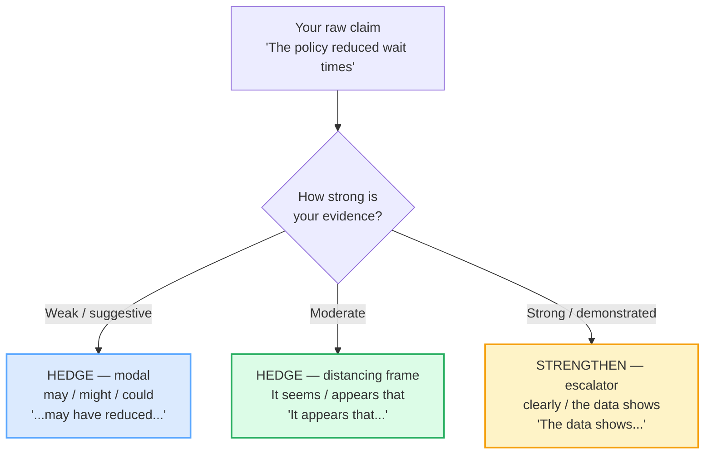

# Editing: Hedging &amp; Tone

> **Phase 3 · writing · bundle #61 · Days 121–122.**
> *Soften without weakening; confidence calibration.*
>
> 🔗 This is the **written/editorial register** of hedging. The
> **spoken** version lives in
> [OPINIONS HEDGED](../speech_acts/OPINIONS_HEDGED.md) (Phase 1, bundle #20) —
> *"I'd say…"* / *"Correct me if I'm wrong, but…"*. This bundle is what you do
> when you **write** the same idea down: calibrate every claim to its evidence.
> Sibling: [EDITING: CONCISION](./EDITING_CONCISION.md) (cut filler, active voice)
> — that bundle is about *shortening*; this one is about *softening vs.
> strengthening*.

---

## Why this bundle exists (read this first)

Most Vietnamese learners arrive at professional English with one of two broken
instincts on certainty:

1. **Under-hedge** — state an opinion as a bald fact. *"This proves the policy
   failed."* In Vietnamese, a confident assertion doesn't read as arrogant
   because the relationship and context carry the politeness. In written English,
   the same sentence reads as **unfounded or aggressive** — the claim outruns the
   evidence, so the reader distrusts the writer.
2. **Over-hedge** — unsure of the English, so hedge *everything*. *"It might
   perhaps arguably seem to possibly suggest…"* Stacked hedges don't add caution;
   they signal the writer is unsure of *anything*, which erodes all authority.

The fluent move — the one native professional writers make automatically — is
**calibration**: match the strength of the language to the strength of the
evidence. Strong evidence → a stronger claim (*The data clearly shows…*). Weak
evidence → a hedge (*It appears that… / This may suggest…*). The hedge is not
timidity; it is **precision**. This bundle teaches the dial.

---

## 1. The mechanism: what a hedge actually does

A hedge is any device that **lessens the epistemic force** of a statement — it
tells the reader *"here is how certain I am, and here is why."* The Manchester
Academic Phrasebank defines it plainly:

> writers "avoid expressing absolute certainty, where there may be a small degree
> of uncertainty, and avoid making over-generalisations, where a small number of
> exceptions might exist… devices for lessening the strength of a statement or
> claim are known as hedging devices."

There are **three families** of hedge, and a fluent writer reaches for the right
one for the job:

The skill is **not** "always hedge." It is: *read your own evidence, then pick
the device whose certainty matches it.*

---

## 2. Family A — the modal hedges (may / might / could)

The cheapest, most reliable hedge is a **modal verb** slotted between the subject
and the claim. One word, and the sentence stops being an assertion and becomes a
*possibility*.

| Modal | Force | Example |
|---|---|---|
| **may** | possible | This **may** have reduced wait times. |
| **might** | a smaller possibility (more tentative) | This **might** affect retention. |
| **could** | possible / hypothetical | The change **could** introduce new errors. |

> From `editing_hedging_corpus.md` (the modal frame, verbatim):
>
> - **may** /meɪ/ — *"used to say that something is possible"* (Oxford) — *"That
>   may or may not be true."*
> - **might** /maɪt/ — the past of *may*; a slightly *more tentative* possibility
>   than *may*
> - **could** /kəd/ weak · /kʊd/ strong — *"used to show that something is or
>   might be possible"* (Oxford)
>
> The Manchester Phrasebank lists the frame verbatim: *"These frequent storms may
> be / could be / might be due to climate change."*

**The *may* > *might* dial:** *may* = it's possible; *might* = it's a smaller
possibility. That single-step downgrade is a calibration tool — use *might* when
you want to signal "I'm not even sure this is likely."

---

## 3. Family B — the distancing frames (It seems / appears / suggests)

When a bare modal is not enough — when you want to **attribute** the claim to the
evidence rather than to yourself — English uses an impersonal *It*-subject or a
**reporting verb**. This puts daylight between the writer and the assertion.

> From `editing_hedging_corpus.md` (the pinned hedges, verbatim):
>
> | **It seems that…** | **It appears that…** |
> |---|---|
> | /ɪt ˈsiːmz ðət/ | /ɪt əˈpɪəz ðət/ UK · /ɪt əˈpɪrz ðət/ US |
>
> - **This suggests that…** /ðɪs səˈdʒests ðət/ — "to indicate that something
>   exists or is true" (Cambridge)
> - **The data suggests / indicates that…** — the evidence → claim bridge
> - **There is some evidence to suggest that…** — a hedged way to introduce a
>   finding without over-claiming

**Why these work:** *It seems that…* removes the *I* — the claim is no longer
"what I believe" but "what the situation looks like." *The data suggests…*
attributes the claim to the *evidence*, which is far harder to argue with than a
personal assertion. Both are the standard moves of professional and academic
writing.

> From `editing_hedging_corpus.md` (the pinned real example #1):
>
> The Oxford "appear" entry's Language Bank attests the verbatim sentence: *"It
> **seems that** the more personal data organizations collect, the more
> opportunity there is for this data to be lost or stolen."*
>
> The Manchester Phrasebank attests the pinned bridge: *"The data reported here
> **appear to support** the assumption that…"*

---

## 4. Family C — the scalar qualifiers (arguably / to some extent / in general / tends to)

These are the **dial** hedges — a single word or short phrase that turns the
strength down by a measured amount. They sit on a spectrum from near-certain
(*arguably*) to heavily qualified (*to some extent*).

> From `editing_hedging_corpus.md`:
>
> - **arguably** /ˈɑːɡjuəbli/ UK · /ˈɑːrɡjuəbli/ US — *"He is arguably the best
>   actor of his generation."* (Oxford)
> - **to some extent** /tə sʌm ɪkˈstent/ — partly; up to a certain degree
> - **in general** /ɪn ˈdʒenrəl/ — usually; in most cases (avoids the
>   over-generalisation trap)
> - **tends to** /tendz tə/ — *"Women tend to live longer than men."* (Oxford)

**The expert use:** *arguably* is a **strong** hedge — it says "I'm making a real
claim, and I can defend it." *to some extent* is a **weak** hedge — it concedes
the claim is only partly true. *in general* and *tends to* handle the
over-generalisation trap: instead of *"All users prefer…"* (one counter-example
kills you), write *"Users **in general** prefer…"* or *"Users **tend to**
prefer…"*.

---

## 5. Family D — the strengtheners (clearly / definitely / the data shows / I'm confident that)

Calibration is two-sided. When the evidence **is** strong, a hedge is wrong — it
under-sells your finding and makes you sound unsure of solid work. These are the
escalators that *raise* certainty to match strong evidence.

> From `editing_hedging_corpus.md`:
>
> - **clearly** /ˈklɪəli/ UK · /ˈklɪrli/ US — *"These results **clearly show**
>   that the government's actions are unpopular."* (Oxford)
> - **definitely** /ˈdefɪnətli/ — *"I **definitely** remember sending the
>   letter."* (Oxford)
> - **I'm confident that…** /aɪm ˈkɒnfɪdənt ðət/ UK · /aɪm ˈkɑːnfɪdənt ðət/ US —
>   *"I'm **confident** that you will get the job."* (Oxford)

**The rule:** *clearly* and *the data shows* are for **demonstrated** results
(numbers, replicated findings). *I'm confident that* is for a **judgement** you
can defend. Never use §D language for a *suggestion* — that is the under-hedge
failure (§E1).

---

## 6. The calibration spectrum — under / right / over (the central drill)

This is the heart of the bundle. Take one claim and calibrate it three ways:

| Level | Sentence | Why |
|---|---|---|
| **Under-hedged** (arrogant) | This **proves** that the policy failed. | *proves* grants no margin — reads as unfounded. |
| **Just-right** (calibrated) | The data **suggests** that the policy **may have** reduced wait times. | *suggests* + *may have* = evidence-matched. |
| **Over-hedged** (timid) | It **might perhaps arguably seem** to **possibly suggest**… | four stacked hedges → the claim vanishes. |

> From `editing_hedging_corpus.md` (the calibration triples, §E1–E3):
>
> - **Under-hedge (fails):** *"This proves that the policy failed."* — the claim
>   outruns the evidence.
> - **Just-right (works):** *"The data suggests that the policy may have reduced
>   wait times."* — a claim calibrated to its evidence.
> - **Over-hedge (fails):** *"It might perhaps arguably seem to possibly suggest
>   that it could maybe be the case…"* — the hedge drowns the claim.

**The diagnostic question:** *Am I matching my language to my evidence?* If the
evidence is thin, hedge more (§A–C). If it's solid, strengthen (§D). The error is
**mismatch** — a strong claim on weak evidence (under-hedge) or a timid claim on
strong evidence (over-hedge).

---

## 7. Cheat sheet — the ≤8 survival chunks

The Pareto set. Calibrate these eight in your own writing. (Every row is a corpus
attestation above.)

| # | Chunk | IPA | Why it's here |
|---|---|---|---|
| 1 | **It seems that…** | /ɪt ˈsiːmz ðət/ | the pinned hedge — soft claim opener |
| 2 | **The data suggests…** | /ðə ˈdeɪtə səˈdʒests/ UK · /ðə ˈdætə səˈdʒests/ US | the pinned bridge — evidence → claim |
| 3 | **may / might / could** | /meɪ/ · /maɪt/ · /kʊd/ | the modal dial — cheapest hedge |
| 4 | **It's likely that…** | /ɪts ˈlaɪkli ðət/ | moderate-confidence hedge |
| 5 | **arguably** | /ˈɑːɡjuəbli/ UK · /ˈɑːrɡjuəbli/ US | a *strong* hedge — "I can defend this" |
| 6 | **tends to** | /tendz tə/ | avoids the over-generalisation trap |
| 7 | **clearly** | /ˈklɪəli/ UK · /ˈklɪrli/ US | the strengthener — for demonstrated results |
| 8 | **I'm confident that…** | /aɪm ˈkɒnfɪdənt ðət/ UK · /aɪm ˈkɑːnfɪdənt ðət/ US | the strengthener — for a defensible judgement |

> Open [`editing_hedging.html`](./editing_hedging.html) to drill these as flip
> cards, edit the role-play lines, shadow, and run the calibration writing task.

---

## 8. Vietnamese → English L1 pitfalls table

The "expert payoff." These are the specific interference traps a Vietnamese
speaker hits when calibrating certainty in written English.

| Vietnamese trap (what you do) | English fix (what to do instead) |
|---|---|
| **States opinion as bald fact** — *"This is wrong"* / *"This proves…"* (Vietnamese context/relationship carries the politeness, so a bare assertion doesn't read as rude in VN) | Calibrate: if the evidence only *suggests* it, write *"This **appears to be** incorrect"* or *"The data **suggests**…"*. Match the verb to the evidence strength. |
| **Over-hedges everything to be "polite"** — *"I think maybe it might possibly seem…"* (VN *có lẽ* / *hình như* stacking) | **One hedge is enough.** Pick *one* device (a modal *or* *It seems* *or* *arguably*) and stop. Stacking four hedges signals you're unsure of anything, not that you're polite. |
| **No register distinction between spoken and written hedging** — uses *"kind of" / "like" / "sort of"* in a formal report | Written hedging uses **lexical** devices: *It appears that / The data suggests / may / tends to*. Reserve *"kind of / sort of"* for spoken casual (🔗 [OPINIONS HEDGED](../speech_acts/OPINIONS_HEDGED.md)). |
| **Uses "I think" as the only hedge** — over-relies on *I think…* in every sentence | Vary the attribution: *It seems that…* (impersonal), *The data suggests…* (evidence), *arguably* (defensible claim). *I think* is fine once; repeating it sounds unprofessional. |
| **Under-claims strong evidence** — reports solid numbers with *"I think it might be…"* | When the data is clear, **strengthen**: *"The results **clearly show**…"* / *"The data **indicates**…"*. A hedge on strong evidence under-sells your work. |
| **Translates VN modals directly** — *"can be"* / *"will be"* where English needs *"may be"* / *"might be"* | English epistemic *may/might/could* ≠ ability *can*. For uncertainty, use *may/might*, not *can*. *"This can be a problem"* (ability) vs *"This **may be** a problem"* (possibility). |
| **Confuses "prove" and "suggest"** — writes *"This proves…"* for correlational evidence | *Prove* = deductive certainty (rare). *Suggest / indicate / appear to* = the standard for empirical evidence. Default to *suggest* unless you have causal proof. |
| **Drops the hedging adverb's stress** — *"ar-GU-ab-ly"* (wrong stress) | **AR-gyu-ab-ly** /ˈɑːɡjuəbli/ — primary stress on the **first** syllable. Drill the word aloud; misplaced stress marks you instantly as non-native even when the hedging logic is right. |

---

## How to practise this bundle (the daily 20 min)

1. **READ** (5 min) — this guide, §1–§6.
2. **EDIT** (7 min) — open `editing_hedging.html`, run the **writing task**:
   take 3 under-/over-hedged sentences and calibrate each to "just-right."
3. **PRODUCE** (8 min) — write a 3-sentence claim about your own work (a project
   result, a reading, an opinion). Edit each sentence's hedge level to match its
   evidence. Read them aloud; check no claim outruns its evidence and none drowns
   in hedges.

---

## Sources

- Manchester Academic Phrasebank, "Being cautious" (the hedging section) — https://www.phrasebank.manchester.ac.uk/using-cautious-language/ (lists verbatim: *may be / could be / might be; It seems possible that; These findings suggest that; The data reported here appear to support; In general; tends to; It is likely that*).
- Oxford Advanced Learner's Dictionary — https://www.oxfordlearnersdictionaries.com/definition/english/{word} (entries for *may, could, arguably, tend, definitely, clearly, appear, confident*; the *tend* Language Bank "generally" attests *In general / tend to / to a large extent*; the *appear* Language Bank "perhaps" attests *It seems that / It could be argued that*).
- Cambridge Advanced Learner's Dictionary — https://dictionary.cambridge.org/dictionary/english/suggest (*suggest*: "to indicate that something exists or is true").
- 🔗 Cross-ref: [OPINIONS HEDGED](../speech_acts/OPINIONS_HEDGED.md) (Phase 1, #20) — the **spoken** register of hedging (*I'd say / Correct me if I'm wrong*); this bundle is the **written/editorial** register.
- Native audio: YouGlish — https://youglish.com/pronounce/{chunk}/english/us?
- Frequency methodology: wordfrequency.info (spoken sub-corpus) — https://www.wordfrequency.info/
