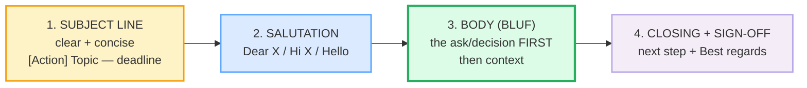
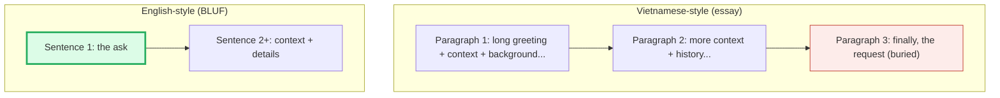

# Email Anatomy

> **Phase 3 · writing · bundle #46 · Days 91–92.**
> *Subject line + open + close; the "BLUF" principle.*
>
> 🔗 This is the **first writing bundle** — the genre skeleton every later
> writing bundle assumes you already know. [FORMAL VS CASUAL REGISTER](./FORMAL_CASUAL_REGISTER.md)
> (bundle #47) builds on it (the same anatomy at two formality levels);
> [REQUESTS & REMINDERS](./REQUESTS_REMINDERS.md) (#48) and
> [STATUS REPORTS](./STATUS_REPORTS.md) (#52) are BLUF applied to a specific
> purpose.

---

## Why this is bundle #46 (read this first)

Phase 3 switches from **spoken** mode to **written** mode. The good news: a
professional email is the most *formulaic* genre in English — once you know the
four-part skeleton and a handful of reusable chunks, you can write 80% of
workplace emails without inventing anything new. The bad news: Vietnamese
learners tend to write emails the way they write Vietnamese essays — long,
elaborate, building to a point that never quite arrives. English emails are the
opposite: **concise, front-loaded, and action-oriented**.

This bundle teaches the skeleton — **subject line → salutation → BLUF body →
closing + sign-off** — and the single principle that makes it work: **Bottom
Line Up Front**.

---

## 1. The four-part skeleton

Every professional email is built from the same four blocks. Oxford University
Press's email guide lays out a six-step structure that collapses to these four
functional parts:

> From `email_anatomy_corpus.md` (the four parts, with real model phrases):
>
> | Part | Model phrase (attested) |
> |---|---|
> | **Subject** | "Meeting arranged for Wednesday" |
> | **Salutation** | "Dear Mr Chan," |
> | **Opening** | "I am writing to tell you…" |
> | **Closing** | "Hope to hear from you soon." |
> | **Sign-off** | "Best wishes," |

---

## 2. The subject line — clear + concise

The subject line is the only line the reader sees in their inbox preview. Make
it do work: **what is this about, and is there an action?** The military
convention (HBR, Sehgal 2016) uses keyword tags in caps — **ACTION**, **INFO**,
**DECISION**, **SIGN** — so the reader knows instantly what's expected.

> From `email_anatomy_corpus.md`:
>
> - "ACTION: Budget approval needed by Friday" — the tag + topic + deadline
>   pattern.
> - "Meeting arranged for Wednesday" — topic + date, no action needed.
> - "Proposal for the Evergreen Sports Centre" — document type + subject.

**The Vietnamese trap:** learners write subject lines that say nothing —
"hello", "question", or just their own name. The reader has to open the email
to find out what it's about, and busy readers will skip it.

---

## 3. The salutation — register in one word

The greeting tells the reader the formality level before they read a single
sentence of content. Match it to the relationship:

| Relationship | Greeting (attested) |
|---|---|
| Colleague you know well | "Hi Carlos," |
| Neutral / new contact | "Dear Luka," |
| Formal (title + surname) | "Dear Mr Chan," |
| Formal (job title) | "Dear Recruiting Director," |

> From `email_anatomy_corpus.md`:
>
> - "Hi Carlos," /haɪ kɑːrˈləʊs/ — informal, first name.
> - "Dear Mr Chan," /dɪə(r) ˈmɪstə tʃæn/ — formal, title + surname.

**The Vietnamese trap:** Vietnamese has elaborate honorific systems (*thưa
anh/chị/chú/bác*). Learners over-formalise every email with "Dear Sir/Madam"
even to colleagues they email daily, or — the opposite error — go straight to
"Hi" with someone they've never met. Calibrate: **first name = "Hi X,"; surname
= "Dear Mr/Ms X,"; unknown = "Dear [Job Title],"**.

---

## 4. The BLUF body — Bottom Line Up Front

This is the principle that separates a native-like email from an essay-like
one. **State the ask, the decision, or the key information in the first
sentence.** Then give the context.

**BLUF** (Bottom Line Up Front) originates in U.S. military communication
(Army Regulation 25-50) and was popularised for business by Kabir Sehgal in the
*Harvard Business Review* (2016). The rule: the reader should know *what you
want* before they know *why you want it*.

> From `email_anatomy_corpus.md`:
>
> - "BLUF: I need you to approve both the design and content of the attached
>   flyer by noon on August 10." — the canonical example: **who** (you) +
>   **action** (approve) + **what** (design and content) + **deadline** (noon
>   Aug 10).
> - "Could you confirm the meeting time by Friday?" — the same BLUF logic in a
>   shorter email: ask + deadline.

**Contrast — the essay-style email (what NOT to do):**

🔗 [STATUS REPORTS](./STATUS_REPORTS.md) (#52) applies BLUF to the status-update
genre; [SUMMARIES & EXECUTIVE BRIEFS](./SUMMARIES.md) (#65) is BLUF pushed to
its purest form.

---

## 5. Attachment notes

When an email carries an attachment, signal it explicitly — don't assume the
reader will notice the paperclip icon.

> From `email_anatomy_corpus.md`:
>
> - "Please find attached the project report." — the formal standard
>   (attested in Cambridge Dictionary grammar examples).
> - "I've attached the timetable for next week." — the neutral, modern
>   alternative (attested in University of Nottingham TEFL materials).

**The Vietnamese trap:** learners often write "I send you the file" (word-for-word
translation from Vietnamese *tôi gửi bạn file*) or forget to mention the
attachment at all. Use **"Please find attached …"** (formal) or **"I've attached
…"** (neutral) — both are fixed chunks, not phrases you assemble word by word.

---

## 6. Closings + sign-offs

The closing states the **next step**; the sign-off sets the **register**.

| Closing (attested) | Register |
|---|---|
| "Looking forward to hearing from you." | formal |
| "Hope to hear from you soon." | neutral |
| "Thank you in advance." | formal (use sparingly) |

| Sign-off (attested) | Register |
|---|---|
| "Best regards," | formal/neutral |
| "Best wishes," | formal |
| "All the best," | neutral |
| "Cheers," | informal (esp. UK) |

> From `email_anatomy_corpus.md`:
>
> - "Looking forward to hearing from you." /ˈlʊkɪŋ ˈfɔːwəd tuː ˈhɪərɪŋ frɒm juː/
> — the classic formal closing.
> - "Best regards," /best rɪˈɡɑːdz/ — the safe all-purpose sign-off.

**The Vietnamese trap:** Vietnamese letters end with elaborate, formulaic
closings (*Trân trọng, Kính chúc sức khỏe*). Learners often overdo the closing
in English ("I look forward to hearing from you at your earliest convenience,
and I remain sincerely yours") or skip it entirely. The English default is
**one closing line + one sign-off word.** Done.

---

## 7. Cheat sheet — the ≤8 survival chunks

The Pareto set. These eight chunks build a complete, professional email.

| # | Chunk | IPA | Why it's here |
|---|---|---|---|
| 1 | **I hope this finds you well.** | /aɪ həʊp ðɪs faɪndz juː wel/ | the canonical polite opening (pinned) |
| 2 | **I'm writing to…** | /aɪm ˈraɪtɪŋ tuː/ | states purpose in one move |
| 3 | **Following up on…** | /ˈfɒləʊɪŋ ʌp ɒn/ | the chaser / reminder opening |
| 4 | **Could you … by Friday?** | /kʊd juː … baɪ ˈfraɪdeɪ/ | the BLUF ask + deadline |
| 5 | **Please find attached …** | /pliːz faɪnd əˈtætʃt/ | signals an attachment (pinned) |
| 6 | **Looking forward to hearing from you.** | /ˈlʊkɪŋ ˈfɔːwəd tuː ˈhɪərɪŋ frɒm juː/ | the formal closing |
| 7 | **Best regards,** | /best rɪˈɡɑːdz/ | the safe all-purpose sign-off |
| 8 | **ACTION: [topic] — [deadline]** | /ˈækʃən …/ | the subject-line formula |

> Open [`email_anatomy.html`](./email_anatomy.html) to practise the writing
> task (write a complete 4-part email), drill the flip cards, and hear native
> clips of each chunk.

---

## 8. Vietnamese → English L1 pitfalls table

The "expert payoff." These are the specific interference traps a Vietnamese
speaker hits when writing professional emails in English.

| Vietnamese trap (what you do) | English fix (what to do instead) |
|---|---|
| **Essay-style structure** — long opening, background first, request buried at the end (Vietnamese *văn nghị luận* style) | **BLUF**: state the ask in sentence 1, then context. Invert the essay. |
| **Vague subject lines** — "hello", "question", or your own name | Use **[Action] Topic — deadline**: "ACTION: Budget approval needed by Friday." |
| **Over-formal everywhere** — "Dear Sir/Madam" to colleagues you email daily; "I remain sincerely yours" closings | Calibrate: "Hi [first name]," for colleagues; "Dear Mr/Ms [surname]," for new contacts. One-line closing, one-word sign-off. |
| **Under-formal with strangers** — "Hi" to a hiring manager you've never met | Default to **"Dear [Job Title],"** or **"Dear Mr/Ms [Surname],"** until invited to use a first name. |
| **Word-for-word translation** — "I send you the file" (← *tôi gửi bạn file*), "Please reply me soon" (← *vui lòng trả lời tôi sớm*) | Use fixed chunks: **"Please find attached …"**, **"Looking forward to hearing from you."** Don't translate — retrieve the chunk. |
| **Burying the ask behind politeness** — "I am sorry to bother you, but if it is not too much trouble, I was wondering if perhaps you might…" | Be direct but polite: **"Could you confirm the meeting time by Friday?"** One clause, clear ask, clear deadline. |
| **No deadline / no clear action** — the reader can't tell what they're supposed to do | End the BLUF sentence with a **specific ask + specific deadline**: "Could you review this by Wednesday?" |
| **Elaborate closing rituals** — long sign-offs with wishes, health, respect formulas (*Trân trọng kính chào*) | **"Best regards,"** — two words, full stop. Match the culture: English emails are transactional, not ceremonial. |
| **"Kindly" overuse** — "Kindly find attached", "Kindly do the needful" (Indian-English calque, common in VN offices too) | Use **"Please find attached"** (standard) — *kindly* reads as archaic or non-native to US/UK readers. |

---

## How to practise this bundle (the daily 20 min)

1. **READ** (5 min) — this guide, §1–§6.
2. **STUDY** (7 min) — open `email_anatomy.html`, drill the 8 flip cards, read
   the annotated model email. Pay attention to the BLUF sentence — where does
   the ask appear?
3. **PRODUCE** (8 min) — the writing task: **write a complete 4-part email**
   (subject + salutation + BLUF body + closing + sign-off). Use the prompt in
   the player. Then reveal the annotated model and compare: did you front-load
   your ask, or bury it?

---

## Sources

- Oxford University Press ELT, "How to write the PERFECT email in English" (Learning English with Oxford, 2021) — https://learningenglishwithoxford.oup.com/2021/03/18/write-perfect-email-english/
- Sehgal, Kabir. "How to Write Email with Military Precision." *Harvard Business Review* (22 Nov 2016) — https://hbr.org/2016/11/how-to-write-email-with-military-precision
- "BLUF (communication)." *Wikipedia.* — https://en.wikipedia.org/wiki/BLUF_(communication)
- Cambridge Advanced Learner's Dictionary — https://dictionary.cambridge.org/dictionary/english/{word} (entries for *write*, *forward*, *regards*, *find*, *hope*)
- Cambridge Dictionary grammar (*much/a lot/lots*) — attests "Please find attached my report." — https://dictionary.cambridge.org/grammar/british-grammar/much-a-lot-lots-a-good-deal-adverbs
- Oxford Advanced Learner's Dictionary — *attached* — https://www.oxfordlearnersdictionaries.com/definition/english/attached
- Rodríguez-Brown & Haugh, "Separated by a common im/politeness marker: *please* in American and British web-based English" (*English Language and Linguistics*, CUP) — https://www.cambridge.org/core/journals/english-language-and-linguistics/article/separated-by-a-common-impoliteness-marker-please-in-american-and-british-webbased-english/3EDE29FABD5DB11786565545E0DC1664
- Adshead, Bryony. "Teaching English as a Foreign Language: Summative Assessment" (University of Nottingham, *Innervate* 2020–21) — https://www.nottingham.ac.uk/english/documents/innervate/20-21/engl3012-bryony-adshead.pdf
- Native audio: YouGlish — https://youglish.com/pronounce/{chunk}/english/us?
- Frequency methodology: wordfrequency.info (spoken sub-corpus) — https://www.wordfrequency.info/
