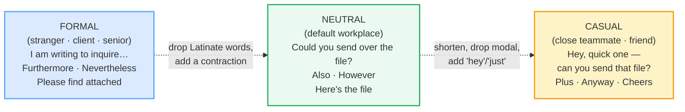

# Formal vs Casual Register

> **Phase 3 · writing · bundle #47 · Days 93–94.**
> *"I hope this finds you well" vs "Hey, quick one."*
>
> 🔗 This is where the **mode switches to writing**. It builds on
> [AGREEING & DISAGREEING](../speech_acts/AGREEING_DISAGREEING.md) (the spoken
> register you already feel) and feeds forward into
> [REQUESTS & REMINDERS](./REQUESTS_REMINDERS.md) (the same request at the right
> register), [APOLOGY EMAILS](./APOLOGY_EMAILS.md), and
> [EDITING: HEDGING & TONE](./EDITING_HEDGING.md). Get the ladder right once and
> every later writing bundle is easier.

---

## Why this is the bundle that fixes "Dear Sir" to a peer

Vietnamese has one of the richest **pronoun + honorific** systems in the world:
*em–anh, tôi–bạn, mình–tớ, cháu–cô, con–mẹ*. You pick the address term from age,
gender, and relationship, and that one word **is** the register. English has a
single *you* for everyone — so a Vietnamese learner, stripped of their usual
register signal, does one of two things:

1. **Defaults over-formal** — *"Dear Sir, I am writing to inform you…"* to a
   teammate named Alex they Slack with daily. (The honorific reflex fires with
   nothing to attach to, so it grabs "Dear Sir".)
2. **Slips over-casual** — copies a YouTuber's *"Hey, what's up"* into a cover
   letter. (No honorific guardrail, so the floor drops out.)

This bundle gives you the **register ladder** — a single message at three rungs
— and the **two levers** that move a sentence up or down it. Master the ladder
and you stop "translating" register from Vietnamese; you start *choosing* it in
English.

---

## 1. The ladder: formal ↔ neutral ↔ casual (one message, three rungs)

Register is a **climb**, not a switch. The same intent — *"send me the file"* —
sits at three heights, and a native reader instantly locates your line on the
ladder from two signals: **vocabulary choice** and **contraction density**.

> From `formal_casual_register_corpus.md` (the three-run ladder, verbatim):
>
> - **FORMAL** → *I am writing to inquire about the document referenced in your
>   message.*
> - **NEUTRAL** → *Could you send over the file when you have a moment?*
> - **CASUAL** → *Hey, quick one — can you send that file?*

Notice what **does not change** (the intent: get the file) and what **does**:

| Lever | Formal | Neutral | Casual |
|---|---|---|---|
| Subject + verb | *I am writing to inquire* | *Could you send* | *can you send* |
| Connector | *Furthermore / Nevertheless* | *Also / However* | *Plus / Anyway* |
| Contractions | none (*I am*) | one (*Here's*) | many (*I'd, that's*) |
| Modal | *would* | *could* | *can* (or none) |
| Opener | *I hope this finds you well* | *Hi [Name],* | *Hey, quick one* |
| Sign-off | *Please find attached* / *Yours sincerely* | *Best,* | *Cheers* |

---

## 2. The two levers that move you up or down

### Lever A — vocabulary shift (Latinate vs Germanic)

The single fastest register signal. Formal English keeps its **Latinate/French**
words (*furthermore, moreover, nevertheless, regarding, inquire, obtain*).
Casual English reaches for the **short Germanic** synonym (*plus, anyway, about,
ask, get*). Same meaning, different altitude.

> From `formal_casual_register_corpus.md`:
>
> | Formal (Latinate) | Casual (Germanic / short) |
> |---|---|
> | **furthermore** /ˈfɜː.ðə.mɔː(r)/ UK · /ˈfɝː.ðɚ.mɔːr/ US | **plus** /plʌs/ |
> | **moreover** /mɔːˈrəʊ.və(r)/ UK · /mɔːrˈoʊ.vɚ/ US | **also** /ˈɔːl.səʊ/ |
> | **nevertheless** /ˌnev.ə.ðəˈles/ | **anyway** /ˈen.i.weɪ/ |
> | **regarding** /rɪˈɡɑːdɪŋ/ UK · /rɪˈɡɑːrdɪŋ/ US | **about** /əˈbaʊt/ |
> | **I am writing to inquire** | **Hey, quick one** |

### Lever B — contraction density

Contractions (*I'm, don't, I'd, that's, here's*) **lower** register. A formal
email expands them (*I am, do not, I would, that is, here is*). Count the
contractions in a sentence and you have a rough register meter: **0 = formal,
1 = neutral, 2+ = casual**.

> From `formal_casual_register_corpus.md`:
>
> - **I would like to** /aɪ wʊd ˈlaɪk tu/ — formal, no contraction.
> - **I'd like to** /aɪd ˈlaɪk tu/ — one contraction down, neutral/casual.

> **Hedging note:** formal register also adds **hedges** — *I was wondering if…,
> if you wouldn't mind, it might be worth…*. Hedging softens without weakening,
> and it is its own bundle: 🔗 [EDITING: HEDGING & TONE](./EDITING_HEDGING.md).

---

## 3. The pinned pair — same intent, opposite registers

The two headline chunks. Open them in the player and listen to the rhythm
difference — the formal line is slow and even; the casual line is clipped.

> From `formal_casual_register_corpus.md`:
>
> - **I hope this finds you well** /aɪ həʊp ðɪs faɪndz juː wel/ — *formal /
>   semi-formal email opener.* Documented by Scribbr (UK) and Harvard Business
>   Review as the classic business-email well-wishing opener.
> - **Hey, quick one** /heɪ kwɪk wʌn/ — *casual IM/email opener.* "Hey" grabs
>   attention informally; "quick one" promises the ask is small. "Quick one"
> resolves on YouGlish as a real native chunk (HTTP 200).

Both open a message to a contact. The first is for a client you've never met;
the second is for a teammate you ping daily. **Same intent, different ladder
rung.**

---

## 4. Choosing the rung (audience × relationship)

Pick the rung from **two questions**, not from how you feel that day:

| Question | Lean formal if… | Lean casual if… |
|---|---|---|
| **Power distance** | recipient is senior / client / official | peer / junior / friend |
| **Familiarity** | first contact, or < a few exchanges | you message weekly, know their style |
| **Stakes** | ask is big, or bad news, or money | ask is small, informational |
| **Channel** | email to external / formal letter | Slack / text / internal email |
| **Culture** | UK/US formal business, or unsure | startup / tech / creative industry |

> **Default rule when unsure:** start one rung **more formal than you think you
> need**, then match whatever the other person does. Under-shooting to casual
> reads as rude; over-shooting to formal reads as stiff but safe. You can always
> climb down; climbing back up after going too casual is hard.

---

## 5. Cheat sheet — the ≤8 survival chunks

The Pareto set. Drill these eight until the formal/casual pair for each is
automatic. (Every row is a corpus attestation above.)

| # | Chunk | IPA | Register | Why it's here |
|---|---|---|---|---|
| 1 | **I hope this finds you well** | /aɪ həʊp ðɪs faɪndz juː wel/ | formal | the pinned formal opener — well-wishing, no contraction |
| 2 | **Hey, quick one** | /heɪ kwɪk wʌn/ | casual | the pinned casual opener — short, low-stakes, attention-grabbing |
| 3 | **Furthermore** | /ˈfɜː.ðə.mɔː(r)/ UK · /ˈfɝː.ðɚ.mɔːr/ US | formal | Latinate addition marker |
| 4 | **Nevertheless** | /ˌnev.ə.ðəˈles/ | formal | Latinate contrast marker |
| 5 | **Regarding** | /rɪˈɡɑːdɪŋ/ UK · /rɪˈɡɑːrdɪŋ/ US | formal | Latinate "about" |
| 6 | **I would like to** | /aɪ wʊd ˈlaɪk tu/ | formal | polite request, no contraction |
| 7 | **Please find attached** | /pliːz faɪnd əˈtætʃt/ | formal | the attachment formula |
| 8 | **Just checking in** | /dʒəst ˈtʃek.ɪŋ ɪn/ | casual | the (overused) casual nudge |

> Open [`formal_casual_register.html`](./formal_casual_register.html) to drill
> these as flip cards, hear native clips, run the email-thread role-play,
> shadow, and **write one message at all three registers**.

---

## 6. Vietnamese → English L1 pitfalls table

The "expert payoff." Vietnamese's pronoun/honorific system maps **unevenly**
onto English's single *you* — these are the specific traps that result.

| Vietnamese trap (what you do) | English fix (what to do instead) |
|---|---|
| **No honorific word to grab onto** → defaults over-formal: *"Dear Sir"* / *"Dear Mr."* to a peer whose name you know | Use the person's **first name** once you have it: *"Hi Alex,"* not *"Dear Sir"*. English encodes respect by **getting the name right**, not by piling on titles. "Dear Sir/Madam" is for when you genuinely don't know the name. |
| **Translates the *em–anh* intimacy directly** → opens a work email to a friendly colleague with *"Dear Brother"* or skips the greeting entirely | Match the channel: email → *"Hi [Name],"*; Slack → *"hey"* (lowercase, no comma) or no greeting at all. Intimacy in English lives in the **first name + contraction**, not a kinship term. |
| **Single *you* feels too blunt** → over-hedges every request: *"I am very sorry to bother you but I was wondering if perhaps you might possibly…"* | Hedge **once**, not four times. *"Could you send the file by Friday?"* is already polite (modal *could*). Stacking four softeners reads as insecure, not respectful. |
| **Treats *tôi–bạn* as "the casual option"** → drops straight to *"Hey, what's up, send me the file"* to a new client | *Bạn* is **neutral peer**, not casual. Map *tôi–bạn* to the **neutral rung** (*"Hi [Name], could you…"*), reserving *"Hey"* for people you'd call by a nickname. |
| **Mixed register within one email** — formal open (*"I hope this finds you well"*) + slang close (*"cheers, lmk asap lol"*) | Hold **one rung per message**. If you open formal, close formal (*"Best regards,"*). Mixed register signals you copied phrases you didn't calibrate. |
| **Translates register word-by-word** → writes *"Furthermore, I would like to add that moreover…"* (stacking formal markers the way Vietnamese stacks politeness particles) | Use **one** connector per idea. *Furthermore* OR *moreover* OR *in addition* — never two. Stacking formal markers sounds robotic, not polite. |
| **No contraction instinct** → writes *"I am writing to you. I do not have the file. It is not here."* in a casual Slack thread | In casual/neutral writing, **contract by default**: *I'm, I don't, it isn't*. The uncontracted forms are for formal email and emphasis ("I **do** have it"). |
| **Skips the sign-off register match** → signs a formal email *"Cheers"* (too casual) or a casual Slack *"Yours sincerely"* (too stiff) | Match the sign-off to the opener: formal → *"Best regards / Kind regards / Sincerely"*, neutral → *"Best / Thanks"*, casual → *"Cheers / Thanks / (nothing)"*. |
| **Carries the *ạ* particle into English** → adds *"sir / madam / please"* everywhere to sound polite | English politeness is in the **modal + indirectness** (*Could you / Would you mind*), not in sprinkling "sir". Over-using "sir" to a peer feels sarcastic or subservient. |

---

## How to practise this bundle (the daily 20 min)

1. **READ** (5 min) — this guide, §1–§4. Internalise the ladder and the two
   levers (vocabulary shift + contraction density).
2. **SHADOW** (7 min) — open `formal_casual_register.html`, drill the 8 flip
   cards aloud (say the formal and the casual version of each), then run the
   email-thread role-play, **climbing the ladder** as the exchange warms up.
3. **PRODUCE** (8 min) — the **writing task**: take **one** message (e.g. "send
   me the Q3 report") and write it at **all three registers** — formal,
   neutral, casual — side by side. Then rewrite a real email you sent today,
   moving it one rung.

---

## Sources

- Cambridge Advanced Learner's Dictionary — https://dictionary.cambridge.org/dictionary/english/{word} (entries for *hey, cheers, just, would, like, plus, attached*; *cheers* tagged informal "goodbye"/"thank you" used as email sign-off)
- Merriam-Webster Dictionary — https://www.merriam-webster.com/dictionary/{word} (entries for *furthermore* /ˈfər-t͟hər-ˌmȯr/, *moreover* /mȯr-ˈō-vər/, *regarding* /ri-ˈgär-diŋ/, *anyway* /ˈe-nē-ˌwā/)
- Collins English Dictionary — https://www.collinsdictionary.com/dictionary/english/nevertheless (IPA /ˌnɛvəðəˈlɛs/ UK · /ˌnevərðəˈles/ US, tagged `[formal]`)
- Oxford 3000 word list — `hey` exclamation /heɪ/ (A1).
- Wiktionary — https://en.wiktionary.org/wiki/hey (`hey` /heɪ/)
- Scribbr (UK) — *Alternatives to "I Hope This Email Finds You Well"* — https://www.scribbr.co.uk/strong-communication/hope-finds-you-well/
- Scribbr — *How to End an Email: Closing Lines & Sign-Offs* (documents "Cheers" as a casual sign-off) — https://www.scribbr.com/effective-communication/end-an-email/
- Manchester Academic Phrasebank — https://www.phrasebank.manchester.ac.uk/ (formality / hedging)
- Woodpecker.co — *Sales Follow-up Guide* (PDF; documents "just checking in") — https://woodpecker.co/docs/sales-follow-up-guide.pdf
- PartnerStack — *15 Work Email Phrases to Stop Using* (documents "just checking in") — https://partnerstack.com/articles/work-email-phrases-to-stop-using-what-to-say-instead
- Carter, R. & McCarthy, M. *Cambridge Grammar of English* (CUP) — formal–neutral–informal cline; contractions as a register lever.
- "The Vietnamese Pronominal System and the Meaning Behind the Switching of Address Terms" (Academia.edu) — https://www.academia.edu/38747861/
- ACARA *Australian Curriculum: Languages – Vietnamese* (PDF) — multiple pronoun forms vs English single *you* — https://www.acara.edu.au/_resources/20141015_Languages_-_Vietnamese_-_Validation_for_public_viewing_Septwember_2014.pdf
- Native audio: YouGlish — https://youglish.com/pronounce/{chunk}/english/us? (all clips verified HTTP 200 on 2026-06-24)
- Frequency methodology: wordfrequency.info (spoken sub-corpus) — https://www.wordfrequency.info/
