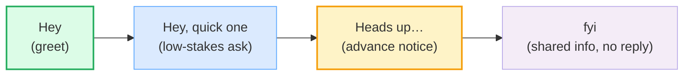

# IM / Slack Style

> **Phase 3 · writing · bundle #53 · Days 105–106.**
> *Short, scannable, thread-aware, emoji-as-tone.*
>
> 🔗 This bundle sits between [FORMAL VS CASUAL REGISTER](./FORMAL_CASUAL_REGISTER.md)
> (the email register ladder) and [STATUS REPORTS](./STATUS_REPORTS.md) (the
> longer written genre). IM/Slack is the **hybrid register** — more casual than
> email, more structured than speech. Related: [EMAIL ANATOMY](./EMAIL_ANATOMY.md)
> (BLUF), [REQUESTS & REMINDERS](./REQUESTS_REMINDERS.md) (gentle nudges).

---

## Why IM/Slack is its own genre (read this first)

Slack, Teams, and Discord chat look like "just typing" — but they have a
**distinct register** that sits between **formal email** and **spoken
English**. It is shorter than email, more casual than a memo, but it is **not**
free-form speech. A good Slack message is:

1. **Short & scannable** — one idea per message, no essay-length walls.
2. **Thread-aware** — the main channel is a noticeboard; the *thread* is the
   conversation.
3. **Emoji-as-tone** — emoji soften, signal tone, and replace the missing
   facial cues of speech (but use them sparingly in formal channels).
4. **@mention-literate** — @here, @channel, and @name notify *different* groups;
   overusing the first two is the #1 cited Slack annoyance.

Vietnamese L1 learners hit a specific wall here: Vietnamese chat culture
(Zalo, Messenger) has different norms, the @here/@channel distinction is
unfamiliar, threads are often skipped (reply posted in the main channel), and
emoji-as-tone-softener (vs emoji-as-decoration) is a new concept. This bundle
drills the four conventions that make a learner sound native in a work chat.

---

## 1. The four openers — how a chat message begins

A chat opener is **one short line** that sets the stakes. There are four, and
they ladder from casual greeting → quick ask → advance notice → shared info:

> From `im_slack_style_corpus.md` (the four openers, verbatim):
>
> - **Hey** /heɪ/ — casual chat/DM greeting or attention-getter (informal).
> - **Hey, quick one** /heɪ kwɪk wʌn/ — casual opener signalling a short,
>   low-stakes ask.
> - **Heads up** /ˌhedz ˈʌp/ — informal warning / advance notice so someone
>   can prepare.
> - **fyi** /ˌɛfˌwaɪˈaɪ/ — "for your information," flags shared info, **no
>   action needed**.

> From `im_slack_style_corpus.md` (the pinned opener — sanity-checkable):
>
> | Heads up | /ˌhedz ˈʌp/ |
> |---|---|
> | informal warning / advance notice | Cambridge *"give someone a heads-up"* —
> "to warn someone that something is going to happen, usually so that they can
> prepare for it." |

**The Vietnamese trap:** learners either open with no greeting at all ("sent
the file" — feels abrupt) or over-formalize ("Dear team, I hope this message
finds you well…" — wrong genre entirely). The fix is to **name the stakes in
the first 2–4 words**: *Hey*, *Quick one*, *Heads up*, or *fyi*.

---

## 2. Brevity conventions — lowercase, abbreviations, dropped punctuation

Chat **tolerates** what email forbids: lowercase first letters, no period at
the end, and initialisms (*fyi*, *brb*, *tbh*, *imo*, *asap*). These are the
**visible register signals** that say "this is a chat." But there is a line —
initialisms belong in **casual channels and DMs**, not in formal announcements.

| Formal email | Casual IM (same meaning) |
|---|---|
| as soon as possible | **asap** |
| for your information | **fyi** |
| in my opinion | **imo** |
| to be honest | **tbh** |
| I'll be right back | **brb** |
| I'll be away from my desk | **afk** |

> From `im_slack_style_corpus.md` (the abbreviations, verbatim):
>
> - **asap** /ˌeɪˌɛsˌeɪˈpiː/ (letters) · /ˈeɪsæp/ (as a word) — informal
>   urgency marker (Merriam-Webster).
> - **fyi** /ˌɛfˌwaɪˈaɪ/ — info-share, no reply expected (Cambridge Learner's).
> - **brb** /ˌbiːˌɑːrˈbiː/ — "be right back," temporary AFK notice.
> - **afk** /ˌeɪˌɛfˈkeɪ/ — "away from keyboard," not at the desk.
> - **tbh** /ˌtiːˌbiːˈeɪtʃ/ — "to be honest," honesty/frankness marker.
> - **imo** /ˌaɪˌɛmˈoʊ/ US · /ˌaɪˌemˈəʊ/ UK — "in my opinion" (Merriam-Webster).

> **Verification note:** The London School of English registers *asap* as
> informal vs *as soon as possible* as formal — this is the register ladder at
> work. The two spoken forms of ASAP (letter-by-letter vs the acronym /ˈeɪsæp/)
> are both documented (WordReference, VOA "New in the Glossary").

**The Vietnamese trap:** Vietnamese chat culture is heavily abbreviated and
emoji-dense, so learners sometimes carry that **all the way into formal work
channels** where it reads as unprofessional. The fix is **register awareness**:
initialisms are fine in `#engineering` or a DM, but write *as soon as possible*
in an all-hands announcement.

---

## 3. Threading etiquette — reply in thread, don't spam the channel

This is the **single biggest chat-culture gap** for a Vietnamese L1 learner.
In a Slack/Teams channel:

- The **main channel** is a **noticeboard** — every message notifies everyone.
- A **thread** is a **sub-conversation** attached to one parent message — only
  the people in the thread get notified.

Posting a reply in the main channel (instead of in the thread) spams the whole
team. The fix is mechanical: **click the parent message → "Reply in thread."**

> From `im_slack_style_corpus.md` (threading, verbatim):
>
> - **thread** /θred/ — a sub-conversation attached to one parent message.
> - **Reply in thread** /rɪˈplaɪ ɪn θred/ — keep the discussion under the parent
>   message (Slack official guidance).
> - **Start a thread** /stɑːrt ə θred/ — begin a new sub-conversation off a
>   message.
> - **Also send to #channel** /ˈɔːlsoʊ send tuː ˈtʃænəl/ — opt-in checkbox to
>   surface *one* thread reply to the whole channel.

> **Verification note:** Slack's official threaded-messages resource documents
> "reply in thread" and the "Also send to #channel" checkbox. Mio's etiquette
> guide states it plainly: *"Replying within a thread declutters the channel
> and helps maintain control of the workspace."*

**The Vietnamese trap:** Zalo group chats have no real thread equivalent, so
Vietnamese learners often reply in the main channel by habit. The fix is to
**treat the main channel as a noticeboard, not a chat room** — if your reply
is only relevant to one person or one sub-topic, it goes in a thread.

---

## 4. @mentions — @here / @channel / @name (the pinned convention)

This is the **pinned convention** of the bundle. The three broadcast mentions
are **not interchangeable** — each notifies a different group:

| Mention | Who gets notified | When it's appropriate |
|---|---|---|
| **@name** | one specific person | you need one person's input; everyone else is CC'd |
| **@here** | only the **active** members of a channel | a quick question for whoever's online right now |
| **@channel** | **all** members, active or away | genuinely time-sensitive for the whole team |
| **@everyone** | everyone in the general channel only | org-wide announcement |

> From `im_slack_style_corpus.md` (the pinned mention convention — verbatim from
> Slack's Help Center):
>
> | @here | @channel |
> |---|---|
> | notifies only the **active** members of a channel | notifies **all**
> | members of a channel, active or away |
> | *"Schedule an impromptu event for people who are available, like a lunch
> | outing. Get a question answered quickly by coworkers who are on Slack."* |
> | *"Update your team about a last-minute change to a project deadline. Let
> | members know when you adjust a work process."* |

> **Verification note (the pinned convention):** Slack's own Help Center article
> *"Notify a channel or workspace"* defines each mention and adds: *"We suggest
> using these mentions sparingly."* In channels with ≥6 members, Slack **asks
> the sender to confirm** before posting — the platform's own acknowledgement
> that over-broadcasting is a real problem. The social norm from the receiver
> side: *"Don't use @channel unless there is a fire"* (Holtslander, Vendasta).

**The Vietnamese trap:** @channel feels efficient ("everyone will see it!")
but it is the most-cited Slack annoyance. Vietnamese learners often overuse it
because the cost of a notification is invisible to the sender. The fix is the
**default rule**: @name first, @here only if you need someone *now*, @channel
only if it's genuinely time-sensitive for the whole team.

---

## 5. Emoji-as-tone — softening, not decoration

In speech, tone of voice carries warmth, urgency, or irony. In chat, **emoji do
that job** — but only when used to *carry tone*, not as decoration. The
workplace-research finding (University of Ottawa, The Conversation): emoji
**match the message tone** to read as competent; a mismatched or over-used
emoji reads as unprofessional.

| Emoji | Tone it carries | Typical use |
|---|---|---|
| 👍 / ✅ | acknowledgement / "got it, done" | closing a small task loop |
| 🙏 | polite request / thanks | softening an ask |
| 🎉 | celebration | shipping, milestones |
| 👀 | "taking a look" / mild interest | acknowledging a link |
| 😅 / 😂 | self-deprecation / lightening | softening a small mistake |
| 🚨 | urgency (use rarely) | genuine incident |

> **Verification note:** University of Ottawa research (*"Should emojis be used
> in workplace communications?"*) found messages without emoji read as "most
> professional," but a positive emoji paired with a positive message improved
> perceptions — **only when tone matched**. The Conversation corroborates:
> *"Your emojis need to match the tone of your message if you wish to appear
> competent."*

**The Vietnamese trap:** Vietnamese chat culture uses emoji densely as
**decoration**. English workplace chat uses emoji **sparingly as tone**. The
fix: one emoji per message max in a work channel, and never in a formal
announcement or bad-news message.

---

## 6. Cheat sheet — the ≤8 survival chunks

The Pareto set. Drill these eight — every chat you write will use one.
(Every row is a corpus attestation above.)

| # | Chunk | IPA | Why it's here |
|---|---|---|---|
| 1 | **Heads up…** | /ˌhedz ˈʌp/ | the advance-notice opener (pinned) |
| 2 | **Hey, quick one** | /heɪ kwɪk wʌn/ | the low-stakes-ask opener |
| 3 | **fyi** | /ˌɛfˌwaɪˈaɪ/ | info-share, no reply expected |
| 4 | **asap** | /ˌeɪˌɛsˌeɪˈpiː/ · /ˈeɪsæp/ | informal urgency marker |
| 5 | **Reply in thread** | /rɪˈplaɪ ɪn θred/ | the threading rule |
| 6 | **@here** | /æt hɪər/ US · /æt hɪə/ UK | notify active members only |
| 7 | **@channel** | /æt ˈtʃænəl/ | notify all members (use sparingly) |
| 8 | **imo** | /ˌaɪˌɛmˈoʊ/ US · /ˌaɪˌemˈəʊ/ UK | flag a personal view |

> Open [`im_slack_style.html`](./im_slack_style.html) to drill these as flip
> cards, hear native clips, play the role-play, shadow, and write.

---

## 7. Vietnamese → English L1 pitfalls table

The "expert payoff." These are the specific interference traps a Vietnamese
speaker hits in IM/Slack-style chat — extend, don't replace, the seed rows
from the spec.

| Vietnamese trap (what you do) | English fix (what to do instead) |
|---|---|
| **No greeting → posts bare message** ("sent the file") — feels abrupt | Open with one of the four openers: *Hey* / *Quick one* / *Heads up* / *fyi*. Name the stakes in the first 2–4 words. |
| **Over-formalizes chat** — "Dear team, I hope this finds you well…" in a Slack DM | Recognize the **hybrid register**: chat is casual-er than email. Use contractions (*I'll*, *don't*) and drop "Dear"/"Sincerely". 🔗 [FORMAL VS CASUAL REGISTER](./FORMAL_CASUAL_REGISTER.md). |
| **Replies in the main channel** instead of the thread (Zalo has no real thread) | Click the parent message → **Reply in thread**. Treat the main channel as a noticeboard, not a chat room. |
| **Overuses @channel / @here** ("everyone should see this") | Default to **@name** (one person). @here only for "whoever's online now." @channel only for genuinely time-sensitive whole-team news. |
| **Emoji as decoration** (dense emoji, like Zalo/Messenger habit) | Emoji as **tone** — one per message max in a work channel. Never in a formal announcement or bad-news message. 🔗 [BAD-NEWS MESSAGES](./BAD_NEWS_MESSAGES.md). |
| **Writes essay-length messages** (one big wall of text) | **One idea per message.** Break long updates into 2–3 short lines or a thread. Scannable beats complete. |
| **No abbreviation register awareness** — uses *asap*/*fyi*/*brb* in formal announcements | Keep initialisms in **casual channels and DMs**. Write *as soon as possible* / *for your information* in all-hands or client-facing messages. |
| **Misses the "no hello" rule** — sends "Hi" then waits for a reply before asking | Lead with the ask: *"Hey, quick one — do you have the Q3 numbers?"* (LeadDev: *"Never just say hello."*) |
| **Drops final consonants even in text** — "gonna", "wanna" written out | In chat, write **standard spelling** (*going to*, *want to*) unless quoting speech. Text abbreviations (*asap*, *fyi*) are fine; phonetic spellings are not. 🔗 [REDUCTIONS](../pronunciation/REDUCTIONS.md). |
| **Pro-drop habit** → "Is good" / "Will send" (no subject) | Supply the subject in writing: *"**It's** good."* / *"**I'll** send it."* Chat tolerates lowercase, not missing subjects. |

---

## How to practise this bundle (the daily 20 min)

1. **READ** (5 min) — this guide, §1–§5.
2. **SHADOW** (7 min) — open `im_slack_style.html`, drill the 8 flip cards +
   the role-play **aloud** (yes, read chat lines aloud — the rhythm of a chat
   message is closer to speech than to prose).
3. **PRODUCE** (8 min) — the writing task: **write a short Slack update**
   (Heads up + concise body + appropriate @mention + emoji-tone). Reveal the
   model answer and compare.

---

## Sources

- Cambridge Advanced Learner's Dictionary — https://dictionary.cambridge.org/dictionary/english/{word} (entries for *hey, thread, channel*; *"give someone a heads-up"* idiom).
- Cambridge Learner's Dictionary — *FYI* — https://dictionary.cambridge.org/dictionary/learner-english/fyi
- Merriam-Webster Dictionary — https://www.merriam-webster.com/dictionary/{word} (entries for *ASAP*, *IMO*).
- Oxford 3000 word list — `hey` exclamation `/heɪ/` (A1).
- Slack Help Center — *Notify a channel or workspace* (the pinned @here/@channel convention) — https://slack.com/help/articles/202009646-Notify-a-channel-or-workspace
- Slack Help Center — *Use mentions in Slack* — https://slack.com/help/articles/205240127-Use-mentions-in-Slack
- Slack Resources — *Tips on how best to use threaded messages* — https://slack.com/resources/using-slack/tips-on-how-best-to-use-threaded-messages
- Slack Blog — *From jargon to emoji, the evolution of workplace communication* — https://slack.com/blog/collaboration/informal-communication-hybrid-work-survey
- Thread Patrol — *Slack Thread Best Practices* — https://thread-patrol.com/blog/slack-thread-best-practices
- Mio — *Slack Etiquette Guide: 10 Do's And Don'ts* — https://www.m.io/blog/slack-etiquette
- LeadDev — *The LeadDev guide to Slack etiquette* — https://leaddev.com/communication/leaddev-guide-slack-etiquette
- CultureBot — *Slack Etiquette: Rules for Remote Communication* — https://getculturebot.com/blog/slack-etiquette-tips-for-remote-teams/
- Holtslander, G. — *Why you shouldn't use @here on Slack* (Medium/Vendasta) — https://medium.com/vendasta/why-you-shouldnt-use-here-on-slack-e19e6c392502
- Zapier — *Slack etiquette at Zapier* — https://zapier.com/blog/slack-etiquette-at-zapier/
- University of Ottawa — *Should emojis be used in workplace communications?* — https://www.uottawa.ca/research-innovation/news-all/should-emojis-be-used-workplace-communications
- The Conversation — *How emoji use at work can determine how competent your colleagues think you are* — https://theconversation.com/how-emoji-use-at-work-can-determine-how-competent-your-colleagues-think-you-are-280702
- The London School of English — *10 differences between formal and informal language* (*asap* vs *as soon as possible*) — https://www.londonschool.com/blog/10-differences-between-formal-and-informal-language/
- VOA — *New in the Glossary: ASAP* (two spoken forms) — https://www.voanews.com/a/new-in-the-glossary-asap-nother/4008597.html
- Carter, R. & McCarthy, M. *Cambridge Grammar of English* (CUP) — chat as the hybrid register between speech and writing.
- Native audio: YouGlish — https://youglish.com/pronounce/{chunk}/english/us?
- Frequency methodology: wordfrequency.info (spoken sub-corpus) — https://www.wordfrequency.info/
