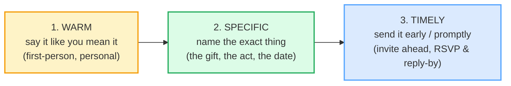

# Invitations &amp; Thank-You Notes

> **Phase 3 · writing · bundle #58 · Days 115–116.**
> *Warm, specific, timely.*
>
> 🔗 This is the **social-writing** sibling of the Phase 3 cluster: it pairs
> with [CLIENT MESSAGES](./CLIENT_MESSAGES.md) (both are warm professional
> writing, but a client message solves a *problem* while an invitation +
> thank-you *build a relationship*), and with [APOLOGY EMAILS](./APOLOGY_EMAILS.md)
> (the same register-control muscle). The speech-act roots are
> [THANKING & RESPONDING](../speech_acts/THANKING.md) and
> [REQUESTING & OFFERING](../speech_acts/REQUESTING_OFFERING.md) — this bundle
> is their **written, personal, social-event** form.

---

## Why this bundle exists (read this first)

A Vietnamese learner writing an invitation or a thank-you note almost always
makes the same mistake: they reach for a **ritualized, generic formula** and
stop there. Three reasons converge:

1. **Vietnamese social writing is pronoun-based and templated.** Invitations
   default to *"Trân trọng kính mời"* ("respectfully invited") and thank-yous
   to *"Cảm ơn vì mọi thứ"* ("thanks for everything"). Both are polite in
   Vietnamese because the **pronoun** (*anh/em/chị/anh chị*…) carries the
   relational warmth. English has no such pronoun system, so English
   invitations and thank-yous carry the warmth **in the words themselves** —
   and a direct translation of the Vietnamese formula lands cold and generic.
2. **The generic thank-you feels safer.** *"Thanks for everything"* is hard to
   get wrong, so learners reuse it for every recipient. But "everything" names
   *nothing* — and a thank-you that names nothing reads as ungrateful to an
   English reader, even when it reads as politely humble in Vietnamese.
3. **Discomfort receiving thanks → deflect.** Vietnamese politeness often
   deflects a compliment (*"có gì đâu"* / "it was nothing"). Carried into
   English, *"It was nothing"* after a genuine *"Thank you so much"* can read
   as brushing the gratitude off.

The fix is one three-word rule, taught across every etiquette reference (Emily
Post, The Knot, Hallmark, American Greetings): **warm · specific · timely.**
Both genres obey it identically:

Notice the rule that defines **both** genres: **specific is the axis that
breaks.** A warm-but-generic note (*"Thanks for everything"*) and a
warm-but-vague invitation (*"Come to my party sometime"*) both fail on the same
word — they never name the thing. The American School of Protocol puts the
thank-you rule in five words: *"Offer your thanks (and be specific!)"*

---

## 1. The invitation opener — say it like you mean it (warm)

The first line of an invitation sets the register. Vietnamese *kính mời* is
formal and impersonal; English invitations run a **warmth ladder**. Pick the
rung that fits the event — casual for a birthday dinner, warmer and
first-person for a wedding or a team lunch:

| Opener | When | Real source attests |
|---|---|---|
| **You're invited to …** | casual, breezy — birthday, dinner, holiday party | Mixily: *"You're invited to dinner! Join us for good food and great company."* |
| **We'd love for you to join us.** | warmer, first-person — weddings, team events, anything you genuinely want the person at | eVentGuru: *"Instead of 'We cordially invite you to attend,' say 'We'd love for you to join us for our Christmas party.'"* |

> From `invitations_thankyous_corpus.md`:
>
> | You're invited to … | We'd love for you to join us. |
> |---|---|
> | /jɔː ɪnˈvaɪtɪd tə/ UK · /jʊr ɪnˈvaɪtɪd tə/ US | /wiːd lʌv fə juː tə dʒɔɪn ʌs/ UK · /wiːd lʌv fər juː tə dʒɔɪn ʌs/ US |
>
> Cambridge's `invite` A1 sense is *"to ask someone if they would like to go
> somewhere or do something"* and attests the passive *"We've been invited to
> Lola's party"* — the *You're invited to…* form. eVentGuru, EventCreate,
> Offbeat Wed, Paperlust and LeaveBoard all attest the warmer *We'd love for
> you to join us* across party / wedding / team-lunch contexts.

**The two ways Vietnamese learners fail this move (and the fix):**

| Failure | Why it happens | Fix |
|---|---|---|
| **Translates *kính mời* as "Respectfully invited"** — lands stiff and bureaucratic in English | L1 formal-template reflex; warmth lives in the pronoun in Vietnamese, not the words | Use the **first-person warm** form: *We'd love for you to join us.* The pronoun *we/us* is what carries the personal warmth in English. |
| **Copies one formal template for every event** — a wedding invite and a Friday BBQ use the same *"cordially invite you"* | one safe formal phrase feels lower-risk than variation | Match the rung to the event: *You're invited to…* for casual, *We'd love for you to join us* for warm. |

---

## 2. The invitation logistics — name the specifics (timely)

The warm opener gets the guest's attention; the **logistics** close the loop.
Two chunks carry almost the whole load: *Save the date* (a heads-up sent
early) and *Please RSVP by [date]* (the reply-by deadline). Both are attested
across the wedding / event references, and Cambridge itself attests the RSVP
line on invitations.

> From `invitations_thankyous_corpus.md`:
>
> | Save the date. | Please RSVP by [date]. |
> |---|---|
> | /seɪv ðə deɪt/ | /pliːz ˌɑː.res.viːˈpiː baɪ/ UK · /pliːz ˌɑːr.es.viːˈpiː baɪ/ US |
>
> Cambridge's `RSVP` entry defines it as *"used at the end of a written
> invitation to mean 'please reply'"* and itself attests *"RSVP by October
> 9th."* — the exact *Please RSVP by [date]* form. Brides and The Knot attest
> *Save the date* as the standard pre-invitation card (sent 6–8 months ahead
> for weddings). Vistaprint attests the spelled-out sibling *"Please reply by
> [date]."*

**The Vietnamese trap here:** Vietnamese event logistics often circulate
informally through a group chat with no firm reply-by date, so the *RSVP by*
deadline feels pushy to write. In English event culture, a clear reply-by date
is **courteous**, not pushy — it lets the host plan, and guests expect it. Omit
it and the guest is left guessing. Add the warm close *Hope you can make it!*
so the deadline doesn't read as a demand.

---

## 3. The thank-you note — name the exact thing (specific)

This is the move the whole bundle exists for, and the one where the L1 trap
bites hardest. The generic *"Thank you for everything"* names nothing; the
specific *"Thank you so much for covering my shift Tuesday"* names the exact
act, and that is what makes it read as grateful. Four registers cover the
range, from casual to professional:

> From `invitations_thankyous_corpus.md`:
>
> - **Thank you so much for …** /ˈθæŋk juː səʊ mʌtʃ fə/ UK · /-soʊ- -fər/ US
>   — Indeed attests the full model note *"Thank you so much for driving
>   several hours to attend my graduation party."* (the object after *for* is
>   the specific act).
> - **I can't thank you enough.** /aɪ kɑːnt ˈθæŋk juː ɪˈnʌf/ UK · /kænt/ US
>   — Grammarly attests *"I can't thank you enough for your support with
>   [specific situation]."*
> - **It meant a lot that you …** /ɪt ment ə lɒt ðæt juː/ UK · /lɑːt/ US —
>   Indeed and Handshake attest it naming a specific action (*…that you drove
>   several hours* / *…that you took the time to tell me*).
> - **I truly appreciate your …** /aɪ ˈtruːli əˈpriːʃieɪt jɔː/ UK · /jʊr/ US
>   — Cambridge's `appreciate` entry attests *"I appreciate your making the
>   effort to come"* (the professional-register thank-you).

**The rule, one sentence:** the blank after *for / that you / your* must be
**a specific noun or action**, never *everything* or *all your help*.

| Generic (avoid) | Specific (write this) |
|---|---|
| Thank you for everything. | Thank you so much for the handmade scarf — the colour is perfect. |
| Thanks for your help. | I can't thank you enough for covering my shift Tuesday. |
| Thanks for coming. | It meant a lot that you drove two hours to be there. |

🔗 The specificity move is the thank-you twin of the **empathy-word** move in
[CLIENT MESSAGES](./CLIENT_MESSAGES.md) — both replace a generic safe phrase
(*thanks for everything* / *sorry for the inconvenience*) with the **exact**
word that makes it sound human.

---

## 4. Cheat sheet — the ≤8 survival chunks

The Pareto set. These eight chunks compose essentially every personal/social
invitation and thank-you note — four for the invitation, four for the
thank-you. (Every row is a corpus attestation above.)

| # | Chunk | IPA | Move |
|---|---|---|---|
| 1 | **You're invited to …** | /jɔː ɪnˈvaɪtɪd tə/ UK · /jʊr-/ US | invite (casual opener) |
| 2 | **We'd love for you to join us.** | /wiːd lʌv fə juː tə dʒɔɪn ʌs/ UK · /-fər-/ US | invite (warm) |
| 3 | **Save the date.** | /seɪv ðə deɪt/ | invite (hold the day) |
| 4 | **Please RSVP by [date].** | /pliːz ˌɑːr.es.viːˈpiː baɪ/ US · /ˌɑː.res-/ UK | invite (reply-by) |
| 5 | **Hope you can make it!** | /həʊp juː kæn meɪk ɪt/ UK · /hoʊp-/ US | invite (warm close) |
| 6 | **Thank you so much for …** | /ˈθæŋk juː səʊ mʌtʃ fə/ UK · /-soʊ- -fər/ US | thank-you (workhorse) |
| 7 | **I can't thank you enough.** | /aɪ kɑːnt ˈθæŋk juː ɪˈnʌf/ UK · /kænt/ US | thank-you (deep) |
| 8 | **It meant a lot that you …** | /ɪt ment ə lɒt ðæt juː/ UK · /lɑːt/ US | thank-you (warmth) |

> Open [`invitations_thankyous.html`](./invitations_thankyous.html) to drill
> these as flip cards, play the host↔guest role-play, shadow, and **write** an
> invitation + a specific thank-you note.

---

## 5. Vietnamese → English L1 pitfalls table

The "expert payoff." These are the specific interference traps a Vietnamese
writer hits on invitations and thank-you notes — extend, don't replace, the
seed rows from the spec.

| Vietnamese trap (what you do) | English fix (what to do instead) |
|---|---|
| **Translates *kính mời* as "Respectfully invited" / "Cordially invite you"** for a casual birthday dinner | Drop the formal template for casual events. Use the **first-person warm** form: *We'd love for you to join us.* In English the warmth lives in *we/us*, not in a formal title. |
| **Writes the generic "Thank you for everything" / "Cảm ơn vì mọi thứ"** for every recipient | **Be specific.** Name the exact gift or act: *Thank you so much for the handmade scarf* / *for covering my shift Tuesday.* The blank after *for* must be a specific noun/action, never *everything*. |
| **Relies on the pronoun (anh/em/chị) to carry warmth** — so the English words themselves stay cold and impersonal | English has no anh/em system. Carry the warmth in the **words**: *We'd love for you to join us*, *It meant a lot that you came.* The pronoun can't do the work for you here. |
| **Deflects a thank-you with "It was nothing" / "có gì đâu"** — carried into English as a response to being thanked | Accept warmly instead: *You're welcome — I'm glad I could help* / *It was my pleasure.* *"It was nothing"* can read as brushing the gratitude off. 🔗 See [THANKING & RESPONDING](../speech_acts/THANKING.md). |
| **Omits the RSVP-by date** because a firm deadline feels pushy | A clear *Please RSVP by [date]* is **courteous**, not pushy — guests expect it. Cambridge attests *"RSVP by October 9th."* Pair it with the warm close *Hope you can make it!* so it doesn't read as a demand. |
| **Sends the invitation too late / the thank-you too late** — Vietnamese logistics often circulate informally in a group chat | **Timely.** *Save the date* goes out early (6–8 months for weddings); the thank-you note goes out within ~2 weeks. Lateness reads as afterthought, not gratitude. |
| **Forgets the warm close** — ends the invitation on the logistics (*"…RSVP by Friday."*) | Add the warm sign-off: *Hope you can make it!* The two extra words turn a logistics line into a welcome. |
| **Mixes *thank* (verb) and *thanks* (noun) / drops the preposition** — *"Thank for everything"* / *"Thanks you"* | Drill the fixed chunks intact: **Thank you so much for** + [specific noun/-ing], **I can't thank you enough for** + [specific]. The *for* is not optional. |
| **Translates *cảm ơn* as "thank" in every slot** — over-using *thank* where *appreciate* is the professional choice | For colleagues / clients / hosts, use **I truly appreciate your…** (Cambridge attests *"I appreciate your making the effort to come"*). Reserve *thank* for personal notes. |
| **/θ/ → /t/, final-cluster deletion in *thank you* /ˈθæŋk juː/, *enough* /ɪˈnʌf*, *appreciate* /əˈpriːʃieɪt/** — intelligibility slip that undercuts a warm note read aloud | Drill the thank-you chunks aloud: tongue-between-teeth for /θ/ in *thank*, hold the /ŋk/ cluster, release /f/ in *enough*. 🔗 See [FINAL CONSONANTS](../pronunciation/FINAL_CONSONANTS.md) and [TH SOUNDS](../pronunciation/TH_SOUNDS.md). |

---

## How to practise this bundle (the daily 20 min)

1. **READ** (5 min) — this guide, §1–§3. Memorise the three-word rule
   (*warm · specific · timely*) and the **specific** axis.
2. **SHADOW** (7 min) — open `invitations_thankyous.html`, drill the 8 flip
   cards + the host↔guest role-play **aloud**, exaggerating the stressed
   content words (*invited*, *love*, *join*, *RSVP*, *thank*, *appreciate*).
3. **PRODUCE** (8 min) — the writing task: **write an invitation** (warm
   opener + specifics + RSVP-by + warm close) **and a specific thank-you note**
   (name the exact gift/act). Reveal the model answers, compare, copy yours out.

---

## Sources

- Cambridge Advanced Learner's Dictionary — *invite* verb A1 (sense: *"to ask someone if they would like to go somewhere or do something"*; attests *"We've been invited to Lola's party"*) — https://dictionary.cambridge.org/dictionary/english/invite
- Cambridge — *appreciate* verb (gratitude sense; UK/US /əˈpriː.ʃi.eɪt/; attests *"I appreciate your making the effort to come"* and *"We really appreciate all the help you gave us"*) — https://dictionary.cambridge.org/dictionary/english/appreciate
- Cambridge — *RSVP* (UK /ˌɑː.res.viːˈpiː/, US /ˌɑːr.es.viːˈpiː/; *"used at the end of a written invitation to mean 'please reply'"*; attests *"RSVP by October 9th."*) — https://dictionary.cambridge.org/dictionary/english/rsvp
- Cambridge — standard component transcriptions (*join, love, thank, save, date, hope, make, meant, enough, truly, lot*) — https://dictionary.cambridge.org/
- Oxford Advanced Learner's Dictionary (cross-check for *invite, appreciate, RSVP*) — https://www.oxfordlearnersdictionaries.com/
- eVentGuru — "Christmas Party Invitation Wording & Ideas" (attests *"We'd love for you to join us for our Christmas party"*) — https://www.eventguru.com/blog/christmas-party-invitation-wording
- EventCreate — "18 Brilliant RSVP Wording Examples" (attests *"we'd love for you to join us… Please RSVP by [date]"*) — https://www.eventcreate.com/blogs/rsvp-wording-examples
- Mixily — "Invitation Wording Guide" (attests *"You're invited to dinner!"*) — https://blog.mixily.com/invitation-wording-guide/
- Brides — "Save-the-Date Wording: Etiquette & Examples" (attests *Save the date*) — https://www.brides.com/save-the-date-wording-examples-4843396
- The Knot — "Save-the-Date Wording Examples" — https://www.theknot.com/content/save-the-date-wording
- Vistaprint — "How to Write Wedding RSVP Wording" (attests *"Please reply by [date]"*) — https://www.vistaprint.com/hub/wedding-rsvp-wording
- WedSites — "Wedding RSVP Wording: 45 Templates" (attests *"We hope you can make it!"*) — https://blog.wedsites.com/wedding-rsvp-wording-templates/
- Zola — "A Guide to Wedding Invitation RSVPs" (attests *"we hope you can make it"*) — https://www.zola.com/expert-advice/a-guide-to-wedding-invitation-rsvps
- LeaveBoard — "How To Write an Invitation Email" (attests *"we'd love for you to join us"*) — https://leaveboard.com/invitation-email/
- Indeed — "How to Write a Graduation Thank-You Letter" (attests *"Thank you so much for driving several hours to attend my graduation party. It meant a lot that you were here to celebrate"*) — https://www.indeed.com/career-advice/career-development/how-to-write-graduation-thank-you-letter
- Grammarly — "250 Appreciation and Thank You Messages" (attests *"I can't thank you enough for your support with [specific situation]"*) — https://www.grammarly.com/blog/writing-tips/appreciation-message/
- American Greetings — "What To Write In A Thank You Card" (attests *"I can't thank you enough for opening your home to me"*) — https://www.americangreetings.com/inspiration/what-to-write/thank-you-messages
- The American School of Protocol (attests the rule *"Offer your thanks (and be specific!)"*) — https://www.facebook.com/TheAmericanSchoolofProtocol/posts/1303486095156743
- Handshake — "Thank You Notes That Boost Your Network" (attests *"it meant a lot that you took the time to tell me"*) — https://joinhandshake.com/blog/students/thank-you-notes-that-boost-your-network-tips-and-examples/
- Optimalprint — "Thank You Messages: 100 Phrases" (attests *"I can't thank you enough for your support"*) — https://www.optimalprint.com/blog/thank-you-message-wording
- Native audio: YouGlish — https://youglish.com/pronounce/{word}/english/us?
- Frequency methodology: wordfrequency.info (spoken sub-corpus) — https://www.wordfrequency.info/
