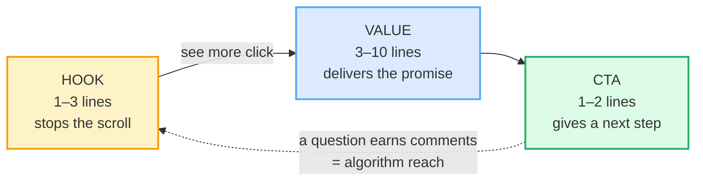

# LinkedIn / Professional Posts

> **Phase 3 · writing · bundle #54 · Days 107–108.**
> *Hook → value → CTA; professional voice.*
>
> 🔗 This bundle sits in the **writing** spine. It builds on
> [FORMAL VS CASUAL REGISTER](./FORMAL_CASUAL_REGISTER.md) (LinkedIn is
> *professional-but-not-stiff* — a register most learners mis-calibrate), on
> [IM / SLACK STYLE](./IM_SLACK_STYLE.md) (the short, scannable, line-break
> rhythm), and on [CV BULLETS](./CV_BULLETS.md) (the action-verb + metric habit
> that also powers a good "value" section).

---

## Why this bundle (read this first)

A LinkedIn post is the one piece of professional writing where **structure
beats talent**. The feed shows only the first 2–3 lines before a "see more"
cut-off, so most people decide whether to read on in the first second. That
means the **hook** (line 1) does ~80% of the work — and the **CTA** (the last
line) decides whether the post earns the comments that feed the algorithm. In
between, the **value** has to deliver on the hook's promise, or the reader feels
tricked and scrolls harder next time.

For a Vietnamese learner the trap is double. Vietnamese professional culture runs
on **modesty and "face"** — you don't sing your own praises, and you certainly
don't start a public message with "I'm excited to share…" So learners either
(a) swing **too boastful**, copying the most clichéd native openers verbatim
(*"humbled and honored to announce…"*), or (b) swing **too humble**, burying
the actual news under apologies and qualifiers until the reader gives up. The
fix is not to become a bragger — it's to **let the structure carry the
confidence** for you: a sharp hook, a useful value section, a clean CTA. The
voice can stay modest; the post still lands.

---

## 1. The hook: earn the "see more" click

LinkedIn only shows the first ~210 characters before the truncation. Your hook
has to do three things in that window: name a **specific** situation, make a
**promise** (what the reader gets), and create **tension** (a gap between what
they know and what's coming).

| Hook family | Real opener | When it works |
|---|---|---|
| The announcement | *I'm excited to share…* / *Thrilled to announce…* | genuine news only (new job, launch, funding) — otherwise it reads as filler |
| The contrarian | *Hot take:* / *Unpopular opinion:* | a real, defensible disagreement — not "[extremely popular opinion]" |
| The confessional | *I'll be honest* | lowers the guard; pairs with a vulnerability or a lesson learned |

> From `linkedin_posts_corpus.md`:
>
> | I'm excited to share… | Thrilled to announce… | Honored to… |
> |---|---|---|
> | /aɪm ɪkˈsaɪtɪd tə ˈʃeə/ | /ˈθrɪld tu əˈnaʊns/ | /ˈɒnəd/ UK · /ˈɑːnərd/ US |
>
> The announcement openers are **real and common** (Grammarly's guide quotes
> "I'm excited to share that today was my first day at [add company]!"), but
> Contentio, LinkedDraft and HookTide all name *I'm excited to share* as the
> **generic** opener to beat — it works *only* when there's genuine news behind
> it.

**The Vietnamese trap:** modesty says "don't brag," so the learner either skips
a hook entirely (the post starts mid-thought) or overcompensates with the most
grandiose cliché. The fix is the **specificity hook** — name *who* and *what*
in line one ("If you manage a team of 3+ in SaaS and your 1:1s feel like status
updates…"). Specificity is confident without being boastful.

---

## 2. The value: deliver on the promise

Once the reader clicks "see more," they want the payoff — not more tease. Three
value formats that work, all of them signposted by a short chunk:

> From `linkedin_posts_corpus.md`:
>
> - **Here's what I learned** /hɪəz wɒt aɪ ˈlɜːnd/ — hand-off from a story to the
>   takeaway.
> - **The key insight** /ðə kiː ˈɪnsaɪt/ — names the single most important
>   takeaway.
> - **Three things…** /θriː θɪŋz/ — promises a short numbered list (a
>   high-engagement format).
> - **A quick story** /ə kwɪk ˈstɔːri/ — signals a narrative format (story →
>   lesson).

The mechanism is simple: the chunk **tells the reader what they're about to
get**, so they can decide to keep reading. A post that buries the insight on
line 8 loses them by line 4. The fix: move the takeaway **up**. LinkedIn rewards
the "BLUF" instinct (bottom line up front — 🔗 [EMAIL ANATOMY](./EMAIL_ANATOMY.md))
even more than email does, because the feed is faster.

---

## 3. The CTA: give the reader somewhere to go

A post with no ending leaves momentum dead — the reader finishes, shrugs, and
scrolls. The strongest LinkedIn CTAs are **questions**, because a question earns
a **comment**, and comments are the signal the algorithm rewards.

> From `linkedin_posts_corpus.md`:
>
> | Thoughts? | Agree? | What would you add? | Drop a comment | DM me |
> |---|---|---|---|---|
> | /θɔːts/ | /əˈɡriː/ | /wɒt wʊd juː æd/ | /drɒp ə ˈkɒment/ | /ˌdiːˈem miː/ |
>
> `Thoughts?` is the shortest, most open engagement question — read aloud, it
> carries **rising intonation**. `What would you add?` is the expert's CTA: it
> flatters the reader by asking for *their* expertise. `DM me` is a soft-offer
> that moves the chat private (lead-gen without a hard sell).

**Avoid** the desperate CTA: *"Like and share if you found this useful"* reads
as needy and is named as a "what to avoid" in every writing source. A genuine
question beats a plea every time.

---

## 4. The humble-brag trap (the one opener to cut)

> From `linkedin_posts_corpus.md`:
>
> | humbled and honored |
> |---|
> | /ˈhʌmbəld ənd ˈɒnəd/ UK · /ˈhʌmbəld ənd ˈɑːnərd/ US |

This is the single most-mocked LinkedIn cliché. *"I'm so incredibly humbled and
honored to announce…"* piles two humility words on top of an announcement — and
most readers now read it as a **flex runway**, not genuine modesty. MagicPost
names it the "humbled trap"; the Social Media Butterfly Blog lists
*"I'm honored and humbled to announce…"* alongside *"I'm excited to share…"* as
the openers to delete first.

**The Vietnamese twist:** this phrase is *exactly* what a modesty-trained
learner reaches for — it feels safe and humble in Vietnamese terms ("tôi rất
vinh dự"). In English LinkedIn culture it backfires, because the pile-up of
humility words signals the opposite. The fix is to **cut the qualifier and lead
with the fact**: not *"Humbled and honored to share that I was promoted,"* but
*"Last month I stepped into the Engineering Lead role. Here's what the first 30
days taught me."* Same news, no humble-brag, a built-in value hook.

---

## 5. Cheat sheet — the ≤8 survival chunks

The Pareto set. Memorise these eight and you can assemble a structurally sound
post in two minutes — hook + value + CTA. (Every row is a corpus attestation
above.)

| # | Chunk | IPA | Why it's here |
|---|---|---|---|
| 1 | **I'm excited to share…** | /aɪm ɪkˈsaɪtɪd tə ˈʃeə/ | the default news hook — works only with genuine news behind it |
| 2 | **Thrilled to announce…** | /ˈθrɪld tu əˈnaʊns/ | the energetic news hook (funding, launch, hire) |
| 3 | **Hot take:** | /hɒt teɪk/ UK · /hɑːt teɪk/ US | the contrarian hook — labels a strong opinion up front |
| 4 | **Here's what I learned** | /hɪəz wɒt aɪ ˈlɜːnd/ | value signpost: hand-off from story to takeaway |
| 5 | **Three things…** | /θriː θɪŋz/ | value signpost: promises a short, scannable list |
| 6 | **Thoughts?** | /θɔːts/ | the shortest open CTA — rising intonation, earns comments |
| 7 | **What would you add?** | /wɒt wʊd juː æd/ | the expert's CTA — invites the reader's expertise |
| 8 | **Drop a comment** | /drɒp ə ˈkɒment/ | a direct instruction-CTA to engage |

> Open [`linkedin_posts.html`](./linkedin_posts.html) to drill these as flip
> cards, hear native clips, play the comment-thread role-play, shadow, and write
> a full post.

---

## 6. Vietnamese → English L1 pitfalls table

The "expert payoff." These are the specific interference traps a Vietnamese
speaker hits on LinkedIn writing — extend, don't replace, the seed rows from the
spec.

| Vietnamese trap (what you do) | English fix (what to do instead) |
|---|---|
| **Modesty / "face" culture** → discomfort with self-promotion; you undersell or bury the news under qualifiers | Let the **structure** carry the confidence, not the adjectives. A sharp hook + a useful value + a clean CTA is confident without bragging. State the fact, then the lesson. |
| **Overcompensate into the boastful cliché** → *"Humbled and honored to announce…"* (feels safe/modest in VN, reads as a flex in EN) | Cut the qualifier pile-up. Lead with the **fact** + a **value hook**: *"Last month I shipped X. Here's what it taught me."* No humble-brag. |
| **Pro-drop / missing subject** → *"Is good news. Want to share."* | Supply the subject + copula every time: *"**I'm** excited to share…"* 🔗 [FINAL CONSONANTS](../pronunciation/FINAL_CONSONANTS.md) covers the spoken side of this. |
| **No plural / dropped finals when read aloud** → *"Three thing I learn"* (the `-s` and the `-d` vanish) | When you narrate the post (video/reel), enforce **Three thing__s__ I learn__ed__** — /θriː θɪŋz/, /ˈlɜːrnd/. The `-s` and `-ed` carry meaning. |
| **Drops the final cluster /θɔːts/** → *"Thought?"* (the /-ts/ collapses) | Hold the cluster: **Thoughts?** /θɔːts/ with rising intonation. Drill the /-ts/ final — it's the whole CTA. |
| **"Vinh dự" → literal "honored" overuse** → *"I am honored"* in every other sentence | Reserve *honored* for genuine external recognition (award, speaking slot). For your own work, use the **fact + lesson** pattern instead. |
| **Oversharing personal detail** → a 400-word life story with no takeaway | Keep the **value > story** ratio. The story is the setup; the *Here's what I learned* is the point. Cut anything that doesn't serve the takeaway. |
| **Direct-translation formality** → *"I would like to respectfully inform that…"* (email register in a feed post) | LinkedIn is **professional-but-not-stiff**. Short sentences, line breaks, contractions (*I'm, here's, I'll*). 🔗 [FORMAL VS CASUAL REGISTER](./FORMAL_CASUAL_REGISTER.md). |
| **Question-word translation → wrong CTA** → *"What do you think?"* dropped to *"You think?"* / missing auxiliary | Build the CTA from a verified chunk: **What would you add?** /wɒt wʊd juː æd/. Keep the auxiliary *would* — it softens and invites. |
| **Hashtag stuffing** → 12 hashtags to "get reach" | **3–5 relevant hashtags** max (Contentio/MagicPost). More reads as SEO grasping. The hashtag that matters is the one naming *who the post is for*. |

---

## How to practise this bundle (the daily 20 min)

1. **READ** (5 min) — this guide, §1–§4.
2. **SHADOW** (7 min) — open `linkedin_posts.html`, drill the 8 flip cards +
   the comment-thread role-play **aloud**, exaggerating every final consonant
   (`-s`, `-ts`, `-d`) and the rising tone on `Thoughts?`.
3. **PRODUCE** (8 min) — the writing task: write **one LinkedIn post** using the
   hook → value → CTA skeleton. Read it aloud once and check every `-s`/`-ed`
   is audible.

---

## Sources

- Grammarly, "The Dos and Don'ts of LinkedIn Posting" — https://www.grammarly.com/blog/business-writing/linkedin-post/
- Contentio, "How to Write a LinkedIn Post: Hook → Value → Proof → CTA" — https://contentio.io/blog/how-to-write-linkedin-post
- MagicPost, "How to Announce a New Job on LinkedIn: 5 Templates + Real Examples" — https://magicpost.in/blog/how-to-announce-new-job-on-linkedin-(-5-pre-made-templates)
- LinkedDraft, "50 LinkedIn Hooks That Stop the Scroll" — https://www.linkeddraft.xyz/resources/50-linkedin-hooks
- The Social Media Butterfly Blog, "How to Write LinkedIn Posts People Actually Read" — https://www.socialmediabutterflyblog.com/2025/10/how-to-write-linkedin-posts-people-actually-read/
- Meet-Lea, "How to Write Engaging LinkedIn Posts: Best Practices 2026" — https://meet-lea.com/en/blog/how-to-write-engaging-linkedin-posts
- HookTide, "Content Creation — Posts, Hooks, Storytelling & Formats" — https://hooktide.io/learn/content
- Cambridge Advanced Learner's Dictionary — https://dictionary.cambridge.org/dictionary/english/{word} (entries for *excited, thrill, announce, honour, honest, learn, insight, thought, agree, add, comment, humble, hot, take, opinion, three, story*)
- Wiktionary (cross-checked IPA) — https://en.wiktionary.org/wiki/{word} (*excited* /ɪkˈsaɪ.tɪd/, *thrilled* /θɹɪld/, *thought* RP /θɔːt/, *insight* /ˈɪnsaɪt/, *honoured* RP /ˈɒnəd/ GenAm /ˈɑnɚd/)
- YouGlish (Modern IPA + native clips) — https://youglish.com/pronounce/{word}/english
- Frequency methodology: wordfrequency.info (spoken sub-corpus) — https://www.wordfrequency.info/
