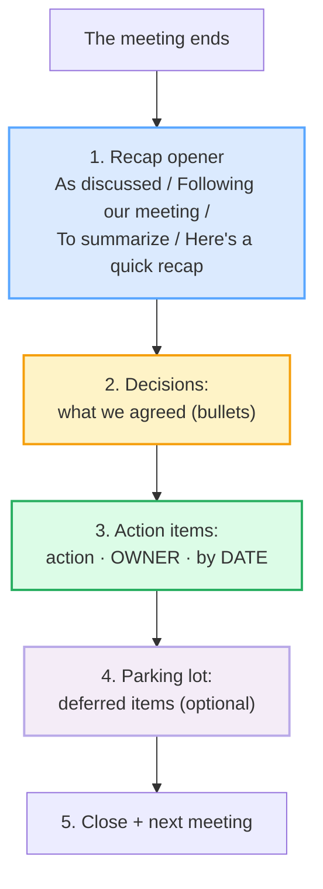

# Meeting Notes & Follow-ups

> **Phase 3 · writing/ · bundle #51 · Days 101–102.**
> *"As discussed, actions: A (owner) by (date)."*
>
> 🔗 This bundle is the **writing-mode** payoff of the meeting bundles that come
> before it: [MEETING OPENINGS](../workplace/MEETING_OPENINGS.md),
> [CONTRIBUTING IN MEETINGS](../workplace/CONTRIBUTING.md), and
> [STATUS UPDATES & STANDUPS](../workplace/STATUS_UPDATES.md). You already *say*
> the meeting — now you write the record that makes the meeting **stick**. It is
> also the accountability sibling of
> [DELEGATING & INSTRUCTIONS](../workplace/DELEGATING_INSTRUCTIONS.md) (the
> spoken "Could you own X by Y?") and of
> [REQUESTS & REMINDERS](./REQUESTS_REMINDERS.md) (the follow-up you write when
> the action item slips).

---

## Why this is the email that makes meetings real

Ask a Vietnamese professional what disappears first after a meeting, and the
answer is almost always the same: **the agreement**. The discussion happens, the
room nods, everyone leaves — and by the next morning there is no written record
of *who is doing what by when*. Vietnamese workplace practice is **relationship-
first and oral**: a verbal "em sẽ làm" (I'll do it) inside a meeting is often
considered binding enough. English-language business does not work that way.
The meeting only becomes real when a **recap email** turns the conversation into
a **scannable list of decisions, action items, owners, and deadlines**.

Two failure modes open up for a Vietnamese L1 writer:

1. **You send no follow-up at all.** The verbal agreement felt sufficient, so
   you skip the email. A week later nobody remembers who owns the task, the
   deadline passes, and — because nothing is in writing — *you* own the silence.
2. **You send a wall of narrative.** When you do write, you reproduce the whole
   meeting as a flowing story ("First we talked about… then Mai said… and we
   also discussed…"). It is warm, it is polite, and it is **useless** — a native
   reader cannot find the action inside it, so nothing moves.

English has a **dedicated skeleton for exactly this**: a labelled, bulleted
recap where every action carries an **owner** and a **date**. Master these eight
chunks and you convert every meeting you attend into tracked, accountable work.

---

## 1. The mechanism: the recap is a skeleton, not a story

An English meeting follow-up is **built from labelled sections**, not paragraphs.
The reader scans for headers — *Decisions*, *Action items*, *Next steps* — and
each bullet is a self-contained unit. Oxford lists **as discussed** as a phrase
under *discuss*; Cambridge Business English lists **To recap** / **Here's a
recap of** as the meeting-closing formula. The genre is older than email:

> From `meeting_followups_corpus.md` (§A — the recap openers, verbatim):
>
> - **As discussed** — /əz dɪˈskʌst/ (discussed /dɪˈskʌst/)
> - **Following up on our meeting** —
>   /ˈfɒl.əʊ.ɪŋ ˈʌp ɒn ˌaʊə ˈmiː.tɪŋ/ UK ·
>   /ˈfɑː.loʊ.ɪŋ ˈʌp ɑːn ˌaʊər ˈmiː.t̬ɪŋ/ US
> - **Great meeting you today** — /ɡreɪt ˈmiː.tɪŋ juː təˈdeɪ/
> - **To summarize** — /tə ˈsʌm.ər.aɪz/ UK · /tə ˈsʌm.ə.raɪz/ US
> - **Recap / Here's a quick recap** — /ˈriː.kæp/

The opener does one job: it tells the reader *this is the record*. After it,
you stop narrating and start **labelling**.

---

## 2. The accountability line: every action needs an owner AND a date

This is the single most important sentence pattern in the bundle, and the one
Vietnamese learners most often drop. Cambridge defines an **action item** as
*"a job for a particular person or group to do following a meeting."* Meeting-
management sources make the format explicit: **action · owner · date**.

> From `meeting_followups_corpus.md` (§B — the accountability structure):
>
> - **Action items:** — /ˈæk.ʃən ˌaɪ.təmz/ UK · /ˈæk.ʃən ˌaɪ.t̬əmz/ US
>   (Cambridge: *"This is the list of main action items arising out of the
>   meeting."*)
> - **Next steps:** — /nekst steps/
> - **Owner:** — /ˈəʊnə/ UK · /ˈoʊnər/ US
> - **[Task] (owner) by [date]** — the accountability bullet

The pattern is mechanical, and that is its power:

> **Action items:**
> - Draft the Q4 proposal **(Mai)** by **Thu, Oct 10**.
> - Share the budget numbers **(Quan)** by **Fri, Oct 11**.

Three components per bullet — the **action**, the **owner** (a name, never
"someone" or "the team"), and the **deadline** (a specific date, never "soon").
If any one of the three is missing, the bullet fails: an action with no owner is
nobody's job; an action with no date is a wish.

---

## 3. The labelled sections: Decisions, Parking lot

Once the recap opener is down, the rest is **headers + bullets**. The decisions
section records *what we agreed*; the parking lot records *what we deferred*.
Cambridge lists **decision** with the collocations *make / reach / come to a
decision*. The **parking lot** is the facilitation method for off-topic items
that are worth keeping but not for this meeting.

> From `meeting_followups_corpus.md` (§C — the section headers):
>
> - **Decisions:** — /dɪˈsɪʒ.ənz/
> - **We agreed that** — /wiː əˈɡriːd ðæt/
> - **Parking lot:** — /ˈpɑː.kɪŋ lɒt/ UK · /ˈpɑːr.kɪŋ lɑːt/ US
> - **Agenda items** — /əˈdʒen.də ˌaɪ.təmz/

The **parking lot** is worth a moment: it is a named place to *park* topics that
came up but are off-agenda — they are written down so the contributor feels
heard, then deferred to a future meeting or a side channel. Using it signals you
run meetings like a professional, not a free-for-all.

---

## 4. Pronunciation / delivery notes (you say these in the stand-up too)

Writing bundles still need IPA — you **read your recap aloud** in the next
stand-up, and several of these chunks you will eventually *say*. Two traps:

- **The /-ed/ in "discussed".** *Discuss* /dɪˈskʌs/ → past *discussed*
  /dɪˈskʌst/. The `-ed` is **/t/**, not a syllable — never "dis-cuss-ed". This
  is the /t/ after the voiceless /s/ cluster from
  [FINAL CONSONANTS](../pronunciation/FINAL_CONSONANTS.md). Dropping the /t/ →
  "discuss" loses the past meaning; adding a vowel → "discuss-id" sounds broken.
- **The /ʒ/ in "decision".** *Decision* /dɪˈsɪʒ.ən/ carries the voiced palato-
  alveolar fricative /ʒ/. Vietnamese has no /ʒ/, so learners de-voice it to
  /ʃ/ → "de-ci-**shun**". Keep the vocal cords **buzzing** through the /ʒ/
  (touch your throat — it should vibrate, unlike the voiceless /ʃ/).
- **US/UK vowel split in "summarize".** UK /ˈsʌm.ər.aɪz/ vs US /ˈsʌm.ə.raɪz/ —
  the unstressed vowel before `-ize` differs. Pick one variety and stay
  consistent within a message.

---

## 5. Cheat sheet — the ≤8 survival chunks

The Pareto set. Memorise these eight and you can write a scannable, accountable
recap for any meeting. (Every row is a corpus attestation above.)

| # | Chunk | IPA | Why it's here |
|---|---|---|---|
| 1 | **As discussed** | /əz dɪˈskʌst/ | the recap opener — "this is the record" |
| 2 | **Following up on our meeting** | /ˈfɒl.əʊ.ɪŋ ˈʌp ɒn ˌaʊə ˈmiː.tɪŋ/ UK · /ˈfɑː.loʊ.ɪŋ ˈʌp ɑːn …/ US | the recap trigger (email opener) |
| 3 | **Great meeting you today** | /ɡreɪt ˈmiː.tɪŋ juː təˈdeɪ/ | warm opener (client / networking meeting) |
| 4 | **To summarize / Recap:** | /tə ˈsʌm.əraɪz/ · /ˈriːkæp/ | flags "here come the main points" |
| 5 | **Decisions:** | /dɪˈsɪʒ.ənz/ | section header — what we agreed |
| 6 | **Action items:** | /ˈækʃən ˌaɪtəmz/ | section header — tasks arising |
| 7 | **[Task] (Owner) by [date]** | /… ˈoʊnər baɪ …/ US | the accountability bullet — action + owner + deadline |
| 8 | **Next steps: / Parking lot:** | /nekst steps/ · /ˈpɑːrkɪŋ lɑːt/ US | forward actions / deferred items |

> Open [`meeting_followups.html`](./meeting_followups.html) to drill these as
> flip cards, play the email role-play, shadow, and **write a full recap email**
> (recap + action items with owners + deadlines + decisions) with a
> reveal-model-answer toggle.

---

## 6. Vietnamese → English L1 pitfalls table

The "expert payoff." These are the specific interference traps a Vietnamese
speaker hits when writing meeting follow-ups — extend, don't replace, the seed
rows from the spec.

| Vietnamese trap (what you do) | English fix (what to do instead) |
|---|---|
| **Sends no follow-up at all** — a verbal "em sẽ làm" in the meeting felt binding (oral, relationship-first culture) | Send a recap email within **24 hours**. The verbal agreement is *not* the record — the email is. Open it with **As discussed / Following our meeting**, then label the rest. |
| **Writes a narrative wall** ("First we talked about… then Mai said…") instead of scannable bullets | Build a **skeleton**: labelled sections (*Decisions:*, *Action items:*, *Next steps:*) with one-line bullets. The reader scans, never reads top-to-bottom. |
| **Action with no owner** — "we'll prepare the report" (translating "chúng ta sẽ làm") | Assign a **name**, never "we" or "the team": "Draft the report **(Mai)**". An ownerless action is nobody's job. |
| **Action with no deadline** — "we'll send it soon" / "tuần sau" left vague | Attach a **specific date**: "by **Thu, Oct 10**". "Soon" is not a deadline; an English reader treats an undated action as optional. |
| **No accountability bullet at all** — recap lists what was *discussed*, never who does *what* | Convert every discussion point into **[task] (owner) by [date]**. The format is mechanical: **action · owner · date** — three components per bullet. |
| **Drops the /t/ in "discussed"** → "discuss" (loses the past tense) | Drill *discuss* /dɪˈskʌs/ → *discussed* /dɪˈskʌst/. The `-ed` is /t/, not a syllable. 🔗 [FINAL CONSONANTS](../pronunciation/FINAL_CONSONANTS.md). |
| **De-voices /ʒ/ → /ʃ/** in "decision" → "de-ci-**shun**" (Vietnamese has no /ʒ/) | Keep the vocal cords **buzzing** through /ʒ/: /dɪˈsɪʒ.ən/. Touch your throat — it vibrates on /ʒ/, not on /ʃ/. |
| **Pro-drop in writing** → "Will send report Friday." (subject omitted) | Supply the full subject + verb: "**I** will send the report on Friday." Written English is not a chat — dropped subjects read as curt. |
| **Confuses register** — stiff "Pursuant to our meeting" to a colleague, or casual "thế nhé" tone to a client | Default to the **professional-neutral** openers: *As discussed / Following our meeting / Great meeting you today*. 🔗 [FORMAL VS CASUAL REGISTER](./FORMAL_CASUAL_REGISTER.md). |
| **"Please find attached the meeting minute"** — dated, singular ("minute" instead of "minutes"/"notes") | Use modern phrasing: "Here's a quick **recap** of today's meeting" + "**Action items:**" list. Drop *pursuant to* / *minutes* unless the org specifically requires formal minutes. |

---

## How to practise this bundle (the daily 20 min)

1. **READ** (5 min) — this guide, §1–§4.
2. **SHADOW** (7 min) — open `meeting_followups.html`, drill the 8 flip cards
   + the email role-play **aloud**, paying attention to the /t/ in *discussed*
   and the /ʒ/ in *decision*.
3. **PRODUCE** (8 min) — the writing task: write a **full meeting follow-up
   email** (recap opener + decisions + action items with owners and deadlines +
   a parking-lot item). Reveal the model; check that **every** action has an
   owner **and** a date.

---

## Sources

- Cambridge Advanced Learner's Dictionary —
  https://dictionary.cambridge.org/dictionary/english/{word}
  (entries for *discuss, summarize, recap, decision, agenda, deadline, owner,
  agree*).
- Cambridge Business English Dictionary — *recap* ("To recap, …",
  "Here's a recap of …"); *action item* ("This is the list of main action items
  arising out of the meeting.").
- Cambridge Essential English Dictionary — *deadline* /ˈdedlaɪn/.
- Oxford Advanced Learner's Dictionary —
  https://www.oxfordlearnersdictionaries.com/definition/english/discuss
  (phrase *as discussed*, example "We will send you an invoice as discussed.");
  https://www.oxfordlearnersdictionaries.com/definition/english/follow-up
  (*follow-up* noun).
- Collins Easy Learning English Vocabulary — *owner* /ˈəʊnə/.
- Fellow.ai — *How to Write a Meeting Follow-Up Email* —
  https://fellow.ai/blog/meeting-follow-up-emails-and-examples/
- Koalendar — *How to Write a Follow-Up Email After a Meeting* —
  https://koalendar.com/blog/follow-up-email-after-meeting
- Otter.ai — *Meeting Notes Templates With Action Items* —
  https://otter.ai/blog/meeting-notes-templates
- Superhuman — *Meeting Recap Email Example* —
  https://blog.superhuman.com/write-the-perfect-sales-recap/
- Ludwig.guru — *"it was great meeting you today"* attestation —
  https://ludwig.guru/s/it+was+great+meeting+you+today
- Facilitator School — *What is the Parking Lot meeting method?* —
  https://www.facilitator.school/glossary/parking-lot
- Lucid Meetings — *What is a Meeting Parking Lot?* —
  https://www.lucidmeetings.com/glossary/parking-lot
- Native audio: YouGlish — https://youglish.com/pronounce/{chunk}/english/us?
- Frequency methodology: wordfrequency.info (spoken sub-corpus) —
  https://www.wordfrequency.info/
