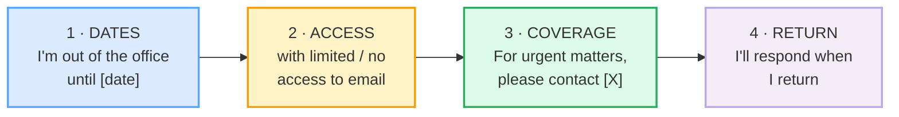

# Out-of-Office & Auto-Replies

> **Phase 3 · writing/ · bundle #63 · Days 125–126.**
> *Clear dates, coverage, alternative contact.*
>
> 🔗 This bundle is the **machine-mode** twin of two earlier speech-act bundles:
> [CLOSING CONVERSATIONS](../speech_acts/CLOSINGS.md) (the spoken "I should let
> you go") and [SCHEDULING](../speech_acts/SCHEDULING.md) (the spoken "Does
> Tuesday work?"). Here you let the *email system* close the loop for you — and
> the skill is making a **canned auto-reply read like a considerate human wrote
> it**. It also leans on [EMAIL ANATOMY](./EMAIL_ANATOMY.md) (subject + open +
> close) and [FORMAL VS CASUAL REGISTER](./FORMAL_CASUAL_REGISTER.md).

---

## Why this is the message most learners write badly

Ask a Vietnamese professional to paste their current out-of-office reply, and
two failure modes dominate. Both come from the same root — Vietnamese
auto-reply conventions are **less standardised** than the English-speaking
business world expects, so the learner falls back on either a vague Vietnamese
template translated word-for-word, or a one-line *"I'm busy, reply later"*:

1. **Vague about dates.** "I am on leave and will come back soon" — no start
   date, no end date, no day-of-week. The sender has no idea whether "soon" is
   tomorrow or next month, so they either escalate (calling a colleague) or sit
   in silence.
2. **No urgency routing.** The message omits the one line that protects
   everyone: **who to contact if this is urgent.** Without it, a genuine
   emergency sits in a dead inbox, and you — not the sender — own the missed
   deadline.

English-speaking business culture expects **four explicit slots**, in order:
**dates → access level → coverage → return expectation.** Skip any one and the
auto-reply fails its only job. The eight chunks below fill those four slots;
master them and you turn a source of email anxiety into a 30-second copy-paste.

---

## 1. The mechanism: four slots, in a fixed order

A correct auto-reply is a **form**, not a letter. It has four fields, and the
order is conventional enough that a native reader scans them in sequence:

Cambridge defines the whole genre in one line — *OOO = "a reply that can be
automatically sent to an email that you have received when you are not in the
office and cannot reply to it"* — and the four slots above are simply the
information the sender needs to act on that fact.

> From `out_of_office_auto_corpus.md` (§A — the dates, verbatim):
>
> - **I'm out of the office until [date].** —
>   /aɪm aʊt əv ðə ˈɒf.ɪs ənˈtɪl .../ UK · /... ˈɑː.fɪs .../ US
> - **I'll be away from [date] to [date].** —
>   /aɪl biː əˈweɪ frɒm ... tə .../ UK · /... frʌm .../ US
> - **returning on [date].** —
>   /rɪˈtɜː.nɪŋ ɒn .../ UK · /rɪˈtɜːrn.ɪŋ ɑːn .../ US

**The Vietnamese trap:** Vietnamese OOO messages (where they exist) lean on
shared context — *"Tôi nghỉ phép, liên hệ anh A nhé"* (I'm on leave, contact
person A) — and assume the reader knows the dates or will ask. English business
writing is the opposite: **explicit dates are professional, not blunt.** Never
ship an OOO with "soon", "next week", or no date at all. Name the day, and add
the date in brackets if there is any chance of cross-time-zone confusion.

---

## 2. Access level — tell them whether to expect a reply

The second slot calibrates the sender's expectation. Three levels, from strictest
to most available:

| Level | Phrase | What the sender hears |
|---|---|---|
| Strictest | **with no access to email** | "Do not wait for me — escalate now." |
| Default | **with limited access to email** | "I may see it, but replies will be slow." |
| Triage | **checking email periodically** | "I'll triage; genuine emergencies get answered." |
| Internal / same-day | **away from my desk** | "Back today; minor delay only." |

> From `out_of_office_auto_corpus.md` (§B — access level, verbatim):
>
> - **with limited access to email** — /wɪð ˈlɪm.ɪ.tɪd ˈæk.ses tuː ˈiː.meɪl/
> - **with no access to email** — /wɪð nəʊ ˈæk.ses tuː ˈiː.meɪl/ UK · /... noʊ .../ US
> - **checking email periodically** —
>   /ˈtʃek.ɪŋ ˈiː.meɪl ˌpɪə.riˈɒd.ɪ.kəl.i/ UK · /... ˌpɪr.iˈɑː.dɪ.kəl.i/ US

Pick the line that matches your *real* behaviour. The modern inbox norm —
flagged across business-writing corpora (Indeed, Exclaimer, Nimblework) — is
that **honest access levels build trust**: a sender who is told "no access" stops
waiting; a sender told "limited" adjusts their own deadline. Vagueness forces
them to assume the worst.

---

## 3. Coverage — route the urgent to a named colleague

The third slot is the one that **protects the sender** (they get help now) and
**protects you** (you are not the bottleneck on someone else's emergency). The
polite frame is *For urgent matters, please contact…* — the modal *please* plus
the hedge *urgent matters* keeps it from reading as "don't bother me."

> From `out_of_office_auto_corpus.md` (§C — coverage, verbatim):
>
> - **For urgent matters, please contact [X].** —
>   /fər ˈɜː.dʒənt ˈmæt.əz pliːz ˈkɒn.tækt .../ UK ·
>   /fɔːr ˈɝː.dʒənt ˈmæt̬.ɚz pliːz ˈkɑːn.tækt .../ US
> - **In my absence, [X] can help you.** —
>   /ɪn maɪ ˈæb.səns ... kæn help juː/
> - **Please reach out to [X].** — /pliːz riːtʃ aʊt tuː .../
> - **If this is urgent, please contact [X].** —
>   /ɪf ðɪs ɪz ˈɜː.dʒənt pliːz ˈkɒn.tækt .../ UK

Two notes on usage:

- **Always name a person, never a team inbox only.** "Please contact my team" is
  useless when the sender does not know who owns the work. Write
  *Please contact Mai Nguyen (mai.nguyen@…)* — name + role + contact in one line.
- **Warn the colleague first.** The coverage line is a promise to the sender that
  [X] has agreed to cover. Naming a colleague who does not know they are the
  backup is a common, relationship-damaging mistake.

---

## 4. Return + thanks — close the loop, courteously

The final slot sets the **reply expectation** (when the sender will hear back)
and acknowledges them (the courtesy *Thanks for your email*). The *respond when
I return* line is the polite way to say "do not expect a reply before [date]":
it defers the answer without ignoring the person.

> From `out_of_office_auto_corpus.md` (§D — return + thanks, verbatim):
>
> - **I'll respond to your email when I return.** —
>   /aɪl rɪˈspɒnd tuː jɔːr ˈiː.meɪl wen aɪ rɪˈtɜːn/ UK ·
>   /... rɪˈspɑːnd ... rɪˈtɜːrn/ US
> - **I'll respond as soon as I can.** —
>   /aɪl rɪˈspɒnd əz suːn əz aɪ kæn/ UK · /... rɪˈspɑːnd .../ US
> - **Thanks for your email.** — /θæŋks fər jɔːr ˈiː.meɪl/

The *Thanks for your email* opener is worth a line of its own: it is the
standard face-saving acknowledgement that **softens the auto-reply's inherent
brusqueness.** A message that opens with "I am out of the office" reads as cold;
the same message opening with "Thanks for your email. I am out of the office…"
reads as considerate. The single courtesy word does the work.

---

## 5. Pronunciation / delivery notes (for reading your own draft aloud)

Writing bundles still need IPA — you **read your OOO aloud** before switching it
on (to catch tone and typos), and these openers surface in voicemail greetings
and spoken hand-offs too. Two traps:

- **Stress on `urgent`, not on `matters`.** In *For urgent matters*, the
  information-carrying word is **UR**-gent (/ˈɜː.dʒənt/); *matters* is the
  generic noun and weakens. Stressing *MAT*-ters makes the line sound like a
  warning rather than a routing note. 🔗 See [WORD STRESS](../pronunciation/WORD_STRESS.md).
- **Reductions in the frame words.** *For* weakens to /fər/, *to* to /tə/,
  *your* to /jər/. Read the line aloud: *For urgent matters, please contact…* —
  the content words (*urgent, contact*) stay strong, the grammar words (*for,
  to*) collapse into schwas. Stiff, full-form *fɔːr … tuː* sounds robotic.
  🔗 See [LINKING](../pronunciation/LINKING.md) and [REDUCTIONS](../pronunciation/REDUCTIONS.md).

---

## 6. Cheat sheet — the ≤8 survival chunks

The Pareto set. Memorise these eight lines and you can assemble any professional
OOO by picking one from each slot. (Every row is a corpus attestation above.)

| # | Chunk | IPA | Why it's here |
|---|---|---|---|
| 1 | **I'm out of the office until [date].** | /aɪm aʊt əv ðə ˈɒf.ɪs ənˈtɪl …/ | slot 1 — the default absence line |
| 2 | **I'll be away from [date] to [date].** | /aɪl biː əˈweɪ frɒm … tə …/ | slot 1 — a full date range |
| 3 | **with limited access to email** | /wɪð ˈlɪm.ɪ.tɪd ˈæk.ses tuː ˈiː.meɪl/ | slot 2 — the default vacation access level |
| 4 | **checking email periodically** | /ˈtʃek.ɪŋ ˈiː.meɪl ˌpɪə.riˈɒd.ɪ.kəl.i/ UK · /ˌpɪr.iˈɑː.dɪ.kəl.i/ US | slot 2 — you will triage |
| 5 | **For urgent matters, please contact [X].** | /fər ˈɜː.dʒənt ˈmæt̬.ɚz pliːz ˈkɑːn.tækt …/ US | slot 3 — the standard urgent-routing line |
| 6 | **In my absence, [X] can help you.** | /ɪn maɪ ˈæb.səns … kæn help juː/ | slot 3 — formal coverage |
| 7 | **I'll respond to your email when I return.** | /aɪl rɪˈspɒnd tuː jɔːr ˈiː.meɪl wen aɪ rɪˈtɜːn/ UK | slot 4 — sets the reply expectation |
| 8 | **Thanks for your email.** | /θæŋks fər jɔːr ˈiː.meɪl/ | the courtesy opener that softens the auto-reply |

> Open [`out_of_office_auto.html`](./out_of_office_auto.html) to drill these as
> flip cards, play the email role-play, shadow, and **write your own OOO
> auto-reply** (dates + access + coverage + return) with a reveal-model-answer
> toggle.

---

## 7. Vietnamese → English L1 pitfalls table

The "expert payoff." These are the specific interference traps a Vietnamese
speaker hits when writing out-of-office and auto-reply messages — extend, don't
replace, the seed rows from the spec.

| Vietnamese trap (what you do) | English fix (what to do instead) |
|---|---|
| **Vague about dates** — "I'm on leave and will come back soon" (literal from *"tôi nghỉ phép, sẽ về sớm"*) | Name the exact day, twice: *I'm out of the office until **Monday 14 July**, returning on **Tuesday 15 July**.* Explicit dates are professional, not blunt — they are the whole point of the message. |
| **Omits the coverage line** (VN relies on the caller "knowing" to ask someone) | Always add slot 3: **For urgent matters, please contact [Name + contact].** No coverage line = a dead inbox for anything time-critical. |
| **Names a colleague who was not warned** (face-saving culture assumes the team "just covers") | Confirm with the colleague **before** you name them in the OOO. The coverage line is a promise to the sender that [X] has agreed. |
| **Too casual / missing formality** — "Hi, I busy now, reply later" (translating *"bận, rep sau nhé"*) | Match the four-slot form (§1). An auto-reply is a small formal document, not a chat. Open with *Thanks for your email* and close with a return line. |
| **Pro-drop habit in the auto-reply** — "On leave. Back Monday. Contact Mai." (subjects omitted) | Supply the full subject + verb in writing: **I am** on leave and **will be** back Monday. Dropped subjects read as curt or broken in a formal auto-reply. |
| **No tense marking** — "I out of office" / "I return on Monday" | Mark the tense and the future: **I am** out of the office; **I will return** on Monday. *Will* + base verb is the standard future for a planned return. 🔗 See [FINAL CONSONANTS](../pronunciation/FINAL_CONSONANTS.md) for the `-ed`/`-s` endings. |
| **Translates "gấp" as "urgent" with no softener** → "If urgent, contact X" (reads as a command) | Soften with *please* and the hedge *matters*: **If this is urgent, please contact [X].** The modal turns the order into a route. |
| **"Kindly contact" / "do the needful"** (dated calque from offshore-team English) | Drop *kindly*. Use **please** once, or let the *If urgent* frame carry the politeness with no extra word. |
| **Cross-cultural responsiveness mismatch** — expects the sender to "wait patiently" (VN norm: silence = patience) | English-speaking senders expect **an explicit reply timeline.** Add *I'll respond to your email when I return* so silence does not read as ignoring them. |
| **One OOO for all audiences** — same casual line to a client, a vendor, and an internal peer | Calibrate register by recipient. Client = formal (*I look forward to responding on my return*); internal peer = brief (*away from my desk, back today*). 🔗 See [FORMAL VS CASUAL REGISTER](./FORMAL_CASUAL_REGISTER.md). |
| **Forgets the timezone on a global team** — "back Monday" means Monday where? | Add the timezone or a window: *returning on Monday, July 14 (ICT)*. On a distributed team, the date alone is ambiguous. |

---

## How to practise this bundle (the daily 20 min)

1. **READ** (5 min) — this guide, §1–§4 (the four slots).
2. **SHADOW** (7 min) — open `out_of_office_auto.html`, drill the 8 flip cards
   + the email role-play **aloud**, paying attention to the stress on *UR*-gent
   and the weak forms of *for / to*.
3. **PRODUCE** (8 min) — the writing task: write a complete OOO auto-reply that
   fills all four slots (dates → access → coverage → return). Read it aloud;
   check every date is explicit, every coverage contact is named, and no slot is
   missing.

---

## Sources

- Cambridge Advanced Learner's Dictionary —
  https://dictionary.cambridge.org/dictionary/english/{word}
  (entries for *office, until, away, return, access, limited, email, matter,
  absence, coverage, contact, reach, help, desk, thank*).
- Cambridge Dictionary — *OOO* (the genre definition) —
  https://dictionary.cambridge.org/us/dictionary/english/ooo
- Cambridge Pronunciation — *urgent* (UK /ˈɜː.dʒənt/ · US /ˈɝː.dʒənt/) —
  https://dictionary.cambridge.org/us/pronunciation/english/urgent
- Cambridge Pronunciation — *periodically* (UK /ˌpɪə.riˈɒd.ɪ.kəl.i/ ·
  US /ˌpɪr.iˈɑː.dɪ.kəl.i/) —
  https://dictionary.cambridge.org/us/pronunciation/english/periodically
- Oxford Advanced Learner's Dictionary — *respond* —
  https://www.oxfordlearnersdictionaries.com/definition/english/respond
- UC Berkeley Linguistics, *Small Pronouncing Dictionary* —
  https://linguistics.berkeley.edu/~kjohnson/English_Phonetics/small_pronouncing_dictionary.html
- Indeed, *8 Examples of Out of Office Messages* —
  https://www.indeed.com/hire/c/info/7-examples-of-out-of-office-messages
- LanguageTool, *Out-of-Office Message Templates | 25 Examples* —
  https://languagetool.org/insights/post/out-of-office-message/
- Grammarly, *10 Out-of-Office Message Examples* —
  https://www.grammarly.com/blog/emailing/out-of-office-message/
- Exclaimer, *17 Out of Office Email Templates & Examples* —
  https://exclaimer.com/email-signature-handbook/out-of-office-templates/
- NetHunt CRM, *Top 6 examples of professional out-of-office messages* —
  https://nethunt.com/blog/best-out-of-office-messages/
- Nimblework, *100+ Professional Out-of-Office Email Messages* —
  https://www.nimblework.com/blog/out-of-office-messages-templates/
- LiveAgent, *Out of Office Email Templates* —
  https://www.liveagent.com/templates/out-of-office-email-templates/
- TextExpander, *15 Out of Office Email Templates* —
  https://textexpander.com/templates/out-of-office-email
- IONOS, *The perfect out of office message* —
  https://www.ionos.com/digitalguide/e-mail/technical-matters/perfect-out-of-office-message-examples-and-templates/
- Mattie James, *How To Write An Out of Office Message* —
  https://blog.mattiejames.com/how-to-write-an-out-of-office-message/
- Employsome, *Out of Office Email: 20 Templates and Examples* —
  https://employsome.com/blog/out-of-office-email/
- Making Business Matter, *Out of Office Message Templates & Examples* —
  https://www.makingbusinessmatter.co.uk/out-of-office-message/
- Chaffey College, *Automatic Replies (Out of Office)* (PDF) —
  https://www.chaffey.edu/faculty-staff/csn/docs/2019-september.pdf
- Indiana University, *"Out of the Office": Conveying Politeness Through
  Auto-Reply Email* —
  https://scholarworks.iu.edu/journals/index.php/li/article/view/37718/40232
- Native audio: YouGlish — https://youglish.com/pronounce/{chunk}/english/us?
- Frequency methodology: wordfrequency.info (spoken sub-corpus) —
  https://www.wordfrequency.info/
