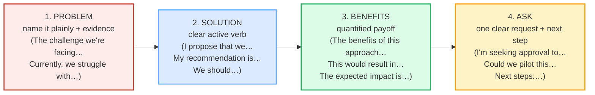

# Persuasive Writing / Proposals

> **Phase 3 · writing · bundle #59 · Days 117–118.**
> *Problem → solution → benefits → ask.*
>
> 🔗 Builds on [EMAIL ANATOMY](./EMAIL_ANATOMY.md) (the BLUF principle — a
> proposal puts the recommendation up front, not buried), on [FORMAL VS CASUAL
> REGISTER](./FORMAL_CASUAL_REGISTER.md) (a proposal sits at the formal-but-
> direct end), and on [STATUS REPORTS](./STATUS_REPORTS.md) (RAG risks +
> next steps are the same skeleton, reversed: a proposal *argues for* a change,
> a status report *reports on* one). The spoken sibling is [DIPLOMATIC
> DISAGREEMENT](../workplace/DIPLOMATIC_DISAGREEMENT.md) — same "state the case
> calmly, then the ask" discipline. Later, [UPWARD REQUESTS](./REQUESTS_TO_BOSS.md)
> (#62) reuses the "frame as benefit + options + clear ask" pattern at smaller
> scale.

---

## Why this bundle exists (read this first)

A Vietnamese learner writing an English proposal almost always makes the same
three mistakes, and all three are **rhetorical-culture** mistakes, not grammar
ones.

**Mistake 1 — indirectness buries the ask.** Vietnamese persuasive writing is
**high-context and face-preserving** (*thể diện*, harmony). The Vietnamese
convention is to circle toward the request — context first, reasoning, then a
soft, hedged ask (*"Nếu được thì…", "Anh/chị xem giúp…"*). English
proposal culture is the **opposite**: it is **deductive** — the recommendation
lands early and the ask is **explicit** ("I propose that we…", "I'm seeking
approval to…"). A proposal whose ask the reader has to *find* reads as weak or
evasive. Purdue OWL states the rule plainly: a proposal must name the problem
and its significance, then make the case.

**Mistake 2 — modesty kills the benefits.** Vietnamese culture reads
self-promotion as *kiêu ngạo* (arrogance), so the writer **under-states the
payoff** (*"Nó có thể giúp một chút"*) or lists benefits **without numbers**.
English proposal culture requires a **quantified benefit** ("This would result
in a 20% reduction…", "The expected impact is a 15-point gain…"). A benefit
with no number is read as hand-waving, not modesty.

**Mistake 3 — no clear next step.** Vietnamese letters often end on a polite,
open note (*"Mong nhận được phản hồi"*) that **does not commit anyone to
anything**. English proposals end with **one concrete ask + a next step**
("Could we pilot this for 30 days?", "Next steps: I draft the spec by Friday").
The ask is what turns a memo into a proposal.

This bundle teaches the four-move English skeleton that fixes all three:
**problem → solution → benefits → ask**.

---

## 1. The mechanism: why English proposals are deductive

Vietnamese and English persuasive writing disagree on **where the main point
goes**:

| | Vietnamese L1 convention | English target |
|---|---|---|
| Thesis placement | **Inductive** — context/reasoning first, request last, softly | **Deductive** — recommendation up front, ask explicit |
| Tone of the ask | Hedged, indirect ("Nếu được thì…") | Direct but polite ("I propose that we…", "I'm seeking approval to…") |
| Evidence | Trait-list ("hardworking, careful") | Quantified result ("a 20% reduction") |
| Closing | Open, polite, no commitment | One concrete ask + dated next step |
| Self-presentation | Modest (face, harmony) | Confident, evidence-led |

So when a Vietnamese writer maps the L1 convention onto English, the result is
a proposal where the recommendation is **buried**, the benefit is **unquantified**,
and the ask **does not exist**. The reader finishes and thinks *"so… what do
you want me to do?"* — the exact failure mode.

> From `proposals_corpus.md` (the four moves, verbatim headwords):
>
> | Move | Chunk | IPA |
> |---|---|---|
> | Problem | **The challenge we're facing** | /ðə ˈtʃælɪndʒ wɪə ˈfeɪsɪŋ/ |
> | Solution | **I propose that we** | /aɪ prəˈpəʊz ðæt wi/ (US /prəˈpoʊz/) |
> | Benefits | **The benefits of this approach** | /ðə ˈbenɪfɪts əv ðɪs əˈprəʊtʃ/ (US /əˈproʊtʃ/) |
> | Ask | **I'm seeking approval to** | /aɪm ˈsiːkɪŋ əˈpruːvl tə/ |

---

## 2. Move 1 — PROBLEM: name it, don't hint it

English proposals open by **naming the problem in one line** — not circling it.
The two highest-frequency openers:

- **"The challenge we're facing is…"** — formal, frames a difficulty as a
  shared challenge (not blame).
- **"Currently, we struggle with…"** — present-tense, anchors the pain in a
  concrete process.

> From `proposals_corpus.md`:
>
> - **The challenge we're facing** /ðə ˈtʃælɪndʒ wɪə ˈfeɪsɪŋ/ — the formal
>   opener naming a current difficulty.
> - **Currently, we struggle with** /ˈkʌrəntli wi ˈstrʌɡl wɪð/ — present-tense
>   framing of a pain point.
> - **The problem we're facing** /ðə ˈprɒbləm wɪə ˈfeɪsɪŋ/ — the standard
>   problem-statement opener.
> - **The issue is** /ði ˈɪʃuː ɪz/ — a blunt one-line problem statement.

**The Vietnamese trap:** the L1 instinct is to soften ("There might be a small
difficulty…") or to delay the problem to paragraph three. English readers want
the problem in **sentence one**, with a number if possible (*"turnover hit 22%
last quarter"*).

---

## 3. Move 2 — SOLUTION: lead with an active verb

This is the move that makes it a *proposal*. The recommendation uses a
**clear, active verb** — `propose`, `recommend`, `should` — placed early.

> From `proposals_corpus.md`:
>
> - **I propose that we** /aɪ prəˈpəʊz ðæt wi/ (US /prəˈpoʊz/) — the canonical
>   proposal-move opener (a subjunctive verb follows: *"I propose that we
>   pilot this"*).
> - **We should** /wi ʃəd/ — the shortest recommendation verb.
> - **My recommendation is** /maɪ ˌrekəmenˈdeɪʃn ɪz/ — a noun-headed, confident
>   recommendation.
> - **The solution is to** /ðə səˈluːʃn ɪz tə/ — the problem→solution bridge.

**Pinned real example (sanity-check the attestation):** the Oxford Advanced
Learner's Dictionary entry for **propose** carries the grammar pattern
**`propose that…`** with the real sentence *"She proposed that the book be
banned."* — so `I propose that we…` is the first-person-plural instantiation of
a dictionary-attested pattern, not an invented phrase. IPA `/prəˈpəʊz/` (UK),
US `/prəˈpoʊz/`, fetched from the Oxford entry on 2026-06-23.

**The Vietnamese trap:** the L1 instinct is to bury the recommendation
(*"Có lẽ chúng ta có thể cân nhắc…"* → "Maybe we could consider…"). English
readers read a hedged recommendation as **no recommendation**. The fix is not
to be rude — it is to let the verb carry the confidence and keep one softener
at most (*"I propose that we pilot this"* — confident; *"I was wondering if
maybe we could possibly consider…"* — broken).

---

## 4. Move 3 — BENEFITS: quantify, don't assert

The move Vietnamese L1 writers omit most. English proposals **quantify** the
payoff — a number, a percentage, a concrete outcome.

> From `proposals_corpus.md`:
>
> - **The benefits of this approach** /ðə ˈbenɪfɪts əv ðɪs əˈprəʊtʃ/ (US
>   /əˈproʊtʃ/) — the standard benefits-statement opener.
> - **This would result in** /ðɪs wʊd rɪˈzʌlt ɪn/ — the conditional benefit
>   verb (past-tense hedged = "this is a projection, not a promise").
> - **The expected impact is** /ði ɪkˈspektɪd ˈɪmpækt ɪz/ — the
>   quantified-impact opener.
> - **The ROI** /ði ɑːr aɪ ˈoʊ/ — the return-on-investment headline.

**Pinned real example (sanity-check):** the Oxford *benefit* entry carries the
real sentence *"the benefits of modern medicine"* and *"This deal will offer
major benefits to industrialists"* — the `the benefits of [X]` pattern is
dictionary-attested, and `this approach` is the Oxford *approach* example
collocation (*"We need to adopt a new approach to the problem"*). IPA
`benefit` /ˈbenɪfɪt/, `approach` /əˈprəʊtʃ/ (US /əˈproʊtʃ/), fetched 2026-06-23.

**The Vietnamese trap:** the L1 modesty instinct produces *"It might help a
little"* or a benefit with no number. English readers want *"This would result
in a 20% reduction in turnover"* — number first. No number = no credibility.

---

## 5. Move 4 — ASK: one clear request + a next step

The move that turns a memo into a proposal. End with **one concrete ask** and
**one dated next step**.

> From `proposals_corpus.md`:
>
> - **I'm seeking approval to** /aɪm ˈsiːkɪŋ əˈpruːvl tə/ — the formal,
>   confident ask.
> - **I'd like your sign-off on** /aɪd laɪk jɔː ˈsaɪn ɒf ɒn/ — a confident
>   but warmer ask.
> - **Could we pilot this** /kʊd wi ˈpaɪlət ðɪs/ — a low-risk, option-giving
>   ask (the "pilot" is the single most persuasive proposal move).
> - **Next steps** /nekst steps/ — the standard closing header.

**The Vietnamese trap:** the L1 closing is polite and open (*"Mong nhận được
phản hồi"*). English readers want to know **exactly what you want them to do,
by when**. A proposal that ends "please consider" commits no one to anything.

---

## 6. Cheat sheet — the ≤8 survival chunks

The Pareto set. Drill these eight until you can drop them into any proposal.
(Every row is a corpus attestation above.)

| # | Chunk | IPA | Why it's here |
|---|---|---|---|
| 1 | **The challenge we're facing** | /ðə ˈtʃælɪndʒ wɪə ˈfeɪsɪŋ/ | problem-move opener — names it, no blame |
| 2 | **Currently, we struggle with** | /ˈkʌrəntli wi ˈstrʌɡl wɪð/ | present-tense pain, concrete process |
| 3 | **I propose that we** | /aɪ prəˈpəʊz ðæt wi/ (US /prəˈpoʊz/) | the canonical proposal verb — PINNED |
| 4 | **My recommendation is** | /maɪ ˌrekəmenˈdeɪʃn ɪz/ | noun-headed confident recommendation |
| 5 | **The benefits of this approach** | /ðə ˈbenɪfɪts əv ðɪs əˈprəʊtʃ/ | benefits-move opener — PINNED |
| 6 | **This would result in** | /ðɪs wʊd rɪˈzʌlt ɪn/ | conditional benefit verb (hedged projection) |
| 7 | **I'm seeking approval to** | /aɪm ˈsiːkɪŋ əˈpruːvl tə/ | the clear ask — formal, confident |
| 8 | **Next steps** | /nekst steps/ | the closing header that commits |

> Open [`proposals.html`](./proposals.html) to drill these as flip cards, hear
> native clips, play the role-play, shadow, and write.

---

## 7. Vietnamese → English L1 pitfalls table

The "expert payoff." These are the specific interference traps a Vietnamese
writer hits on proposals — extend, don't replace, the seed rows from the spec.

| Vietnamese trap (what you do) | English fix (what to do instead) |
|---|---|
| **Inductive structure buries the recommendation** — context for 3 paragraphs, ask at the very end, softly | **Deductive**: put the recommendation in the first or second sentence. BLUF — *"I propose that we pilot remote work"* — then justify. 🔗 See [EMAIL ANATOMY](./EMAIL_ANATOMY.md). |
| **Hedges the ask away** — *"Nếu được thì…"* → "If possible, maybe you could consider…" | Make **one explicit ask**: *"I'm seeking approval to…"* / *"Could we pilot this…"*. One softener max; let the verb carry it. |
| **Modesty → under-quantifies benefits** — *"nó giúp một chút"* / lists traits not numbers | Quantify the payoff: *"This would result in a 20% reduction"* / *"The expected impact is +15 points"*. No number = no credibility. |
| **No concrete next step** — ends "mong nhận được phản hồi" (please reply) | End with **one dated next step**: *"Next steps: I draft the spec by Friday."* The ask is what makes it a proposal. |
| **Face-saving softens the problem** — won't name the difficulty plainly | Name it in sentence one: *"The challenge we're facing is…"* / *"Currently, we struggle with…"*. Framing it as a shared *challenge* (not blame) keeps face while staying direct. |
| **Generic trait-list, no evidence** — "hardworking, responsible, careful" | Replace traits with **one quantified result**: *"cut churn by 18%"*. Evidence > adjectives. 🔗 See [CV / RÉSUMÉ BULLETS](./CV_BULLETS.md). |
| **Translates L1 formal filler** — "Kính gửi… Trân trọng…" word-for-word into stiff English | Use the **proposal register**, not ceremonial filler: *"I propose… The benefits… I'm seeking approval…"*. Formal ≠ ornate. |
| **Over-hedges with "I think / maybe"** — *"I think maybe it could possibly help"* | Calibrate to **one hedge**: *"This would likely result in…"*. Three hedges in one clause reads as no confidence. 🔗 See [EDITING: HEDGING](./EDITING_HEDGING.md) (#61). |
| **Copula / article / plural slips carry into writing** — "it good idea", "we should do pilot program" | Proofread the proposal for **dropped articles, missing plurals, no copula** — the spoken L1 traps (🔗 [FINAL CONSONANTS](../pronunciation/FINAL_CONSONANTS.md) §6) leak into writing too. |

---

## How to practise this bundle (the daily 20 min)

1. **READ** (5 min) — this guide, §1–§5.
2. **SHADOW** (7 min) — open `proposals.html`, drill the 8 flip cards + the
   role-play **aloud**; exaggerate the stress on *propose*, *recommendation*,
   *benefits*, *approval*.
3. **PRODUCE** (8 min) — the writing task: write a **mini-proposal** (problem
   + solution + benefits + ask), one sentence per move, with at least **one
   number** in the benefits. Then reveal the model answer and self-score
   against the 4-move skeleton.

---

## Sources

- Oxford Advanced Learner's Dictionary —
  https://www.oxfordlearnersdictionaries.com/definition/english/{propose,recommendation,approval,benefit,approach,impact,solution,challenge,struggle,problem,issue,result_2,retention,turnover,pilot_3,sign-off,next,should}
  (each headword fetched 2026-06-23; the `propose that…`, `the benefits of…`,
  `seek approval`, `propose a solution` patterns are dictionary-attested).
- Cambridge Advanced Learner's Dictionary —
  https://dictionary.cambridge.org/dictionary/english/{propose,approach,benefit}
  (US IPA variants cross-checked).
- Purdue OWL, "Academic Proposals" —
  https://owl.purdue.edu/owl/general_writing/academic_writing/academic_proposals/index.html
- Manchester Academic Phrasebank — https://www.phrasebank.manchester.ac.uk/
  (Recommending / Being cautious / Describing functions).
- University of Toronto Writing, "Proposals" —
  https://advice.writing.utoronto.ca/types-of-writing/proposals/
- Harvard Office of Career Services — https://ocs.fas.harvard.edu/
- Contrastive-rhetoric background (Kaplan; Connor) — East-Asian inductive vs
  English deductive thesis placement; Hofstede high-context / face dimensions
  applied to Vietnamese L1 persuasive writing.
- Native audio: YouGlish — https://youglish.com/pronounce/{headword}/english/us?
- Frequency methodology: wordfrequency.info (spoken sub-corpus) —
  https://www.wordfrequency.info/
