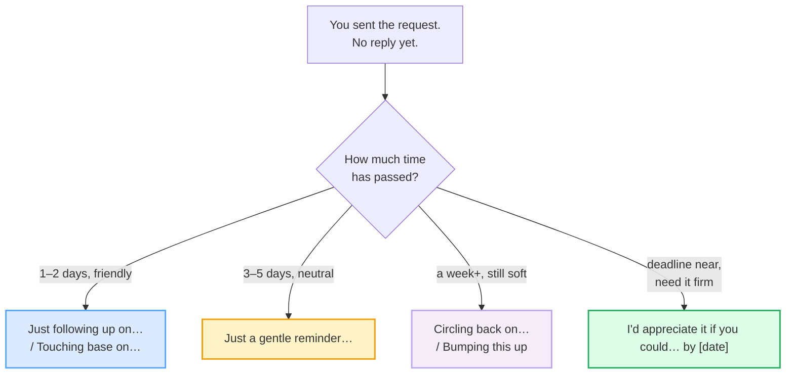

# Requests & Reminders

> **Phase 3 · writing/ · bundle #48 · Days 95–96.**
> *"Just a gentle nudge on…" / "Could you… by Friday?"*
>
> 🔗 This bundle is the **writing-mode** payoff of two earlier speech acts:
> [REQUESTING & OFFERING](../speech_acts/REQUESTING_OFFERING.md) (the spoken
> "Could you…?" and "Shall I…?") and
> [DELEGATING & INSTRUCTIONS](../workplace/DELEGATING_INSTRUCTIONS.md) (the
> spoken "Could you own X by Y?"). Here you write the same requests down — and
> then you learn the part speaking rarely teaches: **how to remind someone who
> has not replied, without losing the relationship.**

---

## Why this is the highest-stakes email you'll write

Ask any Vietnamese professional what English message they dread composing, and
the answer is almost always the same: **the follow-up**. The first request is
easy — you ask for the report, the signature, the file. The problem is day four,
when the reply has not come. Now you must write again, and two failure modes
open up:

1. **You never follow up at all.** Vietnamese workplace culture is strongly
   *indirect and face-saving*; reminding someone — especially a senior — can
   feel like causing them to "mất mặt" (lose face). So you wait. The deadline
   slips. The outcome is lost, and you, not the silent recipient, own the
   failure.
2. **You follow up too bluntly.** Frustrated, you write something close to a
   literal translation of "bạn chưa làm" — *you didn't do it* — and the email
   reads as an accusation. The relationship takes a hit, and the work still
   doesn't move faster.

English has a **dedicated politeness formula for exactly this gap**: a family of
"gentle nudge" openers that remind *the inbox*, not the person. They work because
they **separate the act from the actor** — the email "got lost", the thread
"sank", you are "circling back" to a *topic* rather than calling out a *failure.
Master these eight chunks and you convert your biggest source of email anxiety
into routine, repeatable writing.

---

## 1. The mechanism: indirectness as the softener

English softens a written request the same way it softens a spoken one — by
**burying the imperative under a modal verb** and making the hearer the subject.
A direct command (*Send the file by Friday*) becomes a modal question (*Could you
send the file by Friday?*). The grammar is doing the politeness work for you: the
modal *could/would* is hypothetical, so the request reads as "would it be
possible" rather than "I order you". Cambridge Grammar — *Requests* states it
directly:

> We usually ask for something in a polite and indirect way, for example, using
> *can*, *could*, *would you mind if* and *may*.

> From `requests_reminders_corpus.md` (§A — the request openers, verbatim):
>
> - **Could you … by Friday?** — /ˈkʊd juː ... baɪ ˈfraɪ.deɪ/ (could strong
>   /kʊd/, weak /kəd/)
> - **Would you be able to …?** — /ˈwʊd juː biː ˈeɪ.bəl tuː .../ (would strong
>   /wʊd/, weak /wəd/)
> - **I'd appreciate it if you could …** — /aɪd əˈpriː.ʃi.eɪt ɪt ɪf juː kʊd .../
> - **When you get a chance, could you …?** —
>   /wen juː ɡet ə ˈtʃɑːns kʊd juː .../ UK · /... ˈtʃæns .../ US

**The Vietnamese trap:** Vietnamese has no modal-verb politeness system of this
kind. Politeness is carried by pronoun choice (*anh/chị/em/ông/bà*) and
particles (*nhé, ạ, giúp*). Translated literally, "gửi tôi file nhé" becomes
"send me the file" — grammatically fine, pragmatically a command. The fix is to
**prepend a modal question frame** every time: *Could you / Would you be able
to / Would you mind*.

---

## 2. The reminder formula: remind the inbox, not the person

The second skill — and the one that makes this bundle a *writing* bundle rather
than a speech-acts one — is the **gentle nudge**. The pragmatic trick is to
frame the silence as a property of *the email system* or *the topic*, never as a
failing of the recipient. Five openers do this work; pick by register and by how
much time has passed.

> From `requests_reminders_corpus.md` (§B — the follow-up openers, verbatim):
>
> - **Just a gentle reminder** — /dʒʌst ə ˈdʒen.təl rɪˈmaɪn.dər/ UK ·
>   /dʒʌst ə ˈdʒen.t̬əl rɪˈmaɪn.dɚ/ US
> - **Just following up on …** — /dʒʌst ˈfɒl.əʊ.ɪŋ ˈʌp ɒn .../ UK ·
>   /dʒʌst ˈfɑː.loʊ.ɪŋ ˈʌp ɑːn .../ US
> - **Circling back on …** — /ˈsɜː.kəl.ɪŋ ˈbæk ɒn .../ UK ·
>   /ˈsɝː.kəl.ɪŋ ˈbæk ɑːn .../ US
> - **Bumping this up** — /ˈbʌm.pɪŋ ðɪs ˈʌp/
> - **Touching base on …** — /ˈtʌtʃ.ɪŋ ˈbeɪs ɒn .../ UK ·
>   /ˈtʌtʃ.ɪŋ ˈbeɪs ɑːn .../ US

Notice the **shared grammar of every nudge**: it is a **present participle**
(*following / circling / bumping / touching*) with **no "you"** as object. The
sentence is about *what I am doing* (returning to the topic), not about *what you
failed to do*. That single grammatical choice is what keeps the email from
reading as an accusation.

---

## 3. The politeness ladder — one ask, five rungs

The same request, escalating in firmness. A fluent writer **starts low and climbs
only as far as the silence forces**. Do not skip rungs — jumping from "I was
wondering" straight to "I need this today" reads as emotionally unstable.

| Rung | Opener | Use when… |
|---|---|---|
| 1 — most indirect | **I was wondering if you could …** | asking a favour; senior recipient; no urgency |
| 2 — low pressure | **When you get a chance, could you …?** | no deadline; peer; friendly tone |
| 3 — neutral + deadline | **Could you … by Friday?** | the default work request |
| 4 — first nudge | **Just a gentle reminder that …** | 3–5 days of silence; same deadline |
| 5 — firm + grateful | **I'd appreciate it if you could … by [date].** | deadline near; final reminder before escalating |

> From `requests_reminders_corpus.md` (§C — the ladder, verbatim IPA per rung):
>
> - **I was wondering if you could …** — /aɪ wəz ˈwʌn.dər.ɪŋ ɪf juː kʊd .../
> - **When you get a chance, could you …?** — /wen juː ɡet ə ˈtʃɑːns kʊd juː .../
> - **Could you … by Friday?** — /ˈkʊd juː ... baɪ ˈfraɪ.deɪ/
> - **Just a gentle reminder that …** — /dʒʌst ə ˈdʒen.təl rɪˈmaɪn.dər ðæt .../
> - **I'd appreciate it if you could … by [date].** —
>   /aɪd əˈpriː.ʃi.eɪt ɪt ɪf juː kʊd ... baɪ .../

---

## 4. Pronunciation / delivery notes (for reading your own email aloud)

Writing bundles still need IPA — you **read your drafts aloud** to catch tone,
and the openers above are chunks you will eventually *say* in meetings and calls.
Two traps:

- **Weak forms of the modals.** *Could* and *would* are almost never said with
  their dictionary strong form in connected speech. Strong /kʊd/ weakens to
  /kəd/; /wʊd/ → /wəd/. Read your request aloud: if you are hitting a clear
  "wood" every time, it sounds stiff. Let the modal weaken into the schwa and the
  sentence softens with it.
- **Stress on the softener, not the verb.** In *"Just a gentle reminder"*, the
  stress falls on **GEN**-tle (the softener), not on re-**MIND**-er. Stressing
  the wrong syllable flips the tone from "no worries" to "I am reminding you".
  🔗 See [WORD STRESS](../pronunciation/WORD_STRESS.md).

---

## 5. Cheat sheet — the ≤8 survival chunks

The Pareto set. Memorise these eight openers and you can write 90% of the
request/reminder emails you will ever send. (Every row is a corpus attestation
above.)

| # | Chunk | IPA | Why it's here |
|---|---|---|---|
| 1 | **Could you … by Friday?** | /ˈkʊd juː ... baɪ ˈfraɪ.deɪ/ | the default polite request + soft deadline |
| 2 | **Would you be able to …?** | /ˈwʊd juː biː ˈeɪ.bəl tuː .../ | more indirect; "are you in a position to?" |
| 3 | **I'd appreciate it if you could …** | /aɪd əˈpriː.ʃi.eɪt ɪt ɪf juː kʊd .../ | formal; thanks built into the ask |
| 4 | **When you get a chance, could you …?** | /wen juː ɡet ə ˈtʃɑːns kʊd juː .../ | low-pressure; no deadline |
| 5 | **Just a gentle reminder** | /dʒʌst ə ˈdʒen.təl rɪˈmaɪn.dər/ | the face-saving first nudge |
| 6 | **Just following up on …** | /dʒʌst ˈfɒl.əʊ.ɪŋ ˈʌp ɒn .../ | the default neutral follow-up |
| 7 | **Circling back on …** | /ˈsɜː.kəl.ɪŋ ˈbæk ɒn .../ | returning to a topic; corporate register |
| 8 | **Bumping this up** | /ˈbʌm.pɪŋ ðɪs ˈʌp/ | moves the thread to the top of the inbox |

> Open [`requests_reminders.html`](./requests_reminders.html) to drill these as
> flip cards, play the email role-play, shadow, and **write both emails** (a
> request + a reminder) with a reveal-model-answer toggle.

---

## 6. Vietnamese → English L1 pitfalls table

The "expert payoff." These are the specific interference traps a Vietnamese
speaker hits when writing requests and reminders — extend, don't replace, the
seed rows from the spec.

| Vietnamese trap (what you do) | English fix (what to do instead) |
|---|---|
| **No modal politeness system** → "send me the file" reads as a command (literal from "gửi tôi file nhé") | Prepend a modal-question frame every time: *Could you / Would you be able to / Would you mind*. The grammar does the softening. |
| **Face-saving culture → never follow up** (reminding a senior = causing "mất mặt") | Use the **gentle nudge** formula — it reminds *the inbox*, not the person: *Just following up / Just a gentle reminder / Circling back*. Frame the silence as the email getting lost, not the person failing. |
| **Blunt follow-up when finally pushed** → "you didn't do it" (literal from "bạn chưa làm") | Never put "you didn't" in a reminder. Use a present-participle opener with **no "you" object**: *I'm following up / I'm circling back*. The sentence is about *your* action, not *their* failure. |
| **Drops the deadline** (Vietnamese requests rely on shared context, not explicit dates) | State the date explicitly and attach it to the modal: *Could you … by **Friday**?* Explicit deadlines are not rude in English business writing — they are professional. |
| **Over-apologises** → "Sorry to bother you, but sorry, could you sorry…" (translating "xin lỗi, phiền anh/chị…") | One softener is enough. *Just a gentle reminder* OR *I'd appreciate it if* — not both stacked. Excessive apology reads as insecurity, not politeness. |
| **Pro-drop habit** → "Is good. Will send Friday." (subject omitted) | Supply the full subject + modal in email: **I** will send it on Friday. Written English is not a chat — dropped subjects read as curt or broken. |
| **"Kindly" overuse** → "Kindly do the needful" (Indian-English calque spreading via offshore teams) | Drop *kindly*; it is dated and reads as stiff. Use *please* once, or let the modal (*could you*) carry the politeness with no "please" at all. |
| **Translates "nhắc" as "remind" with no softener** → "I remind you that…" (sounds like a teacher scolding) | Always qualify: *Just a gentle reminder / a quick reminder / a friendly reminder*. The adjective softens what is otherwise a reproach. |
| **Confuses register** — uses casual "Hey, send this" to a client, or stiff "I hereby request" to a colleague | Match the ladder (§3) to the recipient. Peer = rung 2; senior = rung 1 or 3; client = rung 3. 🔗 See [FORMAL VS CASUAL REGISTER](./FORMAL_CASUAL_REGISTER.md). |
| **No past-tense marker on the original request** → "I send you last week, you not reply" | Mark the tense: **I sent** you the request last week; I haven't heard back. Past morphology signals the timeline clearly without emotion. 🔗 See [FINAL CONSONANTS](../pronunciation/FINAL_CONSONANTS.md) for the `-ed`. |

---

## How to practise this bundle (the daily 20 min)

1. **READ** (5 min) — this guide, §1–§4.
2. **SHADOW** (7 min) — open `requests_reminders.html`, drill the 8 flip cards
   + the email role-play **aloud**, paying attention to the weak modal forms.
3. **PRODUCE** (8 min) — the writing task: write **(a)** a polite request email
   and **(b)** a gentle reminder email for the same ask. Read both aloud; check
   every modal is present and no "you didn't" sneaked in.

---

## Sources

- Cambridge Advanced Learner's Dictionary —
  https://dictionary.cambridge.org/dictionary/english/{word}
  (entries for *appreciate, gentle, reminder, nudge, chance, deadline, could,
  would*).
- Cambridge Learner's Dictionary (`could` strong /kʊd/, weak /kəd/) —
  https://dictionary.cambridge.org/dictionary/learner-english/could
- Cambridge Grammar — *Requests* —
  https://dictionary.cambridge.org/us/grammar/british-grammar/requests
  ("We usually ask for something in a polite and indirect way, using *can*,
  *could*, *would you mind if* and *may*").
- Oxford Advanced Learner's Dictionary (`reminder`) —
  https://www.oxfordlearnersdictionaries.com/definition/english/reminder
- Collins English Dictionary (`follow up`, `bump`) —
  https://www.collinsdictionary.com/dictionary/english/follow-up
- Merriam-Webster (`touch base` idiom) —
  https://www.merriam-webster.com/dictionary/touch%20base
- Iowa State University, *Teaching Pronunciation with Confidence* §7.2 (modal
  weak forms) — https://iastate.pressbooks.pub/teachingpronunciation/chapter/7-rhythm/
- Cambridge C2 Word List (Cambridge-Buckcenter PDF) — `appreciate`
  /əˈpriː.ʃi.eɪt/.
- Universität Hamburg, *English Dictionary of Business Terminology* (PDF) —
  `nudge` /nʌdʒ/.
- British Council *LearnEnglish* — *An email request* (C1) —
  https://learnenglish.britishcouncil.org/free-resources/writing/c1/email-request
- HubSpot Sales Blog — *How to send a follow-up email after no response* —
  https://blog.hubspot.com/sales/how-to-send-a-follow-up-email-after-no-response
- CNBC, *Stop 'just following up'—use 'powerful messages'* (2025) —
  https://www.cnbc.com/2025/07/10/stop-just-following-upto-get-responses-asap-use-powerful-messages.html
- NPR, *Why business speak is so irritating* (2023) —
  https://www.npr.org/2023/09/05/1197583526/workplace-jargon-survey-advice
- Native audio: YouGlish — https://youglish.com/pronounce/{chunk}/english/us?
- Frequency methodology: wordfrequency.info (spoken sub-corpus) —
  https://www.wordfrequency.info/
