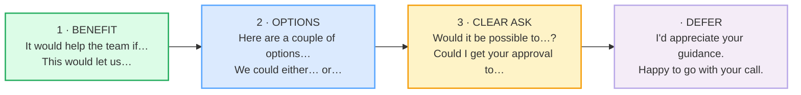

# Upward Requests (to manager)

> **Phase 3 · writing · bundle #62 · Days 123–124.**
> *Frame as benefit + options + clear ask.*
>
> 🔗 This bundle is the **upward** counterpart to
> [PROPOSALS](./PROPOSALS.md) (which pitches to a *decision body* with a
> problem→solution→benefits→ask skeleton). Here the audience is **one person
> above you** — so the moves are lighter, more deferential, and the trap is
> different: Vietnamese L1 writers either **never make the ask** (too much
> deference → nothing happens) or **demand with no options** (too blunt →
> face lost). Also builds on [REQUESTS & REMINDERS](./REQUESTS_REMINDERS.md)
> (downward/lateral requests) and [DIPLOMATIC DISAGREEMENT](../workplace/DIPLOMATIC_DISAGREEMENT.md).

---

## Why this bundle exists (read this first)

Vietnamese workplace culture is **high power-distance** (Hofstede ≈70): a junior
who speaks plainly to a senior risks *mất thể diện* — losing face for both
sides. So requests to a manager are either **wrapped in so many hedges the ask
disappears** ("Nếu được thì… anh xem giúp em… nếu có thể…") or, when the pressure
finally breaks through, **blurted as a demand** with no benefit frame and no
options. Both fail in an English-speaking workplace.

English "managing up" solves this with a three-move skeleton that is
**deferential AND explicit**:

> **benefit** (why it helps the team) + **options** (lower the decision cost) +
> **clear ask** (one unambiguous request) + **defer** (hand the call back).

The genius of the skeleton is that **options and the defer-move carry the
respect**, so the ask itself can be direct. You do not have to choose between
polite and clear — English lets you be both at once.

---

## 1. The three-move skeleton

The order is not decorative. **Benefit first** because a manager triages by
"does this move my goals forward?" — so justify before you ask. **Options next**
because a forced binary ("approve this or else") reads as an ultimatum; two
concrete choices read as help. **Clear ask last** because by then the manager is
already leaning yes — you just name the action. **Defer** closes the loop and
protects face: the decision is still *theirs*.

---

## 2. Move 1 — Frame as benefit

Lead with why this helps the **team** (or the manager's stated goals), never
with your personal need. The conditional `would` is doing real work: it
projects the benefit without claiming it as done.

> From `requests_to_boss_corpus.md`:
>
> - **It would help the team if** /ɪt wʊd help ðə tiːm ɪf/ — the canonical
>   benefit-frame opener
> - **This would let us** /ðɪs wʊd let ʌs/ — benefit = enables an outcome
> - **The benefit would be** /ðə ˈbenɪfɪt wʊd biː/ — names the payoff
> - **This would improve** /ðɪs wʊd ɪmˈpruːv/ — benefit = raises a metric

**The Vietnamese trap:** the L1 instinct is to frame the request as *your*
problem — "Em bị kẹt…" (I'm stuck), "Em cần…" (I need). In English, re-cast it
as the **team's** gain. "It would help the team if we got the licence" lands;
"I need the licence" reads as complaint.

---

## 3. Move 2 — Offer options

Present **two concrete alternatives** so the manager chooses rather than
rubber-stamps. This is the single highest-leverage managing-up habit: it
reduces the manager's cognitive load *and* signals you've done the thinking.

> From `requests_to_boss_corpus.md`:
>
> - **Here are a couple of options** /hɪər ər ə ˈkʌpl əv ˈɒpʃnz/ — the
>   options-move opener
> - **We could either… or…** /wi kʊd ˈaɪðər… ɔːr/ — the choice frame
> - **Option A vs Option B** — the labelled-two-choices shorthand

> From `requests_to_boss_corpus.md` (the PINNED attestation, verbatim):
>
> > Cambridge *either* entry: *"We can **either** eat now **or** after the
> > show."* — the `either… or…` frame is the dictionary's own example sentence.

**The Vietnamese trap:** the L1 instinct under power-distance is to bring the
manager an **open question** ("Anh thấy sao?") with no options prepared —
forcing the senior to do the work. In English upward requests, *bring the
options, let the manager pick*. Open questions read as "you decide, I haven't".

---

## 4. Move 3 — Clear ask + defer

After the benefit and the options, make **one explicit ask**, modal-softened
but unambiguous. Then **defer** — hand the decision back so it stays an upward
request, not a demand.

> From `requests_to_boss_corpus.md`:
>
> - **Would it be possible to…?** /wʊd ɪt bi ˈpɒsəbəl tə/ — the most deferential
>   clear-ask frame
> - **Could I get your approval to** /kʊd aɪ get jɔːr əˈpruːvl tə/ — confident
>   but respectful
> - **I'd like to request** /aɪd laɪk tə rɪˈkwest/ — direct, formal
> - **I'd appreciate your guidance on** /aɪd əˈpriːʃieɪt jɔː ˈɡaɪdns ɒn/ — the
>   defer-to-expertise softener
> - **What do you think?** /wɒt duː juː θɪŋk/ — the open-the-decision close

> From `requests_to_boss_corpus.md` (the PINNED attestation, verbatim):
>
> > Cambridge *possible* entry: *"**Would it be possible to** turn the music
> > down a little?"* — the request frame is the dictionary's own example.

**The Vietnamese trap (the core failure):** learners swing to one of two
extremes —
1. **Too deferential**: stack three hedges ("If possible, maybe you could
   perhaps consider…") until the ask evaporates. The manager can't even tell
   what's being requested. *Fix:* one softener max (`Would it be possible…`),
   then let the verb carry the request.
2. **Too blunt**: no benefit frame, no options, just "I want X by Friday". Reads
   as a demand from someone who doesn't understand hierarchy. *Fix:* prepend
   the benefit + options; the ask stays the same but now reads as help.

---

## 5. Cheat sheet — the ≤8 survival chunks

The Pareto set. Drill these eight until the three-move skeleton is automatic.
(Every row is a corpus attestation above.)

| # | Chunk | IPA | Why it's here |
|---|---|---|---|
| 1 | **It would help the team if…** | /ɪt wʊd help ðə tiːm ɪf/ | benefit-frame opener — PINNED · justifies before asking |
| 2 | **Here are a couple of options…** | /hɪər ər ə ˈkʌpl əv ˈɒpʃnz/ | options-move opener — lowers decision cost |
| 3 | **We could either… or…** | /wi kʊd ˈaɪðər… ɔːr/ | the choice frame — two concrete alternatives |
| 4 | **Would it be possible to…?** | /wʊd ɪt bi ˈpɒsəbəl tə/ | the deferential clear ask — PINNED · unambiguous but soft |
| 5 | **Could I get your approval to…** | /kʊd aɪ get jɔːr əˈpruːvl tə/ | confident-but-respectful ask (noun-led) |
| 6 | **I'd like to propose…** | /aɪd laɪk tə prəˈpəʊz/ | the proposal-move opener — collaborative confidence |
| 7 | **I'd appreciate your guidance on…** | /aɪd əˈpriːʃieɪt jɔː ˈɡaɪdns ɒn/ | the defer-move — hands the call back, saves face |
| 8 | **I was hoping to…** | /aɪ wəz ˈhəʊpɪŋ tə/ | soft hedged opener — distances the request |

> Open [`requests_to_boss.html`](./requests_to_boss.html) to write an upward
> request (the writing task is the primary drill), flip the chunk cards, play
> the role-play, and shadow.

---

## 6. Vietnamese → English L1 pitfalls table

The "expert payoff." These are the specific interference traps a Vietnamese
speaker hits when writing an upward request — extend, don't replace, the seed
rows from the spec.

| Vietnamese trap (what you do) | English fix (what to do instead) |
|---|---|
| **Never makes the ask** — wraps the request in so many hedges ("Nếu được thì… anh xem giúp… nếu có thể…") that the request vanishes | Make **one explicit ask**: "Would it be possible to…?" / "Could I get your approval to…". One softener max; let the verb carry it. The defer-move carries the respect, so the ask can be direct. |
| **Demands with no benefit frame** — under pressure, swings to "Tôi cần X" with no justification | Prepend the **benefit**: "It would help the team if we…". Same ask, but now framed as the team's gain, not your need. |
| **Brings an open question, not options** — "Anh thấy sao?" forces the senior to do the thinking | Bring **two concrete options**: "Here are a couple of options — we could either A or B." Managing up = you do the analysis, the manager picks. |
| **Stacks three hedges** — "If possible, maybe you could perhaps consider…" (triple softening) | Calibrate to **one hedge**: "Would it be possible to…?". Three hedges in one clause reads as no confidence, not politeness. |
| **Buries the ask at the end** — 3 paragraphs of context, request in the last line, softly | Put the **ask up front or second sentence** (BLUF — bottom line up front). Context can follow; the request must be findable in ≤10 seconds. |
| **Translates L1 ceremonial filler** — "Kính gửi sếp… Em xin phép… kính mong…" word-for-word into stiff English | Use the **upward-request register**, not ceremony: "I'd like to propose…" / "Would it be possible to…?". Formal ≠ ornate; respect ≠ grovelling. |
| **No concrete next step / deadline** — ends "mong sếp phản hồi" (please reply) | Close with **one dated next step**: "Could we decide by Friday so I can place the order?" A deadline justifies urgency without pressure. |
| **Avoids the request entirely** (face) — hints and waits, hoping the manager infers | Name it plainly but deferentially: "I'd appreciate your guidance on whether we can approve the licence." English respects directness *wrapped in politeness* — not silence. |

---

## How to practise this bundle (the daily 20 min)

1. **READ** (5 min) — this guide, §1–§4.
2. **WRITE** (8 min) — open `requests_to_boss.html`, do the **writing task**
   (primary): one upward request with all three moves — a benefit, two
   options, one clear ask + a defer. Then reveal the model answer.
3. **SHADOW** (7 min) — drill the 8 flip cards + the role-play **aloud**,
   exaggerating the stress on *possible*, *appreciate*, *guidance*,
   *options*, then relaxing.

---

## Sources

- Cambridge Advanced Learner's Dictionary —
  https://dictionary.cambridge.org/dictionary/english/{possible,help,propose,appreciate,guidance,either,option,discuss,improve,let,hope,think,request,budget,deadline,licence}
  (headwords fetched 2026-06-24; PINNED example sentences: *"Would it be
  possible to turn the music down a little?"*, *"We can either eat now or after
  the show."*, *"I would appreciate it if you could let me know."*).
- Oxford Advanced Learner's Dictionary —
  https://www.oxfordlearnersdictionaries.com/definition/english/{propose,approval,benefit}
  (cross-checked IPA).
- First Round Review, "A Tactical Guide to Managing Up" —
  https://review.firstround.com/a-tactical-guide-to-managing-up-30-tips-from-the-smartest-people-we-know/
- University of Minnesota HR, "Managing Up: A Practical Approach" —
  https://hr.umn.edu/supervising/news/Managing-Practical-Approach-Working-Your-Supervisor
- MindTools, "Managing Up" — https://www.mindtools.com/pages/article/newCDV_79.htm
- Hofstede cultural dimensions (Vietnam power distance ≈70) — the indirectness
  + face-saving (*thể diện*) that biases Vietnamese upward communication.
- Native audio: YouGlish — https://youglish.com/pronounce/{headword}/english/us?
- Frequency methodology: wordfrequency.info (spoken sub-corpus) —
  https://www.wordfrequency.info/
