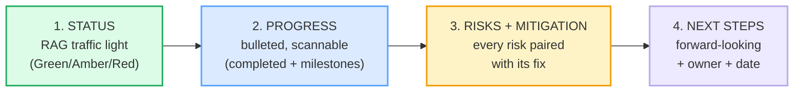

# Status Reports

> **Phase 3 · writing · bundle #52 · Days 103–104.**
> *RAG status, progress, risks, next steps.*
>
> 🔗 Builds on [EMAIL ANATOMY](./EMAIL_ANATOMY.md) (the BLUF principle — a
> status report puts the **traffic-light status** in the first line, not buried
> in paragraph three) and on [MEETING NOTES & FOLLOW-UPS](./MEETING_FOLLOWUPS.md)
> (the "actions: A (owner) by (date)" pattern). The spoken sibling is
> [STATUS UPDATES & STANDUPS](../workplace/STATUS_UPDATES.md) — this bundle is
> its **written, formal, async** form, and on
> [SCHEDULING](../speech_acts/SCHEDULING.md) ("ahead of / behind schedule" is
> the same plan-vs-reality axis as "does Tuesday work?").

---

## Why this bundle exists (read this first)

A Vietnamese learner writing a status report almost always makes the same
mistake, and it is a **genre** mistake, not a grammar one: they write it as
**narrative prose**. Vietnamese workplace writing (and Vietnamese storytelling
generally) is *descriptive* — a flowing paragraph of "đầu tuần em đã làm việc A,
sau đó làm việc B, công việc đang tiến triển tốt, mong sếp thông cảm" — a warm,
face-preserving account. English status-report culture is the **opposite**: it is
**structured and scannable**. A stakeholder opens it, sees a coloured dot
(Red/Amber/Green), scans four bullets, and decides whether to read on or move on.
A wall of prose fails the test in three seconds.

The second mistake is the **face** mistake: because a status report is read by a
manager or client, the Vietnamese writer **over-states progress** ("everything is
going well") and **under-states risk** (no Risks section, or a vague "a few minor
issues"). Vietnamese culture reads admitting a problem as *losing face*; English
project culture reads a hidden risk as *unprofessional* — the whole point of the
report is **early warning**, and a status report with no risks is read as either
naive or dishonest.

This bundle teaches the four-move English skeleton that fixes both: a
**traffic-light status** up front, **bulleted progress**, **risks paired with
their mitigation**, and **next steps with owners**.

Notice what is **not** a move: the long narrative, the excuse paragraph, the
vague *"going well"*. The status is one phrase. The progress is bullets. The
risks each come with a fix. That scannability is the whole genre.

---

## 1. The status header — the RAG traffic light (the opener)

The first line of an English status report is a **status word or phrase** mapped
to the Red/Amber/Green (RAG) traffic-light system. A stakeholder scans it in
under three seconds. Three registers, from "no problem" to "help needed":

| RAG | Chunk | When |
|---|---|---|
| 🟢 Green | **On track** | progressing as planned, likely to hit the target |
| 🟡 Amber | **At risk** | in danger of slipping; needs attention, not yet blocked |
| 🔴 Red | **Blocked** | cannot proceed until a dependency is resolved |

> From `status_reports_corpus.md`:
>
> | On track | At risk | Blocked |
> |---|---|---|
> | /ɒn ˈtræk/ UK · /ɑːn ˈtræk/ US | /ət ˈrɪsk/ | /blɒkt/ UK · /blɑːkt/ US |
>
> Cambridge attests *"They're on track to make record profits."* (the *on track*
> idiom) and *"The recession has put many jobs at risk."* (the *at risk* phrase).
> The RAG colour set is the project-reporting consensus: ProjectManager, Weekdone,
> and PM Majik all define Green = on track, Amber = issues being managed,
> Red = needs escalation.

**The Vietnamese trap here:** there is no RAG equivalent in Vietnamese workplace
writing, so the learner either **omits the status line entirely** (a report that
starts with "This week I did…") or **uses vague language** (*"going well"*,
*"fine"*) with no traffic light. The fix is mechanical: **every status report's
first line is a colour + a status phrase.** No colour = the reader has to read the
whole thing to know if there's a fire.

---

## 2. Progress — bulleted, not narrated (the scannable middle)

The progress move is a **bullet list**, each line one completed item or one
milestone hit. English status reports are read, not narrated — a wall of prose is
the #1 complaint managers have about reports from high-context-culture writers.
Five chunks build the section:

> From `status_reports_corpus.md`:
>
> - **Progress to date:** /ˈprəʊɡres tuː deɪt/ UK · /ˈprɑːɡres tuː deɪt/ US — a
>   heading summarising all work so far.
> - **Completed this week:** /kəmˈpliːtɪd ðɪs wiːk/ — a heading listing the work
>   finished this period.
> - **Milestones:** /ˈmaɪlstəʊnz/ UK · /ˈmaɪlstoʊnz/ US — the checkpoints that
>   measure progress toward the goal. Cambridge Business English attests *"set
>   milestones"*, *"meet the first milestone"*, *"deliver milestones"*.
> - **Ahead of schedule:** /əˈhed əv ˈʃedjuːl/ UK · /əˈhed əv ˈskedʒuːl/ US —
>   faster than planned.
> - **Behind schedule:** /bɪˈhaɪnd əv ˈʃedjuːl/ UK · /bɪˈhaɪnd əv ˈskedʒuːl/ US —
>   slower than planned (this is the amber/red trigger).

So a real progress section reads:

> **Completed this week:**
> - Onboarded the payments vendor (milestone 3 of 5 — **ahead of schedule**).
> - Fixed the login bug reported in last week's report.
> - Drafted the Q3 forecast deck.
>
> **Milestones:** M3 (payments) ✓ done · M4 (beta launch) on track for July 12.

That is the entire move. Notice: **bullets, not paragraphs; each bullet one
fact; the milestone status stated, not hinted.** The Vietnamese instinct is to
write *"Đầu tuần em đã làm việc onboarding, sau đó sửa lỗi login, và cũng đã soạn
báo cáo Q3…"* — one long sentence. English splits it into three scannable lines.

🔗 The noun/verb stress shift on *progress* (noun /ˈprəʊɡres/ vs verb
/prəˈɡres/) is a pronunciation pitfall — drill it, because "PRO-gress" (noun) and
"pro-GRESS" (verb) are both in this report. See
[WORD STRESS](../pronunciation/WORD_STRESS.md).

---

## 3. Risks + mitigation — the paired move (the expert payoff)

This is the move that separates a *useful* status report from a *cheerleading*
one, and it is the move Vietnamese writers most often **omit or under-state**.
The rule is absolute: **every risk is paired with its mitigation.** A risk
without a mitigation reads as complaining; a mitigation without a named risk
reads as noise. The project-reporting consensus (ProjectManager, Asana, Atlassian)
prescribes *"Risks:"* immediately followed by *"Mitigation:"*.

> From `status_reports_corpus.md`:
>
> - **Risks:** /rɪsks/ — heading introducing what could go wrong.
> - **Key risks:** /kiː rɪsks/ — the tighter variant (use when there are many;
>   name the top 2–3).
> - **Mitigation:** /ˌmɪtɪˈɡeɪʃən/ — heading introducing what you are doing to
>   reduce each risk. From Cambridge *mitigate* (Business English attests
>   *"mitigate damage/risk"*, *"mitigate the effects/impact of sth"*).
> - **Contingency:** /kənˈtɪndʒənsi/ — the plan-B if the risk materialises.
>   Cambridge Business English attests *"contingency plan"* and *"provide a
>   contingency against uncertainties in the future."*

Put together, a real risk section reads:

> **Risks:**
> 1. The API rate limit may block bulk import at launch.
> 2. Key engineer on leave July 20–28.
>
> **Mitigation:** (1) Requested a limit increase from the vendor; batch import
> as **contingency** if denied. (2) Cross-trained two teammates; deliverable
> owner reassigned for the window.

**The Vietnamese trap here is the face trap.** Vietnamese culture reads naming a
risk as *admitting failure* or *looking bad in front of the boss*. English
project culture reads a hidden risk as a **breach of trust** — the report exists
*so that* risks surface early, when they're cheap to fix. A status report with
*"everything is fine"* that then slips is far worse than a report that said *"at
risk"* two weeks ago. The cultural reframe: **in English, naming a risk early is
competence, not weakness.** Pair every risk with its mitigation and you've shown
you're on top of it — that's the opposite of losing face.

---

## 4. Next steps + forecast — the forward-looking close

Every status report **ends looking forward** — the upcoming work, who owns it,
and a forecast of where the status is heading. Without it, the report is a museum
of the past. Three chunks close the loop:

> From `status_reports_corpus.md`:
>
> - **Next steps:** /nekst steps/ — heading introducing the actions for the
>   coming period. (Always with an **owner** and a **date** — see
>   [MEETING NOTES & FOLLOW-UPS](./MEETING_FOLLOWUPS.md).)
> - **Upcoming:** /ˈʌpkʌmɪŋ/ — a label for work scheduled in the near future.
> - **Forecast:** /ˈfɔːkɑːst/ UK · /ˈfɔːrkæst/ US — a prediction of status /
>   completion / resource needs ahead.

So a real close reads:

> **Next steps:**
> - Submit vendor contract for legal review — **owner: Linh, by July 10.**
> - Run the bulk-import load test — **owner: Marco, by July 14.**
>
> **Forecast:** Status expected to stay **Green** through M4, moving to **Amber**
> if the rate-limit request is denied by July 8.

That forecast line is what lets a manager sleep. It tells them *you've already
thought about what could turn the status red* — which is exactly what the
risk→mitigation move in §3 set up.

---

## 5. The four-move skeleton — put it together

A complete English status report, every move labelled:

> **Status: 🟢 On track**
>
> **Progress to date:**
> - Completed onboarding (milestone 3 of 5 — **ahead of schedule**).
> - Fixed the login bug from last week.
>
> **Risks:**
> 1. API rate limit may block bulk import at launch.
>
> **Mitigation:** Requested a limit increase; **contingency** = batch import.
>
> **Next steps:** Vendor contract to legal (Linh, July 10); load test (Marco, July 14).
>
> **Forecast:** Green through M4 → Amber if rate-limit denied by July 8.

Read that in eight seconds. That scannability is the genre. A Vietnamese learner
who internalises this skeleton stops writing *"em xin báo cáo tình hình công
việc tuần qua*" prose and starts writing reports a stakeholder can act on without
re-reading.

🔗 This is the **written** version of [STATUS UPDATES & STANDUPS](../workplace/STATUS_UPDATES.md)
— the spoken "quick update, I'm blocked on X" becomes, in writing, this formal
RAG + bullets + risks + next steps skeleton. The spoken form is for the daily
standup; this form is for the weekly async report.

---

## 6. Cheat sheet — the ≤8 survival chunks

The Pareto set. These eight chunks compose essentially every English status
report. (Every row is a corpus attestation above.)

| # | Chunk | IPA | Move |
|---|---|---|---|
| 1 | **On track** | /ɒn ˈtræk/ UK · /ɑːn ˈtræk/ US | status (green) |
| 2 | **At risk** | /ət ˈrɪsk/ | status (amber) |
| 3 | **Completed this week:** | /kəmˈpliːtɪd ðɪs wiːk/ | progress |
| 4 | **Milestones:** | /ˈmaɪlstəʊnz/ UK · /ˈmaɪlstoʊnz/ US | progress |
| 5 | **Ahead of schedule** | /əˈhed əv ˈʃedjuːl/ UK · /əˈhed əv ˈskedʒuːl/ US | progress (positive) |
| 6 | **Risks:** | /rɪsks/ | risk |
| 7 | **Mitigation:** | /ˌmɪtɪˈɡeɪʃən/ | mitigation |
| 8 | **Next steps:** | /nekst steps/ | next steps |

> Open [`status_reports.html`](./status_reports.html) to drill these as flip
> cards, play the status-report role-play, shadow, and **write** a full
> four-move status report.

---

## 7. Vietnamese → English L1 pitfalls table

The "expert payoff." These are the specific interference traps a Vietnamese
writer hits on a status report — extend, don't replace, the seed rows from the
spec.

| Vietnamese trap (what you do) | English fix (what to do instead) |
|---|---|
| **Writes narrative prose, not bullets** — a flowing *"đầu tuần em đã làm…"* paragraph, because Vietnamese workplace writing is descriptive | Split progress into **bullets, one fact per line**. English status reports are **scanned**, not narrated. Headings + bullets beat a paragraph every time. |
| **Omits the RAG status line entirely** — starts with "This week I did…", no colour, because there's no traffic-light convention in VN | **First line is always a status + colour.** 🟢 On track / 🟡 At risk / 🔴 Blocked. No colour = the reader must read everything to know if there's a fire. |
| **Uses vague status** — *"going well"*, *"fine"*, *"a few minor issues"* with no RAG and no ETA, because precision feels risky | Replace vague with the **exact RAG phrase + a date**: *"On track for July 12"* / *"At risk — ETA slips to July 20 if X isn't resolved."* Vague = unprofessional. |
| **Under-states / hides risks** (the face trap) — no Risks section, or "không có vấn đề gì" because naming a problem = losing face | Name the risk **and pair it with the mitigation**. In English, surfacing a risk early is **competence**, not weakness. A report with no risks reads as naive or dishonest. |
| **Over-states progress** — *"almost done"*, *"nearly finished"* when it isn't, to look good in front of the boss | State the **milestone status factually**: *"M3 done (ahead of schedule); M4 on track for July 12."* Let the dates and the RAG carry the honesty, not adjectives. |
| **Drops the mitigation / contingency** — names a risk but no fix, leaving the manager to solve it | Every risk gets a **Mitigation** (what you're doing) + a **Contingency** (plan-B). A risk with no fix is complaining; a fix with no risk is noise. |
| **No owners / dates on next steps** — *"we will do X"* with no name and no deadline (passive, face-distributing) | Every next step needs an **owner + a date**: *"Vendor contract to legal — Linh, July 10."* No owner = no accountability = it won't happen. |
| **Noun/verb stress on *progress*** — says /prəˈɡres/ (verb) when it's the noun /ˈprəʊɡres/, because VN doesn't use stress to distinguish word class | Drill the shift: noun **PRO**-gress (/ˈprəʊɡres/) vs verb pro-**GRESS** (/prəˈɡres/). Both appear in one report. 🔗 [WORD STRESS](../pronunciation/WORD_STRESS.md). |
| **US/UK *schedule* / *forecast*** — mixes /ˈʃedjuːl/ and /ˈskedʒuːl/, or /ˈfɔːkɑːst/ and /ˈfɔːrkæst/, mid-report | Pick one accent per report and keep it. *schedule* UK /ˈʃedjuːl/ · US /ˈskedʒuːl/; *forecast* UK /ˈfɔːkɑːst/ · US /ˈfɔːrkæst/. |
| **Final clusters in *risks / next / steps / blocked*** — /rɪsks/, /nekst/, /steps/, /blɒkt/ dropped or schwa-opened | Release every cluster: *risks* not "risk", *next* not "nex", *blocked* not "block". These headings are read aloud in standups. 🔗 [FINAL CONSONANTS](../pronunciation/FINAL_CONSONANTS.md). |

---

## How to practise this bundle (the daily 20 min)

1. **READ** (5 min) — this guide, §1–§5. Memorise the four-move skeleton
   (RAG → progress → risks+mitigation → next steps).
2. **SHADOW** (7 min) — open `status_reports.html`, drill the 8 flip cards +
   the status-report role-play **aloud**, exaggerating the stressed content words
   (*progress*, *milestone*, *mitigation*, *contingency*).
3. **PRODUCE** (8 min) — the writing task: **write a full four-move status
   report** (RAG status + bulleted progress + risks with mitigation + next steps
   with owners). Reveal the model answer, compare, copy yours out.

---

## Sources

- Cambridge Advanced Learner's Dictionary — *on track* idiom (attests *"They're on track to make record profits."*) — https://dictionary.cambridge.org/dictionary/english/on-track
- Cambridge — *at risk* phrase (attests *"The recession has put many jobs at risk."*) — https://dictionary.cambridge.org/dictionary/english/at-risk
- Cambridge — *blocked* adjective (from *block* /blɒk/–/blɑːk/) — https://dictionary.cambridge.org/dictionary/english/blocked
- Cambridge — *progress* noun UK /ˈprəʊɡres/, US /ˈprɑːɡres/ (Business English attests *"making progress"*, *"progress report"*) — https://dictionary.cambridge.org/dictionary/english/progress
- Cambridge — *complete* verb → *completed* /kəmˈpliːtɪd/ — https://dictionary.cambridge.org/dictionary/english/complete
- Cambridge — *milestone* noun (Business English attests *"set milestones"*, *"meet the first milestone"*) — https://dictionary.cambridge.org/dictionary/english/milestone
- Cambridge — *schedule* noun UK /ˈʃedjuːl/, US /ˈskedʒuːl/ — https://dictionary.cambridge.org/dictionary/english/schedule
- Cambridge — *risk* noun /rɪsk/ → *risks* /rɪsks/ — https://dictionary.cambridge.org/dictionary/english/risk
- Cambridge — *mitigate* verb (Business English attests *"mitigate damage/risk"*, *"mitigate the effects/impact of sth"*) — https://dictionary.cambridge.org/dictionary/english/mitigate
- Cambridge — *contingency* noun (Business English attests *"contingency plan"*, *"provide a contingency against uncertainties"*) — https://dictionary.cambridge.org/dictionary/english/contingency
- Cambridge — *step* noun → *steps* /steps/ — https://dictionary.cambridge.org/dictionary/english/step
- Cambridge — *upcoming* adjective /ˈʌpkʌmɪŋ/ — https://dictionary.cambridge.org/dictionary/english/upcoming
- Cambridge — *forecast* noun UK /ˈfɔːkɑːst/, US /ˈfɔːrkæst/ — https://dictionary.cambridge.org/dictionary/english/forecast
- ProjectManager — "RAG Status in Project Management" (Red/Amber/Green definition) — https://www.projectmanager.com/blog/rag-status
- Weekdone — "RAG Rating in Project Management and Status Reports" — https://blog.weekdone.com/rag-rating-project-management-status-reports/
- PM Majik — "PMO RAG status levels" — https://www.pmmajik.com/pmo-rag-status-levels/
- Asana — "How Project Status Reports Work" (status report = *"progress, risks, and next steps"*) — https://asana.com/resources/how-project-status-reports
- Asana — "Status Report Template" (*"scannable fields for progress, blockers, risks, and next steps"*) — https://asana.com/templates/status-report
- Atlassian — "Project Status Report" (*"progress, risks, and next steps to keep stakeholders aligned"*) — https://www.atlassian.com/agile/project-management/status-report
- Native audio: YouGlish — https://youglish.com/pronounce/{word}/english/us?
- Frequency methodology: wordfrequency.info (spoken sub-corpus) — https://www.wordfrequency.info/
