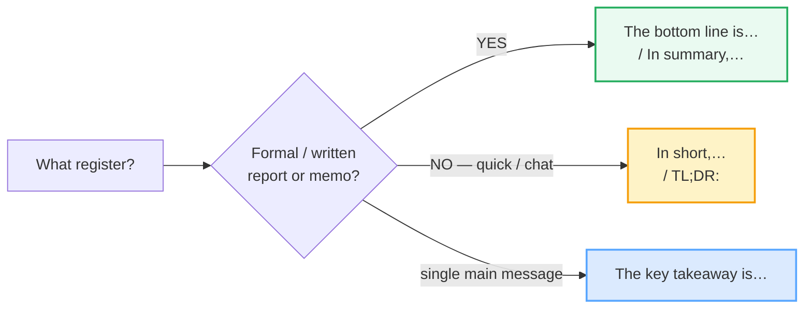
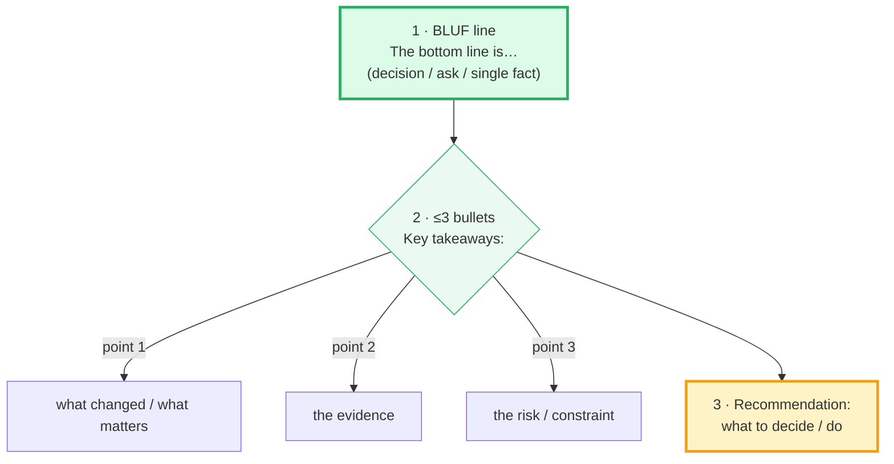

# Summaries & Executive Briefs

> **Phase 3 · writing/ · bundle #65 · Days 129–130.**
> *Bottom line up front; 3 bullets max.*
>
> 🔗 Sibling bundles this one leans on: [EMAIL ANATOMY](./EMAIL_ANATOMY.md)
> (the BLUF principle — this bundle is the BLUF principle applied to a whole
> document, not just an email), [STATUS REPORTS](./STATUS_REPORTS.md) (the
> RAG-status / next-steps habit — an exec brief is a status report distilled to
> its decision), [EDITING CONCISION](./EDITING_CONCISION.md) (cut every word that
> isn't the bottom line), and forward to [IM SLACK STYLE](./IM_SLACK_STYLE.md)
> (TL;DR is the executive brief shrunk to one chat line).

---

## Why this is the summaries bundle (read this first)

A Vietnamese learner can write a perfectly grammatical paragraph and still
**bury the point**. The habit transfers straight from Vietnamese formal writing
and from school composition (*văn tóm tắt*, *viết lại truyện*): the summary is
**narrative and descriptive** — a long wind-up that retells the story in order,
saves the conclusion for the last sentence, and offers no recommendation at all.
To a Vietnamese ear that reads as thorough and respectful. To an English
executive reader it reads as **the answer hidden on page two**.

The English executive brief inverts that. Its single rule has a name — **BLUF,
Bottom Line Up Front** — and Wikipedia traces it to a U.S. military writing
standard: *"the greatest weakness in ineffective writing is that it doesn't
quickly transmit a focused message."* The fix is structural, not stylistic:

1. **One BLUF line** — the decision, the ask, or the single most important fact
   — goes **first**.
2. **≤3 bullets** — the key points that justify the bottom line.
3. **One recommendation** — what to do next.

Three moves, in that order. The whole bundle is the muscle memory for those
three moves.

---

## 1. The mechanism: narrative vs bottom-line-up-front

| | Vietnamese summary habit (L1) | English executive brief (target) |
|---|---|---|
| Structure | **Chronological / narrative** — retell in order, wind up, then conclude | **BLUF** — bottom line first, then context |
| Where the point lives | The conclusion is the **last** sentence (or never stated) | The conclusion is the **first** sentence |
| Length of the wind-up | Long — background, history, detail first | None — the reader gets the answer in line 1 |
| Bullets | Rare; prose paragraphs preferred | **≤3 bullets** — scannable in seconds |
| Recommendation | Usually **omitted** ("just the facts") | **One clear recommendation** — what to decide / do |
| Density | More detail = more thorough | Fewer points = more decisive (the reader is busy) |

The collision is at **information order**: what Vietnamese formal writing treats
as a respectful build-up, the English executive treats as *burying the lede*.
The UMGC writing center puts it plainly: *"executives sometimes make decisions
based upon a reading of this summary alone"* — so the summary must carry the
decision, not the build-up.

---

## 2. Move 1 — the BLUF opener (bottom line first)

State the single most important thing in sentence 1. Pick the opener that fits
the register — formal written, neutral, or the ultra-short TL;DR tag.

> From `summaries_corpus.md` (§A, verbatim):
>
> - **The bottom line is…** /ðə ˈbɒtəm laɪn ɪz/ UK · /ðə ˈbɑːtəm laɪn ɪz/ US —
>   "the most important fact in a situation" (Cambridge Learner's Dictionary).
> - **TL;DR:** /ˌtiːˌelˌdiːˈɑːr/ — "too long; didn't read," used to introduce a
>   summary (Wikipedia).
> - **In short,…** /ɪn ˈʃɔːt/ UK · /ɪn ˈʃɔːrt/ US — the quick version.
> - **The key takeaway is…** /ðə kiː ˈteɪkəweɪ ɪz/ — names the single main
>   message (Cambridge: "What's the key takeaway from this survey?").

> **The pinned example (sanity-check it's real):** Cambridge Learner's Dictionary
> attests *"The bottom line is that if you don't work, you'll fail the test."*
> verbatim under the entry for *the bottom line* — that is the BLUF line in its
> purest form: conclusion first, no wind-up.

---

## 3. Move 2 — the ≤3 bullets (key points)

After the BLUF line, give the points that justify it — as a **short bullet list,
three maximum**. Cambridge attests both the noun and the verb with exactly these
openers.

| Opener | Register | When |
|---|---|---|
| **In summary,…** /ɪn ˈsʌməri/ | formal written | the report's wrap-up paragraph |
| **To summarize,…** /tə ˈsʌməraɪz/ | spoken / semi-formal | a meeting close or a spoken recap |
| **Key takeaways:** /kiː ˈteɪkəweɪz/ | bulleted header | the list itself |
| **The main points are…** /ðə meɪn ˈpɔɪnts ɑːr/ | list intro | leads into the bullets |

> From `summaries_corpus.md` (§B, verbatim):
>
> - **In summary,…** — Cambridge model sentences: *"In summary, they decided
>   against the proposal."* / *"In summary, the whole affair was a fiasco."*
> - **To summarize,…** — Cambridge model sentence: *"To summarize, we believe
>   the company cannot continue in its present form."*
> - **Key takeaways:** — Cambridge Business English: *"the **key takeaway** from
>   this survey"* + *"the **takeaway points**."*

> **The three-bullet discipline:** the USC executive-summary guide's method is
> "Isolate the Major Points" — extract, don't retell. If you have five bullets,
> you have not summarized; you have re-listed. Cut to the three that change the
> decision.

---

## 4. Move 3 — the one recommendation

An English executive brief does not end on "those are the facts." It ends on
**what to do** — one clear recommendation. Cambridge attests the word in the
business register that makes this exact move.

| Closer | What it signals |
|---|---|
| **Recommendation:** /ˌrekəmenˈdeɪʃən/ | the suggested decision (default) |
| **Proposed action:** /prəˈpəʊzd ˈækʃən/ | what you propose to do next |
| **Next step:** /nekst step/ | the immediate follow-up |

> From `summaries_corpus.md` (§C, verbatim):
>
> - **Recommendation:** — Cambridge Business English: *"We accept the **key
>   recommendations** of the report."* / *"The committee will… **make a
>   recommendation** to the Board."*
> - **Proposed action:** — *propose* /prəˈpəʊz/ UK · /prəˈpoʊz/ US + *action*
>   /ˈækʃən/ (Cambridge headwords).
> - **Next step:** — the USC executive-summary guide closes on the
>   "Recommendations" block.

> **Why one, not three:** a busy reader wants a decision they can approve or
> reject. A list of "options" forces them to do your job. State one
> recommendation; keep the alternatives as a one-line footnote if you must.

---

## 5. The executive-brief skeleton, in one diagram

Read top-to-bottom: that is the **opposite** of the Vietnamese narrative wind-up.
The conclusion is line 1, not the last line.

---

## 6. Cheat sheet — the ≤8 survival chunks

The Pareto set: eight openers that cover every slot of an executive brief. (Every
row is a corpus attestation; drill the right one for the register until it comes
out by reflex.)

| # | Chunk | IPA | Why it's here |
|---|---|---|---|
| 1 | **The bottom line is…** | /ðə ˈbɒtəm laɪn ɪz/ UK · /ðə ˈbɑːtəm laɪn ɪz/ US | BLUF opener — the conclusion first (pinned) |
| 2 | **TL;DR:** | /ˌtiːˌelˌdiːˈɑːr/ | ultra-short summary — the whole thing in one line |
| 3 | **In short,…** | /ɪn ˈʃɔːt/ UK · /ɪn ˈʃɔːrt/ US | the quick version — concise signaler |
| 4 | **The key takeaway is…** | /ðə kiː ˈteɪkəweɪ ɪz/ | BLUF opener naming the single main message |
| 5 | **Key takeaways:** | /kiː ˈteɪkəweɪz/ | bulleted summary header (pinned) |
| 6 | **In summary,…** | /ɪn ˈsʌməri/ | formal written summary opener |
| 7 | **To summarize,…** | /tə ˈsʌməraɪz/ | formal spoken / semi-formal summary opener |
| 8 | **Recommendation:** | /ˌrekəmenˈdeɪʃən/ | the close — the suggested action / decision |

> Open [`summaries.html`](./summaries.html) to drill these as flip cards, play
> the brief role-play, shadow the openers, and do the writing task (write an
> executive brief: BLUF + ≤3 bullets + recommendation).

---

## 7. Vietnamese → English L1 pitfalls table

The "expert payoff." These are the specific interference traps a Vietnamese
speaker hits when writing English summaries and executive briefs — extend, don't
replace, the seed rows from the spec.

| Vietnamese trap (what you do) | English fix (what to do instead) |
|---|---|
| **Narrative wind-up** — retells the story in chronological order, saves the conclusion for the last sentence (*văn tóm tắt* habit) | **BLUF first.** Put the decision / ask in sentence 1 ("The bottom line is…"). The build-up goes *below* the bottom line, if at all. |
| **Buries the point** — the reader reaches line 8 before learning why they're reading | Lead with "The bottom line is…" / "The key takeaway is…". If a busy reader reads only line 1, they should have the answer. |
| **No recommendation** — ends on "those are the facts" (Vietnamese summary = describe, don't advise) | End on **one recommendation**: "Recommendation:" / "Proposed action:". An English exec brief without a recommendation is unfinished. |
| **Over-detail / can't prioritize** — lists every point equally (5–10 bullets), because cutting feels incomplete | Cut to **≤3 bullets** under "Key takeaways:". If you have five, you haven't summarized — isolate the major points (USC method). |
| **Prose paragraphs over bullets** — writes the summary as flowing text, the school-essay default | Use **scannable bullets**. Executives skim; a wall of prose hides the points. One line per bullet. |
| **Translation inflation in the opener** — *"In order to summarize the aforementioned…"* (calque of ornate L1 register) | Use the lean opener: **In summary,** / **To summarize,**. 🔗 See [EDITING CONCISION](./EDITING_CONCISION.md) — cut filler. |
| **Hedge instead of decide** — *"It might be suggested that perhaps we could consider…"* to sound humble | State the recommendation directly: **"Recommendation: we proceed with Option A."** Hedge weakens a brief; the reader wants a decision. |
| **TL;DR reads as rude** — avoids it, or uses *"long story short"* incorrectly | **TL;DR:** is the accepted ultra-short tag for a quick summary (Wikipedia/Grammarly). Use it in chat/IM, not in a formal board memo. 🔗 See [IM SLACK STYLE](./IM_SLACK_STYLE.md). |
| **Repeats the background the reader already knows** — re-narrates context out of politeness | Assume the reader knows the context. The brief carries the **decision and the delta**, not the history. |

---

## How to practise this bundle (the daily 20 min)

1. **READ** (5 min) — this guide, §1–§5.
2. **SHADOW** (7 min) — open `summaries.html`, drill the 8 flip cards (say each
   opener aloud — *The bottom line is… / In summary,… / Recommendation:*), then
   play the brief role-play, reading the **BLUF lines** aloud.
3. **PRODUCE** (8 min) — the writing task: take a paragraph of your own (a
   meeting, a report, a news story) and compress it into an **executive brief** —
   one BLUF line + ≤3 "Key takeaways" bullets + one "Recommendation:". Reveal the
   model answer; compare. Read yours aloud — the BLUF line should land first.

---

## Sources

- Cambridge Advanced Learner's Dictionary — https://dictionary.cambridge.org/dictionary/english/{word} (IPA + meaning + example sentences for *summary, summarize, takeaway, recommendation, propose, action, short, bottom, line*).
- Cambridge Learner's Dictionary, *the bottom line* — https://dictionary.cambridge.org/us/dictionary/learner-english/the-bottom-line ("the most important fact in a situation: The bottom line is that if you don't work, you'll fail the test.")
- Cambridge Business English Dictionary — https://dictionary.cambridge.org/dictionary/english/{word} (*summary* "In summary, we must aim…"; *takeaway* "What's the key takeaway from this survey?"; *recommendation* "We accept the key recommendations of the report." / "make a recommendation to the Board").
- "BLUF (communication)." *Wikipedia.* — https://en.wikipedia.org/wiki/BLUF_(communication) ("Bottom Line Up Front… a standard in U.S. military communication"; Army Regulation 25-50 origin; the canonical BLUF example sentence).
- Sehgal, Kabir. "How to Write Email with Military Precision." *Harvard Business Review* (22 Nov 2016) — https://hbr.org/2016/11/how-to-write-email-with-military-precision ("Bottom Line Up Front (BLUF)").
- University of Southern California Libraries, "Organizing Your Social Sciences Research Paper: Executive Summary" — https://libguides.usc.edu/writingguide/executivesummary ("Isolate the Major Points… Recommendations").
- University of Maryland Global Campus (UMGC) Effective Writing Center, "Executive Summary" — https://www.umgc.edu/current-students/learning-resources/writing-center/writing-resources/professional-and-presentation/executive-summary ("executives sometimes make decisions based upon a reading of this summary alone").
- "TL;DR." *Wikipedia.* — https://en.wikipedia.org/wiki/TL;DR ("too long; didn't read… used to introduce a summary").
- Grammarly, "What Does TL;DR Mean? Definition and Examples" — https://www.grammarly.com/blog/writing-tips/tldr-meaning/ ("a quick, digestible summary of a longer piece").
- Native audio: YouGlish — https://youglish.com/pronounce/{chunk}/english/us?
- Frequency methodology: wordfrequency.info (spoken sub-corpus) — https://www.wordfrequency.info/
