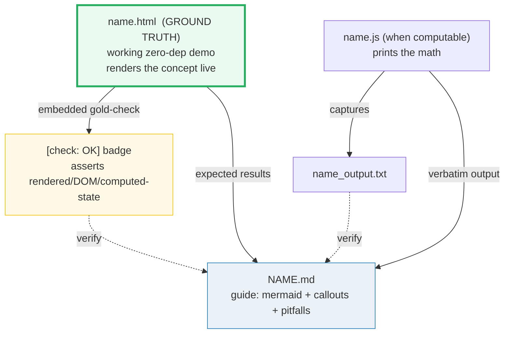

# HOW_TO_RESEARCH — Frontend "Concept-as-a-Bundle" Workflow

> Adapted from [`../skills/concept-builder/SKILL.md`](../skills/concept-builder/SKILL.md).
> Frontend uses the **rendered-ground-truth** variant: the `.html` IS the
> ground truth (it renders the concept live), with an embedded `[check: OK]`
> gold-check proving the rendered/DOM state. A `.js` ships only when the concept
> has a computable core (specificity, box-model math, reconciliation counts).

## 0. The one rule

> **Every concept is a set of files that cite each other, all deriving from ONE
> ground-truth artifact. Nothing is ever hand-waved.**



A **concept bundle** = `name.html` + `NAME.md`, plus optionally `name.js` +
`name_output.txt` when the concept has a computable core.

## 1. Focus

Modern frontend from first principles: **HTML/CSS → Tailwind 4 (CDN playground)
→ React → metaframework choice → Astro deep-dive → TanStack Start.** 26 bundles
across 6 phase subfolders. See [`TODO.md`](./TODO.md).

**Thesis:** Astro for ~80% of the web where content is king; TanStack Start for
app-like SaaS.

## 2. The roles of each file

| File | Role | Hard rules |
|---|---|---|
| **`name.html`** | GROUND TRUTH. A working, single-file, zero-dep demo of the concept (HTML/CSS/JS inline; Tailwind via CDN; React via CDN+Babel). Renders the concept live. | Opens from `file://`. **Embeds a gold-check** (`<script>` that asserts rendered/DOM/computed-state and shows `[check: OK]`). Dark palette, indigo accent `#6366f1`. Full GitHub URLs in the header for `.md` links. Back-link to the phase's dashboard or `../index.html`. |
| **`name.js`** (optional) | Computable core. When the concept has math (specificity, box-model dims, recon counts), a pure-JS file prints it. | `node name.js > name_output.txt 2>/dev/null`. Deterministic (sorted keys, seeded RNG, `check()` not `assert`). |
| **`name_output.txt`** | Captured stdout of the `.js`. | Committed so the `.md` is re-derivable without running. |
| **`NAME}.md`** | Static guide. What / why (internals) / gotchas. | ≥1 mermaid diagram. Numbers under `> From name.html:` or `> From name.js Section X:` callouts (paste verbatim). Pitfalls table + cheat sheet + `## Sources` (web-verified ≥2). |

## 3. The gold-check (the falsifiable anchor)

Every `.html` proves it behaves as claimed:

```html
<div id="goldcheck" style="...">[check: …]</div>
<script>
  // recompute a known value with the IDENTICAL logic, assert it
  const ok = (document.querySelector('.box').children.length === 3);
  document.getElementById('goldcheck').textContent =
    '[check] box has 3 children: ' + (ok ? 'OK' : 'FAIL');
  document.getElementById('goldcheck').style.color = ok ? '#2ecc71' : '#e74c3c';
</script>
```

- Pick a concrete rendered fact (child count, computed style, counter value after
  N clicks, a specificity score) the bundle pins.
- Assert it in JS; show `[check: OK]` (green) or `[check: FAIL]` (red).
- `node --check` the extracted `<script>` before shipping (must pass).

If the badge is red, the demo drifted from the claim — fix the demo.

## 4. The `.html` style

- **Dark palette:** `--bg:#0d1117; --panel:#161b22; --ink:#e6edf3`
- **Accent:** indigo `#6366f1`
- **Zero external runtime deps EXCEPT:** Tailwind Play CDN (`<script src="https://cdn.tailwindcss.com">` — but note v4 uses a different CDN; verify per bundle) and React+ReactDOM+Babel CDNs for the React phase. These CDNs are the *point* of the "playground era" theme.
- **Interactive:** user manipulates inputs (sliders, buttons, click counters) and sees the concept respond.
- **`[check: OK]` gold badge** near the top.
- **Header links** to the `.md` and `.js` as full GitHub URLs:
  `https://github.com/quanhua92/tutorials/blob/main/frontend/{phase}/{NAME}.md`
- **Back-link** to `../index.html` (the frontend dashboard).

## 5. The `.md` structure

```markdown
# [Concept Name]

> **Companion demo:** [`name.html`](./name.html) — open in a browser.
> **Computable core:** [`name.js`](./name.js) (if present) — `node name.js`.

---

## 0. TL;DR — the one idea
> **The analogy:** [plain-English mental model]

[≥1 mermaid diagram]

## 1. How it works
[step-by-step, with code snippets]

## 2. The math / mechanism
> From name.js Section X:
[verbatim output block]

## 3. Tradeoffs / gotchas

### Killer Gotchas
[pitfalls table: trap | symptom | fix]

### Cheat sheet
[one-block reference]

## Sources
[URLs, web-verified ≥2]
```

## 6. Naming & layout

- `.html` / `.js` / `_output.txt` → `lower_snake_case` (e.g. `box_model.js`).
- `.md` → `UPPER_SNAKE_CASE` (e.g. `BOX_MODEL.md`).
- One stem per concept; all files share it.
- Bundles live in **phase subfolders**: `foundations/`, `tailwind/`, `react/`,
  `metaframeworks/`, `astro/`, `tanstack-start/`.

## 7. Verification discipline

```bash
# the .js (if present) runs clean + output captured
node {phase}/name.js > /dev/null 2>&1 && echo "JS OK"
# the .html <script> is syntactically valid
python3 -c "import re;open('/tmp/_j.js','w').write(re.search(r'<script>(.*?)</script>',open('{phase}/name.html').read(),re.S).group(1))" 2>/dev/null
node --check /tmp/_j.js && echo "HTML JS OK"
# gold-check present
grep -q "\[check" {phase}/name.html && echo "GOLD OK"
```

Or use the `Justfile`: `just check {name}` and `just sweep`.

## 8. Common bugs to AVOID

- **`const` reassignment** in the `.html` `<script>`: use `let` or `.push()`.
- **CDN version drift:** pin a specific version in the CDN URL; web-search the
  current Tailwind v4 / React CDN URL (these change).
- **Relative links:** `.md`/`.js` links in `.html` MUST be full GitHub URLs.
- **Back-link:** `.html` links to `../index.html` (frontend dashboard), not deeper.
- **Non-deterministic `.js`:** sort object keys before printing; seed any RNG;
  never `Date.now()` for a printed value.

## 9. Web search is mandatory

For every API, version, CDN URL, and behavioral claim: web-search the official
docs (developer.mozilla.org, tailwindcss.com, react.dev, astro.build,
tanstack.com) + ≥1 other authoritative source. Verify in ≥2 places. Record URLs
in `## Sources`. NEVER guess a version or a CDN URL.
