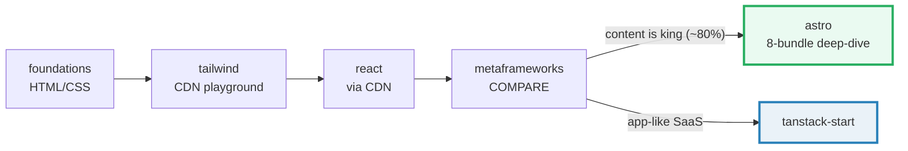
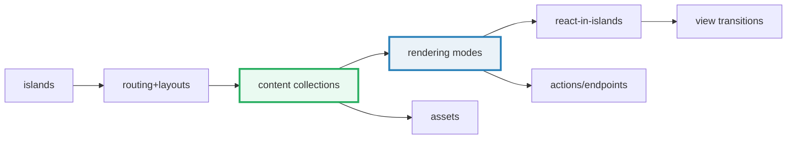

# TODO — `frontend/` concept-bundle curriculum

> The phase-by-phase build plan. The orchestrator ticks boxes here as batches
> land. Companion to `HOW_TO_RESEARCH.md` (per-bundle workflow, to be written).
> Governed by [`../skills/concept-builder/SKILL.md`](../skills/concept-builder/SKILL.md).

## Goal & thesis

Teach modern frontend from first principles: **HTML/CSS → Tailwind 4 (CDN
playground) → React → metaframework choice → Astro deep-dive → TanStack Start**.

> **Thesis (the decision spine):** Astro covers ~80% of the web where **content
> is king**; **TanStack Start** for app-like **SaaS**. The Phase 4 comparison
> bundle is the map; Phases 5–6 are the two destination deep-dives.

## Section conventions

- **Accent:** indigo `#6366f1` (distinct from ts `#3178c6`, interview teal, etc.)
- **Ground-truth model:** **rendered-ground-truth** (frontend variant of the
  interactive flavor).
  - `name.html` — the GROUND TRUTH: a working zero-dep demo (HTML/CSS/JS,
    Tailwind via CDN, React via CDN+Babel), open from `file://`, with an
    embedded **gold-check** (`<script>` asserts rendered/DOM/computed-state and
    shows `[check: OK]`).
  - `name.js` — only when there's a computable core (specificity, box-model
    math, reconciliation counts) → prints → `name_output.txt`.
  - `NAME.md` — guide: ≥1 mermaid diagram + `> From name.html:` (or `.js`)
    callouts + pitfalls table + cheat sheet + `## Sources` (web-verified ≥2).
- **Naming:** `.html`/`.js`/`_output.txt` → `lower_snake_case`; `.md` → `UPPER_SNAKE_CASE`.
- **Diagrams:** mermaid only (renders natively on GitHub; no ASCII/PNG).
- **Layout:** **nested subfolders per phase**, coexisting with the existing
  `frontend/tanstack-{query,router}/` walkthroughs (untouched).

## Directory layout

```
frontend/
├── HOW_TO_RESEARCH.md          ← per-bundle workflow (Phase 0 deliverable)
├── index.html                  ← dashboard (indigo cards per phase)
├── Justfile                    ← open/check/sweep recipes
├── scripts/skeleton.html       ← the gold-check scaffold (style anchor)
├── foundations/                ← Phase 1 (8)
├── tailwind/                   ← Phase 2 (4)
├── react/                      ← Phase 3 (4)
├── metaframeworks/             ← Phase 4 (1)
├── astro/                      ← Phase 5 (8)
├── tanstack-start/             ← Phase 6 (12: Router deep-dive + Start deep-dive)
├── tanstack-query/             ← (existing — untouched)
└── tanstack-router/            ← (existing — untouched)
```

## Learning spine



---

## Phase 0 — Foundation (orchestrator, by hand / rich brief)

- [ ] `HOW_TO_RESEARCH.md` — adapted from the skill, documenting the
      rendered-ground-truth variant (file roles, gold-check, indigo palette).
- [ ] `index.html` — dashboard, indigo accent, cards per phase, links into subfolders.
- [ ] `Justfile` — `open NAME` (browser), `check NAME` (`node --check` extracted
      `<script>` + gold-check present), `sweep`.
- [ ] `scripts/skeleton.html` — the gold-check scaffold all bundles copy.
- [ ] **Style anchor:** `foundations/box_model` — ships first; defines house style.

---

## Phase 1 — `foundations/` — HTML & CSS (8 bundles)

| # | Stem | Concept | Ground-truth | 🔗 |
|---|---|---|---|---|
| 01 | `box_model` ★ | content/padding/border/margin, `box-sizing` | `.js` (dim math) + `.html` | → layout_flow |
| 02 | `html_semantics` | semantic structure, doc outline, a11y roots | `.html` | → selectors_specificity |
| 03 | `selectors_specificity` | selectors, **specificity calc**, cascade | `.js` (calc → `_output.txt`) + `.html` | → cascade in tailwind |
| 04 | `layout_flow` | normal flow, display types, BFC | `.html` | ← box_model |
| 05 | `flexbox` | flex container/items, axes, alignment | `.html` | → css_grid |
| 06 | `css_grid` | tracks, areas, responsive grid | `.html` | ← flexbox |
| 07 | `positioning` | static→sticky, stacking context | `.html` | — |
| 08 | `responsive_units` | rem/em/vw, media + container queries | `.html` | → tailwind_responsive |

---

## Phase 2 — `tailwind/` — Tailwind 4 CDN playground (4 bundles)

> **Extra web-search emphasis** — v4 Play CDN + `@theme` (CSS-first config) are recent.

| # | Stem | Concept | 🔗 |
|---|---|---|---|
| 09 | `tailwind_cdn_playground` | v4 Play CDN, utility-first, the no-build workflow | ← responsive_units |
| 10 | `tailwind_design_tokens` | `@theme`, spacing/color/type tokens, CSS-first config | ← selectors_specificity (cascade) |
| 11 | `tailwind_responsive_variants` | breakpoints, `sm:`/`md:`/`lg:`, dark mode | ← responsive_units |
| 12 | `tailwind_customization` | `@utility`, custom utils, variant stacking, prod build | — |

---

## Phase 3 — `react/` — React via CDN (4 bundles)

| # | Stem | Concept | Gold-check anchor | 🔗 |
|---|---|---|---|---|
| 13 | `react_via_cdn` | React+ReactDOM+Babel CDN, JSX, element tree | renders "hello" | → components_props |
| 14 | `react_components_props` | function components, props, composition, children | renders N composed cards | ← via_cdn |
| 15 | `react_state_hooks` | `useState`, re-render model, events | counter shows N after N clicks | ← components_props |
| 16 | `react_effects_lists` | `useEffect` lifecycle, lists+keys, conditionals | list of 3 keyed items | ← state_hooks |

---

## Phase 4 — `metaframeworks/` — compare (1 bundle, pros/cons only, no deep dive)

| # | Stem | Concept |
|---|---|---|
| 17 | `metaframework_landscape` | **Astro vs TanStack Router vs TanStack Start vs Next.js** — what each is, when to pick which, pros/cons matrix. The decision map. Output: the 80/20 rule. |

---

## Phase 5 — `astro/` — Astro deep-dive (8 bundles, web-search heavy)

> **Extra web-search emphasis** — Content Layer (Astro 5) + View Transitions need
> authoritative sources. This is the heart of the "content is king" thesis.

| # | Stem | Concept | 🔗 |
|---|---|---|---|
| 18 | `astro_islands` | islands architecture, zero-JS-by-default, hydration model | — |
| 19 | `astro_routing_layouts` | file-based routing, dynamic routes, nested layouts, `<slot/>`, pagination | → content_collections |
| 20 | `astro_react_integration` | `@astrojs/react`, `client:load/idle/visible/only`, how/when React mounts | ← islands |
| 21 | `astro_content_collections` | Content Collections + Content Layer, type-safe frontmatter, glob loaders, MDX | ← routing_layouts |
| 22 | `astro_rendering_modes` | SSG vs SSR vs `hybrid`, `output`, `prerender`, on-demand, adapters | ← content_collections |
| 23 | `astro_view_transitions` | `<ViewTransitions/>`, per-element `transition:animate`, navigation | ← rendering_modes |
| 24 | `astro_actions_endpoints` | Astro Actions (type-safe server fns) + API endpoints | ← react_integration |
| 25 | `astro_assets_optimization` | `astro:assets`, `<Image>`, responsive/remote images | ← content_collections |



---

## Phase 6a — `tanstack-start/` — TanStack Router deep-dive (6 bundles)

| # | Stem | Concept |
|---|---|---|
| 27 | `router_type_safety` | end-to-end type-safe routing — the thesis; type inference from route definitions. |
| 28 | `file_based_routing` | the `routes/` file convention + route-tree codegen. |
| 29 | `path_search_params` | typed `:path` params + the killer feature: validated (zod) URL **search params**. |
| 30 | `navigation_links` | `<Link>`, `navigate()`, preload, active/link-props. |
| 31 | `loaders_data` | route loaders, type-safe data loading, TanStack Query integration. |
| 32 | `nested_outlet_context` | nested routes, `<Outlet>`, route-context inheritance down the tree. |

## Phase 6b — `tanstack-start/` — TanStack Start deep-dive (5 bundles + the overview)

| # | Stem | Concept |
|---|---|---|
| 26 | `tanstack_start_overview` | the intro/anchor: Router + Server Fns + Nitro; contrast to Astro. |
| 33 | `server_functions` | `createServerFn` — the type-safe RPC boundary (client → server). |
| 34 | `ssr_streaming` | server-side rendering, streaming + hydration. |
| 35 | `api_endpoints_middleware` | server API routes (`api/`) + request middleware. |
| 36 | `spa_vs_mpa` | **SPA mode vs SSR/MPA** — how TanStack spans both; when each fits. |
| 37 | `deployment_nitro` | Nitro/Vinxi, deployment targets, build outputs. |

---

## Build order (batches of ≤4)

Per the skill: orchestrator preps manifests (none needed — CDN/inline), fills
briefs, launches ≤4 workers in ONE message, sweeps, re-spawns, ticks.

- [ ] **Foundation + anchor** (Phase 0 + `box_model`).
- [ ] **Batch 1:** `html_semantics`, `selectors_specificity`, `layout_flow`, `flexbox`.
- [ ] **Batch 2:** `css_grid`, `positioning`, `responsive_units`, `tailwind_cdn_playground`.
- [ ] **Batch 3:** `tailwind_design_tokens`, `tailwind_responsive_variants`, `tailwind_customization`, `react_via_cdn`.
- [ ] **Batch 4:** `react_components_props`, `react_state_hooks`, `react_effects_lists`, `metaframework_landscape`.
- [ ] **Batch 5:** `astro_islands`, `astro_routing_layouts`, `astro_react_integration`, `astro_content_collections`.
- [ ] **Batch 6:** `astro_rendering_modes`, `astro_view_transitions`, `astro_actions_endpoints`, `astro_assets_optimization`.
- [ ] **Batch 7:** `tanstack_start_overview`.
- [ ] **TS Batch A:** `router_type_safety`, `file_based_routing`, `path_search_params`, `navigation_links`.
- [ ] **TS Batch B:** `loaders_data`, `nested_outlet_context`, `server_functions`, `ssr_streaming`.
- [ ] **TS Batch C:** `api_endpoints_middleware`, `spa_vs_mpa`, `deployment_nitro`.

---

## Progress

| Phase | Done | Total |
|---|---|---|
| 0 — Foundation | 5 | 5 |
| 1 — foundations | 8 | 8 |
| 2 — tailwind | 4 | 4 |
| 3 — react | 4 | 4 |
| 4 — metaframeworks | 1 | 1 |
| 5 — astro | 8 | 8 |
| 6 — tanstack-start | 12 | 12 |
| **Total** | **37** | **37 + 5 foundation** |

## Non-negotiables (from the skill)

1. One ground-truth per concept (`.html`, optionally + `.js`).
2. Orchestrator never edits bundles by hand — brief, launch, sweep, re-spawn.
3. Max 4 workers per batch; disjoint file ownership; no manifest edits.
4. The brief + the sweep are non-negotiable.
5. Mandatory web search in every worker; cite ≥2 sources; flag uncertainty.
6. Determinism where a `.js` prints (sorted keys, seeded RNG, `check()` not `assert`).
7. Every `.md`: ≥1 mermaid diagram + pitfalls table + cheat sheet + `## Sources`.
