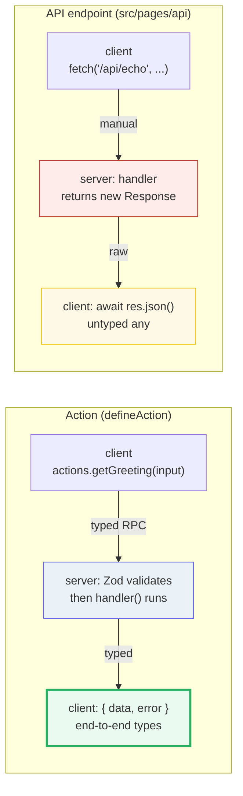
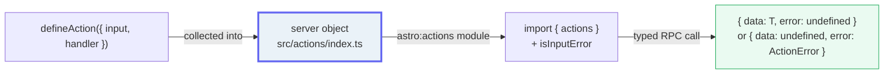

# Astro Actions &amp; API Endpoints

> **Companion demo:** [`astro_actions_endpoints.html`](./astro_actions_endpoints.html) — open in a browser.
> Every result below is rendered live by a tiny inline Zod-like validator in that explainer
> and verified against the official Astro docs. Nothing is hand-waved.

---

## 0. TL;DR — the one idea

> **The analogy:** Actions are type-safe server functions: call them like a local async fn from
> the client, get typed results + Zod validation for free — vs a raw API endpoint where you
> hand-roll `fetch` + `JSON` + types. An Action returns `{ data, error }` with end-to-end
> inferred types; an endpoint returns a raw `Response` whose body the client must `await
> res.json()` into an untyped `any`.



---

## 1. How it works — define, then call through `actions`

**Step 1 — define actions in `src/actions/index.ts`.** Each action is wrapped in
`defineAction()` (singular) from `astro:actions` and collected into a `server` object. The
`input` is a [Zod](https://docs.astro.build/en/reference/modules/astro-zod/) schema imported
from `astro/zod`; Astro validates it before your `handler` ever runs.

```ts
import { defineAction } from 'astro:actions';
import { z } from 'astro/zod';

export const server = {
  getGreeting: defineAction({
    input: z.object({ name: z.string().min(1) }),
    handler: async (input) => ({ message: `Hello, ${input.name}!`, chars: input.name.length }),
  }),
};
```

**Step 2 — call it from the client** by importing `actions` from `astro:actions`. It behaves
like a local async function — no `fetch`, no `JSON.parse`, no manual types:

```ts
import { actions, isInputError } from 'astro:actions';
const { data, error } = await actions.getGreeting({ name: 'Houston' });
if (isInputError(error)) console.log(error.fields.name); // validation messages
// data.message  <-- typed: string
```

The `defineAction` → `server` → `actions` import flow is the whole pipeline:



> **Version:** Actions were added in **`astro@4.15`** (previewed across 4.8–4.10) and require
> **on-demand (SSR) rendering** — both Actions and server endpoints must run on the server, so
> in `static` mode you opt a route out of prerendering with `export const prerender = false`.

---

## 2. The contrast in practice — same input, two paths

The live explainer calls a curated `getGreeting` Action and an `echo` endpoint with the same
input. The Action validates with Zod and returns a typed `{ data, error }`; the endpoint
returns a raw `Response` and echoes whatever it gets.

> From `astro_actions_endpoints.html` — **Action: valid call** (`name: "Houston"`):
> ```json
> {
>   "data": {
>     "message": "Hello, Houston!",
>     "chars": 7
>   }
> }
> ```
> `error === undefined`. `data` is typed end-to-end.

> From `astro_actions_endpoints.html` — **Action: invalid input** (`name: ""`, fails Zod):
> ```json
> {
>   "error": {
>     "type": "input",
>     "code": "BAD_REQUEST",
>     "fields": {
>       "name": ["String must contain at least 1 character(s)"]
>     }
>   }
> }
> ```
> The handler **never ran**. `isInputError(error) === true`, and `error.fields.name` carries
> the Zod messages. A wrong *type* (`name: 123`) is rejected too:
> `"Expected string, received number"`.

> From `astro_actions_endpoints.html` — **Endpoint: valid call** (`name: "Houston"`),
> after the client does `await res.json()`:
> ```json
> {
>   "response": { "status": 200, "statusText": "OK" },
>   "parsed": { "message": "Hello, Houston!", "chars": 7 }
> }
> ```
> `parsed` is `any` — no compile-time guarantee of its shape.

> From `astro_actions_endpoints.html` — **Endpoint: invalid input** (`name: ""`):
> ```json
> {
>   "status": 200,
>   "statusText": "OK",
>   "headers": { "Content-Type": "application/json" },
>   "body": "{\"message\":\"Hello, !\",\"chars\":0}"
> }
> ```
> **No validation** — the empty name is silently echoed as a `200`. Validation, status, and
> headers are all on you.

The gold-check in the live demo pins three deterministic facts about this very logic: a valid
call returns a typed success (`error === undefined`), an empty input fails Zod
(`isInputError(error) === true`), and the **action rejects a number** while the **endpoint
returns `200`** for the same invalid input.

---

## 3. Comparison — when to reach for which

| Aspect | Action (`defineAction`) | API endpoint (`src/pages/api`) |
|---|---|---|
| **Type-safe input** | yes — Zod schema (`astro/zod`) | no — you parse/validate `request.json()` yourself |
| **Type-safe return** | yes — `{ data, error }` inferred end-to-end | no — `await res.json()` is `any` |
| **Calling style** | `actions.name(input)` — like a local async fn | `fetch(url, opts)` + `res.json()` |
| **Validation errors** | `isInputError(error)` + `error.fields` keyed by field | hand-rolled status/body checks |
| **Serialization** | automatic (devalue: `Date`/`Map`/`Set`/`URL`) | manual `JSON.stringify` |
| **Status / headers** | handled for you | you set them on the `Response` |
| **Backend errors** | `throw new ActionError({ code, message })` | return a `Response` with a status code |
| **Best for** | app mutations, forms, typed client→server RPC | webhooks, RSS, images, non-Astro clients, raw JSON |

**Rule of thumb:** reach for an **Action** whenever the caller is your own client code and you
want end-to-end types + free validation. Reach for an **endpoint** when the caller is the web
itself (a webhook, an RSS reader, a `fetch` from another app, or a binary/image response) and a
raw `Response` is exactly the contract you need.

---

## Killer Gotchas

| Trap | Symptom | Fix |
|---|---|---|
| **Actions need on-demand (SSR) output** | Action call errors / form-action page won't render server-side | Install an adapter and enable on-demand rendering; in `static` mode add `export const prerender = false` to the page |
| Forgetting the `error` check | `data` is `undefined` after a failed call → runtime crash | Always `if (error) return;` (or `.orThrow()` for prototypes) before touching `data` |
| **Zod validation errors surface as `isInputError`** | You look for a thrown exception and miss it | Check `isInputError(error)` then read `error.fields.<name>` for the per-field messages |
| **Endpoints return a raw `Response`** | Missing `Content-Type`/status, wrong content type on some hosts | Build the `Response` explicitly: `new Response(body, { status, headers: { 'Content-Type': ... } })` |
| Returning non-JSON-serializable data from an Action | Dates/Maps look wrong, or you assumed `JSON.stringify` | Actions use **devalue**, so `Date`/`Map`/`Set`/`URL` survive — but the wire format is not plain JSON, so don't `fetch` the action URL expecting raw JSON |
| **Don't put secrets in client-visible code** | API keys/tokens shipped to the browser | Keep secrets in `handler`/server-only modules (server `import`s, `astro:env` server vars); the client only ever sees the `actions.*` function |
| Naming an action the same as a route | Route shadowing / 404 confusion | Actions are exposed under `/_actions/<name>`; keep names distinct from `src/pages` routes |
| Expecting an Action result to be inspectable on the network | "I can't see the JSON in DevTools" | Actions use a custom devalue format; inspect the returned `data` object, not the raw response |

### Cheat sheet

```ts
// --- define (src/actions/index.ts) ---
import { defineAction, ActionError } from 'astro:actions';
import { z } from 'astro/zod';

export const server = {
  like: defineAction({
    input: z.object({ id: z.string() }),
    handler: async (input, ctx) => {
      if (!ctx.cookies.has('user-session')) {
        throw new ActionError({ code: 'UNAUTHORIZED', message: 'Log in first.' });
      }
      return { id: input.id, likes: 42 };          // typed return
    },
  }),
};
```

```ts
// --- call from the client (typed RPC, no fetch) ---
import { actions, isInputError } from 'astro:actions';

const { data, error } = await actions.like({ id: 'abc' });
if (isInputError(error)) { /* error.fields.id */ }
else if (error)           { /* error.code, e.g. 'UNAUTHORIZED' */ }
else                      { /* data.likes  <-- number */ }

// prototype fast-path: throw instead of returning the error
const liked = await actions.like.orThrow({ id: 'abc' });
```

```ts
// --- the raw endpoint alternative (src/pages/api/echo.ts) ---
import type { APIRoute } from 'astro';
export const POST = (async ({ request }) => {
  const body = await request.json();           // YOU parse
  return new Response(JSON.stringify(body), {  // YOU serialize + set status/headers
    status: 200,
    headers: { 'Content-Type': 'application/json' },
  });
}) satisfies APIRoute;
```

```
# the rule:
#   Action  = defineAction({ input: zod, handler }) in src/actions/index.ts
#             -> actions.name(input) from the client; typed { data, error }; Zod validates
#   Endpoint= GET/POST/... in src/pages/api/*.ts -> returns a Response; you fetch + parse + type
# both need on-demand rendering (SSR). Use Actions for typed client->server RPC;
# use endpoints for webhooks / RSS / images / non-Astro callers / raw JSON.
```

---

## Sources

- Astro Docs — *Actions* (defineAction, the `server` object, `actions` import, `isInputError`, `ActionError`, added in `astro@4.15`, reduce boilerplate vs endpoints): https://docs.astro.build/en/guides/actions/
- Astro Docs — *Actions API Reference* (`defineAction()`, `actions`, `isInputError()`, `isActionError()`, `ActionError`, `SafeResult = { data } | { error }`, devalue serialization): https://docs.astro.build/en/reference/modules/astro-actions/
- Astro Docs — *Endpoints* (API routes: `src/pages/api/*.ts` exporting `GET`/`POST`/etc. returning a `Response`; `APIRoute` type + `satisfies`; on-demand rendering): https://docs.astro.build/en/guides/endpoints/
- Astro Docs — *On-demand rendering* (Actions/endpoints require SSR; `prerender = false`): https://docs.astro.build/en/guides/on-demand-rendering/
- Astro Docs — *astro/zod* (the Zod module Actions use for `input`): https://docs.astro.build/en/reference/modules/astro-zod/
- dev.to — *Why Astro's New Actions are the Upgrade React 19 Devs Have Been Waiting For* (secondary: cross-checks Zod-based type-safe form handling and the Actions-vs-endpoints boilerplate reduction): https://dev.to/rayenmabrouk/why-astros-new-actions-are-the-upgrade-react-19-devs-have-been-waiting-for-c25
