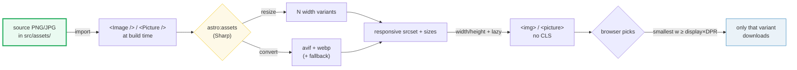

# astro:assets — Images Optimized at Build Time

> **Companion demo:** [`astro_assets_optimization.html`](./astro_assets_optimization.html) — open in a browser.
> Every optimization behavior below is rendered live in that explainer (a before/after
> payload + a viewport/DPR-driven srcset picker) and verified against the official Astro
> docs. Nothing is hand-waved.

---

## 0. TL;DR — the one idea

> **The analogy:** `astro:assets` is a **build-time photo lab**. You hand it a source image
> (imported from `src/assets/`), and Sharp processes it at build: it **resizes** to a set of
> widths, **converts** to modern **avif**/**webp**, and **emits a responsive `srcset`** with
> inferred `width`/`height` (no layout shift) and `loading="lazy"`. The browser then downloads
> **only the variant it needs** for the current screen + DPR. A raw hero PNG is usually the
> **Largest Contentful Paint (LCP)** element — so this is the single biggest lever for
> content-site performance.



The flip side — the trap that makes the rule worth knowing: **images in `public/` and plain
`` tags bypass all of this.** They are copied verbatim to `dist/` and every device
downloads the full file. Optimization only happens for **imported** images rendered through the
components.

---

## 1. How it works — import, render, ship

**Step 1 — put the image in `src/`.** Anything under `src/` (any folder) can be imported and
optimized. The `public/` folder is the explicit "leave it alone" escape hatch.

**Step 2 — import it and render with a component.** The import *is* the trigger: Astro sees
the ESM import, reads the real dimensions, and routes it through Sharp at build.

```astro
---
import { Image, Picture } from 'astro:assets';
import hero from '../assets/hero.png';   // 1600x900 — Astro reads its real dims
---
<!-- default: outputs a single optimized .webp, lazy, with width/height to avoid CLS -->
<Image src={hero} alt="Hero" />

<!-- multiple modern formats + a fallback, in priority order -->
<Picture src={hero} formats={['avif', 'webp']} alt="Hero" />
```

**Step 3 — the build emits the optimized markup.** For a prerendered page this is a static
file with hashed URLs under `/_astro/`; for on-demand (SSR) pages the transform happens on the
fly via an `/_image` endpoint.

```html
<!-- what <Picture formats={['avif','webp']} /> emits (simplified) -->
<picture>
  <source type="image/avif" srcset="/_astro/hero.hash.avif" />
  <source type="image/webp" srcset="/_astro/hero.hash.webp" />
  
</picture>
```

Three things to notice, because they are **defaults**, not opt-ins:

- **Default output format is `.webp`** for `<Image />`; `<Picture />` lets you stack `avif` +
  `webp` + a fallback so the browser takes the newest one it supports.
- **`width` and `height` are inferred** from the source for images in `src/` → no Cumulative
  Layout Shift (CLS). (For `public/` and remote images you must supply them, or use
  `inferSize`.)
- **`loading="lazy"` and `decoding="async"` are always added** unless you override — so
  below-the-fold images defer for free. For an above-the-fold **LCP** image, add the
  `priority` prop (Astro 5.10+) to flip it to `loading="eager"`, `decoding="sync"`,
  `fetchpriority="high"`.

---

## 2. The mechanism — responsive `srcset` and which variant wins

A responsive image generates **multiple widths** so the browser can pick. Astro gives you two
ways to drive it:

- **`densities={[1.5, 2]}`** (Astro 3.3+) — pixel-density multipliers; emits a `1.5x`/`2x`
  `srcset`. Mutually exclusive with `widths`.
- **`widths={[240, 540, 720, 1600]}` + `sizes="..."`** (Astro 3.3+) — explicit widths; the
  `sizes` attribute tells the browser the CSS display width per media condition.
- **`layout="constrained" | "full-width" | "fixed" | "none"`** (Astro 5.10+) — Astro
  **auto-generates** the `srcset` and `sizes` for you based on the layout type. This is the
  modern default; set it once via `image.layout` in `astro.config.mjs` and every image
  (including Markdown ``) becomes responsive.

> From `astro_assets_optimization.html` — the **constrained** layout variant set for a
> 1600-wide source, which is the exact set the Astro docs show (the deterministic anchor the
> demo's gold-check pins to **exactly 7 variants**):
>
> | Variant | webp (sim) | avif (sim) | vs raw PNG | Browser picks it at… |
> |---|---|---|---|---|
> | **640w** | 115 KB | 70 KB | −97% | viewport ≈ 640 px (DPR 1) |
> | **750w** | 135 KB | 83 KB | −96% | viewport ≈ 750 px (DPR 1) |
> | **800w** | 144 KB | 88 KB | −96% | the `constrained` cap (display width caps at 800 px) |
> | **828w** | 149 KB | 91 KB | −96% | ~828 px / 1.4× retina phones |
> | **1080w** | 194 KB | 119 KB | −94% | ~1080 px tablets |
> | **1280w** | 230 KB | 141 KB | −93% | ~1280 px laptops |
> | **1600w** | 288 KB | 176 KB | −91% | large screens / 2× retina at 800 px |
>
> Per-variant sizes are a **deterministic simulation** — a single `.html` cannot run Sharp —
> (`webp ≈ width × 0.18 KB`, `avif ≈ width × 0.11 KB`). The point is the shape and the
> tradeoffs, not the exact bytes.

The `constrained` layout emits `sizes="(min-width: 800px) 800px, 100vw"`, which means: on a
viewport ≥ 800 px the image is displayed at 800 CSS px; on a smaller viewport it fills the
width. The browser then takes the **smallest variant whose width is ≥ (display CSS px × DPR)**,
clamped to the largest variant (no upscaling). That is why:

> From `astro_assets_optimization.html` — the srcset picker (drag the slider / DPR in the demo):
>
> ```
>   viewport 320 px, DPR 1×  →  needs 320 device px  →  picks 640w  (smallest ≥ 320)   →  avif 70 KB
>   viewport 1600 px, DPR 1× →  display caps at 800  →  needs 800   →  picks 800w        →  avif 88 KB
>   viewport 800 px, DPR 2×  →  display caps at 800  →  needs 1600  →  picks 1600w       →  avif 176 KB
> ```
>
> So the raw 2 MB PNG sent to a 360 px phone drops to ~70 KB of avif — about a **29× payload
> reduction** — and the user sees a sharp image because 640 device-px of source ≥ the 360 px
> screen. The gold-check asserts the picker returns `640w` for (320, DPR 1) and `800w` for
> (1600, DPR 1).

### Why this is an LCP win

Per web.dev, images are common **Largest Contentful Paint** candidates, and the responsive
`srcset` + `sizes` mechanism exists precisely so "the browser fetches a version of the image
that's just a *little* wider than your screen — high-resolution without wasting data, and it
loads faster." Smaller variant → earlier LCP; correct `width`/`height` → no CLS; `priority` on
the hero → it's discovered and fetched early.

---

## 3. Remote images — the allowlist + `inferSize`

Remote (`https://…`) images need extra care because Sharp has to fetch them:

- **Authorize the source.** Add the host to `image.domains` or `image.remotePatterns` in
  `astro.config.mjs`. Remote images from anywhere else are rendered **unoptimized** (the
  component still prevents CLS).
- **Supply dimensions, or infer them.** Remote images have no import metadata, so you must
  pass `width`/`height` — or add `inferSize` (Astro 4.4+) to have Astro fetch the real
  dimensions at build. (As of Astro 5.17.3, `inferSize` only fetches for **authorized**
  domains.)

```js
// astro.config.mjs
export default defineConfig({
  image: {
    domains: ['astro.build'],
    // or fine-grained patterns:
    // remotePatterns: [{ protocol: 'https' }],
  },
});
```

```astro
---
import { Image } from 'astro:assets';
---
<Image src="https://astro.build/remote.png" inferSize alt="…" />
```

---

## 4. What astro:assets does → benefit

| What astro:assets does | Benefit |
|---|---|
| Resizes the source into N width variants | Browser downloads only the width it needs (bandwidth + LCP) |
| Converts to **avif** / **webp** (default webp) | Modern codecs are ~30–60% smaller than PNG/JPG at equal quality |
| Emits a responsive `srcset` + `sizes` | One `` works from 360 px phones to 4K, no manual `@2x` files |
| Infers `width`/`height` from the import | No Cumulative Layout Shift (CLS) — content doesn't jump on load |
| Adds `loading="lazy"` + `decoding="async"` by default | Below-the-fold images defer for free; `priority` opts the LCP image into eager |
| Hashes + caches outputs under `/_astro/` | Long-term caching; unchanged images are reused across builds |
| `<Picture formats={[...]}>` | Progressive enhancement: newest supported format wins, old format as fallback |

---

## Killer Gotchas

| Trap | Symptom | Fix |
|---|---|---|
| **Referencing an image by string path instead of importing it** | No optimization — you ship the raw file | Import it from `src/`: `import hero from '../assets/hero.png'` then `<Image src={hero} … />`. String paths + `public/` are never optimized |
| **Remote image not in the allowlist** | Image renders but is **not** optimized/transformed | Add the host to `image.domains` or `image.remotePatterns` in `astro.config.mjs` |
| **`<Image />` on a remote/`public/` image without dimensions** | Astro errors — it can't read the dims | Pass `width`/`height`, or add `inferSize` (remote only; needs an allowed domain) |
| **Using `densities` together with `widths` or a `layout`** | `densities` is silently ignored | They're mutually exclusive. Pick one: `densities`, `widths`+`sizes`, or a `layout` |
| **Huge image set + `constrained`/`full-width` layout** | Build gets slow (N variants × every image, all at build) | Expected for prerendered pages; narrow `widths`, or accept a longer first build (results are cached) |
| **Forgetting `alt`** | Build error — `alt` is **required** on both components | Always pass `alt`, or `alt=""` for decorative images |
| **Expecting `<Image />` inside a React/Svelte island** | It's unavailable there (an island can only contain its own framework's code) | Render the `<Image />` in the `.astro` file and pass it as children/slot, or use the framework's own `` with `stars.src` |
| **LCP hero stuck on `loading="lazy"`** | Hero image defers, hurting LCP | Add `priority` (Astro 5.10+): flips to `eager`/`sync`/`fetchpriority="high"` |

### Cheat sheet

```astro
---
import { Image, Picture } from 'astro:assets';
import hero from '../assets/hero.png';   // import => optimized; public/ is NOT
---
<!-- single optimized webp, lazy, inferred w/h (no CLS) -->
<Image src={hero} alt="Hero" />

<!-- LCP hero: eager + high fetch priority -->
<Image src={hero} alt="Hero" priority />

<!-- avif first, then webp, then the png fallback -->
<Picture src={hero} formats={['avif','webp']} alt="Hero" />

<!-- explicit responsive set (needs sizes) -->
<Image src={hero} widths={[480, 800, 1200, hero.width]}
       sizes="(max-width: 600px) 480px, (max-width: 1000px) 800px, 1200px" alt="Hero" />

<!-- the modern default: layout auto-generates srcset + sizes -->
<Image src={hero} alt="Hero" layout="constrained" width={800} height={600} />
```

```js
// astro.config.mjs — make ALL imported/markdown images responsive by default
export default defineConfig({
  image: {
    layout: 'constrained',          // auto srcset + sizes for every image
    responsiveStyles: true,         // ship the object-fit/max-width CSS
    domains: ['astro.build'],       // allowlist for remote optimization
  },
});

//  src/ import   => optimized (resize + avif/webp + srcset + lazy + w/h)
//  public/       => copied verbatim, NEVER optimized
//  remote https  => optimized ONLY if the host is in domains/remotePatterns
//  <Image/>      => single webp by default; <Picture/> => avif+webp+fallback
//  width/height  => inferred for src/; required for public/ + remote (or inferSize)
//  LCP hero      => add priority (eager + fetchpriority=high)
```

---

## Sources

- Astro Docs — *Images* guide (where to store images, `src/` vs `public/`, `<Image />`/`<Picture />`, responsive `layout`, authorizing remote images, `inferSize`): https://docs.astro.build/en/guides/images/
- Astro Docs — *`astro:assets` API reference* (`<Image />` and `<Picture />` props incl. `densities`/`widths`/`sizes`/`format`/`quality`/`inferSize`/`priority`/`layout`; the verbatim 7-variant `constrained` srcset `640w,750w,800w,828w,1080w,1280w,1600w`; `getImage()`; `inferRemoteSize()`): https://docs.astro.build/en/reference/modules/astro-assets/
- Astro Docs — *Configuration reference* (`image.domains`, `image.remotePatterns`, `image.layout`, `image.responsiveStyles`): https://docs.astro.build/en/reference/configuration-reference/
- web.dev — *Preload responsive images* (why `srcset`+`sizes` exists: browser "fetches a version a little wider than the screen — high-resolution without wasting data"; images as LCP candidates): https://web.dev/articles/preload-responsive-images
- web.dev — *Largest Contentful Paint (LCP)* (images as LCP elements; sizing/priority/load behavior): https://web.dev/articles/lcp
- MDN — *Responsive images* (the `srcset` + `sizes` selection algorithm the picker in the demo replicates): https://developer.mozilla.org/en-US/docs/Web/HTML/Guides/Responsive_images
