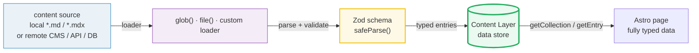
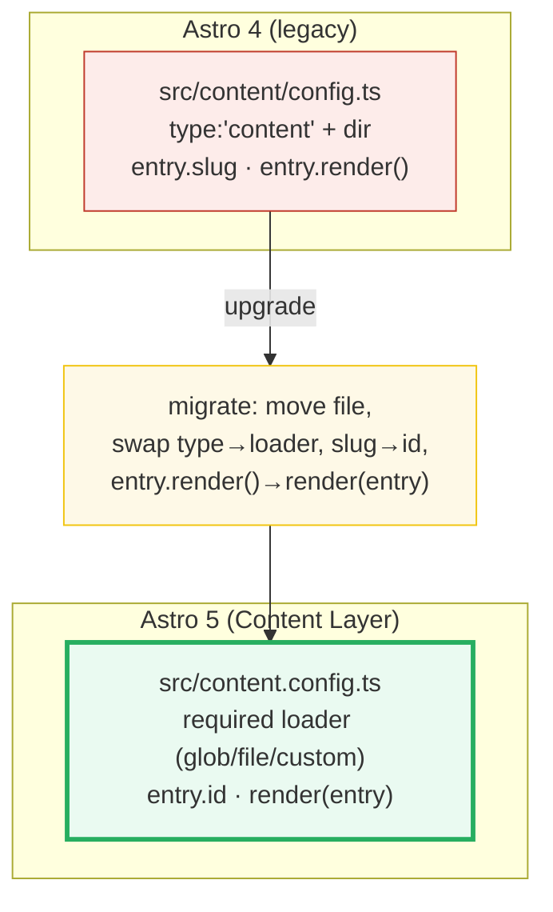

# Astro Content Collections

> **Companion demo:** [`astro_content_collections.html`](./astro_content_collections.html) — open in a browser.
> **Status:** Astro 5+ (Content Layer API). Verified Jun 2026 against the current `docs.astro.build`.

---

## 0. TL;DR — the one idea

> **The analogy:** a content collection is a **typed gateway to your content**: define a Zod
> **schema**, point a **loader** at your files (or remote data), get fully-typed queries via
> `getCollection()` — no more `any` frontmatter. Astro 5's **Content Layer** is the data store
> that sits between *where your content lives* and *how you query it*, so local Markdown and a
> remote CMS look identical to your pages.



A schema mismatch is a **build error, not a runtime one** — Astro refuses to ship an entry whose
frontmatter fails `safeParse()`. The live demo lets you toggle a field and watch the parse flip.

---

## 1. How it works (Astro 5 API)

### 1.1 Define the collection in `src/content.config.ts`

Astro 5 **moved** the config file from `src/content/config.ts` (Astro 4) up to the `src/` root.
Every collection needs a **required `loader`** and an **optional Zod `schema`**:

```ts
// src/content.config.ts  ← lives at the src/ root in Astro 5
import { defineCollection } from 'astro:content';
import { glob } from 'astro/loaders';        // glob() & file() added in astro@5.0.0
import { z } from 'astro/zod';               // Zod, re-exported by Astro

const blog = defineCollection({
  loader: glob({ pattern: '**/*.md', base: './src/content/blog' }),
  schema: z.object({
    title:   z.string(),
    pubDate: z.coerce.date(),            // '2025-01-02' → Date
    tags:    z.array(z.string()),
    draft:   z.boolean().optional(),     // optional field
  }),
});

export const collections = { blog };
```

### 1.2 The loader ingests entries

The `glob()` loader turns each `src/content/blog/*.md` into an **entry**:

- `id` — auto-generated, kebab-cased from the filename (via `github-slugger`); overridable with a
  `slug` frontmatter field. (Astro 4 used `entry.slug`; Astro 5 uses `entry.id`.)
- `data` — the frontmatter, **after** Zod validation/`coerce`.
- `body` — the raw, uncompiled Markdown/MDX body.

### 1.3 Query with `getCollection()`

```ts
import { getCollection, render } from 'astro:content';

const posts = await getCollection('blog');                 // CollectionEntry<'blog'>[]
const draft = await getCollection('blog', ({ data }) => data.draft !== true);
const entry = await getEntry('blog', 'welcome-to-astro');
const { Content } = await render(entry);                   // render MD/MDX to HTML
```

> **Astro 4 → 5:** `entry.render()` became the standalone `render(entry)` imported from
> `astro:content`. The sort order of `getCollection()` is **non-deterministic** — sort it
> yourself (`posts.sort((a,b) => b.data.pubDate - a.data.pubDate)`).

---

## 2. The live validator (rendered truth)

The companion demo simulates `z.object().safeParse()` on a curated 4-entry `blog` collection.
Every result below is computed by the demo's inline Zod-like validator — nothing is hand-waved.

> From astro_content_collections.html — the curated collection (exactly 4 entries):
> ```
>   welcome-to-astro     · title: "Welcome to Astro"          · tags:[intro,astro]   · valid
>   content-collections  · title: "Type-safe Content..."      · tags:[content,zod]   · valid
>   islands-architecture · title: "Islands Architecture..."   · tags:[islands,...]   · valid
>   draft-wip            · title: "Work in Progress"          · tags:[meta] · draft  · valid
> [check] 4 entries & valid-passes=yes & title-drop-rejected=yes: OK
> ```

> From astro_content_collections.html — toggling a frontmatter field flips the parse:
> ```
>   (all fields intact)            safeParse() → success   data is fully typed
>   drop `title` (required)        safeParse() → error     zod error — title: Required
>   drop `pubDate` (required)      safeParse() → error     zod error — pubDate: Required
>   tags = "astro" (not array)     safeParse() → error     zod error — tags: Expected array, received string
>   draft = "yes" (not boolean)    safeParse() → error     zod error — draft: Expected boolean, received string
>   add unknown `author` key       safeParse() → success   unknown key is stripped (Zod default)
> ```

The gold-check pins three deterministic facts about that curated data: **4 entries**, a **valid**
entry **passes**, and the same entry with its **`title` dropped is rejected**.

---

## 3. Loaders — the Content Layer unifies local + remote

The headline change in Astro 5: **a `loader` is now required**, and the Content Layer lets a
collection ingest **any** data source — not just local Markdown. `getCollection()` is identical
regardless of where the bytes came from.

| Loader | Source | Use case | Notes |
|---|---|---|---|
| `glob({ pattern, base })` | local `*.md`/`*.mdx`/Markdoc/JSON/YAML/TOML dirs | Blogs, docs, marketing — the ~80% case | auto-generates `id` from filename; built-in |
| `file(fileName)` | a single local JSON/YAML/TOML (or `.csv` via `parser`) | authors/products in one file, nested JSON | each entry needs a unique `id` key |
| **custom loader** | **remote** — CMS, DB, REST/GraphQL API, GitHub repo | headless CMS, external data | Content Loader API; returns `{ name, load, schema? }` |
| **loader as function** | simple `fetch()` | quick one-off remote pulls | `async () => [{ id, ... }]` shorthand |
| **live loader** | runtime (per request) | stock prices, inventory, user-specific data | `getLiveCollection()`; no MDX/image opt at runtime |



---

## Killer Gotchas

| Trap | Symptom | Fix |
|---|---|---|
| **Config in the old place** (`src/content/config.ts`) | Astro 5 doesn't pick the collections up; types are `any` / "no collection" | Move it to **`src/content.config.ts`** (the `src/` root). `.js`/`.mjs` also OK |
| **No `loader` key** (copy-pasted from an Astro 4 `type:'content'` collection) | build error / collection not registered | Every collection **requires** a `loader`: `glob(...)`, `file(...)`, custom, or a function |
| **Schema mismatch is a BUILD error, not runtime** | `astro build` aborts with a Zod error; the page never ships | Fix the frontmatter **or** loosen the schema (`optional()`, `coerce`, `z.any()`). It failing at build is the feature |
| `entry.slug` is `undefined` after upgrading | dynamic routes 404; `params: { slug }` breaks | Use **`entry.id`**; rename `[...slug].astro` → `[...id].astro`; `getStaticPaths` returns `params: { id: entry.id }` |
| `entry.render()` no longer exists | `is not a function` on a content entry | Import **`render`** from `astro:content`: `const { Content } = await render(entry)` |
| `getCollection()` returns in random order | posts reshuffle between builds/deploys | the sort order is **non-deterministic** — always `.sort()` by your own key |
| `layout:` frontmatter no longer auto-applied (Astro 5) | Markdown entries render without your layout | wrap `<Content />` in an explicit layout component; pass `frontmatter={entry.data}` |
| Content **must** live under `src/content/` | (no longer true) | With the Content Layer, `base` can point **anywhere**; multiple collections can share a directory |

### Cheat sheet

```ts
// src/content.config.ts  — Astro 5 (Content Layer)
import { defineCollection } from 'astro:content';
import { glob, file } from 'astro/loaders';   // added astro@5.0.0
import { z } from 'astro/zod';                // Zod re-export

const blog = defineCollection({
  loader: glob({ pattern: '**/*.{md,mdx}', base: './src/content/blog' }),
  schema: z.object({
    title: z.string(),
    pubDate: z.coerce.date(),
    tags: z.array(z.string()),
    draft: z.boolean().optional(),
    author: reference('authors'),              // typed cross-collection ref
  }),
});
export const collections = { blog };
```

```ts
// query (in any .astro page)
import { getCollection, getEntry, render } from 'astro:content';

const posts = (await getCollection('blog'))
  .filter(({ data }) => !data.draft)
  .sort((a, b) => b.data.pubDate.valueOf() - a.data.pubDate.valueOf());  // sort yourself!
const { Content } = await render(await getEntry('blog', 'welcome-to-astro'));
```

```
Astro 4 → 5 move:   src/content/config.ts   →  src/content.config.ts
                    type:'content' + dir    →  loader: glob({ pattern, base })
                    entry.slug              →  entry.id
                    entry.render()          →  render(entry)   (import from astro:content)
```

---

## Cross-refs

- 🔗 [`astro_routing_layouts`](./astro_routing_layouts.html) — a collection feeds dynamic routes:
  `getStaticPaths()` maps `getCollection('blog')` → `params: { id: entry.id }`.
- 🔗 [`astro_islands`](./astro_islands.html) — an MDX entry rendered via `render(entry)` can drop
  in as a hydrated island inside an otherwise static page.

---

## Sources

Verified Jun 2026. The Astro 5 config path and loader API are confirmed in **≥2 places**:

- **Astro Docs — Content collections** (the canonical guide): https://docs.astro.build/en/guides/content-collections/
  — confirms config lives at **`src/content.config.ts`** (`.js`/`.mjs` also supported); every
  collection needs a **required `loader`** + optional Zod `schema`; `glob()`/`file()` import from
  `astro/loaders`; query with `getCollection()`/`getEntry()`/`render()`.
- **Astro Docs — Content Loader API** (reference): https://docs.astro.build/en/reference/content-loader-reference/
  — confirms `glob()` and `file()` are **`Added in: astro@5.0.0`**; `glob({ pattern, base,
  generateId?, retainBody? })`; custom loader returns `{ name, load, schema? }`; live loaders for
  runtime data.
- **Chen Hui Jing — *Migrating content collections from Astro 4 to 5*** (secondary, ≥2nd source
  for the config-path move + Astro 4→5 diff): https://chenhuijing.com/blog/migrating-content-collections-from-astro-4-to-5/
  — confirms `src/content/config.ts` → `src/content.config.ts`, `type:'content'` →
  `loader: glob(...)`, `entry.slug` → `entry.id`, `entry.render()` → `render(entry)`.
- Astro 5 release (Content Layer introduction): https://github.com/withastro/astro/releases/tag/astro%405.0.0

> **Unverifiable / version note:** Astro 5 re-exports Zod 3 as `astro/zod`; Astro 6 upgrades to
> Zod 4. The schema primitives used here (`z.string/array/boolean/coerce.date/.optional`,
> `reference`) are identical across both, so the demo and cheat sheet are version-stable.
