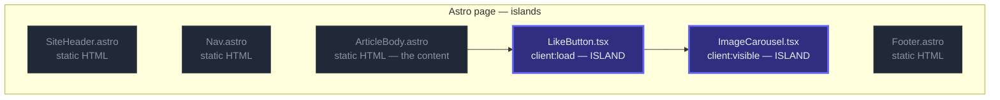
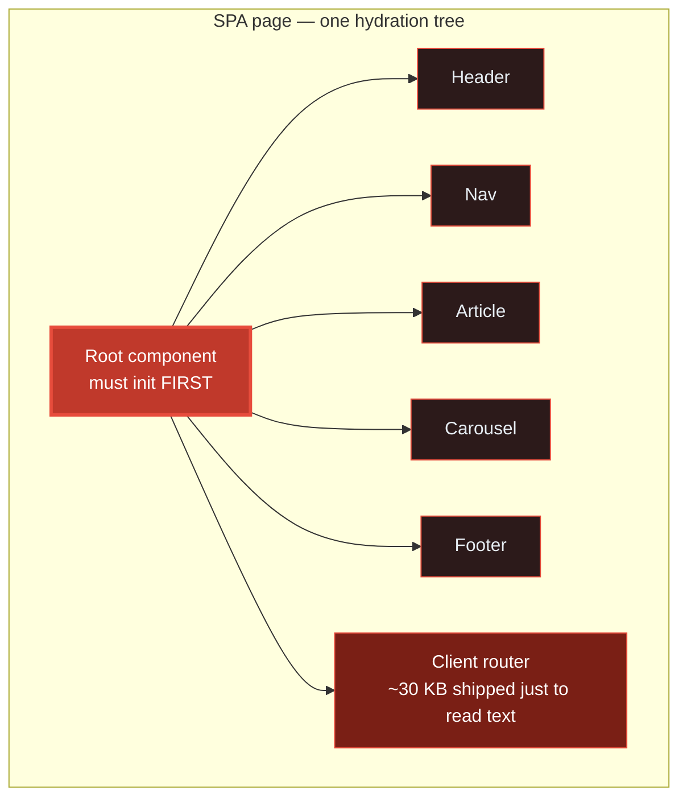
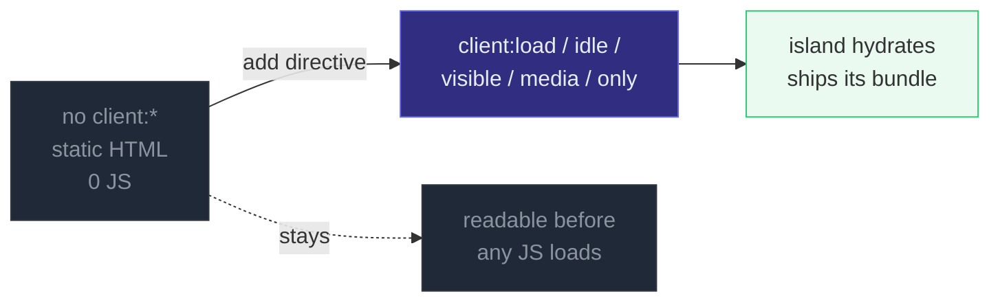

# Astro Islands Architecture

> **Companion demo:** [`astro_islands.html`](./astro_islands.html) — open in a browser.
> It is an **interactive islands simulator**, not a running Astro build: a sample
> page where you toggle which components are islands and watch the JS-shipped
> counter respond. Every number below is computed by that file's JS-budget math.

---

## 0. TL;DR — the one idea

> **The analogy:** an Astro page is a **sea of static HTML**; islands are the bits
> that get **hydrated** — the rest ships **zero JS**. An SPA, by contrast, hydrates
> *everything* in one monolithic client app. Astro makes interactivity **opt-in**:
> a framework component ships JavaScript only when you tag it with a `client:*`
> directive.





> An SPA hydrates top-down from a single root — a slow descendant blocks the
> rest. Astro islands hydrate **independently**; there is no shared root.

---

## 1. How it works

**Step 1 — everything renders to static HTML on the server.** Astro components
(`.astro`) are HTML-only templating components with **no client-side runtime**.
Framework components (React, Svelte, Vue, Solid, Preact) are also server-rendered
to HTML & CSS by default — Astro **automatically strips out all client-side
JavaScript** unless you opt in.

**Step 2 — opt a component into interactivity with a `client:*` directive.**
Adding `client:load` (or `idle`, `visible`, `media`, `only`) tells Astro to build
and bundle that one component's JavaScript and hydrate it on the client. The rest
of the page stays static.

```astro
---
import LikeButton from "./LikeButton.tsx";
---

<!-- No directive: rendered to plain HTML, NOT interactive, ships 0 JS -->
<LikeButton />

<!-- With a directive: hydrated into an interactive island, ships its JS -->
<LikeButton client:load />
```

**Step 3 — islands hydrate independently.** Each island is an isolated widget.
A heavy `client:visible` carousel at the bottom of the page does not block a
`client:load` buy button at the top — they load in parallel and hydrate on their
own schedules. From Jason Miller's original post: *"Each part of the page is an
isolated unit, and a performance issue in one unit doesn't affect the others."*



---

## 2. The math — JS shipped, live

The simulator models a sample blog-post page (8 components, 4 of them React) with
a JS budget: React+ReactDOM runtime is **~45 KB** (gzipped), loaded **once** when
the first island hydrates; each component adds its own bundle; an SPA would
additionally ship a **~30 KB** client router and hydrate **every** component.

> From astro_islands.html (the "zero JS" preset — every framework component at
> `none`, the default):
> ```
>   SiteHeader.astro    static   0 KB
>   Nav.astro           static   0 KB
>   ArticleBody.astro   static   0 KB
>   NewsletterForm.tsx  none     0 KB   (rendered to HTML, NOT interactive)
>   ImageCarousel.tsx   none     0 KB   (rendered to HTML, NOT interactive)
>   LikeButton.tsx      none     0 KB   (rendered to HTML, NOT interactive)
>   DarkModeToggle.tsx  none     0 KB   (rendered to HTML, NOT interactive)
>   Footer.astro        static   0 KB
>
>   Astro shipped:   0 KB    (React runtime: not loaded — no island hydrated)
>   SPA equivalent:  100 KB  (45 react + 30 router + 4 + 18 + 1 + 2)
>   -> zero JavaScript leaves the server. The page is pure HTML.
> [check] all-islands-off===0KB: OK
> ```

> From astro_islands.html (the "content page" preset — small interactive bits
> hydrated, heavy carousel kept static):
> ```
>   LikeButton.tsx      client:load      + 1 KB
>   DarkModeToggle.tsx  client:idle      + 2 KB
>   NewsletterForm.tsx  client:visible   + 4 KB
>   ImageCarousel.tsx   none               0 KB   (stays static HTML)
>
>   Astro shipped:  45 + 1 + 2 + 4 = 52 KB
>   SPA equivalent: 100 KB
>   -> ~48% less JS than the SPA, and the carousel never ships unless scrolled to.
> ```

> From astro_islands.html (the "max islands" preset — every React component at
> `client:load`):
> ```
>   Astro shipped:  45 + 4 + 18 + 1 + 2 = 70 KB
>   SPA equivalent: 100 KB
>   -> even with every island hydrated, Astro still ships 30 KB less than the SPA
>      because there is no client-side router — Astro is page-oriented.
> ```

---

## 3. Which component ships JS, and when?

| Component type | Default behavior | Ships JS? | When does it ship JS? |
|---|---|---|---|
| `.astro` component | renders to static HTML, no runtime | **never** | never — it has no client runtime by design |
| framework component, **no directive** | renders to static HTML & CSS, JS stripped | **NO** | never — it is NOT interactive in the browser |
| framework component + `client:load` | hydrates immediately on page load | yes | right away (high priority) |
| framework component + `client:idle` | hydrates on `requestIdleCallback` / `load` | yes | when the browser is idle (medium) |
| framework component + `client:visible` | hydrates when it enters the viewport | yes | on `IntersectionObserver` fire (low) |
| framework component + `client:media` | hydrates when a CSS media query matches | yes | on media-match (low) |
| framework component + `client:only` | **skips server render**, client-only | yes | immediately, like `client:load`, but no SSR HTML |

> The single most important row is the second one: a framework component with no
> `client:*` directive is **rendered to HTML and is not interactive**. This is
> Astro's "fast by default" guarantee — the framework runtime never ships unless
> you ask.

---

## Killer Gotchas

| Trap | Symptom | Fix |
|---|---|---|
| A framework component with **no `client:*` directive** | renders fine but clicking does nothing — it's static HTML, NOT interactive | add the directive that matches its priority: `client:load` for ASAP, `client:visible` for below-the-fold |
| Expecting islands to share state like SPA siblings | two islands each have their own React root; `useState` in one is invisible to the other | lift shared state to a parent `.astro` via a shared store / events; Astro has a dedicated "share state between islands" recipe |
| Assuming a slow island blocks the rest | it doesn't — but it CAN hurt the *perceived* perf of that one region | move heavy islands to `client:visible` so they never load if off-screen |
| `client:only` rendered on the server | build error / blank SSR output — `client:only` **skips server render entirely** | you MUST pass the framework: `client:only="react"`; provide `slot="fallback"` content for the loading gap |
| Forgetting that `client:media` still ships the JS | the component is hidden by CSS but its bundle still downloads if the media query matches | if it's purely CSS show/hide, consider `client:visible` instead, or omit the directive |
| Treating Astro like an SPA router | client-side route transitions feel bolted-on — because they are | Astro is page-oriented; for app-like navigation use View Transitions / `prefetch`, or pick TanStack Start (see metaframework landscape) |

### Cheat sheet

```astro
---
import Buy from "./Buy.tsx";
import Carousel from "./Carousel.tsx";
import Toggle from "./Toggle.tsx";
---

<!-- .astro: always static HTML, 0 JS, no client runtime -->
<Header />

<!-- framework component, NO directive: static HTML, NOT interactive, 0 JS -->
<Buy />                       <!-- looks right, clicks do nothing -->

<!-- framework component WITH directive: hydrated island, ships JS -->
<Buy client:load />           <!-- high: hydrate immediately -->
<Toggle client:idle />        <!-- medium: hydrate when browser is idle -->
<Carousel client:visible />   <!-- low: hydrate when scrolled into view -->
<Carousel client:media="(max-width: 50em)" />  <!-- hydrate on media match -->
<Chart client:only="react" /> <!-- skip server render; client-only; MUST name framework -->

<!-- the zero-JS-by-default rule, in one line: -->
<!--   no client:*  =>  static HTML, 0 KB JS shipped, NOT interactive -->
```

---

## Sources

- Astro Docs — *Islands architecture* (the concept page; "render to static HTML with no client-side runtime", "stripping out all client-side JavaScript automatically", islands hydrate independently): https://docs.astro.build/en/concepts/islands/
- Astro Docs — *Template directives reference* (the `client:*` directives; "By default, a UI Framework component is not hydrated… If no `client:*` directive is provided, its HTML is rendered onto the page without JavaScript"; `client:only` skips server render): https://docs.astro.build/en/reference/directives-reference/
- Astro Docs — *Astro Components* (".astro components are HTML-only templating components with no client-side runtime"): https://docs.astro.build/en/basics/astro-components/
- Jason Miller (Preact creator) — *Islands Architecture* (Aug 11 2020; the original post expanding Katie Sylor-Miller's 2019 "component islands" coinage; "render HTML pages on the server, and inject placeholders or slots around highly dynamic regions… hydrated on the client into small self-contained widgets"; "a performance issue in one unit doesn't affect the others"): https://jasonformat.com/islands-architecture/
- Astro Docs — *Share state between islands* (the islands-don't-share-state gotcha + recipe): https://docs.astro.build/en/recipes/sharing-state-islands/
