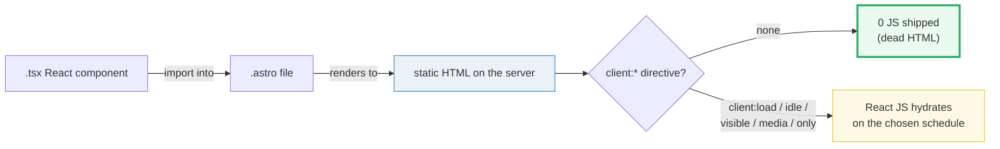
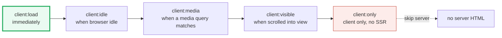

# React in Astro

> **Companion demo:** [`astro_react_integration.html`](./astro_react_integration.html) — open in a browser.
> Every directive behavior below is rendered live in that explorer and verified
> against the official Astro docs. Nothing is hand-waved.

---

## 0. TL;DR — the one idea

> **The analogy:** React in Astro is an **ISLAND**. The component renders to HTML on
> the server, then a `client:*` directive decides *when* (or *whether*) React's JS
> wakes up. **No directive → the island is dead HTML that ships 0 bytes of JS.**
> This is Astro's whole pitch: most of the page is static, and you pay for React
> only on the islands you explicitly mark.



---

## 1. How it works — install, import, hydrate

**Step 1 — add the integration.** From your project:

```bash
npx astro add react
```

This installs `@astrojs/react` (plus `react` / `react-dom` and types) and registers
it in `astro.config.mjs`:

```js
import { defineConfig } from 'astro/config';
import react from '@astrojs/react';

export default defineConfig({
  integrations: [react()],
});
```

**Step 2 — import a `.tsx` into an `.astro` file.** The component runs on the
server and its output becomes static HTML:

```astro
---
import CartButton from '../components/CartButton.tsx';
---
<CartButton product={data} />          <!-- static HTML, 0 JS -->
<CartButton product={data} client:load />  <!-- hydrated immediately -->
```

**Step 3 — choose a `client:*` directive.** The directive is the only thing that
turns the static island into running React. Exactly **five** are defined:



> From `astro_react_integration.html` — the directive comparison table:
>
> | Directive | Hydrates when | Ships JS when | Best for |
> |---|---|---|---|
> | **(no directive)** | Never — stays static HTML | **0 JS (never)** | Static content; server data needing no interactivity |
> | **`client:load`** | Immediately on page load | At page load (immediately) | Above-the-fold UI that must be instantly interactive (nav, buy button) |
> | **`client:idle`** | After initial load, when the browser is idle (`requestIdleCallback`) | After the initial load, when idle | Lower-priority widgets that don't need to be instantly clickable |
> | **`client:visible`** | When it scrolls into the viewport (`IntersectionObserver`) | Only once the element enters the viewport | Below-the-fold / heavy islands; may never load if unseen |
> | **`client:media`** | When a CSS media query matches (e.g. `(max-width: 50em)`) | Only when the query is satisfied | Elements that only exist on certain screen sizes (mobile sidebar) |
> | **`client:only`** | On the client only — **server render is skipped** | At page load (like `client:load`), but with no server HTML first | Components that can't run on the server (`window`/`document` at render, canvas) |
>
> The gold-check in the live demo asserts three facts about this very table:
> exactly 5 `client:*` directives exist, **no directive ships 0 JS**, and
> **`client:load` ships its JS at load**.

---

## 2. The mechanism — why "no directive" is the superpower

Astro's default is the opposite of a normal React app. Per the official directives
reference: *"If no `client:*` directive is provided, its HTML is rendered onto the
page without JavaScript."* So a `<CartButton />` with no directive produces the
button's markup but **zero** React runtime — no `react`, no `react-dom`, no
component bundle. The page is just HTML+CSS.

Add `client:load` and Astro now ships the React runtime + the component, downloads
and parses it during the critical initial load, and hydrates the island immediately.
The other four directives change **only the schedule** for when that same bundle
wakes up (or whether it ships at all):

- `client:idle` defers to `requestIdleCallback` (falls back to the `load` event).
- `client:visible` waits for an `IntersectionObserver` to fire.
- `client:media` waits for `matchMedia` on the given query.
- `client:only` is like `client:load` but **skips server rendering entirely** — the
  island is born in the browser, so you must tell Astro the framework
  (`client:only="react"`) and it cannot read server data at render time.

> From `astro_react_integration.html` — the simulated JS / time-to-interactive for
> one sample island (React + component ≈ 45 KB):
>
> | Directive | JS shipped | Time-to-interactive (after load) | Server HTML? |
> |---|---|---|---|
> | **(no directive)** | **0 KB** | never (static) | yes |
> | `client:load` | 45 KB | 0 ms (immediate) | yes |
> | `client:idle` | 45 KB | ~200 ms (after idle) | yes |
> | `client:visible` | 45 KB* | when scrolled into view | yes |
> | `client:media` | 45 KB* | when the query matches | yes |
> | `client:only` | 45 KB | 0 ms (immediate) | **no** |
>
> \* `client:visible` / `client:media` ship 0 KB until their condition is met; if it
> never is, the JS never ships at all. The numbers are an illustrative deterministic
> model — the *tradeoffs* are what matter.

---

## Killer Gotchas

| Trap | Symptom | Fix |
|---|---|---|
| **Forgetting the directive** | Your "interactive" React component is just static HTML — clicks do nothing | Add the right `client:*`. No directive = static, NOT interactive (by design) |
| `client:only` reading server data at render | Crashes / `window is not defined`, or blank until JS loads | `client:only` **skips the server**, so it can't use server-fetched data at render. Use `client:load` if you need SSR data, or fetch on the client |
| `client:visible` that never becomes visible | Island never hydrates | It needs the element to actually enter the viewport. Don't use it for anything the user might never scroll to |
| Slapping `client:load` on everything | Astro's zero-JS advantage disappears; you've rebuilt a SPA | Default to *no directive*; promote to `client:idle`/`visible`; reserve `client:load` for truly instant UI |
| `client:media` with a query that never matches | JS never ships, island never wakes | Verify the query can actually match the target devices; or use plain CSS + `client:visible` |
| Passing a directive via a dynamic component/spread | Directive silently ignored | A `client:*` only works on a **directly imported** UI-framework component, not on dynamic tags or `components`-prop swaps |
| `client:only` without the framework value | Astro errors — it doesn't know which renderer to use | Always pass it: `client:only="react"` |

### Cheat sheet

```astro
---
import Counter from '../components/Counter.tsx';
---
<!-- no directive => static HTML, 0 JS shipped (the default, and usually the right call) -->
<Counter />

<!-- hydrate immediately: fastest interactive, ships JS on load -->
<Counter client:load />

<!-- hydrate when the browser is idle: defers off the critical load -->
<Counter client:idle />

<!-- hydrate when scrolled into view: saves JS if never seen -->
<Counter client:visible />

<!-- hydrate when a media query matches: e.g. mobile-only sidebar -->
<Counter client:media="(max-width: 50em)" />

<!-- skip the server entirely: client-only, MUST name the framework -->
<Counter client:only="react" />
```

```
# install once (adds @astrojs/react + react/react-dom, registers the integration)
npx astro add react

# the rule:  no directive        => 0 JS, static HTML
#            client:load         => immediate, ships on load
#            client:idle/visible/media => defers the same bundle
#            client:only         => no SSR, client-only, name the framework
```

---

## Sources

- Astro Docs — *Template directives reference* (the five `client:*` directives + the "no directive = HTML without JavaScript" rule): https://docs.astro.build/en/reference/directives-reference/
- Astro Docs — *@astrojs/react* integration (install with `npx astro add react`, `integrations: [react()]`, current line v6.0.0): https://docs.astro.build/en/guides/integrations-guide/react/
- Astro Docs — *Front-end frameworks* (how framework components are imported/hydrated in `.astro`): https://docs.astro.build/en/guides/framework-components/
- Mirko (Medium) — *Astro client directives explained* (secondary, cross-checks the behavior of all five directives): https://medium.com/@mirko.tomhave/astro-client-directives-explained-b0daac284c0
