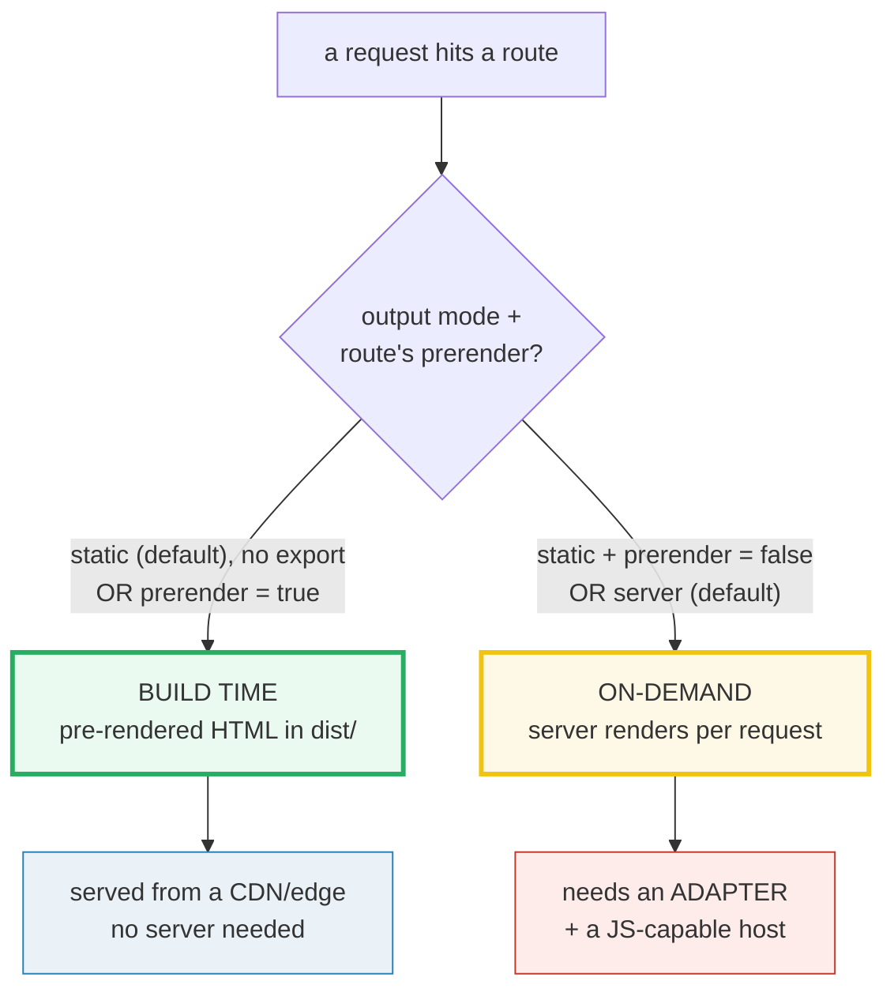
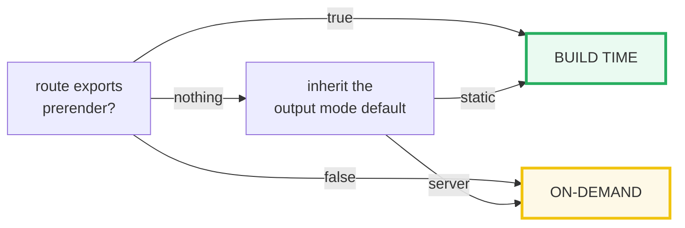

# Astro Rendering Modes (output: static / server)

> **Companion demo:** [`astro_rendering_modes.html`](./astro_rendering_modes.html) — open in a browser.
> Every decision below is rendered live in that request-flow explorer and verified
> against the official Astro docs. Nothing is hand-waved.

---

## 0. TL;DR — the one idea

> **The analogy:** `static` = bake the HTML once at **build time** and serve the same
> loaf to everyone; `server` = bake a fresh loaf **per request**. Astro 5 lets you
> pick **PER ROUTE** with `export const prerender` — so most sites are static with a
> few on-demand pages, and the old `output: 'hybrid'` mode (which used to express
> that idea) was **removed**: the hybrid behavior is now just the `'static'` default
> with a `prerender = false` on the dynamic routes.



---

## 1. How it works — two modes, one per-route escape hatch

Astro 5 ships **exactly two** `output` modes (the third, `'hybrid'`, was removed in
v5 — see [§3 Killer Gotchas](#killer-gotchas)). A route's `export const prerender`
then overrides the mode default for *that route only*.

**`output: 'static'` (the default).** Every page, route, and API endpoint is
pre-rendered to static HTML at build time. To opt a single route INTO on-demand
rendering, add `export const prerender = false`:

```astro
---
// src/pages/dashboard.astro  — rendered on the server, per visitor
export const prerender = false;
---
<html><h1>Hello {Astro.cookies.get('user')}</h1></html>
```

**`output: 'server'`.** Every route is server-rendered on each request (the
opposite default). To opt a single route BACK into build-time, add
`export const prerender = true`:

```astro
---
// src/pages/about.astro — static, even though output:'server' is set
export const prerender = true;
---
<html><h1>About (never changes)</h1></html>
```

> The official docs' rule of thumb: **start with `'static'`** until you are sure
> *most or all* pages need on-demand rendering. `'server'` "does not bring any
> additional functionality. It only switches the default rendering behavior."

The decision core is one line per route, and it is exactly what the live demo's
`whenRendered()` encodes:



---

## 2. The decision matrix

> From `astro_rendering_modes.html` — the full `output mode × prerender` table (the
> gold-check asserts four cells of this matrix directly):

| `output` mode | route's `prerender` | when HTML is made | adapter needed? |
|---|---|---|---|
| **`'static'`** *(default)* | *(none / inherits)* | **BUILD TIME** | no (pure static) |
| `'static'` | `= true` | BUILD TIME | no |
| `'static'` | **`= false`** | **ON-DEMAND** | **yes** ← *the modern "hybrid"* |
| **`'server'`** | *(none / inherits)* | **ON-DEMAND** | **yes** |
| `'server'` | `= false` | ON-DEMAND | yes |
| `'server'` | **`= true`** | **BUILD TIME** | no (for that route) |

> From `astro_rendering_modes.html` — the four official server adapters (asserted:
> exactly 4):
>
> | adapter | runtime | install |
> |---|---|---|
> | `@astrojs/node` | self-hosted Node.js | `npx astro add node` |
> | `@astrojs/vercel` | Vercel (serverless / edge) | `npx astro add vercel` |
> | `@astrojs/netlify` | Netlify functions | `npx astro add netlify` |
> | `@astrojs/cloudflare` | Cloudflare Workers/Pages | `npx astro add cloudflare` |
>
> The gold-check in the live demo asserts: **exactly 2 modes**, static's default is
> build-time, **static + `prerender:false` → on-demand**, **server + `prerender:true`
> → build-time**, and **exactly 4 adapters**.

---

## 3. On-demand features (what a server route can do that a static one can't)

A route rendered on demand runs on the server at request time, so it can:

- read **cookies / request headers / the HTTP method** (`Astro.request`, `Astro.cookies`);
- set **response status & headers**, return a `Response`, or `Astro.redirect`;
- **stream HTML** in chunks (each component flushes as it renders);
- return per-user, freshly-fetched data without a full site rebuild;
- back an **API endpoint** (a `.js`/`.ts` file in `src/pages/` exporting `GET`/`POST`).

> From the official docs: *"On-demand rendered pages and routes are generated per
> visit, and can be customized for each viewer."* None of this is available to a
> build-time route — its HTML is frozen at `astro build`.

**Server islands** (`server:defer` on a component) are a finer-grained cousin: a
static page with one on-demand island. They *also* require an adapter, even when
the whole site is `output: 'static'`.

---

## Killer Gotchas

| Trap | Symptom | Fix |
|---|---|---|
| **Setting `output: 'hybrid'` on Astro 5** | config error — `'hybrid'` no longer exists | Remove it. The old hybrid behavior is now the `'static'` default; just add `export const prerender = false` to the dynamic routes |
| On-demand route **with no adapter** | dev warning + **build-time error** | Any `prerender = false` route (or `output: 'server'`) needs an adapter matching your host (`node`/`vercel`/`netlify`/`cloudflare`) |
| Deploying an on-demand site to a **static host** (e.g. plain GitHub Pages) | the server bundle can't run → 404/blank | On-demand needs a runtime that runs JS. Use a host that supports your adapter, or keep the route static |
| `export const prerender = import.meta.env.X` | **removed in Astro 5** — only literal `true`/`false` are allowed | Use a literal value, or set it dynamically via an integration's `'astro:route:setup'` hook |
| Expecting `output: 'server'` to "do more" | confusion: SSR pages behave the same either way | `'server'` only flips the **default**. A `prerender:false` route under `'static'` is identical to a default route under `'server'` |
| Forgetting that `prerender = true` on a `server` site **opts back into static** | a page stops updating per-user, no cookies/headers | That's the point of the override — but make sure the route is actually static-safe |
| `server:defer` island **with no adapter** | server islands silently unavailable | Server islands need an adapter installed even on an otherwise-static site |

### Cheat sheet

```js
// astro.config.mjs — the only two valid output values in Astro 5
import { defineConfig } from 'astro/config';
import node from '@astrojs/node';

export default defineConfig({
  output: 'static',        // DEFAULT: build everything to HTML. (omit the line entirely)
  // output: 'server',     // SSR: render everything per request (needs adapter)
  adapter: node({ mode: 'standalone' }),   // required the moment ANY route is on-demand
});
```

```astro
---
// per-route override — wins over the mode default
export const prerender = false;   // => this route is ON-DEMAND (needs adapter)
// export const prerender = true; // => this route is BUILD-TIME (static)
// (no export)                    // => inherit the output mode default
---
```

```
# the rule (Astro 5):
#   output: 'static' (default) => all routes built at build time
#   output: 'server'           => all routes rendered per request
#   per route: prerender=true => build time | prerender=false => on-demand
#   ANY on-demand route => needs an adapter + a JS-capable host
#   'hybrid' was REMOVED in Astro 5 (it's now just 'static' + prerender:false)
```

---

## Sources

- Astro Docs — *On-demand rendering* (the authoritative model: default static, `export const prerender = false`, `output: 'server'`, the 4 official adapters, the "start with static" tip): https://docs.astro.build/en/guides/on-demand-rendering/
- Astro Docs — *Upgrade to Astro v5* → "Removed: hybrid rendering mode" (the explicit statement that `'hybrid'` was merged into `'static'`, and that dynamic `prerender` values were removed): https://docs.astro.build/en/guides/upgrade-to/v5/
- Sanity Docs — *Static and server rendering in Astro* (secondary corroboration: *"Prior to Astro 5, this was handled by a separate `output: "hybrid"` mode, which has been removed"*; confirms both modes support per-page overrides and an adapter is required for any server-rendered page): https://www.sanity.io/docs/astro/static-and-server-rendering
- Astro Docs — *Server islands* (`server:defer` needs an adapter even on a static site): https://docs.astro.build/en/guides/server-islands/
- Astro Docs — *Configuration reference* → `output` (the two valid values): https://docs.astro.build/en/reference/configuration-reference/#output
