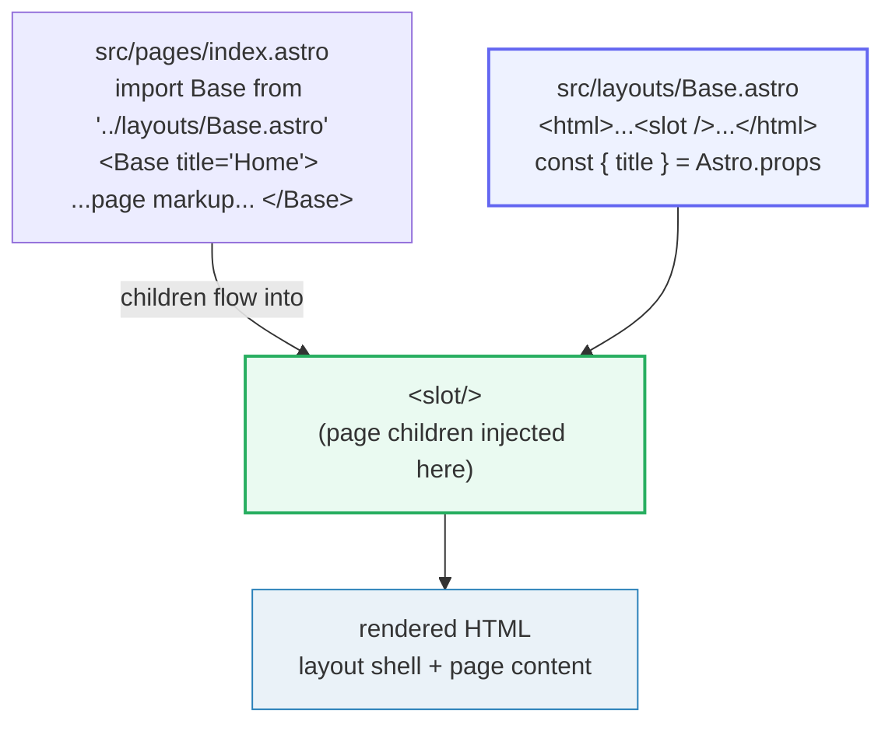

# Astro Routing &amp; Layouts

> **Companion demo:** [`astro_routing_layouts.html`](./astro_routing_layouts.html) — open in a browser.
> Every resolved route below is produced by the resolver embedded in that file.
> Nothing is hand-computed.

---

## 0. TL;DR — the one idea

> **The analogy:** the filesystem **IS** the router. A file under `src/pages/`
> becomes a URL; `[brackets]` = a dynamic segment; `[...rest]` = a catch-all of any
> depth; a layout is just a component that renders `<slot/>` where the page's content
> goes. There is no routing config to maintain — drop a file, get a route.

```mermaid
graph LR
    subgraph FS["src/pages/  (the filesystem IS the router)"]
        I["index.astro"]:::static
        A["about.astro"]:::static
        S["blog/[slug].astro"]:::param
        R["blog/[...path].astro"]:::rest
    end
    I -->|"/"| U1["/  (home)"]
    A -->|"/about"| U2["/about"]
    S -->|slug='hello-world'| U3["/blog/hello-world"]
    S -->|slug='release-notes'| U4["/blog/release-notes"]
    R -->|path='2024/01/r1'| U5["/blog/2024/01/r1"]
    R -->|path=undefined"| U6["/blog"]
    classDef static fill:#eafaf1,stroke:#27ae60,stroke-width:2px
    classDef param fill:#eef2ff,stroke:#6366f1,stroke-width:2px
    classDef rest fill:#fef9e7,stroke:#f1c40f,stroke-width:2px
```

And the layout half — a component that **wraps** a page through `<slot/>`:



---

## 1. How it works — static routes

Astro uses **file-based routing**. Every `.astro`, `.md`, or `.mdx` file inside
`src/pages/` automatically becomes a route; its URL is its path and filename. There
is **no separate routing config** to keep in sync (Astro docs, *Routing*).

> From astro_routing_layouts.html:
> ```
>   /                                   -> src/pages/index.astro
>   /about                              -> src/pages/about.astro
> ```
> (Static routes — exact pathname match. `index.astro` is special: it maps to the
> directory root, so `src/pages/index.astro` → `/` and `src/pages/about/index.astro`
> → `/about`.)

The official docs state the same mappings verbatim:

```
src/pages/index.astro        -> mysite.com/
src/pages/about.astro        -> mysite.com/about
src/pages/about/index.astro  -> mysite.com/about
src/pages/about/me.astro     -> mysite.com/about/me
src/pages/posts/1.md         -> mysite.com/posts/1
```

## 2. Dynamic routes — `[param]` and `[...rest]`

A filename can encode **parameters** in brackets. The page reads them from
`Astro.params`.

- **`[param]`** — matches exactly one path segment; `param` is that segment's value.
- **`[...rest]`** — matches **any depth** of segments (zero or more); when it matches
  zero segments the param is `undefined`.

> From astro_routing_layouts.html:
> ```
>   /blog/hello-world     -> src/pages/blog/[slug].astro      {"slug":"hello-world"}
>   /blog/release-notes   -> src/pages/blog/[slug].astro      {"slug":"release-notes"}
>   /blog/2024/01/r1      -> src/pages/blog/[...path].astro   {"path":"2024/01/r1"}
>   /blog                 -> src/pages/blog/[...path].astro   {"path":undefined}
>   /blog/a%20b           -> src/pages/blog/[slug].astro      {"slug":"a b"}   <- decodeURI applied
>   /nope                 -> 404
> ```
> The resolver models Astro's priority: **static beats named param beats rest**. So a
> single segment after `/blog` hits `[slug]`; multiple segments (or none) fall through
> to `[...path]`. `path: undefined` at `/blog` is the documented "rest matches the top
> level" behaviour.

The page then reads the value:

```astro
---
// src/pages/blog/[slug].astro
export function getStaticPaths() {
  return [
    { params: { slug: "hello-world" } },
    { params: { slug: "release-notes" } },
  ];
}
const { slug } = Astro.params;       // "hello-world" on /blog/hello-world
---
<h1>{slug}</h1>
```

### File pattern → URL(s) → param

| File pattern | Matches URL(s) | Param(s) | Needs `getStaticPaths`? |
|---|---|---|---|
| `index.astro` | `/` | — | no |
| `about.astro` | `/about` | — | no |
| `posts/1.md` | `/posts/1` | — | no |
| `blog/[slug].astro` | `/blog/hello-world`, `/blog/x` (one segment) | `slug` | **yes** (static output) |
| `[lang]-[version]/info.astro` | `/en-v1/info` | `lang`, `version` | **yes** |
| `[org]/[repo]/tree/[branch]/[...file]` | `/withastro/astro/tree/main/docs/x.svg` | `org`,`repo`,`branch`,`file` | **yes** |
| `blog/[...path].astro` | `/blog`, `/blog/a`, `/blog/a/b/c` (any depth) | `path` (or `undefined` at `/blog`) | **yes** |
| `_utils.js`, `_components/` | *(excluded — not a route)* | — | — |

---

## 3. `getStaticPaths()` — the route list for dynamic routes (SSG)

In Astro's **default static (SSG) output**, every URL must be known at build time.
So a dynamic route must `export function getStaticPaths()` returning an array of
`{ params: {...} }` — one object generates one page.

> From astro_routing_layouts.html (gold-check, verbatim):
> ```
> [check] 4 routes + 1 layout; /blog/hello-world->[slug]='hello-world'; /blog/2024/01/r1->[...path]='2024/01/r1': OK
> ```
> The bundle pins: exactly **4** page routes + **1** layout are authored, and the two
> canonical dynamic URLs resolve to the exact files with the exact params. If the
> curated route map drifted, the badge goes red.

```astro
---
// src/pages/dogs/[dog].astro   (Astro docs example)
export function getStaticPaths() {
  return [
    { params: { dog: "clifford" } },
    { params: { dog: "rover" } },
    { params: { dog: "spot" } },
  ];
}
const { dog } = Astro.params;
---
<div>Good dog, {dog}!</div>
```

This emits three pages: `/dogs/clifford`, `/dogs/rover`, `/dogs/spot`. In **on-demand
(SSR)** mode, `getStaticPaths` is **not** used — the route serves any matching request
on demand (and only one `[...rest]` per path is allowed).

---

## 4. Layouts — a component that renders `<slot/>`

A layout is **not a special construct**. It is an ordinary Astro component,
conventionally placed in `src/layouts/`, that renders the shared page shell and a
`<slot/>` placeholder where each page's unique markup is injected (Astro docs,
*Layouts*; CloudCannon tutorial, *Astro Layouts*).

```astro
---
// src/layouts/Base.astro
const { title } = Astro.props;
---
<html lang="en">
  <head><title>{title}</title></head>
  <body>
    <nav>…shared nav…</nav>
    <slot />          <!-- the page's children are injected here -->
    <footer>…shared footer…</footer>
  </body>
</html>
```

```astro
---
// src/pages/index.astro
import Base from '../layouts/Base.astro';
---
<Base title="Home">
  <h1>Hello, world</h1>
  <p>This markup came from src/pages/index.astro</p>
</Base>
```

**`Astro.props`** is how a component (layout or page) reads values its caller passed.
Layouts **nest** the same way: an inner layout imports and wraps an outer one, and the
outer's `<slot/>` receives the inner's children. `src/layouts/` is a **convention, not
a requirement** — layouts can live anywhere (even next to pages, prefixed with `_` so
they aren't treated as routes).

---

## Killer Gotchas

| Trap | Symptom | Fix |
|---|---|---|
| Dynamic route returns 404 in static build | build error: `getStaticPaths() function is required for dynamic routes` | `export function getStaticPaths()` returning `[{ params: {...} }]` — every param in the filename must appear in `params` |
| `[param]` vs `[...rest]` confusion | `/blog/a/b` 404s under `[slug].astro`, or `[slug]` swallows paths you meant for `[...path]` | `[slug]` matches **one** segment; `[...path]` matches **any depth** (incl. zero → `undefined`). Named params beat rest at the same depth (priority rule #4) |
| A route collides and the wrong file wins | static page silently shadows your dynamic route | Astro priority: reserved > more segments > **static > named > rest** > prerendered > SSR > endpoints > pages > redirects > alphabetical. Make the intended route more specific |
| Forgetting a layout is just a component | treating `src/layouts/` as magic; can't pass props / nest | it accepts props via `Astro.props`, imports other components, and nests by wrapping — there is nothing special about it |
| Page not showing up as a route | file is ignored, never built | it must live under `src/pages/`. A leading `_` (file or folder) **excludes** it from routing (use that for colocated components/utils) |
| Markdown page has no styling/meta | bare HTML, no `<head>` | use the `layout:` frontmatter property to point a `.md` file at a layout; the layout gets `frontmatter`, `url`, `headings`, etc. via `Astro.props` |
| Layout `<html>` not wrapping everything | broken page shell | if a layout provides a page shell, its `<html>` must be the parent of **all** other elements in that component |
| `params` look URL-encoded | `slug === "%5Bpage%5D"` instead of `[page]` | `getStaticPaths` params are **not** decoded; call `decodeURI()` on the value when you need the decoded form |

### Cheat sheet

```astro
---  // ROUTING: the filesystem IS the router
//  src/pages/index.astro        -> /
//  src/pages/about.astro        -> /about
//  src/pages/blog/[slug].astro  -> /blog/:slug        (one segment; needs getStaticPaths)
//  src/pages/blog/[...path].astro -> /blog/*          (any depth; path=undefined at /blog)
//  src/pages/_hidden.astro      -> NOT a route        (underscore = excluded)
//  priority: static > [param] > [...rest]   (more path segments always wins first)

export function getStaticPaths() {        // REQUIRED for [param]/[...rest] in static output
  return [{ params: { slug: "hello-world" } }];
}
const { slug } = Astro.params;            // read the matched segment(s) here
---

// LAYOUTS: a component that renders <slot/>; props via Astro.props
//  src/layouts/Base.astro:   const { title } = Astro.props;  ...  <slot />
//  src/pages/index.astro:    import Base;  <Base title="Home"> ...page... </Base>
//  nested: an inner layout imports + wraps an outer one the same way.
```

---

## Sources

- Astro Docs — *Routing* (file-based routing, static/dynamic/rest params, `getStaticPaths`, route priority, excluding pages): https://docs.astro.build/en/guides/routing/
- Astro Docs — *Layouts* (layouts are components, `<slot/>`, `Astro.props`, nested layouts, Markdown layout props): https://docs.astro.build/en/basics/layouts/
- Astro Docs — *Routing Reference* (`getStaticPaths` return shape, `params`, pagination): https://docs.astro.build/en/reference/routing-reference/
- CloudCannon — *Astro Layouts: Shared Headers, Footers and Meta* (secondary: layouts placed in `src/layouts/`, `<slot/>` placeholder, props via `Astro.props`, import + wrap): https://cloudcannon.com/tutorials/astro-beginners-tutorial-series/astro-layouts/
- Astro GitHub Issue #12036 — error confirming `getStaticPaths()` is required for dynamic routes: https://github.com/withastro/astro/issues/12036
