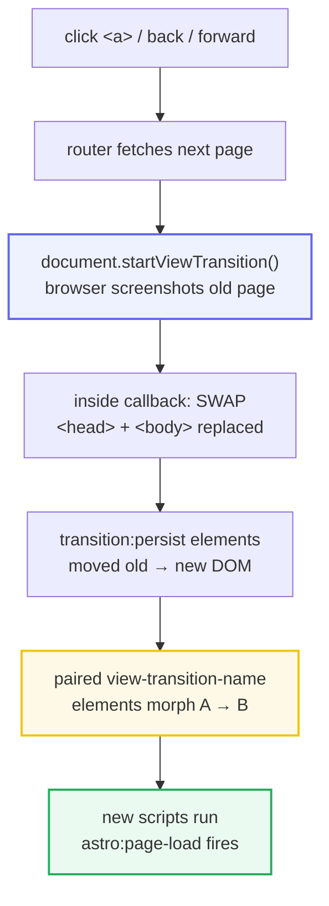

# Astro View Transitions

> **Companion demo:** [`astro_view_transitions.html`](./astro_view_transitions.html) — open in a browser.
> Every assertion below is produced by the demo embedded in that file.
> Nothing is hand-waved.

---

## 0. TL;DR — the one idea

> **The analogy:** view transitions give native-app-style page morphs to the web.
> Drop `<ClientRouter />` in your `<head>` and every in-site link becomes a
> single-page-app navigation; **pair an element across two pages with
> `transition:name` and the browser animates the morph** from its old position/size
> to its new one. It rides the browser's own View Transitions API
> (`document.startViewTransition()`), so there is no animation library to ship.

> ⚠ **Renamed in Astro 5.0:** the component was `<ViewTransitions />` through
> Astro 4.x. In 5.0 it was renamed to **`<ClientRouter />`** (import from
> `astro:transitions`). Old tutorials and Stack Overflow answers still say
> `ViewTransitions` — that export **no longer exists** in Astro 5+. Verify with
> `import { ClientRouter } from 'astro:transitions'`.

```mermaid
graph LR
    A["page A: /<br/>small 'Penguins' card<br/>transition:name='hero-card'"] -->|click link| R["&lt;ClientRouter /&gt;<br/>fetches page B"]
    R -->|document.startViewTransition| S["browser screenshots A,<br/>swaps in B's DOM"]
    S -->|paired name matches| B["page B: /about<br/>large 'Penguins' hero<br/>transition:name='hero-card'"]
    B -.->|morph animation| M["Penguins flies from<br/>A-position to B-position"]
    style A fill:#eef2ff,stroke:#6366f1,stroke-width:2px
    style B fill:#eef2ff,stroke:#6366f1,stroke-width:2px
    style R fill:#eafaf1,stroke:#27ae60,stroke-width:2px
    style M fill:#fef9e7,stroke:#f1c40f,stroke-width:2px
```



The `<ClientRouter />` navigation flow, step by step:



---

## 1. How it works — enable, then pair

**Step 1 — enable SPA mode.** Import `<ClientRouter />` from `astro:transitions`
and add it once to your shared `<head>` / layout. That is the entire opt-in:

```astro
---
// src/components/CommonHead.astro
import { ClientRouter } from "astro:transitions";
---
<link rel="icon" type="image/svg+xml" href="/favicon.svg" />
<title>{title}</title>
<ClientRouter />           <!-- turns in-site links into animated SPA navigation -->
```

Now every `<a>` to another page on your site is intercepted: the router fetches the
next page, calls `document.startViewTransition()`, and swaps the DOM inside the
callback. By default you get a cross-fade (Astro docs, *View transitions*).

**Step 2 — pair an element with `transition:name`.** Give the *same* name to one
element on page A and one element on page B. The browser morphs between them:

```astro
<!-- src/pages/index.astro  (the list page) -->
<a href="/about">
  <aside transition:name="hero-card">Penguins</aside>
</a>
```

```astro
<!-- src/pages/about.astro  (the detail page) -->
<main>
  <section transition:name="hero-card">   <!-- same name → the browser pairs them -->
    <h1>Penguins</h1>
  </section>
</main>
```

`transition:name="hero-card"` compiles to the real CSS property
`view-transition-name: hero-card`. That property is what the browser's View
Transitions API reads to know which elements to morph. **The name must be unique
on each page** — if two visible elements share a name, the transition aborts.

> From astro_view_transitions.html:
> ```
>   paired name:            "hero-card"
>   page A occurrences:     1   (small card in the 2x2 grid)
>   page B occurrences:     1   (large hero at the top)
>   live elements w/ name:  1   (only one page is in the DOM at a time)
> [check] 3 directives & 'hero-card' paired (A:1 B:1) & 1 live element: OK
> ```
> The demo swaps two page mockups inside the real `document.startViewTransition()`.
> The "Penguins" element morphs from small-card (page A) to large-hero (page B)
> because both carry the paired name — exactly what `<ClientRouter />` does on a
> real route change.

---

## 2. The three directives

| Directive | What it does | Example (`.astro`) | Compiles to |
|---|---|---|---|
| `transition:name` | **Pairs** one element on the old page with one on the new page by a shared name; the browser morphs position/size between them. Unique per page. | `<aside transition:name="hero">` | `view-transition-name: hero` (a real CSS property) |
| `transition:animate` | **Overrides** the default fade for an element. Built-ins: `fade` (default), `slide`, `none`, `initial`. Custom animations importable from `astro:transitions`. | `<main transition:animate="slide">` | `@keyframes` pair (forwards + backwards, old + new) |
| `transition:persist` | **Keeps** an element (and its JS state) alive across navigation instead of replacing it — e.g. a `<video>` keeps playing, a counter island keeps its count. | `<video controls transition:persist>` | the old element node is moved into the new DOM (not re-created) |

### `transition:animate` — the built-ins

- **`fade`** (default) — an opinionated crossfade; old fades out, new fades in.
- **`slide`** — old slides out left, new slides in from the right; **reversed on back navigation**.
- **`none`** — disables the browser's default animation. On the `<html>` element, this disables the fade for the whole page.
- **`initial`** — opt out of Astro's opinionated crossfade and use the browser's raw default styling.

Set a page-wide default on `<html>` and override per-element:

```astro
<html transition:name="root" transition:animate="none">
  <head><ClientRouter /></head>
  <body>
    <main transition:animate="slide">…</main>   <!-- overrides the page default -->
  </body>
</html>
```

### `transition:persist` — carry state across pages

```astro
<!-- a video keeps playing as you navigate away and back -->
<video controls muted autoplay transition:persist>
  <source src="/trailer.mp4" type="video/mp4" />
</video>

<!-- a React island keeps its counter state across pages -->
<Counter client:load transition:persist initialCount={5} />
```

A `transition:persist-props` companion (Astro 4.5+) further freezes an island's
*props* (not just state) so it doesn't re-render with new values on navigation.

---

## 3. What `<ClientRouter />` actually does

It is a client-side router that rides the browser's
[View Transitions API](https://developer.mozilla.org/en-US/docs/Web/API/View_Transition_API).
On each in-site navigation:

1. The router **fetches** the next page.
2. It calls **`document.startViewTransition()`** — the browser screenshots the old page.
3. Inside the callback it **swaps** the DOM: `<head>` (stylesheets/scripts kept if
   present on the new page), `<body>` replaced, `transition:persist` elements
   *moved* old → new, scroll restored.
4. Paired `view-transition-name` elements **morph** from old position/size to new.
5. New scripts run; `astro:page-load` fires (replaces `DOMContentLoaded`).

> From astro_view_transitions.html (API support detected at load):
> ```
>   document.startViewTransition : supported (Chromium-based browsers)
>   fallback control             : <ClientRouter fallback="animate|swap|none" />
> ```
> In browsers without the API, `fallback="animate"` (default) simulates the
> transition; `fallback="swap"` just swaps with no animation; `fallback="none"`
> falls all the way back to full page navigation.

Astro also **honours `prefers-reduced-motion`** automatically — no extra config.

---

## Killer Gotchas

| Trap | Symptom | Fix |
|---|---|---|
| **The component RENAMED** — code says `<ViewTransitions />` | Astro 5 build error: `ViewTransitions is not exported from astro:transitions` | Use `<ClientRouter />` (Astro 5+). Import: `import { ClientRouter } from "astro:transitions"`. The old name only exists in Astro ≤ 4.x. |
| `transition:name` doesn't match on both pages | element just cross-fades instead of morphing | the **exact same string** must appear on one element in page A and one in page B; check for typos / dynamic values that differ |
| Two elements share a `transition:name` on one page | transition silently aborts / "duplicate view-transition-name" | the name must be **unique per page**; only one element may carry a given name at a time |
| Scripts stop re-running after navigation | a menu-toggle or theme script works on first load then dies | module scripts run **once**; wrap them in `document.addEventListener("astro:page-load", …)` or add `data-astro-rerun` to inline scripts |
| `transition:persist` keeps **too much** | stale data, an old form value, or a component that should have updated | persist moves the node unchanged — if the new page needed different content, don't persist it; scope persist narrowly |
| Persist doesn't save everything | CSS animations restart, iframes reload mid-transition | known limitation: animation restart and iframe reload cannot be avoided even with `transition:persist` |
| Browser lacks View Transitions API (Firefox/Safari < latest) | "no animation, just a hard swap" on some browsers | `<ClientRouter fallback="swap" />` (or the default `animate` which simulates it); set explicit `transition:name`/`transition:animate` for parity across browsers |
| `navigate()` with user input | open redirect / `javascript:` URL injection | **sanitize** before `navigate(href)`; allowlist known paths (Astro docs, *Navigating with user input*) |

### Cheat sheet

```astro
---
// 1. ENABLE (once, in your shared <head>):
import { ClientRouter } from "astro:transitions";   // Astro 5+ name (was <ViewTransitions/> in 4.x)
---
<ClientRouter />                                     // opt-in to SPA navigation + default fade
<ClientRouter fallback="swap" />                     // optional: control non-supporting browsers

<!-- 2. PAIR an element across two pages with the SAME name: -->
<aside transition:name="hero-card">…</aside>         <!-- page A: compiles to view-transition-name: hero-card -->
<section transition:name="hero-card">…</section>     <!-- page B: browser morphs A → B -->

<!-- 3. ANIMATE: override the default fade -->
<main transition:animate="slide">…</main>            <!-- fade | slide | none | initial -->

<!-- 4. PERSIST: keep an element + its state alive across navigation -->
<video controls transition:persist>…</video>         <!-- keeps playing across pages -->
<Counter client:load transition:persist />           <!-- island keeps its JS state -->

<!-- opt OUT of the router per-link: -->
<a href="/pdf" data-astro-reload>full reload</a>      <!-- forces a real page navigation -->

// lifecycle: listen for astro:page-load instead of DOMContentLoaded
// scripts run once by default → wrap setup in astro:page-load
```

---

## Sources

- **Astro Docs — *View transitions*** (the primary guide: `<ClientRouter />`, `transition:name`/`animate`/`persist`, navigation process, fallback, lifecycle events, `prefers-reduced-motion`): https://docs.astro.build/en/guides/view-transitions/
- **Astro Docs — *Upgrade to Astro v5*** (the rename: section **"Renamed: `<ViewTransitions />` component"** — *"Astro 5.0 renames this component to `<ClientRouter />`"*, imported from `astro:transitions`): https://docs.astro.build/en/guides/upgrade-to/v5/
- **MDN — *View Transitions API*** (the underlying browser API: `document.startViewTransition()`, `view-transition-name`, `::view-transition-group`): https://developer.mozilla.org/en-US/docs/Web/API/View_Transition_API
- **Chrome for Developers — *View Transitions API*** (the platform feature Astro rides on; `startViewTransition`, named-element pairing): https://developer.chrome.com/docs/web-platform/view-transitions/
- **Easton Dev — *Astro View Transitions: Give Your Website App-Like Smooth Transitions*** (secondary: confirms *"ClientRouter is the new name, previously called ViewTransitions. The Astro team renamed it to more accurately describe its function"*): https://eastondev.com/blog/en/posts/dev/20251202-astro-view-transitions-guide/
