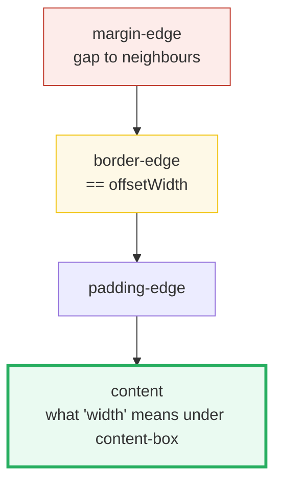

# Box Model

> **Companion demo:** [`box_model.html`](./box_model.html) — open in a browser.
> **Computable core:** [`box_model.js`](./box_model.js) — `node box_model.js`.
> Every number below is printed by that file. Nothing is hand-computed.

---

## 0. TL;DR — the one idea

> **The analogy:** a box is a Russian doll of four edges — **content** (the thing),
> wrapped in **padding** (inner breathing room), wrapped in **border** (the frame),
> wrapped in **margin** (outer gap to neighbours). `box-sizing` decides whether
> your declared `width` means *just the content* (the default, `content-box`) or
> *content + padding + border* (`border-box`, the reset everyone copies).



---

## 1. How it works (content-box, the default)

With `box-sizing: content-box` (the UA default), `width` sets **only the content**.
Padding, border, and margin are then **added on top**, so the element grows beyond
its declared width:

```
width:200 + padding:20 (each side) + border:5 (each side)
      = 200 + 40 + 10 = 250   ← the border-edge, a.k.a. offsetWidth
      + margin:10 (each side) = 270   ← the full footprint
```

> From box_model.js Section A:
> ```
>   width=200  padding=20  border=5  margin=10  box-sizing=content-box
> 
>   content (width)   = 200
>   padding-edge      = 240   (content + 2*padding)
>   border-edge       = 250   (= offsetWidth)
>   margin-edge       = 270   (border-edge + 2*margin)
> [check] content-box border-edge == 200 + 40 + 10 == 250: OK
> [check] content-box margin-edge == 250 + 20 == 270: OK
> ```

The live `.html` proves the same: its content-box demo `.c` is `width:200` with
`padding:20; border:5`, and the gold-check asserts `offsetWidth === 250`.

---

## 2. The toggle: `box-sizing: border-box`

`border-box` **flips what `width` means**: the declared width now **includes**
padding and border, so the element stops at exactly `width` at the border edge.
Content shrinks to make room.

```
width:200 (includes padding+border)
  content = 200 - 2*20 - 2*5 = 150
  border-edge (offsetWidth) = 200   ← == the declared width
```

> From box_model.js Section B:
> ```
>   width=200  padding=20  border=5  margin=10  box-sizing=border-box
> 
>   border-edge (= W)  = 200   (offsetWidth == declared width)
>   content           = 150   (W - 2*padding - 2*border)
>   padding-edge      = 190
>   margin-edge       = 220
> [check] border-box offsetWidth == declared width 200: OK
> [check] border-box content == 200 - 40 - 10 == 150: OK
> ```

This is why **every CSS reset starts with** `*, *::before, *::after { box-sizing:
border-box; }`. Mental math becomes trivial: `width:200` means 200px wide, period.

---

## 3. The headline contrast

Same `width:200`, same padding/border/margin — different footprint:

> From box_model.js Section C:
> ```
>   content-box  offsetWidth = 250   margin-edge = 270
>   border-box   offsetWidth = 200   margin-edge = 220
>   -> same `width:200` spans 50px less horizontally under border-box.
> [check] border-box is 50px narrower than content-box: OK
> ```

---

## 4. Which edge is which API?

| You want… | Read |
|---|---|
| content + padding + border (the layout box) | `element.offsetWidth` / `offsetHeight` |
| content only (CSS pixels) | `getComputedStyle(el).width` (with `content-box`) |
| position relative to offset parent | `offsetLeft` / `offsetTop` |
| the full margin footprint | no direct API — compute `offsetWidth + marginLeft + marginRight` |

---

## Killer Gotchas

| Trap | Symptom | Fix |
|---|---|---|
| Forgetting the content-box default | element wider than expected; layout overflows | set `box-sizing: border-box` globally in the reset |
| Reading `getComputedStyle().width` expecting the layout box | you get content width, not border-edge | use `offsetWidth` for the layout box |
| `width:100%` + padding on `content-box` | overflows the parent | `border-box` (or `width: calc(100% - padding)`) |
| Vertical margins **collapse** between adjacent block siblings | gaps smaller than `marginTop + marginBottom` | the larger margin wins, they don't add; use padding/flex/grid to avoid |
| `margin` doesn't count toward `offsetWidth` | "where did the space go?" | margin is outside the border-edge; measure separately |

### Cheat sheet

```css
/* the reset that makes width predictable */
*, *::before, *::after { box-sizing: border-box; }

/* content-box (default): width = content.   border-box: width = content+padding+border */
/* offsetWidth = content + padding + border   (the layout box, what neighbours see) */
/* margin is OUTSIDE offsetWidth; vertical margins collapse between block siblings */
```

---

## Sources

- MDN — *The box model*: https://developer.mozilla.org/en-US/docs/Learn/CSS/Building_blocks/The_box_model
- MDN — *box-sizing*: https://developer.mozilla.org/en-US/docs/Web/CSS/box-sizing
- CSS Working Group — *CSS Box Model Module Level 3* (defines the edges): https://www.w3.org/TR/css-box-3/
- MDN — *mastering margin collapsing* (the collapse gotcha): https://developer.mozilla.org/en-US/docs/Web/CSS/CSS_box_model/Mastering_margin_collapsing
- Paul Irish — **box-sizing: border-box** (the canonical reset rationale, ≥1 secondary source): https://www.paulirish.com/2012/box-sizing-border-box-ftw/
