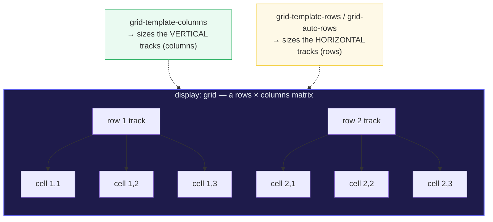
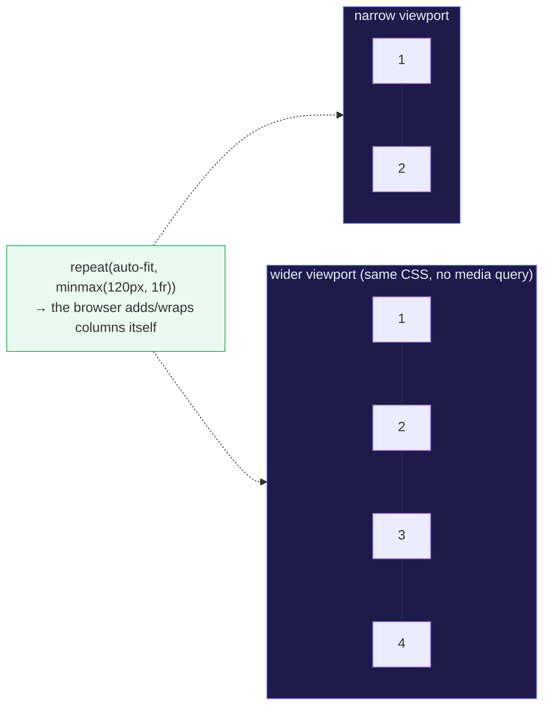

# CSS Grid

> **Companion demo:** [`css_grid.html`](./css_grid.html) — open in a browser and
> change the `grid-template-columns` + `gap` selects to watch the items reflow
> into a rows × columns matrix live.
> Every measured state below is shown verbatim by that playground. Nothing is
> hand-waved.

---

## 0. TL;DR — the one idea

> **The analogy:** grid is **two-dimensional layout**. A grid container lays its
> children into a matrix of **rows AND columns at the same time**, sized by
> tracks (the space between grid lines). Flexbox is one-dimensional — a single
> main axis. Grid is the tool when you care about *both* axes: page shells
> (header / sidebar / main / footer), photo galleries, dashboards, anything that
> looks like a table or a matrix. One container, two axes, no floats.





> **The grid/flex split:** reach for **flexbox** when the layout is a single line
> (a row of buttons, a nav bar, "center this"); reach for **grid** when you need a
> real matrix where items must line up on *both* a row and a column. The two
> compose — a grid item can itself be a flex container.

---

## 1. How it works

One rule starts it:

```css
.container { display: grid; }   /* its direct children are now grid items */
```

Then the container properties define the matrix:

| You want… | Property | Typical value |
|---|---|---|
| define the column tracks | `grid-template-columns` | `repeat(3, 1fr)` · `200px 1fr` · `1fr 2fr 1fr` |
| define the row tracks | `grid-template-rows` | `repeat(2, 100px)` · `auto` |
| the gutter between tracks | `gap` | `8px` · `1rem` (sets `row-gap` + `column-gap`) |
| **responsive cards, NO media queries** | `grid-template-columns` | `repeat(auto-fit, minmax(120px, 1fr))` |
| place an item into a named region | `grid-area` | `header` · `sidebar / main` |
| align an item inside its cell (inline axis) | `justify-items` | `start` · `center` · `stretch` (default) |
| align an item inside its cell (block axis) | `align-items` | `start` · `center` · `stretch` (default) |
| distribute the tracks inside the container | `justify-content` / `align-content` | `start` · `space-between` |

And the vocabulary: a **grid line** is numbered from 1 (column line 1 is on the
left in LTR); a **track** is the space between two lines; a **cell** is one
row-track × column-track intersection; a **grid area** is several cells merged.

### The default state (what the playground boots into)

The live `.html` measures its own container on load. With no control touched
(`repeat(3, 1fr)`, 6 items, `grid-auto-rows: 72px`, `gap: 8px`), the browser
lays the items into a clean 3-column × 2-row matrix:

> From css_grid.html (default state, nothing touched):
> ```
> getComputedStyle(stage):
>   display               = "grid"
>   grid-template-columns = repeat(3, 1fr)   → resolved: <W>px <W>px <W>px
>   grid-auto-rows        = 72px             (implicit row tracks get a fixed height)
>   gap                   = 8px              (row-gap + column-gap, both 8px)
>   items                 = 6
>
> measured structure (the layout truth):
>   columns               = 3     (items in row 1)
>   rows                  = 2
>   row 1: items [1, 2, 3]   offsetTop = 0px
>   row 2: items [4, 5, 6]   offsetTop = 80px   (= 72px row + 8px row-gap)
>   item 1 & item 4 same column (equal offsetLeft)?  yes   (both at column 1)
> [check] two-dimensional: row-aligned AND column-aligned: OK
> ```

That last line is the whole pitch. Item **1** and item **3** share the **same
row** (equal `offsetTop`); item **1** and item **4** share the **same column**
(equal `offsetLeft`). A one-dimensional layout cannot satisfy both at once —
that is what "two-dimensional" *means*, measured.

---

## 2. The `fr` unit, `repeat()`, and `minmax()`

- **`fr`** — a *fraction of the leftover space* in the grid container. Like
  flexbox's `flex-grow`, it distributes space **after** fixed tracks and gaps are
  paid for. `1fr 1fr 1fr` → three equal columns; `1fr 2fr 1fr` → the middle
  column gets twice the share.
- **`repeat(n, X)`** — write a repeated track listing once: `repeat(3, 1fr)`
  instead of `1fr 1fr 1fr`. You can mix it with explicit tracks:
  `200px repeat(2, 1fr)`.
- **`minmax(min, max)`** — give a track a floor and a ceiling:
  `minmax(120px, 1fr)` = "at least 120px, grow to share leftover space".

> From css_grid.html (grid-template-columns presets):
> ```
> repeat(3, 1fr)     3 equal fluid columns            → resolved <W> <W> <W>
> 1fr 2fr 1fr        proportional — middle is 2×      → <W> <2W> <W>
> 200px 1fr 1fr      fixed first track, fluid rest     → 200px <W> <W>
> repeat(4, 1fr)     4 columns → items wrap to 2 rows of 4 (8 needed; here 6 fill row 1)
> ```

---

## 3. `auto-fit` vs `auto-fill` — responsive with no media queries

The famous one-liner:

```css
.cards {
  display: grid;
  grid-template-columns: repeat(auto-fit, minmax(120px, 1fr));
}
```

The browser creates **as many ≥120px columns as fit**, then stretches them with
`1fr` to fill the row. Resize the viewport and columns are added/dropped
automatically — **zero breakpoints**. The playground's second panel toggles the
keyword with only 3 items to expose the subtle difference:

> From css_grid.html (auto-fit vs auto-fill, 3 items, wide row):
> ```
> auto-fit:  grid-template-columns = repeat(auto-fit, minmax(120px, 1fr))
>            resolved track count  = 3   (the would-be 4th track is COLLAPSED)
>            item 1 width          = <wide>px
>            → empty tracks collapse to 0; the 3 items stretch to fill the row.
>
> auto-fill: grid-template-columns = repeat(auto-fill, minmax(120px, 1fr))
>            resolved track count  = 4   (an empty 4th track is KEPT)
>            item 1 width          = <narrower>px
>            → empty tracks still claim a 1fr share, so filled items are narrower.
> ```
> (`<wide>` > `<narrower>` whenever there is room for more columns than there is
> content — i.e. whenever the difference is visible at all.)

**The rule:** they are identical until the row is wide enough to fit a column
with no content. Then `auto-fill` **keeps** the empty track (reserves space),
`auto-fit` **collapses** it (stretches the filled items). For card grids you
almost always want `auto-fit`. Use `auto-fill` when items must keep a consistent
size and not stretch (e.g. a fixed-thumbnail gallery loaded asynchronously).

---

## 4. Named areas & line-based placement (brief)

For page shells, `grid-template-areas` reads like a picture of the layout:

```css
.page {
  display: grid;
  grid-template-columns: 200px 1fr;
  grid-template-rows: auto 1fr auto;
  grid-template-areas:
    "header  header"
    "sidebar main"
    "footer  footer";
}
.header  { grid-area: header; }     /* spans both columns automatically */
.sidebar { grid-area: sidebar; }
.main    { grid-area: main; }
.footer  { grid-area: footer; }
```

Or place by **line numbers** (lines count from 1; `-1` is the last line):
`grid-column: 1 / 3` (start at line 1, end at line 3 = span 2 tracks). A `.` in
the areas map means an empty cell.

---

## Killer Gotchas

| Trap | Symptom | Fix |
|---|---|---|
| **`auto-fit` vs `auto-fill`** | cards look fine, but with few items they either stretch oddly (`auto-fit`) or leave a gap (`auto-fill`) | `auto-fit` collapses empty tracks (stretches items); `auto-fill` keeps them. Pick deliberately — usually `auto-fit`. |
| **`1fr` has a `min-content` floor** | a column with long unbreakable content (a long URL) **refuses to shrink** and blows out the grid | use `minmax(0, 1fr)` — sets the minimum to 0 so the track can actually shrink (the grid equivalent of flexbox's `min-width:0`) |
| **`fr` vs `%`** | `%` is of the container's inline size and does **not** subtract `gap`, so `gap + %` columns overflow; `fr` divides *leftover* space after gaps | use `fr` for fluid tracks; reserve `%`/`px` for fixed tracks you add explicitly |
| **implicit vs explicit rows** | you set `grid-template-columns` and items "wrap" into rows you never defined — those are **implicit** rows sized by `grid-auto-rows` (default `auto`) | set `grid-auto-rows: 72px` (or `minmax(72px, auto)`) to control the rows the items create automatically |
| **`gap` is between tracks, not items** | expecting `gap` to act like margins around each item | `gap` is a gutter *between* tracks — no leading/trailing gap at the container edges, no collapse, applied once (replaces the old `margin` hacks + `:last-child` negative-margin tricks) |
| **`grid-column: 1 / -1` under `auto-fit`** | spanning to the last line `-1` makes the grid revert to `auto-fill`-like sizing | `-1` targets the last **explicit** line; under `auto-fit` the explicit grid can differ from what you see — span a fixed count (`span N`) instead |
| **`gap` legacy names** | old tutorials write `grid-gap` / `grid-column-gap` | those still work as legacy aliases, but `gap` / `column-gap` / `row-gap` are the current names (shared with flexbox & multi-column) |

### Cheat sheet

```css
/* the two-dimensional layout primitive */
.container { display: grid; }                       /* children placed into rows AND columns */

/* tracks   */ grid-template-columns: repeat(3, 1fr);   /* fr = fraction of LEFTOVER space */
/* rows     */ grid-auto-rows: 72px;                    /* sizes rows the items create implicitly */
/* gutter   */ gap: 8px;                                /* = row-gap + column-gap; between tracks */

/* responsive cards, NO media queries */
.cards { grid-template-columns: repeat(auto-fit, minmax(120px, 1fr)); }

/* let a fluid track actually shrink past min-content */
.col { grid-template-columns: minmax(0, 1fr) minmax(0, 1fr); }

/* a page shell, drawn as a map */
.page {
  grid-template-columns: 200px 1fr;
  grid-template-areas: "header header" "sidebar main" "footer footer";
}
.header { grid-area: header; }

/* place by lines (lines count from 1; -1 = last line) */
.featured { grid-column: 1 / 3; }   /* start line 1, end line 3 = span 2 tracks */
```

---

## Cross-references

- 🔗 [`FLEXBOX.md`](./FLEXBOX.md) — flexbox is **one-dimensional** (a single main
  axis). Use it for rows/columns of items where only *one* axis matters; reach
  for grid when items must align on *both* a row and a column.
- 🔗 [`BOX_MODEL.md`](./BOX_MODEL.md) — grid tracks and gaps are still measured
  by the box model; `box-sizing: border-box` keeps item widths honest inside
  their cells.

---

## Sources

- MDN — *CSS grid layout* (module overview, two-dimensional layout): https://developer.mozilla.org/en-US/docs/Web/CSS/CSS_grid_layout
- MDN — *grid-template-columns* (defines the column tracks): https://developer.mozilla.org/en-US/docs/Web/CSS/grid-template-columns
- MDN — *grid-template-rows* (defines the row tracks): https://developer.mozilla.org/en-US/docs/Web/CSS/grid-template-rows
- MDN — *`<flex>` (the `fr` unit — "a fraction of the leftover space")*: https://developer.mozilla.org/en-US/docs/Web/CSS/flex_value
- MDN — *repeat()* (repeats a track listing): https://developer.mozilla.org/en-US/docs/Web/CSS/repeat
- MDN — *minmax()* (sets a track's floor and ceiling): https://developer.mozilla.org/en-US/docs/Web/CSS/minmax
- MDN — *gap* (the gutter between tracks; `row-gap`+`column-gap`): https://developer.mozilla.org/en-US/docs/Web/CSS/gap
- MDN — *grid-template-areas* (named regions for page shells): https://developer.mozilla.org/en-US/docs/Web/CSS/grid-template-areas
- MDN — *grid-area* (places an item into a named region / by lines): https://developer.mozilla.org/en-US/docs/Web/CSS/grid-area
- MDN — *grid-auto-flow* (row by default; `column` to flow down columns): https://developer.mozilla.org/en-US/docs/Web/CSS/grid-auto-flow
- MDN — *Box alignment in grid layout* (`justify-items`/`align-items`/`justify-content`): https://developer.mozilla.org/en-US/docs/Web/CSS/CSS_grid_layout/Box_alignment
- CSS-Tricks — *A Complete Guide to CSS Grid* (secondary source, all properties verified): https://css-tricks.com/snippets/css/complete-guide-grid/
- CSS-Tricks — Sara Soueidan, *Auto-Sizing Columns in CSS Grid: `auto-fill` vs `auto-fit`* (the collapse-vs-keep distinction): https://css-tricks.com/auto-sizing-columns-css-grid-auto-fill-vs-auto-fit/
- web.dev — *Learn CSS: Grid* (explicit vs implicit grid, `minmax(0,1fr)` floor, terminology): https://web.dev/learn/css/grid
- W3C — *CSS Grid Layout Module Level 1* (normative spec, defines the `fr` unit & tracks): https://www.w3.org/TR/css-grid-1/
