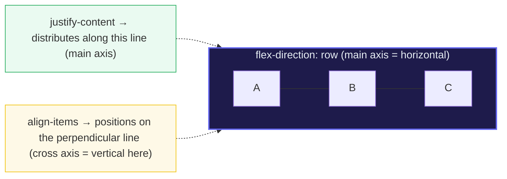
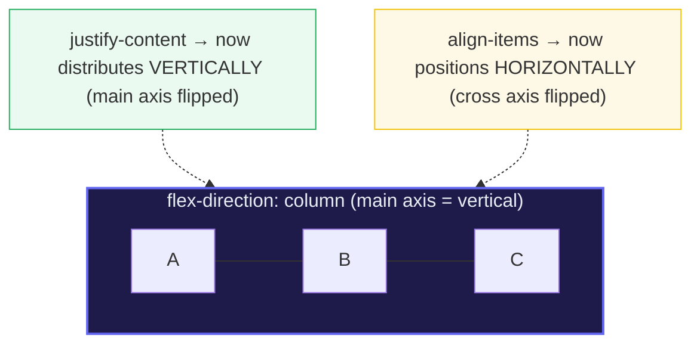

# Flexbox

> **Companion demo:** [`flexbox.html`](./flexbox.html) — open in a browser and
> drag the three `<select>`s to see the items reflow live.
> Every measured state below is shown verbatim by that playground. Nothing is
> hand-waved.

---

## 0. TL;DR — the one idea

> **The analogy:** flexbox is **one-dimensional layout**. A flex container lays
> its children along a single **main axis** (the direction of flow) and aligns
> them on the perpendicular **cross axis**. `flex-direction` picks the main axis;
> `justify-content` distributes free space *on the main axis*; `align-items`
> positions items *on the cross axis*. That's 90% of "put these in a row" and
> "center this" — one container, three properties.





> **The axis-flip rule:** swap `flex-direction` to `column` and **main/cross
> swap with it** — `justify-content` suddenly works vertically and `align-items`
> horizontally. The property names never change; only the axis they point at does.

---

## 1. How it works

One rule starts it:

```css
.container { display: flex; }   /* its direct children are now flex items */
```

Then three container properties do almost everything:

| You want… | Property | Typical value |
|---|---|---|
| a row vs a column (the main axis) | `flex-direction` | `row` (default) · `column` |
| space items along the flow | `justify-content` | `flex-start` · `center` · `space-between` · `space-around` · `space-evenly` |
| align items on the cross axis | `align-items` | `stretch` (default) · `center` · `flex-start` · `baseline` |

And per-item sizing via the `flex` shorthand (`flex-grow flex-shrink flex-basis`):

```
flex: 0 1 auto;   /* default — don't grow, may shrink, start from width/height */
flex: 1;          /* => 1 1 0%  — absorb free space, share it proportionally   */
flex: none;       /* => 0 0 auto — fully inflexible, fixed at its width/height  */
```

### The default state (what the playground boots into)

The live `.html` measures its own container on load. With no control touched,
the browser-applied defaults are:

> From flexbox.html (default state, nothing touched):
> ```
> getComputedStyle(stage).display        = "flex"
> getComputedStyle(stage).flexDirection  = "row"          (UA default)
> getComputedStyle(stage).justifyContent = "flex-start"   (UA default)
> getComputedStyle(stage).alignItems     = "stretch"      (UA default)
> stage.querySelectorAll(".item").length = 3
>
> measured along main axis:
>   start gap (edge -> A) = 0px        flex-start packs items tight at the start
>   inter-item gaps        = [0, 0]px   no space inserted between items
>   end gap (C -> edge)    = <free>px   ALL leftover space piles up at the end
> [check] display:flex & 3 items & default row: OK
> ```

That last line is the gold-check: the container really is `display:flex`, it
has exactly **3** flex children, and the default direction is `row`.

---

## 2. The `justify-content` family (main axis)

| value | first/last edge | between items |
|---|---|---|
| `flex-start` (default) | flush to start | packed, all free space at the **end** |
| `flex-end` | flush to end | packed, all free space at the **start** |
| `center` | equal gap both sides | packed, free space split start/end |
| `space-between` | **flush both edges (0/0)** | **equal** gaps between |
| `space-around` | half-gap at each edge | full (= 2× edge) gap between |
| `space-evenly` | equal gap at edges | same gap as between (all equal) |

Click **"verify space-between"** in the demo and it measures the concrete claim:

> From flexbox.html (justify-content: space-between):
> ```
> start gap (edge -> A) = 0px     first item flush to the start edge
> end gap (C -> edge)    = 0px     last item flush to the end edge
> inter-item gaps        = [N, N]px  EQUAL — free space split evenly between
> [check] space-between: edges flush (0/0) & gaps equal: OK
> ```
> (`N` is responsive to the container width; the verifier asserts the two
> inter-item gaps are **equal to each other** and both edges are **0**.)

---

## 3. `align-items` (cross axis)

On a `row` the cross axis is **vertical**, so `align-items` is how you vertically
place/center items (the classic "center this" problem):

```css
.row { display:flex; height:200px; align-items:center; }  /* vertically centered */
```

| value | effect (on a row) |
|---|---|
| `stretch` (default) | items grow to fill the container's height |
| `flex-start` | items hug the top |
| `flex-end` | items hug the bottom |
| `center` | items centered vertically |
| `baseline` | items' **text baselines** line up (great for mixed font sizes) |

> Flip to `column` and the *same* `align-items:center` now centers **horizontally**
> — because the cross axis flipped. (See the mermaid in §0.)

---

## 4. `flex-grow` / `flex-shrink` / `flex-basis` & the shorthand

- **`flex-grow`** (default **0**) — how much *positive* free space the item grabs,
  as a share. All items `flex-grow:1` → equal shares. One item `flex-grow:2` →
  twice the share of the others. **0 means "don't grow at all"** (the default —
  which is why items sit at their content size unless you say otherwise).
- **`flex-shrink`** (default **1**) — how readily the item gives up space when the
  container is too small.
- **`flex-basis`** (default **`auto`**) — the *starting* main size *before* grow/shrink
  run. `auto` means "look at my `width`/`height`"; `0` means "start from nothing,
  let grow decide everything".

The **`flex` shorthand** packs all three; the spec default is `0 1 auto`:

> From flexbox.html (flex-grow panel presets):
> ```
> flex:1   =>  flex: 1 1 auto     grow enabled, starts from width/height
> flex:2   =>  flex: 2 1 auto     grabs 2× the share of a flex:1 sibling
> flex:210 =>  flex: 2 1 0        basis 0 => pure proportional (sizes set by grow alone)
> flex:none=>  flex: 0 0 auto     fully inflexible (fixed at its declared size)
> ```
> (`flex:1` expands in browsers to `1 1 0%` per the CSS-Flexbox implementation —
> the spec says `0`, but `0%` is what ships. Either way the item absorbs free
> space proportionally.)

---

## Killer Gotchas

| Trap | Symptom | Fix |
|---|---|---|
| **`flex-grow` defaults to `0`** | items stay at content size; "why won't my columns fill the row?" | set `flex:1` (or `flex-grow:1`) on the item(s) that should absorb space |
| **`min-width:auto` on flex items** | long-content item **refuses to shrink** below its `min-content` width; row overflows instead of shrinking | set `min-width:0` (or `min-height:0` for columns) on the item; this is the #1 flexbox gotcha |
| **`flex-basis` vs `width`** | confused which one wins; on a flex item the *main-size* property (`width` for rows) feeds `flex-basis` when basis is `auto` | think of `flex-basis` as "the width flexbox uses"; set basis explicitly to avoid surprises |
| **`align-items` ≠ `align-content`** | expect `align-content` to center a single row — it does **nothing** on a single-line (`nowrap`) container | `align-items` aligns items *within a line*; `align-content` only packs *multiple lines* (needs `flex-wrap:wrap`) |
| **`column` + no height = nothing to distribute** | `justify-content:space-between` on a column looks broken | a column's free space comes from the container's **height**; give it a height or it collapses to content |
| **`gap` vs `space-*`** | both add spacing; `gap` is a *minimum* gutter that `justify-content` can override | use `gap` for fixed gutters; `space-between/around/evenly` for distribution |

### Cheat sheet

```css
/* the one-dimensional layout primitive */
.container { display:flex; }                       /* children flow along main axis  */

/* main axis  */ flex-direction: row | column;     /* row=>horizontal, column=>vertical */
/* main space */ justify-content: flex-start|center|space-between|space-around|space-evenly;
/* cross axis */ align-items: stretch|flex-start|flex-end|center|baseline;

/* per item   */ flex: <grow> <shrink> <basis>;     /* default 0 1 auto  */
/*                flex:1 => grow to fill; flex:none => fixed size            */

/* perfect centering, the flexbox way */
.center { display:flex; align-items:center; justify-content:center; }

/* the overflow fix: let a long item actually shrink */
.shrinkable { min-width:0; }   /* OR min-height:0 on a column */
```

---

## Cross-references

- 🔗 [`BOX_MODEL.md`](./BOX_MODEL.md) — flex items are still boxes; `box-sizing:border-box`
  keeps their declared width honest.
- 🔗 **layout_flow** — flexbox replaces the old `inline-block` / `float` hacks for
  one-dimensional arrangements (rows of buttons, nav bars, card strips).
- 🔗 **css_grid** — grid is **two-dimensional** (rows *and* columns at once). Reach
  for flexbox when the layout is a single line; reach for grid when you need a
  real matrix.

---

## Sources

- MDN — *CSS Flexible Box Layout* (module overview): https://developer.mozilla.org/en-US/docs/Web/CSS/CSS_flexible_box_layout
- MDN — *flex-direction*: https://developer.mozilla.org/en-US/docs/Web/CSS/flex-direction
- MDN — *justify-content* (distributes on the main axis): https://developer.mozilla.org/en-US/docs/Web/CSS/justify-content
- MDN — *align-items* (aligns on the cross axis): https://developer.mozilla.org/en-US/docs/Web/CSS/align-items
- MDN — *flex* shorthand (defaults `0 1 auto`; `flex:1` => `1 1 0%`): https://developer.mozilla.org/en-US/docs/Web/CSS/flex
- MDN — *flex-grow* (default `0`): https://developer.mozilla.org/en-US/docs/Web/CSS/flex-grow
- MDN — *Controlling ratios of flex items* (the `min-width:auto` / min-content floor): https://developer.mozilla.org/en-US/docs/Web/CSS/CSS_flexible_box_layout/Controlling_flex_item_ratios
- CSS-Tricks — *A Complete Guide to Flexbox* (secondary source, all properties verified): https://css-tricks.com/snippets/css/a-guide-to-flexbox/
- W3C — *CSS Flexible Box Layout Module Level 1* (normative spec): https://www.w3.org/TR/css-flexbox-1/
