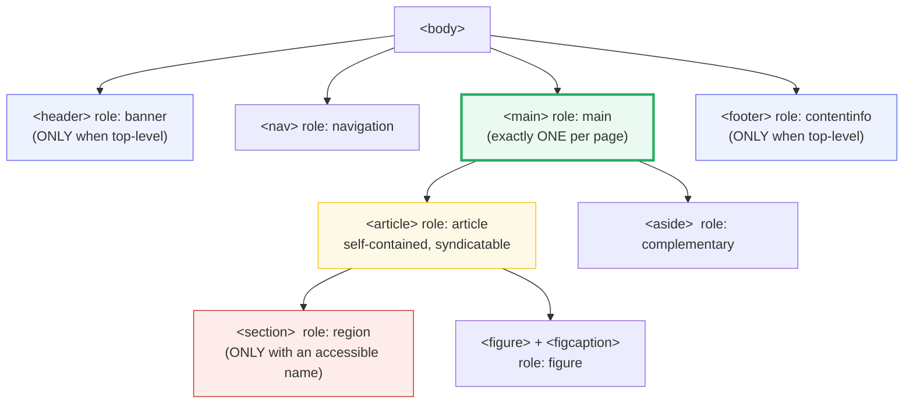
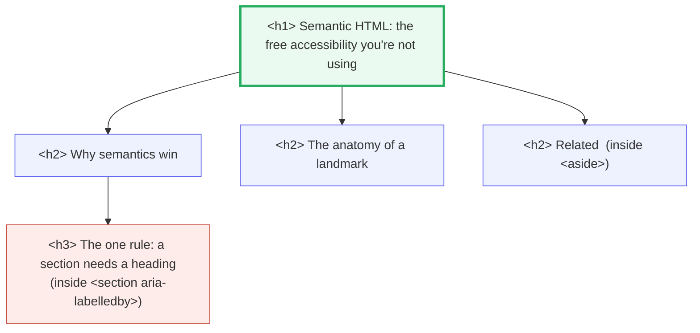

# HTML Semantics

> **Companion demo:** [`html_semantics.html`](./html_semantics.html) — open in a browser.
> **Rendered-ground-truth variant:** there is no `.js` — the structure IS the
> concept. The page itself is a genuinely semantic blog-article page, and a live
> inspector derives its outline + landmark map from its own DOM.

---

## 0. TL;DR — the one idea

> **The analogy:** a `<div>` is a blank cardboard box — strong, but anonymous.
> A semantic element (`<header>`, `<nav>`, `<main>`, `<article>`, `<aside>`,
> `<footer>`) is the *same* box with a **shipping label pre-printed on it**.
> Every browser, search engine, and screen reader reads that label for free and
> routes the user accordingly. Writing `<div class="nav">` is peeling the label
> off — now nobody knows what's inside unless you re-stick it with
> `role="navigation"`. Just use the labelled box.



The free wins: a screen-reader "landmarks" menu jumps the user straight to
`main`, skipping the entire header; search engines treat the single `<h1>` as
the page title; reader mode and SEO extractors key off these tags. None of it
works if you built the page out of `<div>`.

---

## 1. How it works — the labelled boxes

A semantic tag carries an **implicit ARIA role**. The browser computes that role
from the tag name alone — you never write `role="..."`. Screen readers then
expose those roles as **landmarks**: named jump targets in a "landmarks" menu.

```html
<header> … </header>   <!-- implicit role: banner   (site-oriented intro)   -->
<nav>    … </nav>      <!-- implicit role: navigation (a group of nav links) -->
<main>   … </main>     <!-- implicit role: main      (the dominant content)  -->
<aside>  … </aside>    <!-- implicit role: complementary (tangentially related) -->
<footer> … </footer>   <!-- implicit role: contentinfo (identifying info)   -->
```

> From `html_semantics.html` — the live **landmark map** panel, computed by
> `document.getElementsByTagName(tag).length` on the page's own DOM:
> ```
> <header>  banner          x1
> <nav>     navigation      x1
> <main>    main            x1
> <article> article*        x1
> <section> region**        x1
> <aside>   complementary   x1
> <footer>  contentinfo     x1
> <figure>  figure*         x1
> * document-structure roles   ** only with an accessible name
> ```

The `*` and `**` are the subtle half of the story — see the gotchas.

---

## 2. The document outline — one root, then descend

The heading outline is a tree. Best practice (MDN, WebAIM, the a11y community)
is **exactly one `<h1>` per page** — the page's title — then `<h2>` for each
major section, `<h3>` for sub-sections, never skipping a level. Assistive tech
lets users walk this tree by heading; search engines weight `<h1>` as the
single most important on-page signal after `<title>`.



> From `html_semantics.html` — the live **document outline** panel, computed by
> querying `main` for `h1, h2, h3` in document order:
> ```
> <h1> Semantic HTML: the free accessibility you're not using
>   <h2> Why semantics win
>     <h3> The one rule: a section needs a heading
>   <h2> The anatomy of a landmark
>   <h2> Related
> ```
> The gold-check pins this: `document.querySelectorAll('h1').length === 1`.

Note: `<main>` itself **does not contribute to the outline** (MDN, `<main>`
"Usage notes") — it is purely an informative landmark wrapper. The outline is
built from the headings inside it.

---

## 3. The self-contained units — `<article>`, `<figure>`, `<time>`

Not every meaningful element is a landmark. Three are **content-level semantics**
that machines read even though they don't appear in the landmarks menu:

```html
<!-- <article>: self-contained, independently distributable.
     Syndicate it to RSS, reuse it on another page — it still makes sense. -->
<article>
  <h2>Granny Smith</h2>
  <p>These juicy, green apples make a great filling for apple pies.</p>
</article>

<!-- <figure> + <figcaption>: a self-contained unit of media + its caption. -->
<figure>
  
  <figcaption>The five core landmarks this page exposes.</figcaption>
</figure>

<!-- <time>: a human-visible date whose datetime attr is MACHINE-readable. -->
<time datetime="2026-06-27">June 27, 2026</time>
```

`<time datetime="...">` is the quiet SEO win: the visible text can be any
locale ("June 27, 2026", "27/6/26") while `datetime` is an unambiguous
`YYYY-MM-DD` that calendars, search rich-results, and assistants parse
directly.

---

## 4. The element reference

| Element | Implicit ARIA role | Landmark? | When to use it |
|---|---|---|---|
| `<header>` | `banner` | ✅ only when **top-level** (not nested in `article`/`aside`/`main`/`nav`/`section`) | site intro + logo + primary nav wrapper |
| `<nav>` | `navigation` | ✅ always | a group of **navigation links** (major nav; for a small in-article link list, a plain list is fine) |
| `<main>` | `main` | ✅ always — **exactly one** per page (unless `hidden`) | the dominant content, unique to this page; target of "skip to content" |
| `<article>` | `article` | ❌ (document-structure role) | self-contained, **syndicatable** content: a blog post, a product card, a comment, a widget |
| `<section>` | `region` | ✅ **only with an accessible name** (e.g. `aria-labelledby` → a heading); otherwise it has no role | a thematic grouping that **must** start with a heading |
| `<aside>` | `complementary` | ✅ always | tangentially related to the main content: a sidebar, "related links", pull-quote, ad |
| `<footer>` | `contentinfo` | ✅ only when **top-level** | identifying info: copyright, contact, privacy links |
| `<figure>` + `<figcaption>` | `figure` | ❌ (document-structure role) | self-contained media + its caption; position is independent of surrounding text |
| `<time>` | `time` | ❌ | a date/time; `datetime` attr gives the machine-readable value |
| `<h1>`–`<h6>` | `heading` (+ `aria-level`) | ❌ | the six-level section outline; **one `<h1>`** per page, never skip levels |
| `<div>` / `<span>` | *(none / `generic`)* | ❌ | generic grouping — **only when no semantic element fits** |

> The seven ARIA **landmark** roles (the ones screen readers list) are:
> `banner`, `complementary`, `contentinfo`, `form`, `main`, `navigation`,
> `region`, `search` (plus `application`, used rarely). `<article>` and
> `<figure>` are *not* in that list — they are document-structure roles.

---

## Killer Gotchas

| Trap | Symptom | Fix |
|---|---|---|
| `<div class="nav">` instead of `<nav>` | screen reader's landmarks menu is empty; no "skip to nav" | use `<nav>` — the implicit `navigation` role is the whole point |
| `<section>` with **no heading / no accessible name** | exposes **no** role at all (collapses to `generic`); the "region" landmark never appears | give it a heading + `aria-labelledby`, OR just use a `<div>` if it isn't a real region |
| Multiple `<h1>`s on a page | outline becomes ambiguous; SEO/heuristics can't pick the page title | one `<h1>` (the page title), then `<h2>`s — "one h1 per page" is the a11y/SEO best practice |
| Skipping heading levels (`h1` → `h4`) | assistive-tech heading-nav jumps look broken / empty | go `h1`→`h2`→`h3`; never leap a level for visual size — use CSS for size |
| `<header>`/`<footer>` nested in `<article>`/`<section>` | they **lose** the `banner`/`contentinfo` role (correctly!) and become generic | that's intended — only the page-level header/footer are landmarks; don't add `role="banner"` to "fix" it |
| `<main>` inside `<header>`/`<nav>`/`<aside>`/`<footer>`/`<article>` | invalid nesting; `<main>` must be a direct child of `body`-level flow | keep `<main>` at the top level, not buried |
| More than one `<main>` (no `hidden`) | landmark conflict; screen readers can't pick "the" main | exactly one visible `<main>` |
| `<aside>` holding primary content | mislabels main content as "complementary" | `<aside>` is for **tangential** content; the page's core goes in `<main>`/`<article>` |
| Using `<figure>` for any old image | over-claims "self-contained media unit" | `<figure>` is for content that could be moved/removed and still makes sense (diagrams, code listings, photos with captions); a decorative image is just `` |

### Cheat sheet

```html
<!-- the canonical page skeleton: labelled boxes, one h1, real landmarks -->
<body>
  <header>  <!-- role: banner (top-level only) -->
    <a href="#main">Skip to content</a>
    <nav aria-label="Primary"> … </nav>   <!-- role: navigation -->
  </header>

  <main id="main">                        <!-- role: main (EXACTLY ONE) -->
    <article>                             <!-- role: article (syndicatable) -->
      <h1>The page title</h1>             <!-- THE single h1 -->
      <time datetime="2026-06-27">June 27, 2026</time>
      <h2>A section</h2>
      <section aria-labelledby="r1"><h3 id="r1">A named region</h3></section>
      <figure><figcaption>…</figcaption></figure>
    </article>
    <aside> … </aside>                     <!-- role: complementary -->
  </main>

  <footer> … </footer>                     <!-- role: contentinfo (top-level only) -->
</body>
```

```text
RULES OF THUMB
- one <h1> per page; h1 -> h2 -> h3, never skip a level.
- exactly one <main>; it does NOT contribute to the outline (it wraps it).
- <section> needs a heading + accessible name to BE a 'region'; else use <div>.
- <header>/<footer> are 'banner'/'contentinfo' ONLY at the top level.
- <article> is self-contained & distributable; <aside> is tangential.
- <figure>+<figcaption> for media+cation; <time datetime> for machine dates.
- a <div> is the LAST resort, not the default.
```

---

## Cross-references

- 🔗 [`BOX_MODEL.md`](./BOX_MODEL.md) — these semantic boxes still paint a
  content/padding/border/margin rectangle; semantics is about the *label*, the
  box model is about the *geometry*.
- 🔗 `selectors_specificity` (later in Phase 1) — how CSS targets these
  elements: tag selectors (`article {}`) are the lowest-specificity way to style
  semantics, and that low specificity is a feature, not a bug.

---

## Sources

Every role and behaviour below was verified in ≥2 authoritative places
(MDN + W3C WAI / the HTML spec, and at least one independent a11y source).

- MDN — *`<main>` element* (implicit role `main`; only one per page; "doesn't contribute to the document's outline"): https://developer.mozilla.org/en-US/docs/Web/HTML/Reference/Elements/main
- MDN — *ARIA: region role* (a `<section>` exposes `region` **only** when it has an accessible name): https://developer.mozilla.org/en-US/docs/Web/Accessibility/ARIA/Reference/Roles/region_role
- MDN — *ARIA: contentinfo role* (footer identifying info; top-level landmark): https://developer.mozilla.org/en-US/docs/Web/Accessibility/ARIA/Reference/Roles/contentinfo_role
- MDN — *ARIA: landmark role* (defines what a landmark is): https://developer.mozilla.org/en-US/docs/Web/Accessibility/ARIA/Reference/Roles/landmark_role
- MDN — *`<time>` element* (implicit role `time`; `datetime` is machine-readable): https://developer.mozilla.org/en-US/docs/Web/HTML/Reference/Elements/time
- MDN — *`<figure>` element* (self-contained content + optional `<figcaption>`): https://developer.mozilla.org/en-US/docs/Web/HTML/Reference/Elements/figure
- MDN — *`<figcaption>` element*: https://developer.mozilla.org/en-US/docs/Web/HTML/Reference/Elements/figcaption
- MDN — *`<h1>`–`<h6>` heading elements*: https://developer.mozilla.org/en-US/docs/Web/HTML/Reference/Elements/Heading_Elements
- MDN discussion #232 — *Why `<h1>` should be one per page?* (community guidance): https://github.com/orgs/mdn/discussions/232
- W3C WAI — *Landmark Regions (APG)* (`banner`, `main`, `complementary`, `contentinfo` are top-level landmarks): https://www.w3.org/WAI/ARIA/apg/practices/landmark-regions/
- W3C — *HTML Living Standard, §4.3 Sections* (header/footer/nav/main/article/aside/section semantics): https://html.spec.whatwg.org/multipage/sections.html
- tempertemper — *Implicit ARIA landmark roles* (`<header>`→`banner` unless descendant of article/aside/main/nav/section): https://www.tempertemper.net/blog/implicit-aria-landmark-roles
- Scott O'Hara — *Accessibility of the `<section>` element* (region only with an accessible name): https://www.scottohara.me/blog/2021/07/16/section.html
- web.dev — *Headings and sections* (`<aside>` is tangentially related): https://web.dev/learn/html/headings-and-sections

### Notes on verification / uncertainty

- **"One `<h1>` per page"** is a **best practice / strong recommendation**
  (MDN, WebAIM, the a11y community, and major screen-reader behaviour), **not a
  hard rule in the HTML spec**. The HTML spec's old "outline algorithm"
  historically allowed one `<h1>` per section, but **browsers never shipped
  it**; the practical, universally-recommended pattern is a single top-level
  `<h1>`. This bundle pins exactly one and teaches that as the rule.
- **`<article>`** has implicit role `article`, which the WAI-ARIA spec
  classifies as a **document-structure** role, **not** a formal *landmark*
  role — so it generally does not appear in a screen reader's "landmarks" menu
  (though some tools surface it as a navigable region). Stated precisely in the
  table and the inspector.
