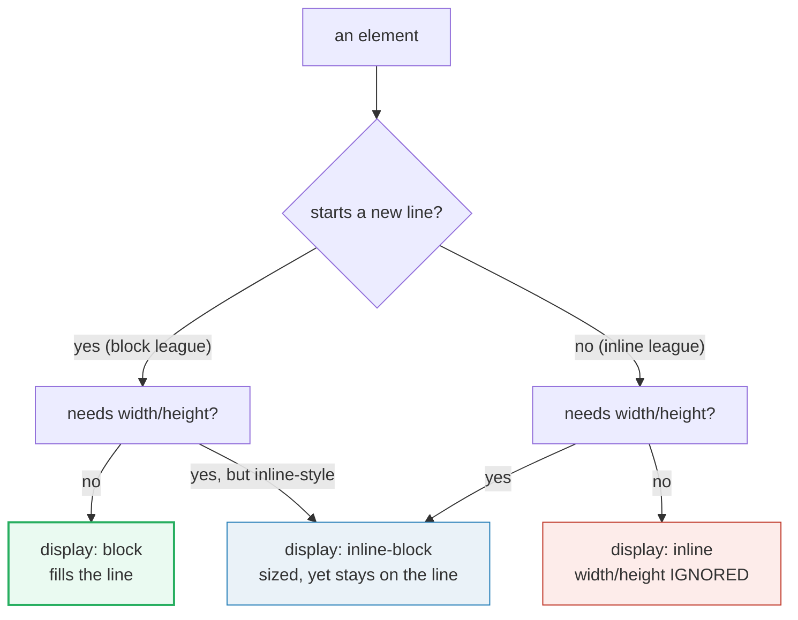
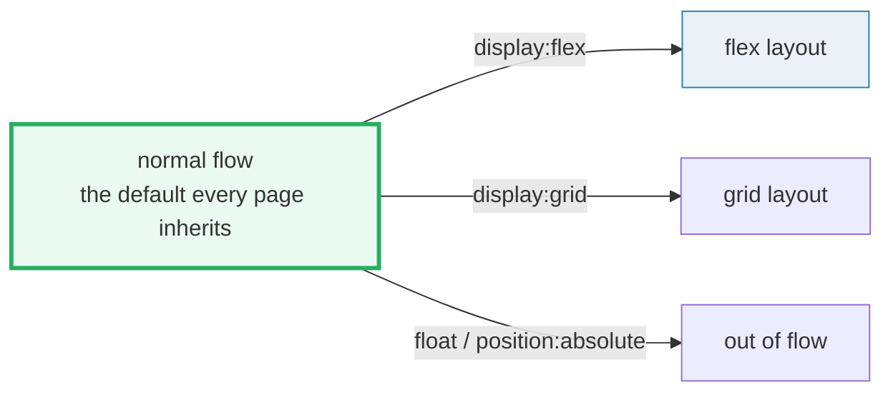

# Layout Flow

> **Companion demo:** [`layout_flow.html`](./layout_flow.html) — open in a browser.
> Every value below is measured live by that file's gold-check. Nothing is hand-waved.
> 🔗 Builds on [box model](./BOX_MODEL.md) (what `width` means depends on `box-sizing`
> *and* on `display`). Flexbox is the modern escape FROM the inline-block hacks below.

---

## 0. TL;DR — the one idea

> **The analogy:** normal flow is a page of prose. **Block** boxes are paragraphs —
> each starts on a new line and stretches as wide as the page. **Inline** boxes are
> the words inside a paragraph — they flow left-to-right and wrap. `display` is the
> switch that assigns each box to one league or the other. **Inline-block** is the
> "word that's allowed to have a size"; **a BFC** is a page-within-the-page that
> keeps its own margins and floats from leaking out.





Flex and grid are **escapes FROM** normal flow — but their *outer* display is still
`block`, so the container itself still stacks like a block box among its siblings.

---

## 1. The three display types (measured)

The demo renders all three side by side. The gold-check pins each behaviour with a
viewport-independent computed fact:

> From layout_flow.html:
> ```
>   block        : computed display = "block"     clientWidth = 320px   (fills the 320px stage)
>   inline       : computed display = "inline"    computed width = auto  (width:200 IGNORED)
>   inline-block : computed display = "inline-block"  offsetWidth = 120px  (width:120 RESPECTED)
> ```

**Why `auto`?** For an inline *non-replaced* element, `width`/`height` **do not apply**,
so the computed value is `auto` even when you write `width:200px`. The browser returns
`auto` verbatim — that is the proof the declaration was ignored. Vertical margins are
likewise ignored (they don't push sibling lines); horizontal margins/borders/padding
*are* honoured but don't break the line.

**`inline-block`** is the hybrid: it participates in the inline formatting context
(sits on the text line, doesn't force a new line) **but** generates a block container
box, so `width`/`height` apply and it establishes its own BFC.

| `display` | Starts a new line? | Respects `width`/`height`? | Respects vertical margin? |
|---|---|---|---|
| **`block`** | yes (stacks top→bottom) | yes | yes (but **collapses** with block siblings) |
| **`inline`** | no (flows left→right) | **no** (computed `auto`) | **no** (vertical margin ignored) |
| **`inline-block`** | no (flows left→right) | **yes** | yes |
| **`none`** | n/a — removed from layout & a11y tree | n/a | n/a (no box generated at all) |

---

## 2. Normal flow — the block league

In a **block formatting context**, boxes are laid out one after the other **vertically,
beginning at the top** of the containing block; each box's left outer edge touches the
left edge of the containing block (CSS 2.1 §9.4.1). The separation between two block
siblings is their `margin` — and adjacent block margins **collapse** into the larger one
rather than adding.

This is why the demo's block boxes A and B never share a line even though B is only
`width:50%`: a block always claims its own line; leftover horizontal space is left empty.

> From layout_flow.html (BFC demo, same child `margin-top:40`):
> ```
>   plain parent (no BFC)   : child.offsetTop = 0   ← margin collapsed THROUGH the parent
>   display:flow-root (BFC) : child.offsetTop = 40  ← BFC suppressed the collapse, margin held in
> ```

---

## 3. Block Formatting Context — what creates one, what it contains

A **BFC** is an isolated layout region. MDN lists what establishes one — the ones you'll
actually reach for:

- the **root** `<html>` (every page has at least one);
- **floats** (`float` ≠ `none`), **absolutely positioned** (`position: absolute|fixed`);
- **`display: inline-block`**, **`display: flow-root`**;
- **`display: flex|inline-flex|grid|inline-grid`** containers (a flex/grid formatting
  context, BFC-like);
- block elements whose **`overflow`** is not `visible`/`clip`;
- `contain: layout|content|paint`, query containers, table cells, multicol containers.

An element that establishes a new BFC will do three things — **the whole reason BFCs matter**:

1. **contain internal floats** (a floated child no longer pokes out the bottom);
2. **exclude external floats** (the BFC box shrinks to avoid an outside float);
3. **suppress margin collapsing** (margins don't escape the BFC — the demo's right box).

> The modern, side-effect-free way to make a BFC is **`display: flow-root`**. The old
> `overflow: hidden` trick works but can clip shadows/descendants or add stray scrollbars —
> `flow-root` exists precisely to avoid that. (The name means "acts like the flow root
> `<html>`, starting its own context.")

---

## Killer Gotchas

| Trap | Symptom | Fix |
|---|---|---|
| **Inline ignores `width`/`height`/vertical-margin** | you set `width:200; height:80` on a `<span>` and nothing changes; `getComputedStyle(el).width` reads `auto` | use `display: inline-block` (or `flex/grid`) when a flowing element needs a size |
| **inline-block whitespace gap** | two `inline-block` boxes have an unexplained ~4px gap between them | whitespace in the HTML becomes a space; set the parent `font-size:0`, remove the whitespace, or just use `flex`/`grid` |
| **Margin collapse between block siblings** | gap between two blocks is the *larger* margin, not the sum; a child's margin can collapse *through* a borderless/paddingless parent | establish a BFC (`display:flow-root`), or add padding/border to the parent |
| **Collapsed parent / float not contained** | floated children escape a parent → the parent has zero height, borders/backgrounds run through the float | `display: flow-root` on the parent (the modern "clearfix") |
| **Thinking `display:none` is invisible-but-present** | it's removed from layout **and** the accessibility tree; screen readers skip it | use visually-hidden techniques for a11y; `visibility:hidden` keeps the box |
| **`width:100%` inline-block overflowing** | an inline-block with `width:100%` + the whitespace gap overflows its parent | `display:block`, or `flow-root`/`flex` parent, or drop `100%` |

### Cheat sheet

```css
/* normal flow: block stacks top→bottom; inline flows left→right. display picks the league. */
/* inline non-replaced: width/height/vertical-margin DO NOT APPLY (computed width = auto). */
/* inline-block: flows inline BUT respects width/height (and starts its own BFC). */
/* margins collapse between adjacent block boxes in the same BFC; BFCs stop the collapse. */

/* contain floats / stop margin collapse — the modern clearfix, no side effects: */
.parent { display: flow-root; }

/* hide a box entirely (no layout, no a11y tree): */
.hidden { display: none; }
```

---

## 🔗 Cross-references

- **box_model** — what `width` *means* depends on `box-sizing`; whether `width` *applies*
  at all depends on `display` (this bundle). The two compose: an inline box has a box
  model, but its content-edge width is `auto`.
- **flexbox** (next) — `display:flex` is the modern replacement for the inline-block hacks
  people used for side-by-side layout: it gives you a line of sized boxes *without* the
  whitespace-gap bug and *with* alignment control.

---

## Sources

- MDN — *Block and inline layout in normal flow*: https://developer.mozilla.org/en-US/docs/Web/CSS/Guides/Display/Block_and_inline_layout
- MDN — *Block formatting context* (what creates a BFC, what it contains): https://developer.mozilla.org/en-US/docs/Web/CSS/Guides/Display/Block_formatting_context
- MDN — *Visual formatting model*: https://developer.mozilla.org/en-US/docs/Web/CSS/Guides/Display/Visual_formatting_model
- MDN — *display* (property reference): https://developer.mozilla.org/en-US/docs/Web/CSS/Reference/Properties/display
- W3C — *CSS 2.1 Visual formatting model* (§9.4 normal flow, §9.4.1 BFC, §10.3/10.6 inline width/height): https://www.w3.org/TR/CSS2/visuren.html
- CSS-Tricks — *Fighting the Space Between Inline Block Elements* (the whitespace-gap gotcha): https://css-tricks.com/fighting-the-space-between-inline-block-elements/
