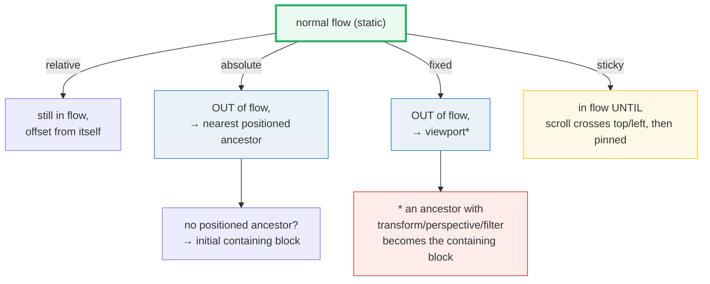
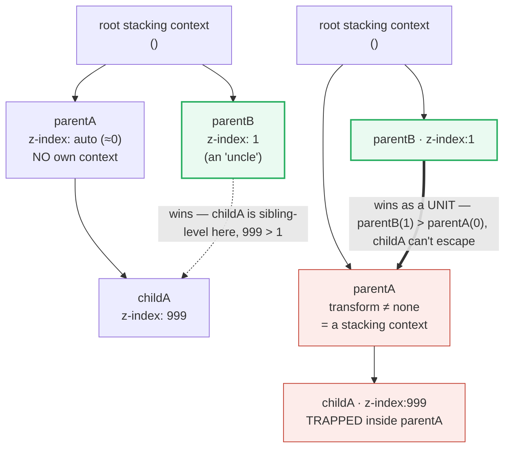

# Positioning

> **Companion demo:** [`positioning.html`](./positioning.html) — open in a browser.
> Every measured value below is shown live by that file's gold-check. Nothing is
> hand-waved.
> 🔗 Builds on [layout flow](./LAYOUT_FLOW.md) (`absolute`/`fixed` take a box
> **out** of normal flow) and [box model](./BOX_MODEL.md) (the offset edges the
> `position` values measure against).

---

## 0. TL;DR — the one idea

> **The analogy:** `position` takes a box **out of normal flow** and answers
> *where it is placed*; `z-index` decides *paint order* (who's on top) — but
> **only within its stacking context**. There are two independent questions:
> (1) **placement** — the `position` value chooses the anchor (`static` = nowhere
> special, `relative` = itself, `absolute` = nearest positioned ancestor,
> `fixed` = viewport, `sticky` = nearest scroll ancestor past a threshold);
> (2) **painting** — `z-index` only reorders siblings *inside the same stacking
> context*. A child's `z-index:999` can never beat an uncle whose parent wins,
> because contexts are **atomic**.





> **The quarantine rule:** a stacking context is treated **atomically** as a
> single unit by its parent. The `z-index` of anything inside it only reorders
> *within* that unit — it can never reach out and beat a sibling of the unit.
> That is the entire reason "z-index isn't working".

---

## 1. The 5 position values (measured)

The demo renders all five inside one stage that is both a **positioned ancestor**
(`position:relative`) and a **scroll container** (`overflow:auto`), so `absolute`
and `sticky` each get the context they need.

> From positioning.html (gold-check assertions, viewport-independent):
> ```
> getComputedStyle(#absBox).position   = "absolute"
> #absBox.offsetParent                 = #stage          ← nearest positioned ancestor
> #absBox.offsetLeft                   = 12              ← its left:12, measured from offsetParent
> getComputedStyle(#stickyBox).position= "sticky"
> getComputedStyle(#fixedBox).position = "fixed"         ← offsetParent = null (containing block = viewport)
> document.querySelectorAll("[data-pos]").length = 5      ← all 5 values present
> [check] abs→ancestor & offsetLeft==12 & sticky & fixed & 5 boxes: OK
> ```

| `position` | Taken out of flow? | Offsets (`top/right/bottom/left`) measured from… | Reference / containing block |
|---|---|---|---|
| **`static`** (default) | no | **ignored** — they do nothing | normal flow; nothing is "positioned" |
| **`relative`** | no (stays in flow, keeps its space) | the element's **own** in-flow position | itself |
| **`absolute`** | **yes** (no space reserved) | the **nearest positioned ancestor** | if none exists → the **initial containing block** (≈ viewport/root) |
| **`fixed`** | **yes** (no space reserved) | the **viewport** (initial containing block) | *unless* an ancestor has `transform`/`perspective`/`filter ≠ none` — then **that ancestor** is the containing block |
| **`sticky`** | no (flows normally until the threshold, then pinned) | the **nearest scrolling ancestor** (`overflow` ≠ `visible`) + its containing block | needs a scroll container AND a non-`auto` inset on the sticky axis |

> **`offsetParent` proves the anchor.** For a positioned box, `offsetParent` is
> its containing block. The demo's `absolute` box reports `offsetParent === #stage`;
> its `fixed` box reports `offsetParent === null` (the viewport is not an element).

### A "positioned element" is anything but `static`

MDN: a **positioned element** is one whose computed `position` is `relative`,
`absolute`, `fixed`, or `sticky` — i.e. *anything except* `static`. That matters
because `absolute` looks up the tree for the **nearest positioned ancestor** to
anchor to; if every ancestor is `static`, it falls back to the initial
containing block. This is why you almost always drop a `position:relative` (with
no offsets) on a wrapper before placing an `absolute` tooltip inside it.

---

## 2. The two-part model — placement vs paint order

**Placement** (the `position` value) answers *where the box goes*. **Paint
order** (`z-index`) answers *who's drawn on top when boxes overlap*. They are
independent — but `z-index` has a gate:

```css
/* z-index ONLY applies to positioned elements (and flex/grid items). */
.pinned { position: relative; z-index: 10; }   /* works */
.ghost  { position: static;  z-index: 10; }    /* z-index IGNORED (static) */
.flex-item { z-index: 10; }                    /* works inside display:flex without position */
```

> From positioning.html (stacking-context reveal, `elementFromPoint` at the overlap):
> ```
> parentA.transform = none
>   childA.z-index = 999    parentB.z-index = 1
>   elementFromPoint(overlap) = childA     → childA wins
>   reading: no parent context → childA(999) competes at root → childA on top
>
> parentA.transform = matrix(...translateZ...)   (stacking context created)
>   childA.z-index = 999    parentB.z-index = 1
>   elementFromPoint(overlap) = parentB     → parentB wins (childA trapped)
>   reading: parentA IS a context → childA(999) trapped → parentB(1) on top
> ```

The toggle adds `transform:translateZ(0)` to `parentA`. The child's `z-index:999`
is **unchanged**, yet it instantly drops behind `parentB` — because `parentA`
became a stacking context and the whole unit (now z-index `auto` ≈ 0) loses to
`parentB`'s 1. `document.elementFromPoint(x, y)` returns the live topmost element,
proving the paint order flipped.

---

## 3. What creates a stacking context

A stacking context is an isolated group of elements that move up/down the z-axis
**together** and are painted as one atomic unit by their parent. MDN lists the
triggers — the ones you'll actually hit:

- the **root** `<html>` (every page starts with one; nothing can go behind it);
- `position: absolute` or `relative` **with** `z-index ≠ auto`;
- `position: fixed` or `sticky` — **always**, unconditionally (no z-index needed);
- **`opacity` less than `1`** (the classic "why did my dropdown go behind things?");
- any of these with a value other than `none`: **`transform`**, `scale`, `rotate`,
  `translate`, **`filter`**, `backdrop-filter`, `perspective`, `clip-path`, `mask`;
- **`will-change`** naming any of the above (the browser "promotes" a layer early);
- `isolation: isolate`; `contain: layout|paint|content|strict`;
- **flex/grid items** with `z-index ≠ auto` (they don't need `position`);
- `mix-blend-mode ≠ normal`; the top layer (`dialog`, `popover`, fullscreen) + `::backdrop`.

> **The asymmetry to remember:** `absolute`/`relative` need `z-index ≠ auto` to
> form a context; `fixed`/`sticky` form one *unconditionally*. That's why a
> `position:fixed` navbar is its own stacking island even with no z-index set.

---

## Killer Gotchas

| Trap | Symptom | Fix |
|---|---|---|
| **`absolute` anchors to the wrong place** | your tooltip flies to the page corner / viewport edge | it had no positioned ancestor → it fell back to the **initial containing block**; put `position:relative` on the intended wrapper |
| **`fixed` isn't fixed anymore** | a `position:fixed` element scrolls with some ancestor instead of the viewport | an ancestor has `transform`/`perspective`/`filter ≠ none`, which makes **that ancestor** the containing block; remove it (or scope the fixed element outside that subtree) |
| **`sticky` doesn't stick** | behaves like `relative` or never pins | needs (a) a **scroll container** (`overflow` ≠ `visible` on an ancestor) and (b) a **non-`auto` inset** (`top`/`left`…) on the sticky axis — plus room to actually scroll |
| **"z-index isn't working"** | a huge z-index still sits behind a sibling | the element (or an ancestor) isn't positioned (static ignores z-index) — OR a parent **ate it into a new stacking context** (via `transform`/`opacity`/`will-change`), trapping its z-index locally |
| **z-index can't beat an uncle** | child `z-index:999` still under a `z-index:1` sibling of its parent | the parent created a context; the child competes only *inside* it. Raise the **parent's** z-index, or remove the context-creating property from the parent |
| **`opacity`/`transform` silently create contexts** | dropdown that used to overlay the nav now goes behind it after you added a fade/transform | these properties promote a layer and quarantine descendant z-index; use `isolation:isolate` deliberately, or restructure so the overlay isn't a descendant |
| **`z-index` without `position`** | set `z-index` on a `position:static` box — nothing changes | either set `position:relative` (no offsets needed) or move the box into a flex/grid container (items accept z-index without position) |

### Cheat sheet

```css
/* the 5 values: where the box is placed */
.pos-static   { position: static; }    /* default; top/left/z-index IGNORED        */
.pos-relative { position: relative; }  /* in flow; offsets from ITSELF; space kept  */
.pos-absolute { position: absolute; }  /* OUT of flow; → nearest positioned ancestor */
.pos-fixed    { position: fixed; }     /* OUT of flow; → viewport (unless ancestor transformed) */
.pos-sticky   { position: sticky; top: 0; } /* flows, then pins once scroll crosses the inset */

/* the #1 prerequisite: give the absolute box a positioned ancestor */
.wrap { position: relative; }          /* harmless: no offsets, just becomes an anchor */
.wrap .tip { position: absolute; top: 100%; left: 0; }

/* z-index only applies to positioned elements (or flex/grid items) */
.lifted { position: relative; z-index: 10; }

/* z-index is LOCAL to its stacking context — a child can't beat an uncle.
   Fix it at the PARENT level, or remove the context-creating property
   (transform/opacity<1/filter/will-change) that trapped the descendants. */

/* force a new context on purpose (without side effects of opacity/transform) */
.island { isolation: isolate; }
```

---

## Cross-references

- 🔗 [`LAYOUT_FLOW.md`](./LAYOUT_FLOW.md) — `position:absolute` and `position:fixed`
  are listed among the things that take a box **out of normal flow** (alongside
  floats). `relative`/`sticky` stay in flow but offset/pin. Positioning is the
  "escape hatch" from block/inline stacking.
- 🔗 [`BOX_MODEL.md`](./BOX_MODEL.md) — `top/right/bottom/left` are measured against
  the containing block's edges; `box-sizing:border-box` keeps the declared width
  honest regardless of how the box is positioned.

---

## Sources

- MDN — *position* (all 5 values, containing-block rules, "positioned element" definition): https://developer.mozilla.org/en-US/docs/Web/CSS/position
- MDN — *Stacking context* (the full list of what creates one; atomicity of nested contexts): https://developer.mozilla.org/en-US/docs/Web/CSS/CSS_positioned_layout/Stacking_context
- MDN — *Positioning* (Learn: relative stays in flow; absolute/fixed/sticky taken out): https://developer.mozilla.org/en-US/docs/Learn_web_development/Core/CSS_layout/Positioning
- MDN — *z-index* (only applies to positioned elements, or flex/grid items): https://developer.mozilla.org/en-US/docs/Web/CSS/z-index
- MDN — *HTMLElement.offsetParent* (returns the containing block for positioned boxes; null for fixed): https://developer.mozilla.org/en-US/docs/Web/API/HTMLElement/offsetParent
- web.dev — *Z-index and stacking contexts* (secondary source: opacity/transform/will-change create contexts; z-index needs position ≠ static): https://web.dev/learn/css/z-index
- W3C — *CSS 2.1 Visual formatting model* (§9.3 positioned elements, §9.9 layer presentation / stacking; normative): https://www.w3.org/TR/CSS2/visuren.html
- Josh W. Comeau — *What The Heck, z-index??* (the "stacking context traps children" mental model): https://www.joshwcomeau.com/css/stacking-contexts/
