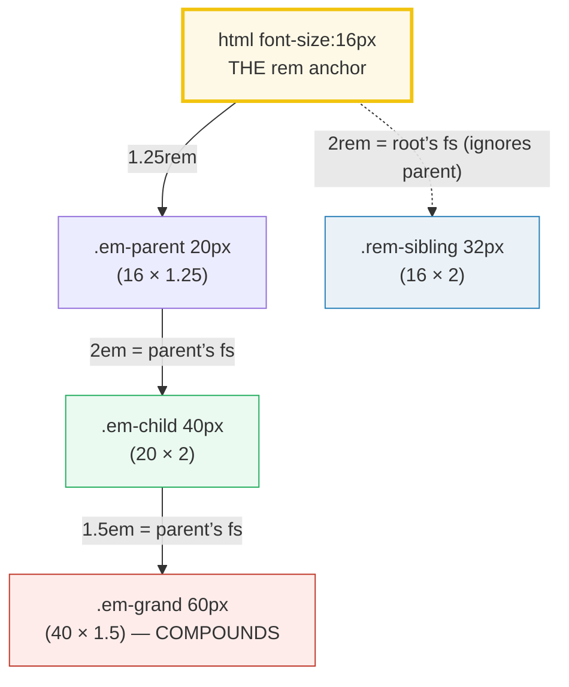
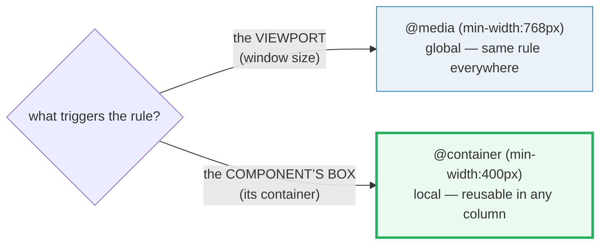

# Responsive Units

> **Companion demo:** [`responsive_units.html`](./responsive_units.html) — open in a browser.
> Every value below is measured live by that file's gold-check. Nothing is hand-waved.
> 🔗 Builds on [box model](./BOX_MODEL.md) (units are what `width`/`font-size` resolve *to*) and
> feeds into [Tailwind responsive variants](../tailwind/TAILWIND_RESPONSIVE_VARIANTS.md) (every `sm:`/`md:`
> breakpoint is a media query under the hood).

---

## 0. TL;DR — the one idea

> **The analogy:** `px` is absolute — "this many dots, period". `em` is "relative to **my parent's**
> font-size" — so it **compounds** down a nested tree like interest. `rem` ("root em") is "relative to
> the **root** `<html>`" — one fixed reference, no compounding. **Media queries** react to the
> **viewport** (global); **container queries** react to a **component's own box** (local, reusable).
> `clamp(min, pref, max)` makes a value fluid between two absolutes with no breakpoints at all.





---

## 1. The four unit families (measured)

The demo pins `html { font-size: 16px }` in its own `<style>`, which makes `rem` **deterministic**
on this page: `1rem == 16px` regardless of viewport. It then renders a nested chain and reads every
value back with `getComputedStyle`:

> From responsive_units.html (Panel 1 — resolution chain):
> ```
>   root    font-size = 16px   (html { font-size:16px })        ← the rem anchor
>   parent  1.25rem    = 20px   (16 × 1.25)
>   child   2em        = 40px   (parent 20 × 2)   ← em = the parent's font-size
>   grand   1.5em      = 60px   (parent 40 × 1.5) ← em COMPOUNDS through nesting
>   sibling 2rem       = 32px   (root 16 × 2)     ← rem ignores the 20px parent
> ```

**The em nuance (the one that bites):** on the `font-size` property itself, `em` means the
**inherited** (parent's) font-size — MDN: *"If used on the `font-size` property itself, it represents
the inherited font-size of the element."* On **every other** property (`padding`, `margin`, `width`),
`em` means the element's **own** computed font-size. That's why `font-size:1.5em` *inside* a
`font-size:2em` parent multiplies to `1.5 × 2 = 3em` of the root — and why deeply nested `em`s spiral.

**rem** short-circuits that: it always references the root element (`<html>`), so it **never
compounds**. *"Represents the `font-size` of the root element (typically `<html>`). A common browser
default is `16px`."* (MDN). The demo relies on the *pinned* value, not the UA default.

> From responsive_units.html (Panel 1 — width bars, declared `width:2` in a 20px em context):
> ```
>   2px = 2px    2em = 40px    2rem = 32px    2vw = <viewport/50>px
> ```
> `2vw` is the only non-deterministic row — `1vw` is 1% of the viewport width, so it shifts with the
> window. That is exactly why the **gold-check never pins a `vw` value**.

### Unit reference

| Unit | Relative to | Resolves to (root=16px) | Use for |
|---|---|---|---|
| **`px`** | nothing — absolute (`1px = 1in/96`) | exactly what you write | hairlines, borders, tiny fixed details |
| **`em`** | parent's font-size (on `font-size`); own font-size (elsewhere) | compounds down the tree | spacing that should scale *with the element's* text |
| **`rem`** | root `<html>` font-size | `N × 16px` (deterministic) | **font-sizes, media-query breakpoints** — the default reach |
| **`%`** | the containing block (parent's dimension) | parent × N/100 | fluid widths, flex/grid splits *(not a `<length>`!)* |
| **`vw`/`vh`** | 1% of viewport width / height | viewport-dependent | full-bleed sections, viewport-scale type |
| **`vmin`/`vmax`** | smaller / larger of `vw`,`vh` | viewport-dependent | "keep it visible on any aspect ratio" |
| **`ch`** | advance measure of the `0` glyph (~`0.5em`) | font-dependent | capping line length (~`65ch` for readability) |
| **`cqw`/`cqi`** | 1% of the **query container's** width / inline-size | container-dependent | sizes that track the *component*, not the viewport |

---

## 2. Media query vs container query — viewport vs component

A **media query** (`@media`) tests a condition of the **viewport** (or media): width, orientation,
hover capability, color-scheme. It is **global** — the same rule applies everywhere on the page, so a
card that should be "wide in the sidebar, narrow in the main column" cannot be expressed with one
media query, because both live in the same viewport.

A **container query** (`@container`) tests a condition of an **ancestor's box** that has been marked
as a query container with `container-type`. The component becomes responsive to **where it is placed**,
not to the window:

```css
.cq-container { container-type: inline-size; }   /* mark the box as queryable */
@container (min-width: 400px) {
  .cq-card { display: flex; }   /* only when THIS container is >= 400px */
}
```

The golden rule (Josh Comeau / MDN): **you can't change what you measure.** `container-type:
inline-size` lets you query the inline (width) axis — but the element *inside* the container must not
be the thing that sets the container's width, or you get a cycle.

> From responsive_units.html (Panel 2 — slider drives the host width, viewport untouched):
> ```
>   host .cq-container  container-type = inline-size   (it IS a query container)
>   container width     = 520px   (set by the slider, NOT the viewport)
>   @container (min-width:400px)  = MATCHED
>   card computed display = flex   → horizontal
>
>   media query (for contrast):
>   window.matchMedia("(min-width:768px)").matches = true/false   (tracks the WINDOW)
> ```
> Drag the slider below 400 and the card stacks — **without resizing the browser**. That is the whole
> point: component-level responsiveness.

| | `@media` | `@container` |
|---|---|---|
| reacts to | the **viewport** (window) | an ancestor **component box** |
| scope | global (whole document) | local (nearest query container) |
| needs setup | nothing | `container-type` on an ancestor |
| reusable component? | no — same breakpoint everywhere | **yes** — adapts to its slot |
| classic use | page-level layout (sidebar on/off) | cards/widgets in fluid grids |

---

## 3. Fluid type with `clamp()` — no breakpoints

```css
h1 { font-size: clamp(1rem, 6vw, 2.5rem); }   /* never < 16px, never > 40px */
```

`clamp(MIN, PREFERRED, MAX)` returns the preferred value, but clamped to the `[MIN, MAX]` range.
`min()` and `max()` are its siblings. This replaces an entire ladder of `@media` font-size steps with
one smooth line — but note the **accessibility caveat** below: a `vw`-driven preferred value can
defeat the user's browser font-size setting between the bounds.

> From responsive_units.html (Panel 3 — `clamp(1rem, 6vw, 2.5rem)`):
> ```
>   computed font-size  = glides 16px ↔ 40px with the viewport
>   6vw at this viewport = <viewport × 0.06>
>   clamped?            = "at MIN" / "fluid" / "at MAX"
> ```

---

## Killer Gotchas

| Trap | Symptom | Fix |
|---|---|---|
| **`em` compounds through nesting** | a menu inside a menu inside a menu grows `1.2 × 1.2 × 1.2 …` until text is huge | use `rem` for font-size (one root reference); reserve `em` for spacing that should track *its own* element's text |
| **`rem` depends on the root font-size** | "my `1rem` is 16px" is the *UA default*, not a spec value — a user who raised their browser font-size, or a reset that set `html{font-size:10px}`, shifts everything | never assume `1rem == 16px` in production math; set your own root or read `getComputedStyle(html).fontSize` |
| **media queries are viewport-global** | the same card looks wrong in a wide sidebar and a narrow main column, because both see the same viewport width | use a **container query** so the component adapts to its own box |
| **`container-type` containment side effects** | `container-type: size` applies size containment (the element's own size is no longer based on its contents → it collapses without an explicit height); `inline-size` is the safe default | default to `container-type: inline-size`; reserve `size` when you also query the block axis and provide a height |
| **you can't change what you measure** | a `@container (min-width)` rule that resizes the *same* axis the query reads causes a layout cycle / no-op | the element that *responds* to the query must live *inside* the container, and must not set the container's queried dimension |
| **`100vw` includes the scrollbar** | a `width:100vw` hero overflows horizontally on desktop browsers with a visible vertical scrollbar → stray horizontal scroll | use `width:100%`, or `100dvw`/`100svw` won't fix it either (they also include the gutter); reserve `vw` for *insets* not full widths |
| **`clamp()` can ignore user font-size** | between MIN and MAX the preferred `vw` value ignores the user's browser font-size setting → a11y regression | keep MIN as a `rem` floor (respects user setting) and don't let the preferred value run away; or prefer `@media`/`rem` for body text |
| **`%` is not a `<length>`** | some properties reject `%` where a `<length>` is required (and vice-versa); mixing in `calc()` can throw | check the property's value grammar; use `calc()` with explicit units when unsure |

### Cheat sheet

```css
/* the deterministic anchor: set the root, so rem is knowable */
html { font-size: 16px; }            /* 1rem = 16px ON THIS PAGE (UA default matches, but don't assume) */

/* em on font-size = PARENT's font-size (compounds); on padding/width = the element's OWN font-size */
/* rem = root <html> font-size (never compounds). Prefer rem for font-size; em for self-relative spacing. */

/* responsive: viewport vs component */
@media (min-width: 768px) { /* layout reacts to the WINDOW */ }

.sidebar { container-type: inline-size; }          /* mark a query container */
@container (min-width: 400px) { .card { ... } }     /* reacts to the CONTAINER's box, not the window */

/* fluid without breakpoints — clamped to [1rem, 2.5rem]: */
h1 { font-size: clamp(1rem, 6vw, 2.5rem); }

/* line-length cap in characters (ch = width of the '0' glyph): */
.prose { max-width: 65ch; }
```

---

## 🔗 Cross-references

- **box_model** — units are what `width`/`font-size` *resolve to*; `box-sizing` decides whether
  `width` means content or content+padding+border, but both need a unit to be a real length.
- **layout_flow** — `%` is relative to the *containing block*, whose identity depends on `display`/
  `position` (this bundle's resolution chain only works because each child knows its parent).
- **tailwind_responsive_variants** (`../tailwind/TAILWIND_RESPONSIVE_VARIANTS.md`, Batch 3) — Tailwind's
  `sm:`/`md:`/`lg:` modifiers compile to `@media` queries; container-query variants (`@container`/`@md:`)
  are the component-level counterpart shown here.

---

## Sources

- MDN — *`<length>`* (px/em/rem/vw/vh/vmin/vmax/ch/%, the em-on-font-size nuance, rem root default 16px): https://developer.mozilla.org/en-US/docs/Web/CSS/Reference/Values/length
- MDN — *CSS Container queries* (`container-type: size|inline-size`, the `@container` rule): https://developer.mozilla.org/en-US/docs/Web/CSS/Guides/Containment/Container_queries
- MDN — *container-type* (size containment side effects, inline-size as the safe default): https://developer.mozilla.org/en-US/docs/Web/CSS/Reference/Properties/container-type
- MDN — *Using media queries* (viewport-level conditions): https://developer.mozilla.org/en-US/docs/Web/CSS/Guides/Media_queries/Using
- MDN — *clamp()* (MIN, PREFERRED, MAX clamping): https://developer.mozilla.org/en-US/docs/Web/CSS/Reference/Values/clamp
- web.dev — *CSS min(), max(), and clamp()* (fluid typography technique, secondary source): https://web.dev/articles/min-max-clamp
- web.dev — *Container queries* (component-level responsiveness, inline-size, "can't change what we measure"): https://web.dev/learn/css/container-queries
- CSS-Tricks — *CSS Container Queries* (inline-size = container width in horizontal writing mode): https://css-tricks.com/css-container-queries/
- CSS-Tricks — *Font Size Idea: px at the Root, rem for Components, em for Text* (em compounding rationale): https://css-tricks.com/rems-ems/
- W3C — *CSS Values and Units Module Level 4* (the `<length>` definitions, §lengths): https://drafts.csswg.org/css-values/#lengths
- W3C — *CSS Containment Module Level 3* (container queries + containment): https://www.w3.org/TR/css-contain-3/
