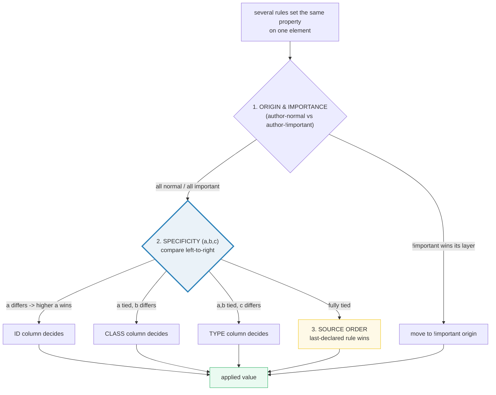

# Selectors &amp; Specificity

> **Companion demo:** [`selectors_specificity.html`](./selectors_specificity.html) — open in a browser.
> **Computable core:** [`selectors_specificity.js`](./selectors_specificity.js) — `node selectors_specificity.js`.
> Every triplet below is printed by that file. Nothing is hand-computed.

---

## 0. TL;DR — the one idea

> **The analogy:** specificity is a **3-number score** attached to every selector —
> `(a, b, c)` = **(IDs, classes/attributes/pseudo-classes, types/pseudo-elements)**.
> When several rules set the same property on one element, the browser compares the
> scores **column by column, left to right**; the higher score wins, and a tie is
> broken by **source order** (last one wins). `*` and combinators score nothing.
> A single ID (`1,0,0`) beats any number of classes (`0,99,0`); the columns are
> **not** a base-10 number.



Two overrides sit **above** this whole ladder and are **not** specificity:

- **Inline styles** (`style="..."`) — think of them as `(1,0,0,0)`; they beat every
  author selector.
- **`!important`** — moves the declaration to a higher-priority **origin**. Only
  another `!important` (or a higher origin) can beat it.

---

## 1. How it works — the triplet

A selector earns weight by counting its parts:

| part | example | adds |
|---|---|---|
| ID selector | `#nav` | **+1,0,0** |
| class / attribute / pseudo-class | `.item` · `[href]` · `:hover` | **+0,1,0** |
| type / pseudo-element | `a` · `::before` | **+0,0,1** |
| universal `*` and combinators (` `, `>`, `+`, `~`) | — | **+0,0,0** |

> From selectors_specificity.js Section A:
> ```
>   A selector's specificity is a 3-part weight, compared left-to-right:
> 
>     a  = # of ID selectors           (#id)              +1,0,0
>     b  = # of class / attribute / pseudo-class  (.c [a] :pc) +0,1,0
>     c  = # of type / pseudo-element   (li  ::pe)         +0,0,1
>     *  and combinators ( > + ~ space ) add NOTHING       -> 0,0,0
> 
>   Atomic facts (each computed by specificity()):
> [check] "#nav" -> (1,0,0): OK
> [check] ".item" -> (0,1,0): OK
> [check] "a" -> (0,0,1): OK
> [check] "*" -> (0,0,0): OK
> [check] "[href]" -> (0,1,0): OK
> [check] ":hover" -> (0,1,0): OK
> [check] "::before" -> (0,0,1): OK
> ```

---

## 2. The worked-examples table

> From selectors_specificity.js Section B:
> ```
>   selector          (a,b,c)        decimal
>   ----------------------------------------
>   *                 (0,0,0)        000
>   li                (0,0,1)        001
>   ul li             (0,0,2)        002
>   .item             (0,1,0)        010
>   #nav              (1,0,0)        100
>   #nav .item        (1,1,0)        110
>   #nav .item a      (1,1,1)        111
>   a[href]:hover     (0,2,1)        021
>   #a #b #c          (3,0,0)        300
>   .x.y.z            (0,3,0)        030
>   div::after        (0,0,2)        002
>   :nth-child(2n)    (0,1,0)        010
> [check] GOLD "#nav .item a" -> (1,1,1) decimal 111: OK
> ```

The **`decimal` column is a reading aid only** — it is NOT base-10 math (see the
killer gotcha below). The pinned **GOLD** value `#nav .item a -> (1,1,1) -> 111`
is recomputed inside `selectors_specificity.html` by the identical `specificity()`
function, and the live demo proves the browser's own cascade picks that rule.

---

## 3. The cascade — where specificity sits

Specificity is **one step** in a fixed chain. The browser walks it in order; the
first step that produces a unique winner wins.

> From selectors_specificity.js Section C:
> ```
>   When several rules set the same property on one element, the browser
>   picks the winner through this fixed chain (first match wins):
> 
>     1. ORIGIN & IMPORTANCE   author-normal < author-!important < ...
>        (!important is a separate ORIGIN, not a specificity boost)
>     2. SPECIFICITY            the (a,b,c) triplet, compared left-to-right
>     3. SOURCE ORDER           last-declared rule wins on a tie
> 
>   Specificity is only compared BETWEEN rules of the same origin/importance.
> 
> [check] "html body main article section nav div ul li a" -> (0,0,10)  [10 types, still 0 in CLASS]: OK
> [check] ".item" (0,1,0) BEATS "html body main article section nav div ul li a" (0,0,10)  [CLASS col > TYPE col]: OK
> [check] "#nav" (1,0,0) BEATS ".a.b.c.d.e" (0,5,0)  [ID col > CLASS col]: OK
> [check] "ul li" (0,0,2) TIES "ol li" (0,0,2)  [-> last-declared wins]: OK
> 
>   Two override mechanisms are NOT specificity (they sit higher):
>     inline style   -> think (1,0,0,0); beats every author selector
>     !important     -> moves the declaration to a higher ORIGIN;
>                      only another !important (or higher) can beat it.
> ```

The two computed demonstrations are the heart of the model:

- **`.item` `(0,1,0)` beats ten type selectors `(0,0,10)`** — the CLASS column is
  compared before TYPE, so *any* number of types still loses to one class.
- **`#nav` `(1,0,0)` beats five classes `.a.b.c.d.e` `(0,5,0)`** — the ID column is
  compared before CLASS, so *any* number of classes still loses to one ID.

---

## Killer Gotchas

| Trap | Symptom | Fix |
|---|---|---|
| **Reading the triplet as a base-10 number** | thinking `0,1,1` (= "11") beats `0,0,10` | it's a triplet compared left-to-right, **not** a number — `(0,0,10)` is valid and `(0,1,0)` beats it |
| **IDs beat unlimited classes** | piling on classes "to be more specific" never overtakes one `#id` | raise specificity in the same column, or drop the ID (use `[id="x"]` = a class-level attribute selector) |
| **`!important` is a sledgehammer** | one `!important` forces the *next* person to also use `!important`, spiraling | it's a separate **origin**, not specificity — prefer a more specific selector or `@layer` |
| **Inline style beats every selector** | your stylesheet rule silently loses to `style="..."` | only `!important` (or editing the inline style) overrides it |
| **Source order only breaks exact ties** | "I put it last, why didn't it win?" | last-wins applies **only** when `(a,b,c)` is identical; otherwise specificity already decided |
| **Proximity doesn't matter** | `<body><h1>` vs `<html><h1>` — you expect the nearer ancestor to win | both are `(0,0,2)`; tree distance is irrelevant, only the triplet + source order count |
| **Inherited vs targeted** | parent `#id { color }` looks "very specific" but child `h1 { color }` wins | a directly targeted element always beats an inherited value, regardless of specificity |

### Cheat sheet

```css
/* score each selector as (a,b,c) = (ID, CLASS, TYPE); compare left-to-right */
/*   #id              -> +1,0,0                                            */
/*   .class [attr] :pc -> +0,1,0                                           */
/*   type  ::pseudo-el -> +0,0,1                                           */
/*   *  and  > + ~ (space) -> +0,0,0   (add nothing)                       */

/* order of resolution: ORIGIN/IMPORTANCE  ->  SPECIFICITY  ->  SOURCE ORDER */
/* inline style ~= (1,0,0,0) ;  !important is a higher ORIGIN, not specificity */

/* keep specificity LOW and flat — one class per rule is the sweet spot */
/* (.button) beats needing (#nav .list .item .button) just to win a tie */
```

---

## 🔗 Cross-references

- **box_model** — the elements these selectors *target*. Specificity decides *which*
  rule paints a box; the box model decides *how big* that box is.
- **tailwind_design_tokens** — Tailwind's utilities are deliberately **single-class,
  low-specificity** `(0,1,0)`. That predictability is *why* utility CSS composes
  cleanly without specificity wars.

---

## Sources

- MDN — *Specificity*: https://developer.mozilla.org/en-US/docs/Web/CSS/CSS_cascade/Specificity
- web.dev / Chrome — *Learn CSS: Specificity*: https://web.dev/learn/css/specificity
- MDN — *Cascade and specificity (Introduction)*: https://developer.mozilla.org/en-US/docs/Web/CSS/CSS_cascade/Cascade
- CSS-Tricks — *Specifics on CSS Specificity*: https://css-tricks.com/specifics-on-css-specificity/
- CSS-Tricks — *CSS Specificity is Base-Infinite* (why it's a triplet, not base-10): https://css-tricks.com/css-specificity-is-base-infinite/
- W3C — *Selectors Level 4, #specificity-rules* (the normative triplet rules): https://drafts.csswg.org/selectors/#specificity-rules
