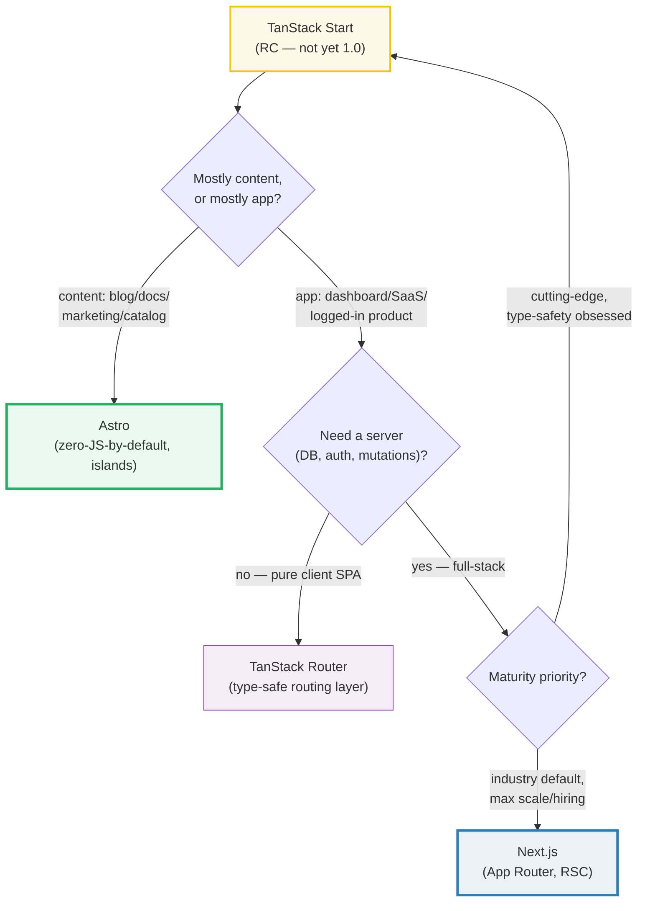
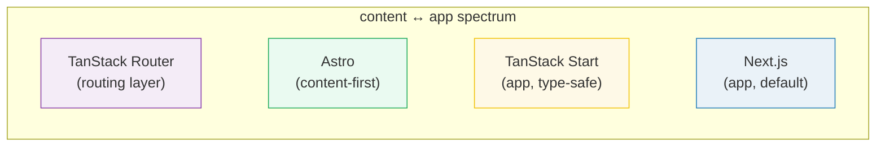

# Metaframework Landscape

> **Companion demo:** [`metaframework_landscape.html`](./metaframework_landscape.html) — open in a browser; it is the interactive comparison dashboard + decision helper.
> **Rendered-ground-truth variant** — no `.js` (there is no computable core; this bundle is *curated comparison data*). The `.html` IS the ground truth: it renders four framework cards + a deterministic decision helper, and asserts both in a gold-check.

> This bundle is the **map**. It compares Astro, TanStack Router, TanStack Start, and Next.js at the pros/cons level. It does NOT deep-dive any framework — the deep-dives live in later phases: 🔗 [`astro/`](../astro/astro_islands.html) (Phase 5) and 🔗 [`tanstack-start/tanstack_start_overview`](../tanstack-start/tanstack_start_overview.html) (Phase 6).

---

## 0. TL;DR — the one idea

> **The 80/20 thesis:** *Astro for ~80% of content-driven sites; TanStack Start for app-like SaaS; Next.js for the industry-default full-stack.* One question decides almost everything — **is the page mostly read, or mostly interacted with?** Content is king → Astro. The app *is* the product → TanStack Start (type-safe) or Next.js (default). TanStack Router is the type-safe *routing layer* underneath Start — not a full metaframework by itself.





---

## 1. The four options (verified Jun 2026)

> From metaframework_landscape.html — the `FRAMEWORKS` data object renders the four cards and the comparison table verbatim.

### Astro — *content-first*
Islands architecture, multi-framework (React/Vue/Svelte/Solid/Preact), **zero-JS-by-default**. You opt into JS per-island with `client:*` directives. **Server Islands** (`server:defer`) add a little dynamic content to an otherwise static shell. Current line: **v7 (2026)**. Best for blogs, docs, marketing, portfolios, catalogs — the ~80% of the web where content is king.

### TanStack Router — *the routing layer* (stable)
The type-safe routing engine. **"The route tree is the application contract."** A generated route tree gives you typed links, typed search params, typed loaders, prefetch on intent, and code splitting. It is client-first SPA routing — **it has no server of its own.** It is the layer TanStack Start is built on. Do not compare it head-to-head with full metaframeworks: it is a layer, not a framework.

### TanStack Start — *full-stack on Router* (RC, not yet 1.0)
Takes TanStack Router's typed route tree and adds the server: full-document **SSR, streaming, server functions** (`createServerFn` — an explicit, validated server boundary), server routes, and deployable output for Node/Workers/Netlify/Railway. **Status: Release Candidate as of Jun 2026.** Tanner Linsley announced v1.0 RC on **Sep 23, 2025**; the official site says the RC API is *"considered stable and preparing for 1.0."* **It is NOT yet 1.0 GA** — see Killer Gotchas.

### Next.js — *the industry default*
The dominant full-stack React framework (Vercel). **App Router** (file-system based, nested layouts, built on React Server Components + Suspense + Server Functions). Current: **v15 (2025/2026)**. Best for large production apps, teams that need the default hire-able stack, and anything where "nobody got fired for picking Next.js." The path of least resistance — and the one with the steepest RSC mental model and the heaviest Vercel coupling.

---

## 2. Comparison table (verbatim from the dashboard data)

| Framework | Rendering model | Routing | Best for | Key caveat |
|---|---|---|---|---|
| **Astro** *(content-first)* | SSG by default; SSR + Server Islands on demand. Ships zero JS unless you opt in with `client:*`. | File-based, page-oriented. Not a SPA router. | Blogs, docs, marketing, portfolios, catalogs — the ~80% where content is king. | Multi-framework, **NOT React-only**. Islands hydrate in isolation; sharing state between islands needs wiring. |
| **TanStack Router** *(routing layer)* | Client-first SPA routing. No server of its own; pair with Vite for a pure client app. | Type-safe, code-generated route tree. Params/search/loaders/prefetch typed end to end. | A client SPA where you want the best router — without adopting a server framework. | It is **ONLY routing**. No SSR, no server functions, no deployable server. It is a layer, not a framework. |
| **TanStack Start** *(RC · not yet 1.0)* | Full-document SSR + streaming; opt routes into SPA/selective SSR. Server-powered, client-authored. | TanStack Router — the typed route tree IS the application contract. | App-like SaaS wanting the router's type safety AND a server, on a newer stack than Next.js. | **Still RC, NOT 1.0 GA** (since Sep 2025). Smaller ecosystem, fewer tutorials. Pin the version for production. |
| **Next.js** *(industry default)* | SSR / SSG / ISR / RSC / Edge — all of them, all configurable. React Server Components are the core model. | App Router — file-system, nested layouts, built on RSC + Suspense + Server Functions. | Large production apps, teams needing the default hire-able stack, maximum scale/support. | **App Router (new, RSC) vs Pages Router (legacy)** is a real fork. Caching defaults change across versions. |

> From metaframework_landscape.html — the `FRAMEWORKS` object: each row's fields are rendered into both the cards and this table from the same source.

---

## 3. When to pick which (the 80/20 in detail)

- **Pick Astro** when the page is mostly *read* — blog, docs, marketing site, portfolio, catalog, landing page. You want it fast by default and you only reach for JavaScript where an interactive island (a carousel, a search box, a pricing calculator) actually needs it. **~80% of the web.** → Deep-dive in the [`astro/`](../astro/astro_islands.html) phase.
- **Pick TanStack Router** when you have a *client SPA* and want the best type-safe router — generated route tree, typed search params, loaders, prefetch — and you do **not** need a server (yet). It is the upgrade path *into* Start: "keep the app client-first, then bring Start in when the same route tree needs a server."
- **Pick TanStack Start** when the product is an *app* (dashboard, SaaS, logged-in tool), you want the router's type safety to flow into server functions and loaders, **and** you accept RC maturity risk. The strongest selling point is compile-time type safety across routing, loaders, and server functions. → Deep-dive in [`tanstack-start/`](../tanstack-start/tanstack_start_overview.html).
- **Pick Next.js** when you want the **industry default**: the biggest ecosystem and mindshare, mature RSC + streaming, one-click Vercel deploy, and the path of least resistance for teams and hiring. App Router is the future-proof, RSC-native choice.

---

## 4. The decision helper (deterministic)

The dashboard's `decide(answers)` is a pure function of four axes — `site` (content|app), `js` (minimal|full), `server` (none|full), `maturity` (default|cutting). Same four answers always return the same pick. The 80/20 collapses to:

```
content + minimal JS          → Astro      (the ~80% case; content wins outright)
content + full JS             → Astro      (islands can be fully interactive)
app + no server               → TanStack Router   (it's a SPA)
app + full server + cutting   → TanStack Start    (RC caveat)
app + full server + default   → Next.js
```

> From metaframework_landscape.html gold-check:
> ```
> [check] 4 cards render (4/4) & decide(content,minimal)='astro' (astro): OK
> ```
> The gold-check asserts **two facts about data authored in the file**: (1) exactly 4 framework cards render (matching `Object.keys(FRAMEWORKS).length`), and (2) `decide({site:'content', js:'minimal', ...}) === 'astro'`. Neither reads from the network.

---

## Killer Gotchas

| Trap | Symptom | Fix / honest note |
|---|---|---|
| **Treating TanStack Start as GA** | "It's 1.0, ship it!" → surprise breakage, missing docs | It is **Release Candidate** as of Jun 2026 (RC since Sep 2025). Official site: *"API considered stable, preparing for 1.0."* Pin the version; treat bumps as planned work. **Not yet 1.0 GA — flag this honestly, do not hide it.** |
| **Comparing TanStack Router alone to full frameworks** | "Router vs Next.js" is apples-to-oranges | Router is a **layer** (routing only, no server). Compare it to other *routers*. The fair full-framework comparison is Start vs Next.js. |
| **Astro is NOT React-only** | assuming `.astro` = React ecosystem | Astro is **multi-framework** — React, Vue, Svelte, Solid, Preact render side by side. You can even mix frameworks on one page. |
| **Next.js App Router vs Pages Router** | two mental models, legacy tutorials, "which one?" | App Router (RSC, nested layouts) is the future-proof pick; Pages Router is legacy. Don't start new work on Pages Router. Caching defaults have changed across Next versions — verify per release. |
| **Islands don't share state for free** | two Astro islands can't read each other's state | each island hydrates in isolation; wire shared state explicitly (URL, a store, props lifted into a parent island). |
| **Start's smaller ecosystem** | fewer Stack Overflow answers, fewer deploy guides than Next.js | offset by official partners (Cloudflare, Railway, Netlify, Vercel) and the Thoughtworks Tech Radar "Assess" rating — but expect more DIY than Next.js. |

### Cheat sheet

```
THE 80/20 RULE
  content is king            → Astro            (zero-JS-by-default, islands, ~80% of the web)
  app + no server (SPA)      → TanStack Router  (type-safe routing LAYER, not a framework)
  app + server + type-safety → TanStack Start   (RC, not yet 1.0 — pin the version)
  app + server + default     → Next.js          (App Router, RSC, industry default)

ONE QUESTION: is the page mostly READ, or mostly INTERACTED WITH?
  read  → Astro
  app   → need a server? yes → Start(RC)/Next.js · no → Router

STATUS (Jun 2026)
  Astro            v7, stable
  TanStack Router  stable (the layer)
  TanStack Start   Release Candidate (NOT 1.0 GA; RC since Sep 2025)
  Next.js          v15, App Router, the default
```

---

## Sources

Web-verified ≥2 per framework (official + reputable secondary), Jun 2026.

**Astro**
- Astro Docs — *Islands architecture* (official): https://docs.astro.build/en/concepts/islands/
- Astro — official site: https://astro.build/
- Patterns.dev — *Islands Architecture* (secondary): https://www.patterns.dev/vanilla/islands-architecture
- Jason Miller (Preact) — *Islands Architecture* (the canonical origin post): https://jasonformat.com/islands-architecture/

**TanStack Router**
- TanStack Router — official site ("the route tree is the application contract"): https://tanstack.com/router/latest
- TanStack Router Docs — *Type Safety*: https://tanstack.com/router/latest/docs/guide/type-safety
- TkDodo — *Context Inheritance in TanStack Router* (reputable secondary, maintainer-adjacent): https://tkdodo.eu/blog/context-inheritance-in-tan-stack-router

**TanStack Start**
- TanStack Start — official site (status: **RC**, "API considered stable, preparing for 1.0"): https://tanstack.com/start/latest
- TanStack Blog — *Announcing TanStack Start v1* (Tanner Linsley, Sep 23 2025 — v1.0 Release Candidate): https://tanstack.com/blog/announcing-tanstack-start-v1
- React Status — *Issue #445: TanStack Start v1 begins to appear* (secondary): https://react.statuscode.com/issues/445
- Thoughtworks — *Technology Radar Vol. 34* (TanStack Start in "Assess", 2026): https://www.thoughtworks.com/content/dam/thoughtworks/documents/radar/2026/04/tr_technology_radar_vol_34_en.pdf

**Next.js**
- Next.js — official site (App Router, RSC): https://nextjs.org/
- Next.js Docs — *App Router* ("uses React's latest features such as Server Components, Suspense, and Server Functions"): https://nextjs.org/docs/app
- web.dev / community — *Next.js 15 App Router: Complete Guide to Server and Client Components* (secondary): https://dev.to/devjordan/nextjs-15-app-router-complete-guide-to-server-and-client-components-5h6k

> **Fact I could NOT pin to a hard GA date:** TanStack Start's exact **1.0 GA release date**. As of Jun 2026 it is unambiguously **Release Candidate** (official site + Tanner's Sep 2025 blog + Thoughtworks Radar all agree), but no source gives a committed GA date. The bundle therefore states "RC, not yet 1.0 GA" — the honest status — rather than guessing a ship date.
