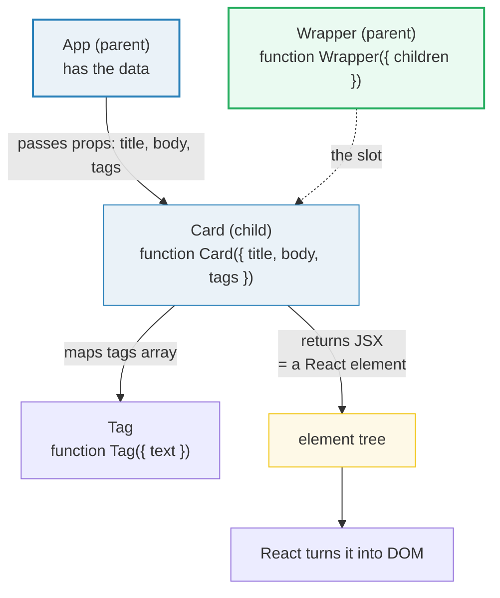

# React Components & Props

> **Companion demo:** [`react_components_props.html`](./react_components_props.html) — open in a browser.
> It renders three `<Card>` components (built from different props) inside a
> `<Wrapper>` that fills its `children` slot — a live, editable React 19 + Babel
> playground. Rendered-ground-truth: **no `.js`**, the `.html` IS the proof.

---

## 0. TL;DR — the one idea

> **The analogy:** a component is a **function**: props IN, elements OUT.
> `function Card(props)` returns JSX describing a piece of UI; React calls it
> with a single `props` object and turns the returned element into DOM.
> **Composition** = one component renders other components (a parent that nests
> children). **`children`** = the **slot pattern**: whatever you nest between a
> component's tags (`<Wrapper>…</Wrapper>`) arrives as the `children` prop, so a
> wrapper can frame arbitrary content without knowing what it is.



Props flow **down** the tree (parent → child). A child never pushes data back up
through props — if it must, the parent passes a *callback* prop instead (see the
state/hooks bundle). That one-way data flow is what keeps React predictable.

---

## 1. How it works — the function model

A **React function component** is a JavaScript function that returns JSX:

```jsx
// names MUST start with a capital letter, or JSX treats <Card/> as an HTML tag
function Card({ title, body, tags = [] }) {
  return (
    <div className="card">
      <h3>{title}</h3>
      <p>{body}</p>
      <div className="tags">
        {tags.map((t) => <Tag key={t} text={t} />)}
      </div>
    </div>
  );
}
```

Three things are happening:

1. **Props is one object.** React calls your component with a *single* argument.
   `function Card(props)` is the whole signature; `props.title`, `props.body`
   read fields off it. You almost always **destructure** it inline:
   `function Card({ title, body })` — identical, just nicer.
2. **The body returns an element.** JSX is sugar for
   `React.createElement(Card, { title, body }, …)`, which returns a plain object
   (a React element). React stores that object as the description of a node.
3. **Composition by calling.** When React sees `<Card/>` *inside* another
   component's returned JSX, it recurses: it calls `Card` with the given props,
   takes the element `Card` returns, and keeps going until the tree is all host
   tags (`<div>`, `<h3>`, …). That recursion **is** composition.

### Reading props — the two equivalent forms

```jsx
function Avatar(props) {              // the whole props object
  let person = props.person;
  let size   = props.size;
  // …
}

function Avatar({ person, size }) {   // destructured (idiomatic)
  // person and size are plain locals here
}
```

### Default values

```jsx
function Avatar({ person, size = 100 }) { /* … */ }
```

`size = 100` applies only when `size` is **missing or `undefined`**. Pass
`size={null}` or `size={0}` and the default is **ignored** (both are real
values, not "absent"). This is exactly JavaScript default-parameter semantics —
React doesn't add anything on top.

> From `react_components_props.html` — the demo `<Card>`:
> ```
> function Card({ title, body, tags = [] }) { … }
> ```
> `tags` defaults to an empty array, so a card with no tags still renders an
> empty `.tags` box without throwing on `.map`.

---

## 2. Composition & the `children` slot

A component that renders other components is a **parent**; the ones it renders
are its **children** (in the component sense). Reuse comes from nesting:

```jsx
function App() {
  return (
    <Wrapper>
      {cards.map((c, i) => <Card key={i} title={c.title} body={c.body} tags={c.tags} />)}
    </Wrapper>
  );
}
```

`<Wrapper>` here is a **visual wrapper** — it doesn't know what's inside it. It
just receives whatever you nest as the special `children` prop and renders it in
a frame:

```jsx
function Wrapper({ children }) {
  return <div className="wrapper">{children}</div>;
}
```

Think of `children` as a **hole** the parent leaves open, filled by the caller's
JSX. This is the React equivalent of HTML nesting (`<div></div>`), but the
"frame" can be your own component.

> From `react_components_props.html` — the composed tree React actually builds:
> ```
> <Wrapper>                       // receives 3 <Card/> as `children`
>   <Card title="Props IN"      …/>   // maps its tags array → <Tag/>s
>   <Card title="Elements OUT"  …/>
>   <Card title="Composition"   …/>
> </Wrapper>
> ```
> Parent → child → grandchild, all via props. The `.map()` turns one data array
> into three `<Card/>` elements; each `<Card/>` turns its `tags` array into
> `<Tag/>` elements. Lists in React are always "an array of elements."

### Rendering a list → give every item a `key`

```jsx
{tags.map((t) => <Tag key={t} text={t} />)}
```

A `key` is a **sibling-unique** string/number that tells React which array item
each element corresponds to. React needs it to keep state aligned when the list
reorders, inserts, or deletes. Rules (react.dev, *Rendering Lists*):

- **Unique among siblings** — the same key is fine in a *different* array.
- **Must not change between renders** — never `key={Math.random()}`.
- **Don't use array index** if the list can reorder (subtle state bugs).
- **`key` is not passed to your component** — it's a React hint. If you need the
  id inside, pass it as a separate prop: `<Item key={id} id={id} />`.

---

## 3. Intent → pattern

| You want to… | Pattern | Example |
|---|---|---|
| Pass data into a component | a prop, read by destructuring | `<Card title="x"/>` → `Card({ title })` |
| Give a prop a fallback | default in the destructure | `Card({ tags = [] })` |
| Forward every prop at once | JSX spread (use sparingly) | `<Avatar {...props}/>` |
| Render many of the same | `array.map()` + `key` | `cards.map((c,i) => <Card key={i} …/>)` |
| Slot arbitrary content | the `children` prop | `<Wrapper>{stuff}</Wrapper>` |
| Filter then render | `filter()` before `map()` | `people.filter(p=>p.x).map(…)` |

---

## Killer Gotchas

| Trap | Symptom | Fix |
|---|---|---|
| **Props are read-only** | mutating `props.x = 1` does nothing / breaks | never mutate props; the parent should pass new props, or use state (data that changes over time lives in state, not props) |
| **Lowercase component name** | `<card/>` renders an unknown HTML tag, your component never runs | name components with a **capital first letter**: `Card`, not `card` |
| **List without `key`** | console warning "Each child in a list should have a unique key" + reorder bugs | give each mapped element a stable, sibling-unique `key` (a db id, not the array index) |
| **`key` generated at render** | `key={Math.random()}` → React remounts everything every render, losing state | use a stable id from the data |
| **Prop-drilling pain** | passing the same prop through 5 layers "just to reach the bottom" | that's the signal to reach for **Context** (or lift/compose state) — see the *Passing Data Deeply with Context* page |
| **Default not applying for `0`/`null`** | `size = 100` ignored when you pass `size={0}` | defaults only fire for missing/`undefined`; guard `0`/`null` explicitly if they mean "default" |
| **Defining a component inside another** | `function Parent(){ function Child(){} … }` → Child remounts every render, state resets, perf tanks | define every component at the **top level**; pass data via props |
| **Mutating an array prop** | `props.tags.push(x)` mutates the parent's data | treat props as immutable; return a new array |

### Cheat sheet

```jsx
// 1. a component is a function: props IN (one object), elements OUT
function Card({ title, body, tags = [] }) {        // destructure + default
  return (
    <div className="card">
      <h3>{title}</h3>                              {/* {expr} embeds any JS */}
      <p>{body}</p>
      <div className="tags">
        {tags.map((t) => <Tag key={t} text={t} />)} {/* list = map + key */}
      </div>
    </div>
  );
}

// 2. composition = a parent renders children
function App() {
  return cards.map((c, i) => <Card key={i} {...c} />);  // spread = pass all props
}

// 3. children = the slot pattern
function Wrapper({ children }) {
  return <div className="wrapper">{children}</div>;     // frames unknown content
}

// rules of thumb
//   - capital name            (Card, not card)
//   - props are READ-ONLY     (never mutate; new data ⇒ new props from parent)
//   - every .map() child      needs a stable, sibling-unique key
//   - default { x = d }       fires only for missing / undefined
//   - components at top level (never define one inside another)
```

---

## How React 19 loads in the demo (same trick as `react_via_cdn`)

The `.html` needs no build step. It loads three pinned scripts and compiles the
JSX in the browser:

| Script | Role | Pinned URL |
|---|---|---|
| `react@19.2.7` | the runtime (`createElement`, hooks, `version`) | `https://esm.sh/react@19.2.7?dev` |
| `react-dom@19.2.7/client` | the DOM renderer (`createRoot`) | `https://esm.sh/react-dom@19.2.7/client?dev` |
| `@babel/standalone@8.0.3` | compiles JSX → `React.createElement` | `https://cdn.jsdelivr.net/npm/@babel/standalone@8.0.3/babel.min.js` |

React 19 **dropped UMD builds**, so the old `unpkg.com/react@19/umd/…` 404s; we
`import()` the ESM from esm.sh and assign it to `window` ourselves. The JSX
lives in a `<textarea>` (not a script tag) and is compiled at runtime with the
**classic** runtime (`runtime: "classic"`) so it emits
`React.createElement(...)` against our global. Full story in
[`react_via_cdn`](./react_via_cdn.html) / [`REACT_VIA_CDN`](./REACT_VIA_CDN.md).

---

## Sources

- React — *Your First Component* (function components, capital names, composition, never nest definitions): https://react.dev/learn/your-first-component
- React — *Passing Props to a Component* (props object, destructuring, defaults, spread, `children`, props are immutable): https://react.dev/learn/passing-props-to-a-component
- React — *Rendering Lists* (`.map()`, the `key` prop, rules of keys, index caveat): https://react.dev/learn/rendering-lists
- React — *Passing Data Deeply with Context* (prop-drilling → context): https://react.dev/learn/passing-data-deeply-with-context
- React — *Components and Props* (legacy reference, "single object" called "props"): https://legacy.reactjs.org/docs/components-and-props.html
- MDN — *Destructuring assignment* (the `{ person, size }` parameter syntax): https://developer.mozilla.org/en-US/docs/Web/JavaScript/Reference/Operators/Destructuring_assignment
- esm.sh — React 19 ESM CDN (the `?dev` build URL pattern): https://esm.sh/react@19.2.7?dev
- Babel — *Standalone* (in-browser `Babel.transform`): https://babeljs.io/docs/babel-standalone

---

🔗 **Cross-refs:** [`react_via_cdn`](./react_via_cdn.html) (the loader this demo
copies); the upcoming **state/hooks** bundle (props flow **down**, state flows
**up** via callback props — `children` + callbacks are how a child talks back).
