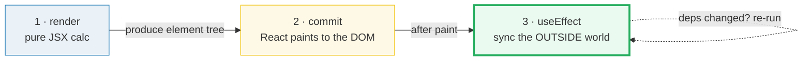
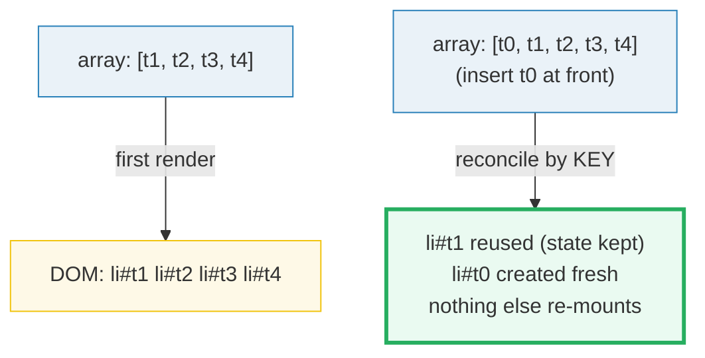

# React Effects, Lists & Conditionals

> **Companion demo:** [`react_effects_lists.html`](./react_effects_lists.html) — open in a browser.
> Rendered-ground-truth: NO `.js`. The `.html` IS the ground truth — it mounts a
> real React 19 component (via the same CDN pattern as
> [`react_via_cdn.html`](./react_via_cdn.html)) and a `[check: OK]` gold-check
> asserts the rendered list, the mount effect's side effect, and the conditional.

---

## 0. TL;DR — the one idea

> **The analogy:** `useEffect` runs **AFTER render** to sync with the outside
> world; render a list with `.map` + a stable **key**; **key** is React's
> identity for reconciliation, not a layout hint.

A component's render is a **pure** calculation of JSX — it may not touch the DOM,
the network, or any external system. Three patterns take a component from "shows
UI" to "does things":

1. **`useEffect`** — the escape hatch that runs *after* the screen is painted, to
   synchronize React with something non-React (the document title, a WebSocket, a
   3rd-party widget, a timer). It is caused by *rendering itself*, not by a click.
2. **Lists** — a JavaScript array rendered into JSX via `.map()`. Every item needs
   a stable `key` so React can tell "this is the same todo, now at position 2"
   from "this is a brand-new todo" when the array reorders.
3. **Conditionals** — plain JavaScript (`&&`, `? :`, or `if` + a variable) deciding
   which JSX makes it into the tree.



The crucial ordering: **render → commit (paint) → effect.** The user sees the UI
*before* the effect runs. An effect that sets `document.title` or appends a marker
into a node can therefore only do so once the DOM already exists.

---

## 1. `useEffect` — synchronize with the outside world

An Effect is declared with three steps (react.dev/learn/synchronizing-with-effects):

```jsx
function ChatRoom({ roomId }) {
  useEffect(() => {
    const conn = createConnection(roomId);   // 1. set up the external system
    conn.connect();
    return () => conn.disconnect();          // 3. cleanup: undo it
  }, [roomId]);                              // 2. deps: re-sync only when roomId changes
  return <h1>Welcome to {roomId}!</h1>;
}
```

- **Step 1 — declare.** The callback runs after the component *commits* (paints).
- **Step 2 — dependencies.** The second argument is an array. React compares it
  to the previous render's array using `Object.is`; it skips the re-run only if
  *every* value is unchanged.
- **Step 3 — cleanup (optional).** Return a function. React calls it **before**
  the effect runs again, and **one final time on unmount**. "connect" needs
  "disconnect", "subscribe" needs "unsubscribe", "fetch" needs "cancel or ignore".

### The dependency array is the whole contract

| deps | when the effect runs | typical use |
|---|---|---|
| `[]` | once, on mount (+ cleanup on unmount) | set `document.title`, init a widget, focus an input, append a marker |
| `[x]` | on mount + whenever `x` changes | re-sync when a prop/state changes: `[roomId]` → reconnect |
| `[a, b]` | on mount + when `a` or `b` change (`Object.is`) | re-sync on multiple reactive values |
| *no array* | after **every** render | almost never wanted — risks an infinite loop if it sets state |

> **From `react_effects_lists.html` (the mount effect):**
> ```jsx
> React.useEffect(function () {
>   var sink = document.getElementById('effect-sink');
>   var marker = document.createElement('div');
>   marker.setAttribute('data-effect-marker', 'mounted');
>   marker.textContent = 'useEffect fired on mount — synced the outside world';
>   sink.appendChild(marker);
>   document.title = 'React Effects — mounted';
> }, []);
> ```
> Empty deps `[]` ⇒ runs **once after the first paint**. Its side effect is
> observable and deterministic: it appends exactly one
> `[data-effect-marker]` into `#effect-sink` (a node outside the React tree) and
> sets `document.title`. The gold-check asserts that marker exists.

**You can't "choose" your dependencies.** React (and the `eslint-plugin-react-hooks`
linter) expect every reactive value the effect reads to appear in the array. If
you don't want a re-run, *edit the effect code* so it stops reading that value —
never lie to the array, because a missing dependency freezes the effect's closure
around a stale value.

---

## 2. Rendering lists with `.map()` + `key`

To render a list you move the data into an array, then `.map()` it into JSX:

```jsx
const todos = [
  { id: 't1', text: 'Learn useEffect' },
  { id: 't2', text: 'Render a list with .map + key' },
  { id: 't3', text: 'Conditional rendering' },
  { id: 't4', text: 'Ship the bundle' }
];

<ul>
  {todos.map(t => (
    <li key={t.id}>{t.text}</li>
  ))}
</ul>
```

The `key` is **React's identity for reconciliation, not a layout hint**. When the
array reorders, inserts, or deletes, the `key` lets React match each element to
its previous incarnation and reuse its DOM node + state. Without a stable key,
React falls back to array index and gets confused on reorder.

### What makes a good key

| Source of data | Good key |
|---|---|
| Database rows | the DB primary key / `id` |
| Locally generated items | an incrementing counter, `crypto.randomUUID()`, or `uuid` |
| Static, never-reordered content | array index is *acceptable* (e.g. poem lines) |

**Rules of keys** (react.dev/learn/rendering-lists):
- Keys must be **unique among siblings** (the same key in *different* arrays is fine).
- Keys must **not change** between renders — don't generate them with `Math.random()`.
- The component does **not** receive `key` as a prop; it's consumed by React itself.



With **stable keys**, inserting `t0` at the front only creates one new node and
reuses the other four. With **index-as-key**, React thinks "item at position 0 is
still the same item", reassigns state to the wrong row, and bugs appear.

> **From `react_effects_lists.html` (the list):**
> The component maps over **4** todos, each with a stable `id` (`t1`..`t4`) used
> as `key`. The gold-check asserts exactly **4** `<li class="todo">` rendered.

---

## 3. Conditional rendering — `&&`, ternary, or `if`

Branching in JSX is just JavaScript (react.dev/learn/conditional-rendering):

```jsx
// ternary: pick one of two JSX trees
{isPacked ? <del>{name} ✅</del> : name}

// && : include JSX only when true, render nothing otherwise
{show && <div className="details">{todos.length} todos</div>}

// if + variable: clearest for non-trivial logic
let content = name;
if (isPacked) content = <del>{name} ✅</del>;
return <li>{content}</li>;
```

The `&&` pitfall: a JS `&&` returns the *left* side when it's falsy. If the left
side is the number `0`, React renders a literal `0` (numbers are renderable,
`false`/`null`/`undefined` are not). Fix it by making the left side a boolean:

```jsx
// BAD — renders "0" when messageCount is 0
{messageCount && <p>New messages</p>}
// GOOD — false renders nothing
{messageCount > 0 && <p>New messages</p>}
```

> **From `react_effects_lists.html` (the conditional):**
> ```jsx
> {show && (
>   <div className="details" data-conditional="visible">
>     {todos.length} todos — the effect set document.title
>   </div>
> )}
> ```
> `show` starts `false`, so `[data-conditional]` is **absent** at mount. The
> gold-check asserts that absence. Clicking **show details** flips `show` to
> `true` and React inserts the element — a live re-render proving the toggle.

---

## Killer Gotchas

| Trap | Symptom | Fix |
|---|---|---|
| **Effects run AFTER paint, not before** | trying to read a DOM node during render crashes (it doesn't exist yet); mutating the DOM in render breaks purity | move side effects into `useEffect`; render is a pure calculation |
| **Missing dependency = stale closure** | effect uses an old value of a prop/state from the render it was created in | add the value to the dep array; or restructure so the effect doesn't need it |
| **Index as `key` breaks on reorder/insert** | component state "follows the wrong row" when you sort, prepend, or delete | use a stable id from the data; index is only safe for static, never-reordered lists |
| **Over-using effects — "You Might Not Need an Effect"** | cascading re-renders, derived state stored in state + an effect syncing it | if you can compute it during render, do so; update state in *event handlers*, not effects |
| **No cleanup for subscriptions/timers/fetch** | leaks pile up across navigation; "✅ Connecting…" prints twice in dev and you have no disconnect | return a cleanup: `clearTimeout`, `removeEventListener`, `AbortController`, or an `ignore` flag |
| **Setting state unconditionally in an effect with no dep array** | infinite render loop (effect → setState → render → effect…) | give it the right deps, or move the logic to an event handler |
| **`0 && <X/>` renders a literal `0`** | a stray "0" appears in the UI | make the left side a boolean: `count > 0 && <X/>` |
| **StrictMode double-invokes effects in dev** | your effect appears to run twice on mount in development | that's intentional — it stress-tests your cleanup. Implement cleanup so setup→cleanup→setup is user-invisible. Production runs once. |

### "You Might Not Need an Effect" — the meta-gotcha

react.dev/learn/you-might-not-need-an-effect: Effects exist to *step out* of React
and synchronize with an **external** system (browser APIs, network, 3rd-party
libs). If your effect only adjusts some state based on other state, you almost
certainly don't need it:

```jsx
// BAD — no external system; this effect just derives state
const [a, setA] = useState(0);
const [b, setB] = useState(0);
useEffect(() => { setB(a * 2); }, [a]);   // unnecessary, causes an extra render

// GOOD — compute during render; no effect, no extra render
const [a, setA] = useState(0);
const b = a * 2;
```

---

## Cheat sheet

```jsx
// EFFECT — runs after paint; deps array is the contract
useEffect(() => {
  // sync with an external system (DOM title, subscription, timer, network)
  return () => { /* cleanup: undo/stop whatever you started */ };
}, [deps]);          // [] = mount once · [x] = mount + when x changes · none = every render

// LIST — .map() to JSX, each item a stable unique-among-siblings key
{items.map(item => <Item key={item.id} {...item} />)}   // key is identity, not layout

// CONDITIONAL — just JS: &&, ternary ?, or if + variable
{cond && <A/>}                       // include when true, else nothing
{cond ? <A/> : <B/>}                 // pick one of two
// (0 is falsy but RENDERS — use `count > 0 &&` not `count &&`)

// TIMING — render (pure) → commit (paint) → useEffect (sync outside world)
```

---

## 🔗 Cross-refs

- [`react_state_hooks`](./react_state_hooks.html) — `useState` and the re-render model (the state this bundle toggles).
- [`react_components_props`](./react_components_props.html) — composition & `children` (the building blocks rendered into a list).
- [`metaframework_landscape`](../metaframeworks/metaframework_landscape.html) — where React actually ships: frameworks (Next.js, TanStack Start) handle data-fetching & routing so you stop hand-rolling effects for them.

---

## Sources

- React — *Synchronizing with Effects* (the canonical guide; deps, cleanup, StrictMode double-invoke): https://react.dev/learn/synchronizing-with-effects
- React — *Rendering Lists* (`.map()`, `key`, index-as-key pitfall, rules of keys): https://react.dev/learn/rendering-lists
- React — *Conditional Rendering* (`&&`, ternary, the `0 &&` left-side pitfall): https://react.dev/learn/conditional-rendering
- React — *You Might Not Need an Effect* (derive during render; effects are for external systems): https://react.dev/learn/you-might-not-need-an-effect
- React — *`useEffect` reference* (deps comparison via `Object.is`, cleanup timing, mount/unmount lifecycle): https://react.dev/reference/react/useEffect
- React — *`<StrictMode>` reference* (dev-only double-invoke of effects to find missing cleanup): https://react.dev/reference/react/StrictMode
- React — *Render and Commit* (the render → commit → effect ordering this bundle pins): https://react.dev/learn/render-and-commit
- MDN — *`Array.prototype.map()`* (the array method behind every React list): https://developer.mozilla.org/en-US/docs/Web/JavaScript/Reference/Global_Objects/Array/map
