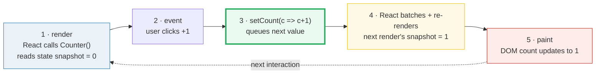
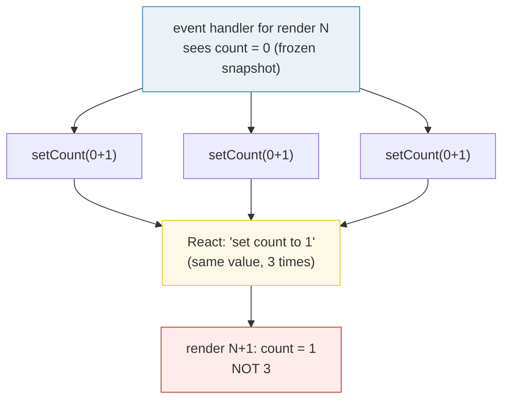

# State & Hooks — `useState` and the Re-render Model

> **Companion demo:** [`react_state_hooks.html`](./react_state_hooks.html) — open in a browser.
> A single-file React 19 + Babel playground. Rendered-ground-truth: **no `.js`** — the live
> `<Counter>` in the page IS the ground truth, and its gold-check proves the re-render model
> by clicking the button and asserting the rendered count.

---

## 0. TL;DR — the one idea

> **The analogy:** `state` is the component's **private memory**; `setState` tells React
> *"re-render me with this new value"* — it does **NOT** mutate the variable in place.

A plain local variable fails two ways: it is **reset on every render**, and changing it
**never asks React to paint**. `useState` fixes both in one call:

```js
const [count, setCount] = useState(0);
//        ^ snapshot   ^ "re-render me" trigger
```

- `count` — the value **for this render**. React stores the real value *outside* your
  function (as if on a shelf) and hands each render a **snapshot**. That snapshot never
  changes mid-render, even after `setCount`.
- `setCount(next)` — **requests a re-render** with the next value. React stores it, calls
  your component again, and paints the new JSX snapshot.



The whole loop is **request, not mutate**: you never write `count = count + 1`. You hand
React a new value and it re-renders.

---

## 1. Why a local variable isn't enough

React renders a component by **calling it as a function** and taking the JSX it returns.
That means any `let index = 0;` declared inside is recreated from scratch on every render —
and mutating it does nothing to the screen, because React has no idea you changed anything:

```js
function Gallery() {
  let index = 0;                       // dies the instant the function returns
  function handleClick() { index++; }  // mutates a variable React can't see
  // clicking "Next" does nothing visible
}
```

Two things are missing, and `useState` provides exactly those two:

1. **Retain** the data between renders → the state variable.
2. **Trigger** React to render again → the setter function.

```js
function Gallery() {
  const [index, setIndex] = useState(0);
  function handleClick() { setIndex(index + 1); }  // asks React to re-render with index+1
}
```

---

## 2. The re-render model, proven by the gold-check

The companion demo renders a `<Counter>` starting at `0`. Its gold-check **dispatches 5 real
`click()` events on the `+1` button** (each calls `setCount(c => c + 1)`), then asserts the
**rendered** count text. Then it clicks the `+3` button once and asserts again.

> From `react_state_hooks.html` (gold-check, after React mounts the Counter):
> ```
>   start:        count snapshot = 0
>   click +1 ×5:  setCount(c => c+1) queued 5 times  -> React re-renders ONCE -> "5"
>   click +3  ×1: setCount(c => c+1) queued 3 times  -> React re-renders ONCE -> "8"
> [check] 5× click +1 → count "5", then +3 → "8": OK
> ```

The count literally visible on the page **is** `"8"` because React re-rendered on every
click and painted the new snapshot. That is the re-render model, end-to-end:
**event → `setX` → React re-renders → fresh snapshot → paint**.

> From `react_state_hooks.html` — the `+3` button uses the **functional updater** three
> times in one handler:
> ```jsx
> onClick={() => {
>   setCount(c => c + 1);
>   setCount(c => c + 1);
>   setCount(c => c + 1);
> }}
> ```
> Three queued updaters → `+3`. (A direct `setCount(count+1)` written three times would
> yield only `+1` — see Killer Gotchas.)

---

## 3. State is a snapshot — set it, don't read it

The single most surprising fact: **calling the setter does not change the variable in the
code that's already running.** Each render gets a fixed snapshot; `setCount` only affects
the *next* render.

```js
function handleClick() {
  console.log(count);      // 0
  setCount(count + 1);     // request a re-render with 1
  console.log(count);      // STILL 0  — this render's snapshot is frozen
}
```

This is *why* writing `setCount(count + 1)` three times in a row only adds 1: in *this*
render's handler `count` is always the same stale value, so all three become
`setCount(0 + 1)`.



**Fix:** pass an *updater function* `setCount(c => c + 1)`. React queues the updaters and
chains them off the **pending** state: `0→1`, `1→2`, `2→3` → final `3`.

---

## 4. Batching — many `setX`, one re-render

React **batches** state updates: it waits until the event handler finishes, then re-renders
**once** with all the queued changes. So calling `setCount` and `setOn` in the same click
produces a single paint, not two.

> From react.dev — *useState* caveats:
> > "React batches state updates. It updates the screen **after all the event handlers have
> > run** and have called their `set` functions."

Since React 18 this is **automatic batching**: updates inside `setTimeout`, promises, and
native handlers are batched too (previously only React event handlers were). React 19 keeps
this. That is exactly what the `+3` button exploits — three queued updaters, one re-render.

---

## 5. State is per-instance (and private)

`useState` relies on a **stable call order**: React keeps an array of state slots per
component instance and matches them by position. That is why Hooks must be called
**unconditionally at the top level** — never inside loops or conditions.

Render the *same* component twice and each copy gets **completely isolated** state:

```jsx
<Counter/>   // its own count, its own toggle
<Counter/>   // a separate count, a separate toggle
```

Unlike props, state is **private**: a parent cannot touch a child's `useState`. To share,
lift the state up to the common ancestor.

---

## 6. Event handling — pass the function, don't call it

```jsx
<button onClick={handleClick}>      // ✅ pass the function (React calls it on click)
<button onClick={() => setCount(c => c + 1)}>  // ✅ inline arrow, called on click
<button onClick={handleClick()}>    // ❌ calls it DURING render → infinite re-render loop
```

`onClick={handleClick()}` runs `handleClick` immediately while rendering; if that calls a
setter, React re-renders, which calls it again… → "Too many re-renders."

---

## Killer Gotchas

| Trap | Symptom | Fix |
|---|---|---|
| `setX(x + 1)` written **N times** in one handler | counter only goes up by **1** (all see the same stale snapshot) | use the functional updater `setX(x => x + 1)` — React chains the queued updaters |
| Reading `x` right after `setX(x + 1)` | logs the **OLD** value | state is a snapshot; it only changes in the *next* render. Capture `const next = x + 1` if you need it now |
| Mutating an object/array in state then passing it back | screen **doesn't** update (`Object.is` sees the same reference) | **replace**, don't mutate: `setList([...list, item])`, `setForm({...form, name})` |
| `onClick={handler()}` | fires on every render / "Too many re-renders" loop | pass `handler` (no parens), or wrap inline `() => handler()` |
| Conditional/loop `useState` | state slots misalign → wrong values / crash | call Hooks **only at the top level** of the component |
| Assuming two `<Counter/>`s share state | they update independently | state is per-instance; lift it up to share |
| Storing a value **derivable** from props/other state | duplicated source of truth drifts | compute it during render (or `useMemo`); don't mirror it into state |

### Cheat sheet

**intent → pattern**

| intent | pattern | note |
|---|---|---|
| update from the previous value | `setX(prev => prev + 1)` | functional updater; safe to call several times (they chain) |
| set a brand-new value | `setName('Robin')` | next value doesn't depend on the old |
| toggle a boolean | `setOn(v => !v)` (or `setOn(!on)`) | negate the pending/old value |
| replace an array/object | `setList(p => [...p, x])` | **never** mutate; React skips same-reference updates |
| reset to initial | `setCount(0)` | or remount via a new `key` to wipe all state at once |

```jsx
import { useState } from 'react';

const [count, setCount] = useState(0);        // declare: [snapshot, setter]
const [name, setName]   = useState('Taylor');
const [on,   setOn]     = useState(false);

setCount(count + 1);          // set to a fresh value (next value is independent of old)
setCount(c => c + 1);         // functional update (safe to call several times; chains)
setOn(o => !o);               // toggle a boolean
setList(prev => [...prev, x]);// replace (never mutate) arrays/objects in state
// state is a SNAPSHOT: reading it right after a setter still shows the OLD value.
// React BATCHES setters: one event handler -> one re-render, no matter how many setX.
```

**The one mental model:** you never *assign* state — you *request the next render*. React
stores the value, calls your component again, and hands that render a fresh snapshot to
paint.

---

## 🔗 Cross-refs

- [`react_components_props`](./react_components_props.html) — props (read-only, top-down) vs
  state (private, mutable-by-setter). The other half of "what a component remembers."
- [`react_effects_lists`](./react_effects_lists.html) — *state change → side effect*: when a
  `setX` re-render should trigger work (fetch, subscription), that's `useEffect`; and how
  `key` ties list identity to per-item state.

---

## Sources

- react.dev — *`useState` reference* (the `[state, setState]` pair, functional updaters,
  batching, the snapshot caveat): https://react.dev/reference/react/useState
- react.dev — *State: A Component's Memory* (why local vars fail, per-instance isolation,
  the call-order mechanism): https://react.dev/learn/state-a-components-memory
- react.dev — *State as a Snapshot* (state never changes mid-render;
  `setNumber(n+1)` ×3 = +1): https://react.dev/learn/state-as-a-snapshot
- react.dev — *Responding to Events* (`onClick`, pass the function not call it,
  propagation): https://react.dev/learn/responding-to-events
- react.dev — *React v18.0* (Automatic Batching — updates in timeouts/promises are batched
  too; carries into React 19): https://react.dev/blog/2022/03/29/react-v18
- Rudi Yardley — *React hooks: not magic, just arrays* (independent secondary; the
  per-instance array-of-state-slots + cursor model behind the rules of hooks):
  https://medium.com/@ryardley/react-hooks-not-magic-just-arrays-cd4f1857236e
