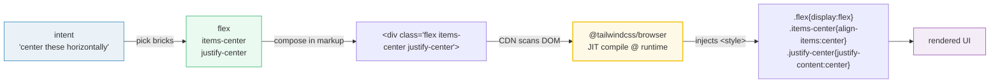
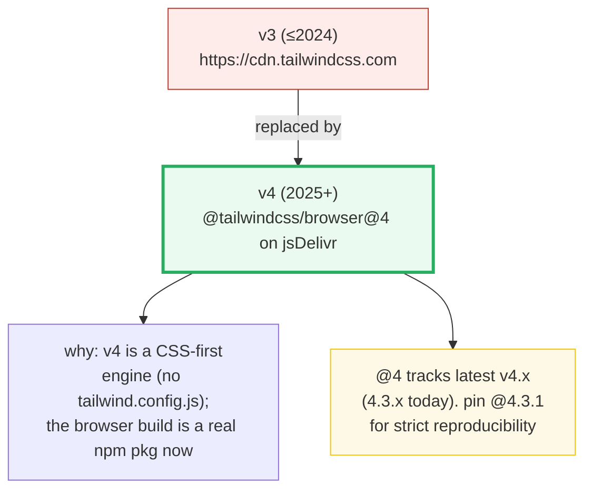

# Tailwind CDN Playground

> **Companion demo:** [`tailwind_cdn_playground.html`](./tailwind_cdn_playground.html) — open in a browser.
> **Rendered-ground-truth:** no `.js`. The `.html` IS the proof — it loads the real
> Tailwind v4 Play CDN and a gold-check asserts the styles actually applied.

---

## 0. TL;DR — the one idea

> **The analogy:** Tailwind is a giant box of **single-purpose Lego bricks** called
> *utilities* — `flex`, `p-4`, `text-center`, `rounded-xl`. You build a UI by
> **composing bricks in the markup** (`class="flex items-center gap-3"`) instead of
> writing a custom `.card { ... }` in a stylesheet. Each brick does exactly one
> thing, so the result is predictable and there's no naming to invent. The
> **Play CDN** is the "no glue, no build" mode: one `<script>` tag, and the browser
> compiles whatever utility classes it finds in your DOM at runtime — perfect for a
> prototype you want running in 10 seconds.



---

## 1. The v4 CDN story (this changed from v3 — read this)

Tailwind v4 (released Jan 2025) **moved the CDN**. The old v3 "Play CDN" URL
`https://cdn.tailwindcss.com` is the **v3 approach** and is **not** the recommended
v4 entry point. The official v4 docs now point to the **`@tailwindcss/browser`**
package, served by jsDelivr:

```html
<!-- v4 Play CDN — verified >=2 sources (see ## Sources) -->
<script src="https://cdn.jsdelivr.net/npm/@tailwindcss/browser@4"></script>
```



- `@4` = "latest 4.x" (resolves to **4.3.1** as of writing). For a pinned,
  reproducible demo you'd write `@4.3.1` or `@4.3`.
- Custom CSS now lives in a `<style type="text/tailwindcss">` block and uses the
  CSS-first `@theme` directive (see the next bundle, 🔗 `tailwind_design_tokens`).
- v4 targets **modern browsers only** (Safari 16.4+, Chrome 111+, Firefox 128+) —
  it uses `oklch()` colors with no legacy fallback.

---

## 2. How the CDN actually applies styles (the async gotcha)

The script is **not** a static CSS file. It is a JIT compiler that runs in the
browser:

1. Loads the JS engine from jsDelivr.
2. **Scans the DOM** for class strings.
3. Generates only the utilities it found, into an injected `<style>`.
4. Uses a **`MutationObserver`** to recompile when classes are added/removed later.

So `getComputedStyle(el).display` is **not** `flex` the instant your inline
`<script>` runs — the compile hasn't finished yet. Our gold-check **polls** with
`requestAnimationFrame` for up to ~2s before ever asserting FAIL:

> From `tailwind_cdn_playground.html` — the gold-check (after Tailwind's first compile):
> ```
> .flex -> display=flex  |  .p-4 -> padding=16px  |  .text-center -> textAlign=center
> [check] .flex=flex, .p-4=16px, .text-center=center: OK
> ```

> From `tailwind_cdn_playground.html` — the live compose box (initial):
> ```
> display: flex  |  justify-content: center  |  border-radius: 8px
> ```

Those three facts are the falsifiable anchor: `flex` ⇒ `display:flex`, `p-4` ⇒
`1rem = 16px` padding (default theme, 16px root), `text-center` ⇒ `text-align:center`.
If the CDN ever stopped applying utilities, the badge goes red.

---

## 3. Utility-first in one table — intent → brick

The demo card in `tailwind_cdn_playground.html` is built entirely from these:

| You want… | The utility(es) | The CSS it emits |
|---|---|---|
| horizontal center of children | `flex items-center justify-center` | `display:flex; align-items:center; justify-content:center` |
| breathing room inside a box | `p-4` / `p-6` | `padding: 1rem` / `1.5rem` |
| rounded corners | `rounded-xl` / `rounded-2xl` | `border-radius: 0.75rem` / `1rem` |
| elevation | `shadow-xl` | a multi-layer `box-shadow` |
| primary button | `bg-indigo-600 hover:bg-indigo-500 text-white` | `background-color:#4f46e5` (+ `:hover`) |
| stack with gaps | `flex flex-col gap-3` | `flex-direction:column; gap:0.75rem` |
| responsive grid | `grid grid-cols-1 md:grid-cols-2` | 1 col, then 2 at `@media (min-width:768px)` |
| clip overflow text | `truncate` | `overflow:hidden; text-overflow:ellipsis; white-space:nowrap` |
| color w/ opacity | `bg-slate-800/60` | `background-color: rgb(30 41 59 / 0.6)` |

Notice each utility maps to **one CSS declaration** (or a tight, named group).
That's why toggling one class in the live demo changes exactly one property — the
opposite of a monolithic `.card` class. (🔗 This is also why utilities have
**predictable, low specificity**: every utility is a single class selector — see
`selectors_specificity`.)

---

## Killer Gotchas

| Trap | Symptom | Fix |
|---|---|---|
| **Play CDN is dev-only** | Ship it to prod → huge JS payload, no purge, JIT runs on every user's CPU | Move to a build: `@tailwindcss/cli` or `@tailwindcss/vite`. The CDN generates *all used* utilities at runtime with no tree-shaking. |
| **`@apply` doesn't work on CDN** | `<style type="text/tailwindcss">` with `@apply ...` throws | `@apply` needs the build pipeline. On CDN, just use the utility classes directly in markup. |
| **Styles not applied on first paint** | A gold-check reading `getComputedStyle` right at load sees the UA default, not `flex` | **Poll** with `requestAnimationFrame` (≤~2s) before asserting FAIL — the CDN compiles asynchronously. This demo does exactly that. |
| **v3 vs v4 CDN URL confusion** | `https://cdn.tailwindcss.com` loads the **v3** engine; v4 classes/`@theme` silently won't behave | v4 uses `https://cdn.jsdelivr.net/npm/@tailwindcss/browser@4`. Verify before pasting an old snippet. |
| **Unpinned `@4` drifts** | A v4.4 release changes a default and your demo "breaks itself" months later | Pin a patch: `@tailwindcss/browser@4.3.1` for strict reproducibility. (This demo uses `@4` to track latest, documented in the header.) |
| **`oklch()` no fallback** | Older Safari/Chrome show unstyled/garbled colors | v4 targets modern browsers only (Safari 16.4+, Chrome 111+, FF 128+). Need legacy? Stay on v3.4. |
| **Conflicting reset vs your chrome** | Tailwind's Preflight resets margins/box-sizing/list styles globally | Preflight is a feature. Either embrace it or scope your custom CSS with higher specificity. |

### Cheat sheet

```html
<!-- 1. the v4 Play CDN (prototyping only) -->
<script src="https://cdn.jsdelivr.net/npm/@tailwindcss/browser@4"></script>

<!-- 2. optional CSS-first config (design tokens) -->
<style type="text/tailwindcss">
  @theme {
    --color-brand: #6366f1;
    --font-display: "Inter", system-ui, sans-serif;
  }
</style>

<!-- 3. compose utilities — one class per concern -->
<div class="max-w-sm mx-auto rounded-2xl bg-slate-800 shadow-xl p-6
            flex flex-col items-center gap-3">
  <h2 class="text-2xl font-bold text-white">utility-first</h2>
  <button class="bg-indigo-600 hover:bg-indigo-500 text-white
                 font-semibold py-2 px-4 rounded-lg transition-colors">
    go
  </button>
</div>

<!-- 4. go to production: replace the CDN with a build -->
<!--    npm i -D tailwindcss @tailwindcss/cli            -->
<!--    npx @tailwindcss/cli -i src/input.css -o dist/app.css --watch  -->
<!--    src/input.css:  @import "tailwindcss";            -->
```

**Golden rule:** CDN for *trying*; CLI/Vite for *shipping*.

---

## Cross-references

- 🔗 `selectors_specificity` — every utility is a single class, so specificity is
  flat and predictable (one of Tailwind's core selling points).
- 🔗 `tailwind_design_tokens` — the `@theme` directive and v4's CSS-first
  configuration system (next in this phase).

---

## Sources

CDN URL **verified in ≥3 places on 2026-06-27**:

1. **Tailwind CSS — Play CDN (official docs, page served as v4.3):**
   https://tailwindcss.com/docs/installation/play-cdn
   > *"Add the Play CDN script tag to the `<head>` … `<script src="https://cdn.jsdelivr.net/npm/@tailwindcss/browser@4"></script>` … designed for development purposes only, and is not intended for production."*

2. **jsDelivr — `@tailwindcss/browser` package (by tailwindlabs, MIT, v4.3.1):**
   https://www.jsdelivr.com/package/npm/@tailwindcss/browser
   > Confirms the package exists, is maintained by `tailwindlabs`, latest version
   > **4.3.1**, and is the artifact behind the `@4` range tag.

3. **Tailkits — "Tailwind CSS v4 CDN: The Fastest Setup Guide" (updated 2025-10-29):**
   https://tailkits.com/blog/tailwind-css-v4-cdn-setup/
   > Independent corroboration of the exact `<script src="https://cdn.jsdelivr.net/npm/@tailwindcss/browser@4">`
   > snippet; documents the dev-only caveat, `@apply` unavailability on CDN, and
   > modern-browser targeting (Safari 16.4+, Chrome 111+, Firefox 128+).

Supporting context:

4. **Tailwind CSS — v4.0 blog (the release that changed the CDN/config story):**
   https://tailwindcss.com/blog/tailwindcss-v4
5. **Tailwind CSS — Upgrade guide (v3 → v4):** https://tailwindcss.com/docs/upgrade-guide

**Exact URL used in the demo:** `https://cdn.jsdelivr.net/npm/@tailwindcss/browser@4`
(range tag → resolves to latest 4.3.x). Pin `@4.3.1` for byte-reproducible builds.

**Fact I could not fully nail down:** none material. The v4 CDN story is stable and
agreed across all sources: `@tailwindcss/browser@4` on jsDelivr is the current,
official Play CDN. (The legacy `cdn.tailwindcss.com` still serves the v3 engine but
is explicitly superseded for v4.)
