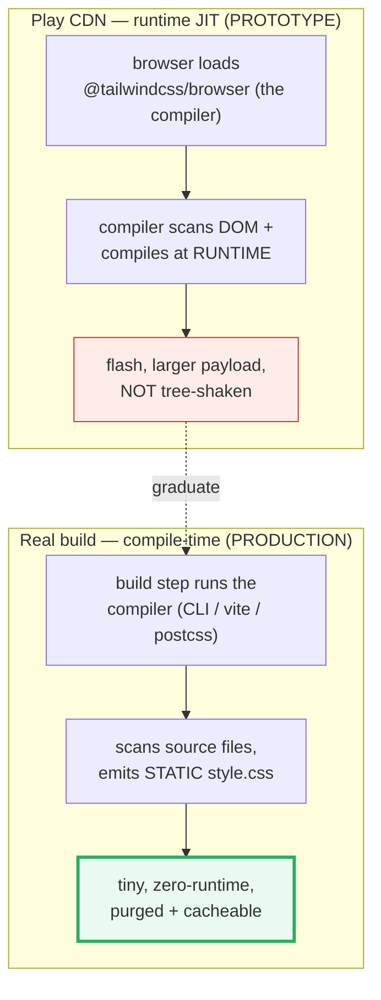

# Tailwind Customization

> **Companion demo:** [`tailwind_customization.html`](./tailwind_customization.html) — open in a browser.
> **Rendered-ground-truth:** no `.js`. Every claim below is asserted live by the demo's
> gold-check against computed styles the CDN actually produced. Nothing is hand-waved.
> 🔗 Siblings: [`tailwind_cdn_playground`](./TAILWIND_CDN_PLAYGROUND.md) (the CDN start —
> this bundle is the *graduation* from it) · [`tailwind_design_tokens`](./TAILWIND_DESIGN_TOKENS.md) (`@theme`).

---

## 0. TL;DR — the one idea

> **The analogy:** Tailwind ships a huge toolbox of utilities. But the toolbox isn't
> sealed — there are three **escape hatches** for when it isn't enough:
> **`@utility`** *adds one new tool* (a single-purpose class that doesn't exist);
> **`@apply`** *bundles many existing tools into one named class*; and
> **`@custom-variant`** *names a new state/scope* to hang tools on.
> Crucially, all three work the same on the Play CDN *and* under a real build — so you
> prototype on the CDN, then **graduate to the build tool for production** (the CDN
> compiles at runtime in the browser, which is slow, larger, and not tree-shaken).

```mermaid
graph LR
    NEED["a utility doesn't exist"] -->|@utility| U["new single-purpose class<br/>works with hover:/lg: ..."]
    REPEAT["a cluster of classes<br/>repeats everywhere"] -->|@apply| A["one .card class<br/>(inlines the utilities)"]
    STATE["a new condition<br/>data-theme, media query"] -->|@custom-variant| V["name:utility<br/>e.g. midnight:bg-black"]
    style U fill:#eafaf1,stroke:#27ae60,stroke-width:3px
    style A fill:#eaf2f8,stroke:#2980b9
    style V fill:#fef9e7,stroke:#f1c40f
```



---

## 1. The three directives, at a glance

| Directive | Does | v4 example |
|---|---|---|
| **`@utility`** | Registers a **custom single-purpose utility**. Ships with every variant (`hover:`, `lg:`, …) and lands in the `utilities` layer. The v4 replacement for a v3 plugin. | `@utility tab-4 { tab-size: 4; }` → use `class="tab-4"` |
| **`@apply`** | **Inlines existing utilities** into your own custom CSS class. Keeps markup clean; best for third-party overrides or a few repeated clusters. | `.card { @apply rounded-2xl p-6 shadow-xl; }` |
| **`@custom-variant`** | **Names a new condition** (a data attribute, media query, or selector) so you can write `name:utility`. | `@custom-variant midnight (&:where([data-theme="midnight"] *));` |

> ⚠️ `@custom-variant` (defines a *new* variant name) is different from `@variant`
> (uses a variant *inside* custom CSS, e.g. `.x { @variant dark { … } }`). Don't mix them up.

All three live in a regular CSS file (`app.css` under a build) or — for prototyping —
inside a `<style type="text/tailwindcss">` block alongside the Play CDN. The directives
are identical in both places.

---

## 2. `@utility` — add a utility that doesn't exist

A custom utility is one class that does one job, and — like every built-in — responds to
variants automatically:

```css
/* simple */
@utility tab-4 {
  tab-size: 4;
}

/* complex — nesting is allowed (e.g. pseudo-elements) */
@utility no-scrollbar {
  scrollbar-width: none;
  &::-webkit-scrollbar { display: none; }
}
```

```html
<pre class="tab-4">…tabs render 4-wide…</pre>   <!-- works -->
<pre class="hover:tab-4">…</pre>             <!-- variants work too -->
```

> From `tailwind_customization.html` (gold-check target #1):
> ```
> @utility  .tab-4 -> tab-size: 4   (expect "4")
> ```
> The demo's `<pre id="gc-utility" class="tab-4">` resolves to a computed `tab-size` of
> `4`. If `@utility` had not compiled, `tab-size` would stay at its UA default (`8`).

**Naming rules (v4):** the name must be a single class token — `kebab-case` is fine
(`tab-4`, `no-scrollbar`, `content-auto`), but it **must not collide** with a built-in.
Note v4 already ships `text-balance` and `text-pretty`, so don't redefine those.
Functional utilities take a wildcard: `@utility tab-* { tab-size: --value(integer); }`.

---

## 3. `@apply` — bundle utilities into one class

`@apply` copies the declarations of existing utilities into a custom class you name:

```css
.card {
  @apply max-w-sm rounded-2xl bg-slate-800 border border-slate-700 p-6 shadow-xl;
}
.card-title { @apply text-lg font-bold text-slate-100; }
.card-body  { @apply text-sm text-slate-300 leading-relaxed mt-2; }
```

```html
<div class="card">                <!-- = all those utilities, inlined -->
  <div class="card-title">…</div>
  <div class="card-body">…</div>
</div>
<div class="card rounded-none">…  <!-- a plain utility still overrides it --></div>
```

> From `tailwind_customization.html` (gold-check target #2):
> ```
> @apply    .card  -> padding-top: 24px  | radius: 16px   (expect 24, from p-6)
> ```
> `p-6` is `1.5rem`; at the default 16 px root, that's **24 px**. If `@apply` had failed,
> `.card` would have no padding and `paddingTop` would read `0`.

> **In Vue/Svelte `<style>` or CSS modules:** `@apply` needs the theme in scope. Import it
> for reference without duplicating output: `@reference "../../app.css";` (or
> `@reference "tailwindcss";` if you use only the default theme). The Play CDN's
> `<style type="text/tailwindcss">` block already has everything in scope, so no
> `@reference` is needed there.

---

## 4. `@custom-variant` + variant stacking

`@custom-variant` binds a name to a selector (shorthand) or a nested block (with `@slot`):

```css
/* shorthand — nesting not needed */
@custom-variant midnight (&:where([data-theme="midnight"] *));

/* block form — when you need to nest rules */
@custom-variant any-hover {
  @media (any-hover: hover) {
    &:hover { @slot; }
  }
}
```

```html
<div data-theme="midnight">
  <span class="midnight:underline">only underlined inside this scope</span>
</div>
```

> From `tailwind_customization.html` (gold-check target #3):
> ```
> @variant  midnight:underline -> text-decoration-line: underline   (expect "underline")
> ```
> The `#gc-variant` span sits inside `[data-theme="midnight"]`, so the custom variant
> matches and `text-decoration-line` becomes `underline`. Outside that scope the class is
> inert — that is the whole point of a custom variant.

**Stacking.** Variants compose; the **leftmost is the outermost** wrapper:

```html
<button class="hover:md:bg-brand">…</button>
<!-- compiles to:  @media (md) { &:hover { background-color: brand } } -->
<button class="dark:md:hover:bg-fuchsia-600">…</button>   <!-- docs' canonical example -->
```

The demo defines `--color-brand: #6366f1` via `@theme`, so `bg-brand` resolves — try the
`hover:md:bg-brand` button at ≥768 px.

---

## 5. When to escape the Play CDN

The Play CDN (`@tailwindcss/browser@4`) is explicitly **"designed for development
purposes only, and is not intended for production."** It ships the *entire compiler* to
the browser and recompiles your classes **at runtime** (JIT-in-the-browser): on load, and
again on every DOM change via a `MutationObserver`. That means a larger payload, a flash
of unstyled content while the first compile pass runs, and no tree-shaking.

| | Play CDN | Real build |
|---|---|---|
| **When styles are made** | runtime, in the browser | build time, in Node |
| **Payload** | compiler JS + generated CSS | one small static CSS file |
| **Tree-shaken / purged** | no | yes |
| **Runtime cost** | JIT on every load/change | zero |
| **Use for** | prototypes, demos, this bundle | production |

The build pipeline (same directives, no CDN):

```bash
npm i tailwindcss @tailwindcss/vite     # or @tailwindcss/postcss, or the `tailwind` CLI
```
```css
/* app.css */
@import "tailwindcss";
/* your @utility / @apply / @custom-variant go right here — unchanged from the CDN */
```

---

## Killer Gotchas

| Trap | Symptom | Fix |
|---|---|---|
| **The Play CDN is NOT for production** | console warning; large payload; FOUC; styles recompile on every DOM change | graduate to the CLI / `@tailwindcss/vite` / postcss build — emits a static, purged CSS file |
| **`@apply` hurts maintainability if overused** | "which utilities make up `.card`?" is hidden; hard to reason about; raises specificity | prefer composing utilities in markup; reserve `@apply` for third-party overrides or a few real clusters |
| **`@apply` "Cannot apply unknown utility class"** (v4) | in Vue/Svelte `<style>` or CSS modules the theme isn't in scope | add `@reference "../../app.css";` (or `@reference "tailwindcss";`) to import theme + utilities for reference |
| **Custom utility name collides with a built-in** | your `@utility text-balance {}` is shadowed or conflicts | v4 ships `text-balance`/`text-pretty`; pick a name that doesn't exist (e.g. `tab-4`, `no-scrollbar`) |
| **Confusing `@custom-variant` with `@variant`** | `@custom-variant midnight (…)` *defines* a new variant; `@variant dark { … }` *uses* one inside CSS | define once with `@custom-variant`; consume with `name:utility` in HTML or `@variant name` in CSS |
| **v4 `@utility` replaces the v3 plugin/config pattern** | old `tailwind.config.js` `addUtilities()` no longer applies in pure v4 | move custom utilities into CSS via `@utility`; `@config`/`@plugin` exist only for legacy compatibility |
| **Variant stack order is the selector order** | `hover:md:` ≠ `md:hover:` in cascade/source order | leftmost is the outermost wrapper; pick the order that matches the intent |

### Cheat sheet

```css
/* (1) add a utility that doesn't exist — works with hover:/lg:/… */
@utility tab-4 { tab-size: 4; }
@utility no-scrollbar { scrollbar-width: none; &::-webkit-scrollbar { display: none; } }

/* (2) inline existing utilities into one named class */
.card { @apply max-w-sm rounded-2xl bg-slate-800 border border-slate-700 p-6 shadow-xl; }

/* (3) name your own state/scope */
@custom-variant midnight (&:where([data-theme="midnight"] *));   /* -> midnight:underline */

/* variants STACK; leftmost = outermost:  hover:md:bg-brand  ==  @media(md){ &:hover{…} } */

/* CDN = prototype only; production = build (same directives, zero runtime):
   @import "tailwindcss";   with CLI / @tailwindcss/vite / postcss            */
```

---

## Sources

- Tailwind CSS v4.3 — *Functions and directives* (`@utility`, `@apply`, `@custom-variant`, `@variant`, `@reference`): https://tailwindcss.com/docs/functions-and-directives
- Tailwind CSS v4.3 — *Adding custom styles* (simple/complex/functional `@utility`, `@custom-variant` block + `@slot`): https://tailwindcss.com/docs/adding-custom-styles
- Tailwind CSS v4.3 — *Hover, focus, and other states* (variant stacking `dark:md:hover:`): https://tailwindcss.com/docs/hover-focus-and-other-states
- Tailwind CSS v4.3 — *Play CDN* ("designed for development purposes only, and is not intended for production"; `<style type="text/tailwindcss">` supports all CSS features): https://tailwindcss.com/docs/installation/play-cdn
- npm registry — `@tailwindcss/browser` (verified latest **4.3.1**; `@4` resolves to it): https://www.npmjs.com/package/@tailwindcss/browser
- LogRocket — *A dev's guide to Tailwind CSS in 2026* (secondary source on the `@utility` directive): https://blog.logrocket.com/tailwind-css-guide/
